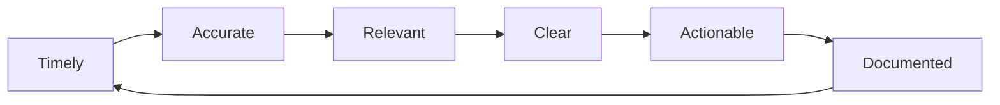
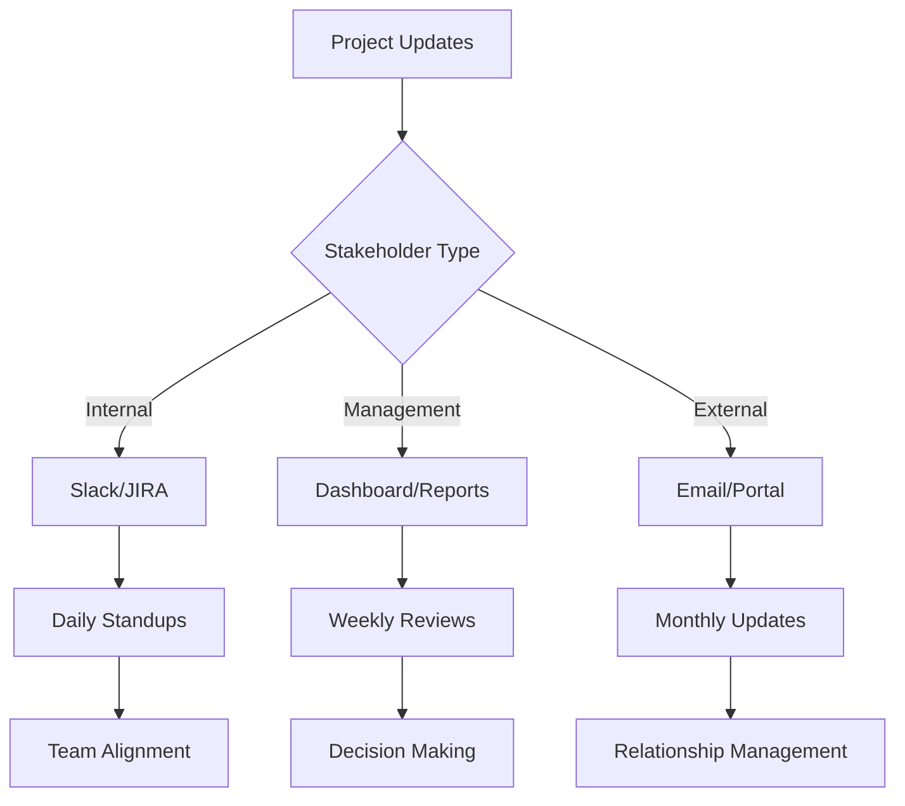
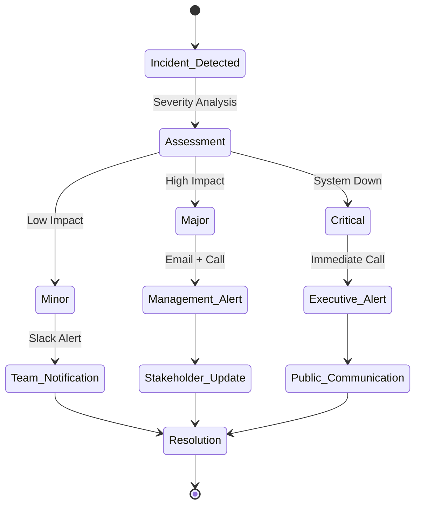
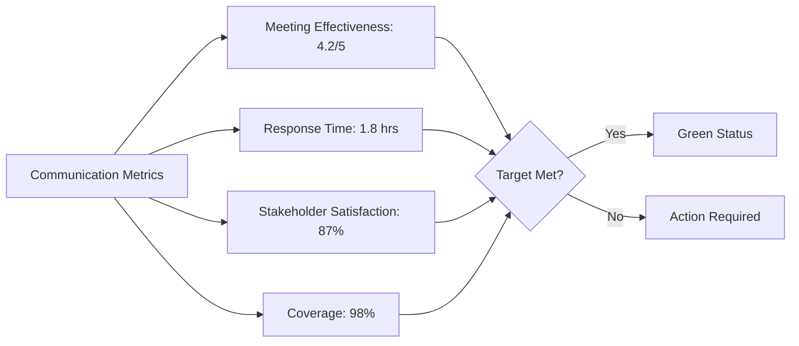

# Communication Plan

## 1. Communication Overview

### 1.1 Communication Objectives

- Ensure timely and accurate information flow
- Maintain stakeholder engagement and alignment
- Facilitate effective decision-making
- Minimize miscommunication and conflicts
- Support project transparency and accountability

### 1.2 Communication Principles



## 2. Stakeholder Communication Matrix

### 2.1 Internal Stakeholders

| Stakeholder | Role | Communication Needs | Frequency | Method | Owner |
|-------------|------|-------------------|-----------|---------|-------|
| **Executive Team** | Decision Makers | Strategic updates, risks, budget | Weekly | Dashboard + Meeting | PMO |
| **Steering Committee** | Governance | Progress, issues, decisions needed | Bi-weekly | Meeting + Report | PM |
| **Product Team** | Requirements | Feature status, user feedback | Daily | Standup + Slack | Product Manager |
| **Engineering Team** | Development | Technical updates, blockers | Daily | Standup + JIRA | Tech Lead |
| **QA Team** | Quality | Test results, bug reports | Daily | Reports + Slack | QA Lead |
| **DevOps Team** | Operations | Infrastructure, deployments | Daily | Alerts + Slack | DevOps Lead |

### 2.2 External Stakeholders

| Stakeholder | Role | Communication Needs | Frequency | Method | Owner |
|-------------|------|-------------------|-----------|---------|-------|
| **Customers** | End Users | Product updates, support | As needed | Email + Portal | Support Team |
| **Partners** | Integrations | API changes, roadmap | Monthly | Email + Calls | Partnership Team |
| **Vendors** | Services | Requirements, SLAs | Weekly | Email + Calls | Procurement |
| **Investors** | Funding | Business metrics, milestones | Monthly | Report + Meeting | CEO |

## 3. Communication Channels

### 3.1 Digital Channels

| Channel | Purpose | Audience | Response Time | Owner |
|---------|---------|----------|---------------|-------|
| **Slack** | Real-time collaboration | Internal teams | 2 hours | IT |
| **Email** | Formal communication | All stakeholders | 24 hours | Admin |
| **JIRA** | Task tracking | Development teams | Daily | Tech Lead |
| **Confluence** | Documentation | All teams | As needed | Tech Writer |
| **GitHub** | Code collaboration | Developers | Immediate | DevOps |
| **Zoom** | Video meetings | All stakeholders | Scheduled | IT |

### 3.2 Communication Flow



## 4. Meeting Structure

### 4.1 Regular Meetings

| Meeting | Frequency | Duration | Participants | Purpose | Deliverable |
|---------|-----------|----------|--------------|---------|-------------|
| **Daily Standup** | Daily | 15 min | Dev Teams | Progress sync | Blockers list |
| **Sprint Planning** | Bi-weekly | 2 hours | Product + Dev | Sprint goals | Sprint backlog |
| **Sprint Review** | Bi-weekly | 1 hour | All teams | Demo + feedback | Release notes |
| **Retrospective** | Bi-weekly | 1 hour | Dev Teams | Process improvement | Action items |
| **Steering Committee** | Bi-weekly | 1 hour | Leadership | Governance | Decisions log |
| **All Hands** | Monthly | 1 hour | Everyone | Company updates | Meeting notes |

### 4.2 Meeting Guidelines

```yaml
meeting_best_practices:
  preparation:
    - Send agenda 24 hours in advance
    - Include relevant documents
    - Define clear objectives
    - Identify decision makers
    
  execution:
    - Start and end on time
    - Follow the agenda
    - Encourage participation
    - Document decisions
    
  follow_up:
    - Send meeting notes within 24 hours
    - Track action items
    - Schedule follow-up meetings
    - Update project documentation
```

## 5. Reporting Structure

### 5.1 Project Reports

| Report Type | Frequency | Audience | Content | Format | Owner |
|-------------|-----------|----------|---------|--------|-------|
| **Status Report** | Weekly | Management | Progress, risks, issues | Dashboard | PMO |
| **Sprint Report** | Bi-weekly | Teams | Velocity, burndown | JIRA Report | Scrum Master |
| **Financial Report** | Monthly | Executive | Budget, expenses | Excel | Finance |
| **Quality Report** | Weekly | QA + Dev | Test results, bugs | Test Report | QA Lead |
| **Performance Report** | Monthly | Technical | Metrics, KPIs | Dashboard | DevOps |

### 5.2 Report Templates

#### 5.2.1 Weekly Status Report Template

```markdown
# Weekly Status Report - Week of [Date]

## Executive Summary
- Overall project health: [Green/Yellow/Red]
- Key achievements this week
- Major risks or issues

## Progress Update
- Completed milestones
- Current sprint status
- Upcoming deliverables

## Metrics
- Velocity: [Story points]
- Bug count: [Open/Closed]
- Test coverage: [Percentage]

## Risks & Issues
- New risks identified
- Risk mitigation progress
- Escalation needed

## Next Week Focus
- Priority items
- Key meetings
- Deliverables due
```

## 6. Crisis Communication

### 6.1 Incident Communication Plan



### 6.2 Crisis Communication Matrix

| Severity | Response Time | Communication Method | Audience | Owner |
|----------|---------------|---------------------|----------|-------|
| **Critical** | 15 minutes | Phone + Email + Slack | All stakeholders | CEO |
| **High** | 1 hour | Email + Slack | Internal + Key customers | CTO |
| **Medium** | 4 hours | Slack + JIRA | Internal teams | Team Lead |
| **Low** | 24 hours | JIRA update | Development team | Developer |

## 7. Communication Tools & Technologies

### 7.1 Tool Stack

| Tool | Purpose | Users | Integration | Cost |
|------|---------|-------|-------------|------|
| **Slack** | Team messaging | All internal | JIRA, GitHub | $8/user/month |
| **Zoom** | Video conferencing | All | Calendar | $15/user/month |
| **JIRA** | Project tracking | Dev teams | Slack, GitHub | $7/user/month |
| **Confluence** | Documentation | All | JIRA | $5/user/month |
| **Tableau** | Reporting | Management | Database | $70/user/month |

## 8. Communication Metrics

### 8.1 Key Performance Indicators

| Metric | Target | Measurement | Frequency |
|--------|--------|-------------|-----------|
| **Meeting Effectiveness** | >4.0/5.0 | Survey rating | Monthly |
| **Information Timeliness** | <2 hours | Response time | Weekly |
| **Stakeholder Satisfaction** | >85% | Survey score | Quarterly |
| **Communication Coverage** | 100% | Stakeholder reach | Monthly |

### 8.2 Communication Health Dashboard



## 9. Escalation Procedures

### 9.1 Communication Escalation Path

| Level | Trigger | Escalate To | Timeline | Method |
|-------|---------|-------------|----------|--------|
| **Level 1** | Team issue | Team Lead | Immediate | Slack |
| **Level 2** | Project blocker | Project Manager | 2 hours | Email + Call |
| **Level 3** | Resource conflict | Steering Committee | 4 hours | Meeting |
| **Level 4** | Strategic decision | Executive Team | 24 hours | Executive meeting |

## 10. Communication Training

### 10.1 Training Program

| Audience | Training Topic | Duration | Frequency | Owner |
|----------|----------------|----------|-----------|-------|
| **All Staff** | Communication basics | 2 hours | Onboarding | HR |
| **Managers** | Stakeholder management | 4 hours | Annual | PMO |
| **Tech Leads** | Technical communication | 2 hours | Bi-annual | CTO |
| **Support** | Customer communication | 3 hours | Quarterly | Support Manager |

## 11. References

- [Project Charter](./project-charter.md) - `PRJ-CHARTER-001`
- [Team Structure](../08_team/team-structure.md) - `TEAM-001`
- [Risk Management](./risk-management.md) - `RISK-001`

---
*This communication plan is reviewed quarterly and updated based on stakeholder feedback.*
