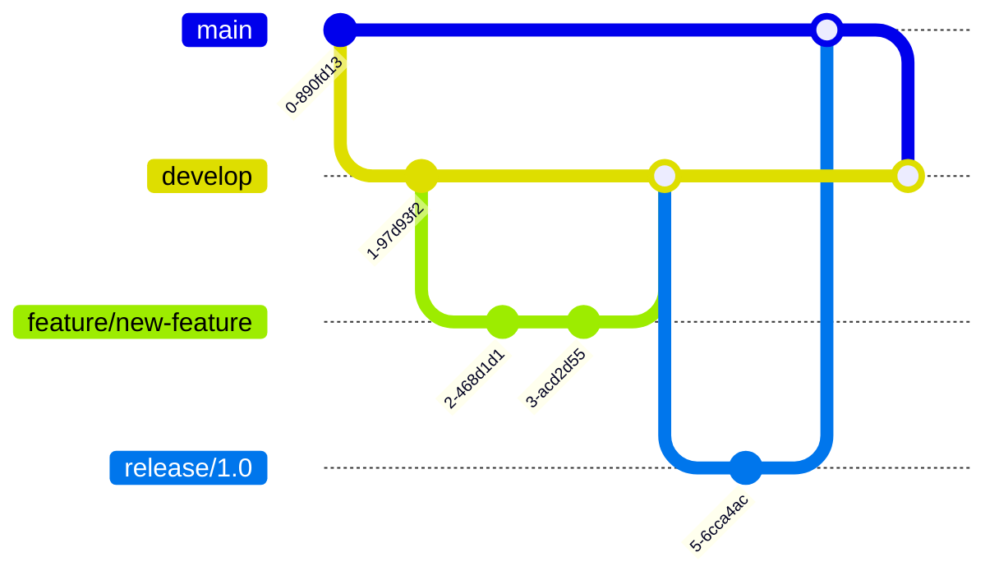

# Contributing Guide

## 1. Welcome Contributors!

Thank you for your interest in contributing to TechAlly! This guide will help you get started with contributing to our e-commerce platform.

### 1.1 Ways to Contribute

- 🐛 Report bugs and issues
- 💡 Suggest new features
- 📝 Improve documentation
- 🔧 Submit bug fixes
- ✨ Add new features
- 🧪 Write tests
- 👀 Review pull requests

## 2. Code of Conduct

### 2.1 Our Standards

- **Be Respectful**: Treat everyone with respect and kindness
- **Be Inclusive**: Welcome diverse perspectives and experiences
- **Be Collaborative**: Work together towards common goals
- **Be Professional**: Maintain professional communication
- **Be Patient**: Remember that everyone was new once

### 2.2 Unacceptable Behavior

- Harassment or discrimination
- Personal attacks or trolling
- Publishing private information
- Inappropriate language or imagery
- Any conduct that could be considered unprofessional

## 3. Getting Started

### 3.1 Prerequisites

```bash
# Required tools
node --version  # v18.0.0+
npm --version   # v9.0.0+
git --version   # v2.30.0+
docker --version # v24.0.0+
```

### 3.2 Fork and Clone

```bash
# Fork the repository on GitHub

# Clone your fork
git clone https://github.com/YOUR_USERNAME/techally-platform.git
cd techally-platform

# Add upstream remote
git remote add upstream https://github.com/techally/techally-platform.git

# Verify remotes
git remote -v
```

### 3.3 Development Setup

```bash
# Install dependencies
npm install

# Setup environment
cp .env.example .env.local

# Start Docker services
docker-compose -f docker-compose.dev.yml up -d

# Run database migrations
npm run db:migrate

# Start development server
npm run dev
```

## 4. Development Workflow

### 4.1 Branch Strategy



### 4.2 Branch Naming

| Type | Pattern | Example |
|------|---------|---------|
| **Feature** | `feature/description` | `feature/add-payment-method` |
| **Bug Fix** | `fix/description` | `fix/cart-calculation` |
| **Hotfix** | `hotfix/description` | `hotfix/security-patch` |
| **Docs** | `docs/description` | `docs/api-documentation` |
| **Refactor** | `refactor/description` | `refactor/auth-service` |
| **Test** | `test/description` | `test/order-integration` |

### 4.3 Creating a Feature Branch

```bash
# Sync with upstream
git checkout main
git fetch upstream
git merge upstream/main

# Create feature branch
git checkout -b feature/your-feature-name

# Make your changes
# ... edit files ...

# Stage and commit
git add .
git commit -m "feat: add new feature"

# Push to your fork
git push origin feature/your-feature-name
```

## 5. Commit Guidelines

### 5.1 Commit Message Format

```
<type>(<scope>): <subject>

<body>

<footer>
```

### 5.2 Commit Types

| Type | Description | Example |
|------|-------------|---------|
| **feat** | New feature | `feat(auth): add OAuth support` |
| **fix** | Bug fix | `fix(cart): correct total calculation` |
| **docs** | Documentation | `docs(api): update endpoint docs` |
| **style** | Code style | `style: format code with prettier` |
| **refactor** | Code refactoring | `refactor(order): simplify logic` |
| **perf** | Performance | `perf(search): optimize query` |
| **test** | Tests | `test(user): add unit tests` |
| **chore** | Maintenance | `chore: update dependencies` |
| **ci** | CI/CD | `ci: add GitHub actions` |

### 5.3 Commit Examples

```bash
# Feature commit
git commit -m "feat(payment): integrate Stripe payment gateway

- Add Stripe SDK integration
- Implement payment processing
- Add webhook handlers
- Update order status on payment

Closes #123"

# Fix commit
git commit -m "fix(auth): resolve token expiration issue

Token was not refreshing properly when expired.
Added automatic refresh logic before expiration.

Fixes #456"
```

## 6. Pull Request Process

### 6.1 Before Creating a PR

- [ ] Code follows style guidelines
- [ ] Self-review of code
- [ ] Comments added for complex logic
- [ ] Documentation updated
- [ ] Tests added/updated
- [ ] All tests passing
- [ ] No merge conflicts

### 6.2 PR Template

```markdown
## Description
Brief description of changes

## Type of Change
- [ ] Bug fix
- [ ] New feature
- [ ] Breaking change
- [ ] Documentation update

## Testing
- [ ] Unit tests pass
- [ ] Integration tests pass
- [ ] Manual testing completed

## Checklist
- [ ] Code follows project guidelines
- [ ] Self-review completed
- [ ] Documentation updated
- [ ] Tests added/updated
- [ ] No breaking changes

## Related Issues
Closes #(issue number)

## Screenshots (if applicable)
```

### 6.3 PR Review Process


## 7. Code Style Guidelines

### 7.1 TypeScript/JavaScript

```typescript
// ✅ Good
export class UserService {
  private readonly repository: UserRepository;
  
  constructor(repository: UserRepository) {
    this.repository = repository;
  }
  
  async findById(id: string): Promise<User | null> {
    return this.repository.findById(id);
  }
}

// ❌ Bad
export class user_service {
  repo: any;
  
  constructor(repo) {
    this.repo = repo
  }
  
  find_by_id(id) {
    return this.repo.findById(id)
  }
}
```

### 7.2 File Organization

```
src/
├── services/          # Business logic
│   └── user/
│       ├── user.service.ts
│       ├── user.service.test.ts
│       └── index.ts
├── controllers/       # HTTP handlers
├── models/           # Data models
├── utils/            # Utilities
└── types/            # Type definitions
```

### 7.3 Naming Conventions

| Element | Convention | Example |
|---------|------------|---------|
| **Files** | kebab-case | `user-service.ts` |
| **Classes** | PascalCase | `UserService` |
| **Interfaces** | PascalCase with I | `IUserService` |
| **Functions** | camelCase | `getUserById` |
| **Constants** | UPPER_SNAKE | `MAX_RETRIES` |
| **Enums** | PascalCase | `OrderStatus` |

## 8. Testing Requirements

### 8.1 Test Coverage

- Minimum 80% code coverage
- All new features must have tests
- Bug fixes must include regression tests

### 8.2 Test Types

```javascript
// Unit Test Example
describe('UserService', () => {
  let service: UserService;
  let repository: MockRepository;
  
  beforeEach(() => {
    repository = new MockRepository();
    service = new UserService(repository);
  });
  
  describe('findById', () => {
    it('should return user when found', async () => {
      const user = { id: '123', name: 'John' };
      repository.findById.mockResolvedValue(user);
      
      const result = await service.findById('123');
      
      expect(result).toEqual(user);
      expect(repository.findById).toHaveBeenCalledWith('123');
    });
  });
});

// Integration Test Example
describe('POST /api/users', () => {
  it('should create a new user', async () => {
    const userData = {
      email: 'test@example.com',
      password: 'SecurePass123!'
    };
    
    const response = await request(app)
      .post('/api/users')
      .send(userData)
      .expect(201);
    
    expect(response.body).toHaveProperty('id');
    expect(response.body.email).toBe(userData.email);
  });
});
```

## 9. Documentation

### 9.1 Code Documentation

```typescript
/**
 * Processes a payment for an order
 * @param orderId - The ID of the order
 * @param paymentData - Payment information
 * @returns Payment result with transaction ID
 * @throws {PaymentError} If payment processing fails
 * @example
 * const result = await processPayment('order-123', {
 *   amount: 99.99,
 *   currency: 'USD',
 *   method: 'credit_card'
 * });
 */
export async function processPayment(
  orderId: string,
  paymentData: PaymentData
): Promise<PaymentResult> {
  // Implementation
}
```

### 9.2 API Documentation

```yaml
# OpenAPI documentation
/api/users/{id}:
  get:
    summary: Get user by ID
    parameters:
      - name: id
        in: path
        required: true
        schema:
          type: string
    responses:
      200:
        description: User found
        content:
          application/json:
            schema:
              $ref: '#/components/schemas/User'
      404:
        description: User not found
```

## 10. Release Process

### 10.1 Version Numbering

We follow [Semantic Versioning](https://semver.org/):
- **MAJOR**: Breaking changes
- **MINOR**: New features (backward compatible)
- **PATCH**: Bug fixes

### 10.2 Release Checklist

- [ ] All tests passing
- [ ] Documentation updated
- [ ] CHANGELOG.md updated
- [ ] Version bumped
- [ ] Release notes prepared
- [ ] Security scan completed

## 11. Getting Help

### 11.1 Resources

- 📚 [Documentation](../INDEX.md)
- 💬 [Discussions](https://github.com/techally/discussions)
- 🐛 [Issue Tracker](https://github.com/techally/issues)
- 📧 [Email Support](mailto:dev@techally.com)

### 11.2 Community

- **Slack**: [Join our Slack](https://techally.slack.com)
- **Discord**: [Join Discord](https://discord.gg/techally)
- **Forum**: [Community Forum](https://forum.techally.com)

## 12. Recognition

We value all contributions! Contributors are recognized in:
- CONTRIBUTORS.md file
- Release notes
- Monthly newsletter
- Annual contributor awards

## 13. License

By contributing, you agree that your contributions will be licensed under the project's MIT License.

---
*Thank you for contributing to TechAlly! Together, we're building something amazing.*