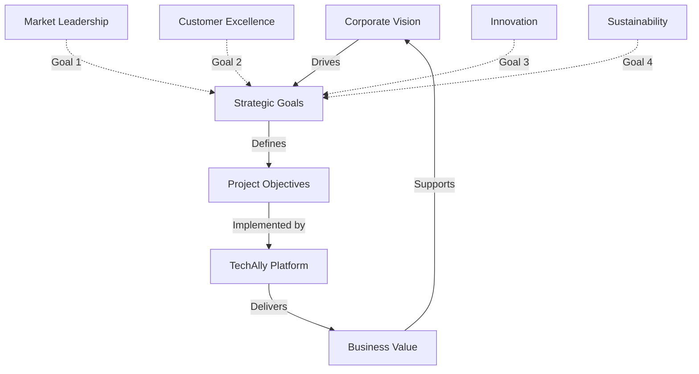
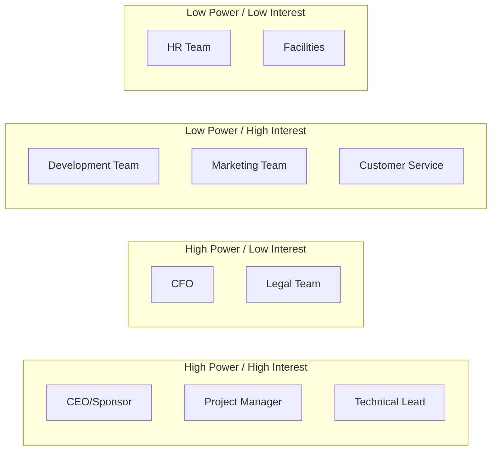
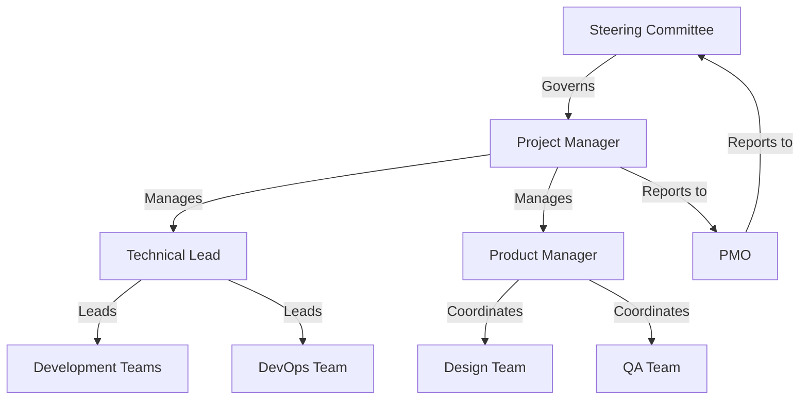
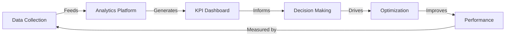

# TechAlly Project Charter

## 1. Project Identification

| Attribute | Value |
|-----------|--------|
| **Project ID** | PRJ-TA-001 |
| **Project Name** | TechAlly Smart Device E-Commerce Platform |
| **Project Type** | Enterprise E-Commerce Solution |
| **Start Date** | 2025-01-15 |
| **Target Launch** | 2025-09-01 |
| **Budget** | $800K - $1.2M |
| **Sponsor** | Chief Executive Officer |
| **Project Manager** | Sarah Johnson |

## 2. Executive Summary

TechAlly is a next-generation e-commerce platform specializing in smart devices, IoT products, and cutting-edge consumer electronics. The platform aims to capture 5% of the $537 billion global smart device market by Year 3 through advanced features, superior user experience, and strategic partnerships.

### 2.1 Strategic Alignment

## 3. Business Case

### 3.1 Market Opportunity

- **Market Size**: $537 billion (2024)
- **Growth Rate**: 22.3% CAGR (2024-2030)
- **Target Segment**: Smart device enthusiasts, home automation builders
- **Competitive Gap**: Lack of specialized platforms with deep technical expertise

### 3.2 Value Proposition

| Customer Segment | Pain Points | TechAlly Solution |
|-----------------|-------------|-------------------|
| Tech Enthusiasts | Limited product expertise | AI-powered recommendations, expert reviews |
| Smart Home Builders | Compatibility issues | Advanced compatibility checker |
| Professional Users | Bulk ordering complexity | B2B portal, volume discounts |
| Mainstream Consumers | Technical confusion | Simplified shopping, expert support |

### 3.3 Financial Projections

| Metric | Year 1 | Year 2 | Year 3 |
|--------|--------|--------|--------|
| GMV | $50M | $100M | $150M |
| Active Users | 500K | 1.2M | 2M |
| Conversion Rate | 25% | 30% | 35% |
| Average Order Value | $200 | $225 | $250 |
| Market Share | 1.5% | 3% | 5% |

## 4. Project Objectives

### 4.1 Primary Objectives

1. **Platform Development** [`OBJ-001`]
   - Scalable architecture supporting 100K+ concurrent users
   - 99.9% uptime with <1.5s page load times
   - Mobile-first responsive design

2. **Business Growth** [`OBJ-002`]
   - $50M GMV in Year 1
   - 500K registered users
   - 200+ brand partnerships

3. **Customer Experience** [`OBJ-003`]
   - 35% conversion rate
   - 4.5+ star customer rating
   - <2% return rate

### 4.2 Success Criteria

- **Technical**: All performance benchmarks met
- **Financial**: ROI positive by Month 18
- **Market**: Top 5 smart device e-commerce platform
- **Customer**: NPS score >70

## 5. Scope Definition

### 5.1 In Scope

- **Customer-Facing Systems**
  - Web application ([`MOD-WEB-001`](../architecture/frontend-architecture.md))
  - Mobile applications (iOS/Android) ([`MOD-MOB-001`](../architecture/mobile-architecture.md))
  - Customer portal ([`MOD-CUST-001`](../architecture/customer-portal.md))

- **Business Systems**
  - Admin dashboard ([`MOD-ADM-001`](../architecture/admin-architecture.md))
  - Inventory management ([`SVC-INV-001`](../api/inventory-service.md))
  - Order processing ([`SVC-ORD-001`](../api/order-service.md))

- **Technical Infrastructure**
  - Cloud infrastructure ([`INF-001`](../architecture/infrastructure.md))
  - API layer ([`API-001`](../api/api-reference.md))
  - Database systems ([`DB-001`](../database/schema-overview.md))

### 5.2 Out of Scope

- Physical retail stores
- Manufacturing operations
- Direct logistics operations
- International operations (Phase 2)

## 6. Stakeholder Analysis

### 6.1 Stakeholder Matrix

### 6.2 Key Stakeholders

| Stakeholder | Role | Interest | Influence | Engagement Strategy |
|-------------|------|----------|-----------|-------------------|
| CEO | Sponsor | Strategic Success | High | Weekly updates |
| CTO | Technical Oversight | Architecture | High | Design reviews |
| CFO | Budget Approval | ROI | High | Monthly financial reviews |
| Development Team | Implementation | Technical Excellence | Medium | Daily standups |
| Marketing | Go-to-Market | Customer Acquisition | Medium | Bi-weekly syncs |
| Customers | End Users | Platform Quality | Low | Feedback surveys |

## 7. Project Organization

### 7.1 Governance Structure

### 7.2 Team Structure

Reference: [Team Structure Document](../team/team-structure.md)

- **Core Team**: 15-20 members
- **Extended Team**: 10-15 contractors
- **Support Functions**: Legal, Finance, HR

## 8. Project Approach

### 8.1 Methodology

- **Framework**: Agile/Scrum
- **Sprint Duration**: 2 weeks
- **Release Cycle**: Monthly
- **MVP Launch**: Month 6
- **Full Launch**: Month 8

### 8.2 Phase Plan

| Phase | Duration | Key Deliverables |
|-------|----------|------------------|
| Discovery | 4 weeks | Requirements, Architecture |
| Foundation | 8 weeks | Core infrastructure, Authentication |
| Development | 16 weeks | Features, Integrations |
| Testing | 4 weeks | QA, Performance, Security |
| Launch Prep | 2 weeks | Deployment, Training |
| Go-Live | 2 weeks | Soft launch, Monitoring |

## 9. Risk Management

### 9.1 Major Risks

| Risk ID | Risk | Probability | Impact | Mitigation |
|---------|------|-------------|--------|------------|
| `RISK-001` | Scalability issues | Medium | High | Load testing, Auto-scaling |
| `RISK-002` | Integration delays | High | Medium | Early API development |
| `RISK-003` | Security breach | Low | Critical | Security audits, Compliance |
| `RISK-004` | Budget overrun | Medium | High | Phased approach, MVP first |
| `RISK-005` | Market competition | High | Medium | Unique features, Fast delivery |

### 9.2 Risk Response Plan

Reference: [Risk Management Plan](risk-management.md)

## 10. Communication Plan

### 10.1 Communication Matrix

| Audience | Method | Frequency | Owner |
|----------|--------|-----------|-------|
| Steering Committee | Status Report | Weekly | PM |
| Development Team | Standup | Daily | Scrum Master |
| Stakeholders | Demo | Bi-weekly | Product Manager |
| All Teams | Newsletter | Weekly | PM |
| Customers | Updates | Monthly | Marketing |

### 10.2 Escalation Path

1. Team Lead → Project Manager
2. Project Manager → Steering Committee
3. Steering Committee → Executive Sponsor

## 11. Success Metrics

### 11.1 KPI Dashboard

| Category | Metric | Target | Measurement |
|----------|--------|--------|-------------|
| **Technical** | Uptime | 99.9% | Monitoring tools |
| **Performance** | Page Load | <1.5s | APM tools |
| **Business** | GMV | $50M Y1 | Analytics |
| **Customer** | Conversion | 35% | Analytics |
| **Quality** | Defect Rate | <1% | Bug tracking |

### 11.2 Measurement Framework

## 12. Approval and Sign-off

| Role | Name | Signature | Date |
|------|------|-----------|------|
| Executive Sponsor | John Smith | ___________ | _____ |
| Project Manager | Sarah Johnson | ___________ | _____ |
| Technical Lead | Mike Chen | ___________ | _____ |
| CFO | Lisa Brown | ___________ | _____ |

## 13. References and Links

- [Business Requirements](../requirements/business-requirements.md) - `REQ-BR-001`
- [Functional Requirements](../requirements/functional-requirements.md) - `REQ-FR-001`
- [System Architecture](../architecture/system-overview.md) - `ARCH-001`
- [API Specifications](../api/api-reference.md) - `API-001`
- [Team Structure](../team/team-structure.md) - `TEAM-001`
- [Risk Management](risk-management.md) - `RISK-001`

## 14. Revision History

| Version | Date | Author | Changes |
|---------|------|--------|---------|
| 1.0.0 | 2025-09-23 | Executive Team | Initial charter creation |

---
*This document is maintained by the TechAlly PMO and requires steering committee approval for changes.*
