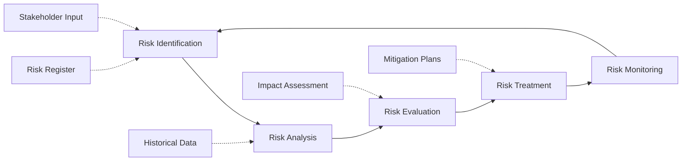
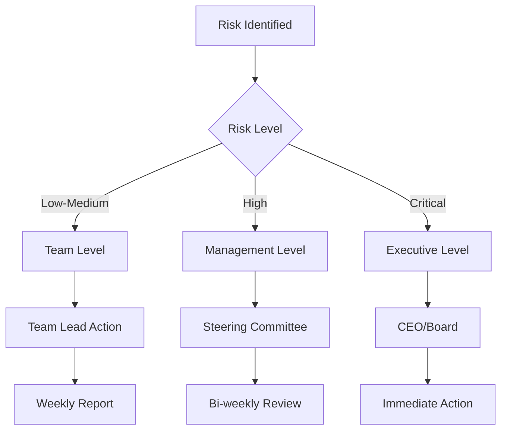

# Risk Management Plan

## 1. Risk Management Overview

### 1.1 Risk Management Process



## 2. Risk Categories

### 2.1 Technical Risks

| Risk ID | Risk Description | Probability | Impact | Risk Level | Owner |
|---------|------------------|-------------|--------|------------|-------|
| `TECH-001` | Technology stack compatibility issues | Medium | High | High | CTO |
| `TECH-002` | Performance not meeting requirements | Medium | High | High | Tech Lead |
| `TECH-003` | Third-party API integration failures | High | Medium | High | Backend Lead |
| `TECH-004` | Security vulnerabilities | Low | Critical | High | Security Team |
| `TECH-005` | Database scalability issues | Medium | High | High | Database Admin |

### 2.2 Business Risks

| Risk ID | Risk Description | Probability | Impact | Risk Level | Owner |
|---------|------------------|-------------|--------|------------|-------|
| `BUS-001` | Market competition increases | High | High | Critical | CEO |
| `BUS-002` | Customer acquisition costs exceed budget | Medium | High | High | CMO |
| `BUS-003` | Regulatory changes affect compliance | Low | High | Medium | Legal |
| `BUS-004` | Economic downturn affects funding | Medium | Critical | High | CFO |
| `BUS-005` | Key partnerships fail | Medium | High | High | COO |

### 2.3 Project Risks

| Risk ID | Risk Description | Probability | Impact | Risk Level | Owner |
|---------|------------------|-------------|--------|------------|-------|
| `PROJ-001` | Key team members leave | Medium | High | High | HR |
| `PROJ-002` | Scope creep affects timeline | High | Medium | High | PM |
| `PROJ-003` | Budget overrun | Medium | High | High | PMO |
| `PROJ-004` | Timeline delays | High | Medium | High | PM |
| `PROJ-005` | Quality issues in deliverables | Low | High | Medium | QA Lead |

## 3. Risk Assessment Matrix

### 3.1 Probability Scale
- **Very Low (1)**: 0-5% chance
- **Low (2)**: 6-25% chance
- **Medium (3)**: 26-50% chance
- **High (4)**: 51-75% chance
- **Very High (5)**: 76-100% chance

### 3.2 Impact Scale
- **Very Low (1)**: Minimal impact
- **Low (2)**: Minor delays/costs
- **Medium (3)**: Moderate impact
- **High (4)**: Major impact
- **Critical (5)**: Project failure

### 3.3 Risk Level Matrix

| Impact/Probability | Very Low | Low | Medium | High | Very High |
|-------------------|----------|-----|--------|------|-----------|
| **Critical** | Medium | High | High | Critical | Critical |
| **High** | Low | Medium | High | High | Critical |
| **Medium** | Low | Low | Medium | Medium | High |
| **Low** | Very Low | Low | Low | Medium | Medium |
| **Very Low** | Very Low | Very Low | Low | Low | Medium |

## 4. Risk Mitigation Strategies

### 4.1 Technical Risk Mitigation

```yaml
technical_risks:
  TECH-001:
    mitigation: Proof of concept development
    contingency: Alternative technology evaluation
    monitoring: Weekly architecture reviews
    
  TECH-002:
    mitigation: Performance testing throughout development
    contingency: Infrastructure scaling plan
    monitoring: Continuous performance monitoring
    
  TECH-003:
    mitigation: Early integration testing
    contingency: Backup API providers
    monitoring: API health monitoring
```

### 4.2 Business Risk Mitigation

```yaml
business_risks:
  BUS-001:
    mitigation: Unique value proposition development
    contingency: Pivot strategy
    monitoring: Competitive analysis reports
    
  BUS-002:
    mitigation: Marketing efficiency optimization
    contingency: Funding runway extension
    monitoring: CAC/LTV ratio tracking
```

## 5. Risk Monitoring

### 5.1 Risk Review Schedule

| Review Type | Frequency | Participants | Deliverable |
|-------------|-----------|--------------|-------------|
| Risk Assessment | Weekly | Project Team | Risk Status Report |
| Risk Review | Bi-weekly | Steering Committee | Risk Dashboard |
| Risk Audit | Monthly | PMO | Risk Audit Report |
| Risk Strategy | Quarterly | Executive Team | Risk Strategy Update |

## 6. Escalation Procedures

### 6.1 Risk Escalation Matrix



## 7. Risk Register

### 7.1 Active Risks (Top 10)

| Rank | Risk ID | Description | Current Level | Trend | Next Review |
|------|---------|-------------|---------------|-------|-------------|
| 1 | `BUS-001` | Market competition | Critical | ↗ | 2025-09-30 |
| 2 | `TECH-003` | API integration | High | → | 2025-09-25 |
| 3 | `PROJ-002` | Scope creep | High | ↗ | 2025-09-24 |
| 4 | `BUS-002` | Customer acquisition | High | → | 2025-09-27 |
| 5 | `TECH-001` | Technology compatibility | High | ↘ | 2025-09-26 |

## 8. Risk Response Plans

### 8.1 Critical Risk Response

For **Critical** level risks:
1. Immediate escalation to executive team
2. Daily monitoring and reporting
3. Dedicated response team assignment
4. Emergency budget allocation if needed
5. Stakeholder communication within 24 hours

### 8.2 High Risk Response

For **High** level risks:
1. Escalation to steering committee
2. Weekly monitoring and reporting
3. Mitigation plan activation
4. Resource reallocation consideration
5. Stakeholder update within 48 hours

## 9. References

- [Project Charter](./project-charter.md) - `PRJ-CHARTER-001`
- [Business Requirements](../02_requirements/business-requirements.md) - `REQ-BR-001`
- [Communication Plan](./communication-plan.md) - `COMM-001`

---
*This risk management plan is reviewed monthly and updated as needed.*
