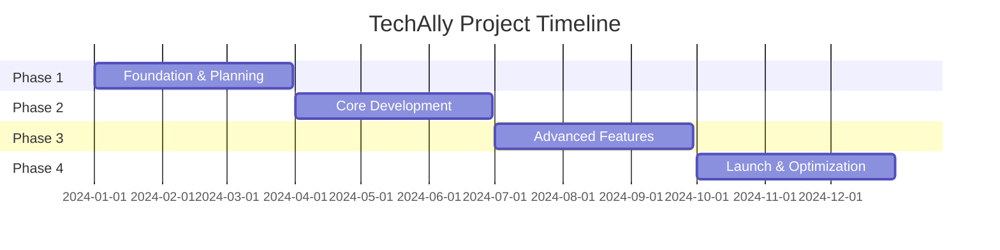
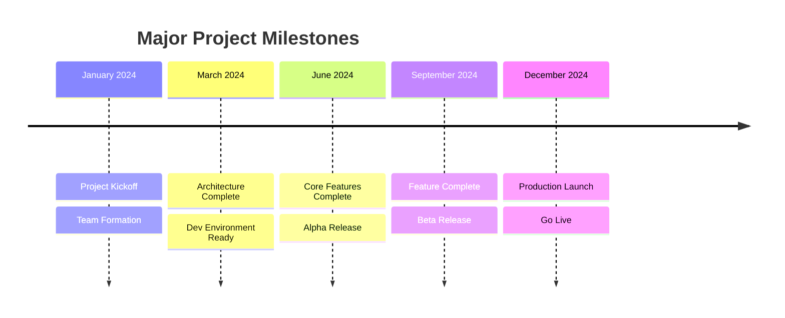
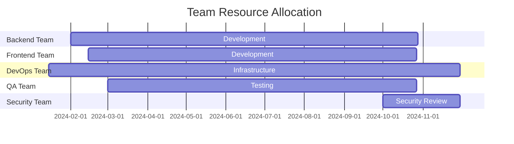

# Project Timeline

## 1. Executive Summary

The TechAlly E-Commerce Platform project is scheduled for completion over 12 months, divided into 4 major phases with quarterly milestones.

## 2. Project Phases

### 2.1 Phase Overview

## 3. Detailed Timeline

### 3.1 Phase 1: Foundation (Q1 2024)

| Week | Milestone | Deliverables | Status |
|------|-----------|--------------|--------|
| **W1-2** | Project Kickoff | Charter, Team Formation | ✅ Complete |
| **W3-4** | Requirements Gathering | BRD, FRD, NFR Documents | ✅ Complete |
| **W5-6** | Architecture Design | System Architecture, Tech Stack | ✅ Complete |
| **W7-8** | Environment Setup | Dev/Staging Environments | ✅ Complete |
| **W9-10** | Database Design | Schema Design, ERD | ✅ Complete |
| **W11-12** | API Design | API Specifications | ✅ Complete |

### 3.2 Phase 2: Core Development (Q2 2024)

| Week | Milestone | Deliverables | Status |
|------|-----------|--------------|--------|
| **W13-14** | Authentication Service | User Registration, Login | 🔄 In Progress |
| **W15-16** | User Management | Profile, Preferences | 🔄 In Progress |
| **W17-18** | Product Catalog | Product CRUD, Categories | 📅 Planned |
| **W19-20** | Shopping Cart | Cart Management | 📅 Planned |
| **W21-22** | Order Management | Order Processing | 📅 Planned |
| **W23-24** | Payment Integration | Stripe, PayPal | 📅 Planned |

### 3.3 Phase 3: Advanced Features (Q3 2024)

| Week | Milestone | Deliverables | Status |
|------|-----------|--------------|--------|
| **W25-26** | Search & Filtering | Elasticsearch Integration | 📅 Planned |
| **W27-28** | Inventory Management | Stock Tracking | 📅 Planned |
| **W29-30** | Notification System | Email, SMS, Push | 📅 Planned |
| **W31-32** | Analytics Dashboard | Admin Analytics | 📅 Planned |
| **W33-34** | Mobile Applications | iOS & Android Apps | 📅 Planned |
| **W35-36** | Performance Optimization | Caching, CDN | 📅 Planned |

### 3.4 Phase 4: Launch Preparation (Q4 2024)

| Week | Milestone | Deliverables | Status |
|------|-----------|--------------|--------|
| **W37-38** | Security Hardening | Penetration Testing | 📅 Planned |
| **W39-40** | Load Testing | Performance Testing | 📅 Planned |
| **W41-42** | Beta Launch | Limited Release | 📅 Planned |
| **W43-44** | Bug Fixes | Issue Resolution | 📅 Planned |
| **W45-46** | Documentation | User & Admin Guides | 📅 Planned |
| **W47-48** | Production Launch | Go Live | 📅 Planned |

## 4. Sprint Schedule

### 4.1 Sprint Planning

| Sprint | Duration | Focus Area | Goals |
|--------|----------|------------|-------|
| **Sprint 1** | Jan 1-14 | Setup | Environment, Team |
| **Sprint 2** | Jan 15-28 | Planning | Requirements, Architecture |
| **Sprint 3** | Jan 29-Feb 11 | Foundation | Database, API Design |
| **Sprint 4** | Feb 12-25 | Auth | User Authentication |
| **Sprint 5** | Feb 26-Mar 11 | Users | User Management |
| **Sprint 6** | Mar 12-25 | Products | Product Catalog |
| **Sprint 7** | Mar 26-Apr 8 | Cart | Shopping Cart |
| **Sprint 8** | Apr 9-22 | Orders | Order Processing |
| **Sprint 9** | Apr 23-May 6 | Payments | Payment Integration |
| **Sprint 10** | May 7-20 | Search | Search Features |
| **Sprint 11** | May 21-Jun 3 | Inventory | Stock Management |
| **Sprint 12** | Jun 4-17 | Notifications | Alert System |

## 5. Key Milestones

### 5.1 Major Milestones

### 5.2 Critical Path

| Milestone | Date | Dependencies | Impact |
|-----------|------|--------------|--------|
| **Database Schema** | Feb 15 | Requirements | Blocks all development |
| **Auth Service** | Mar 1 | Database | Blocks user features |
| **Payment Gateway** | May 15 | Orders | Blocks transactions |
| **Load Testing** | Nov 1 | All features | Blocks launch |
| **Security Audit** | Nov 15 | All features | Blocks launch |

## 6. Resource Allocation

### 6.1 Team Timeline

### 6.2 Budget Timeline

| Quarter | Budget Allocation | Spent | Remaining |
|---------|------------------|-------|-----------|
| **Q1 2024** | $250,000 | $180,000 | $70,000 |
| **Q2 2024** | $400,000 | $0 | $400,000 |
| **Q3 2024** | $350,000 | $0 | $350,000 |
| **Q4 2024** | $300,000 | $0 | $300,000 |
| **Total** | $1,300,000 | $180,000 | $1,120,000 |

## 7. Risk Timeline

### 7.1 Risk Events

| Date | Risk | Mitigation | Status |
|------|------|------------|--------|
| **Mar 15** | Tech Stack Decision | POC Complete | ✅ Resolved |
| **May 30** | Payment Gateway Delay | Multiple Vendors | 🔄 Monitoring |
| **Aug 15** | Mobile Dev Resources | Contractor Backup | 📅 Planned |
| **Oct 30** | Load Test Results | Early Testing | 📅 Planned |
| **Nov 30** | Security Vulnerabilities | Extra Sprint | 📅 Planned |

## 8. Release Timeline

### 8.1 Release Schedule

| Release | Date | Type | Features |
|---------|------|------|----------|
| **v0.1.0** | Mar 1, 2024 | Internal Alpha | Basic Auth, User Management |
| **v0.2.0** | Apr 15, 2024 | Internal Alpha | Product Catalog, Cart |
| **v0.3.0** | Jun 1, 2024 | Private Alpha | Orders, Payments |
| **v0.4.0** | Jul 15, 2024 | Public Alpha | Search, Inventory |
| **v0.5.0** | Sep 1, 2024 | Private Beta | Mobile Apps |
| **v0.9.0** | Oct 15, 2024 | Public Beta | Feature Complete |
| **v1.0.0** | Dec 1, 2024 | Production | General Availability |

## 9. Dependencies

### 9.1 External Dependencies

| Dependency | Required By | Impact | Status |
|------------|------------|--------|--------|
| **AWS Account** | Jan 15 | Blocks infrastructure | ✅ Complete |
| **Stripe Account** | Apr 1 | Blocks payments | 🔄 In Progress |
| **Apple Developer** | Jul 1 | Blocks iOS app | 📅 Planned |
| **SSL Certificates** | Nov 1 | Blocks production | 📅 Planned |
| **Domain Names** | Nov 15 | Blocks launch | 📅 Planned |

## 10. Monitoring & Reporting

### 10.1 Progress Tracking

- **Daily**: Standup meetings, Jira updates
- **Weekly**: Sprint progress reports
- **Bi-weekly**: Stakeholder updates
- **Monthly**: Executive dashboard
- **Quarterly**: Board presentations

### 10.2 KPIs

| Metric | Target | Current | Status |
|--------|--------|---------|--------|
| **On-Time Delivery** | 95% | 92% | 🟡 Warning |
| **Budget Utilization** | 85% | 72% | 🟢 On Track |
| **Velocity** | 40 pts/sprint | 38 pts | 🟢 On Track |
| **Defect Rate** | <5% | 3% | 🟢 On Track |
| **Test Coverage** | >80% | 75% | 🟡 Warning |

## 11. Contingency Planning

### 11.1 Buffer Time

- **Development**: 15% buffer (6 weeks)
- **Testing**: 20% buffer (4 weeks)
- **Deployment**: 25% buffer (2 weeks)
- **Total Buffer**: 12 weeks

### 11.2 Fast-Track Options

| Option | Time Saved | Trade-offs |
|--------|------------|------------|
| **Reduce Mobile Scope** | 3 weeks | Web-only at launch |
| **Simplify Analytics** | 2 weeks | Basic reporting only |
| **Defer Advanced Search** | 2 weeks | Basic search only |
| **Use More Libraries** | 4 weeks | Less customization |

## 12. Success Criteria

### 12.1 Launch Criteria

- [ ] All P1 features complete
- [ ] <2% critical bugs
- [ ] >99.9% uptime in staging
- [ ] Load test: 10K concurrent users
- [ ] Security audit passed
- [ ] Documentation complete
- [ ] Training complete
- [ ] Support team ready

## References

- [Project Charter](./project-charter.md) - `PRJ-CHARTER-001`
- [Risk Management](./risk-management.md) - `RISK-001`
- [Resource Plan](./resource-plan.md) - `RES-001`

---
*This timeline is a living document and will be updated as the project progresses.*
