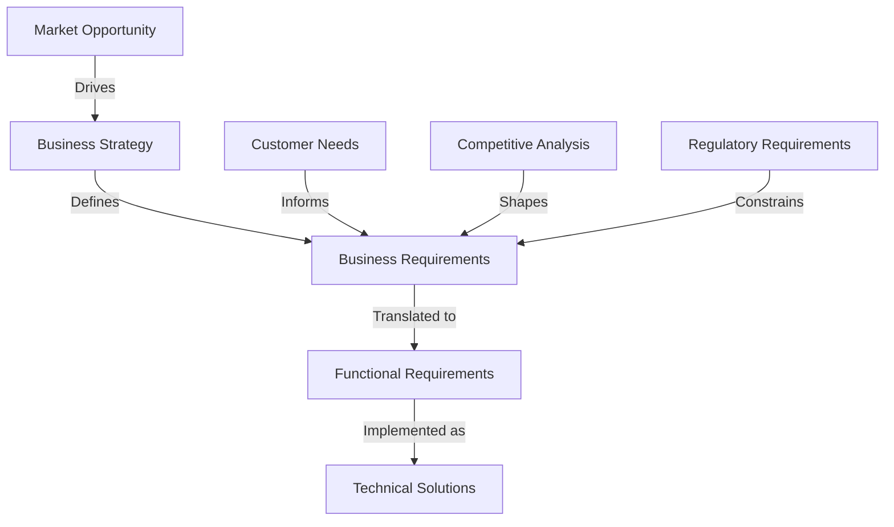
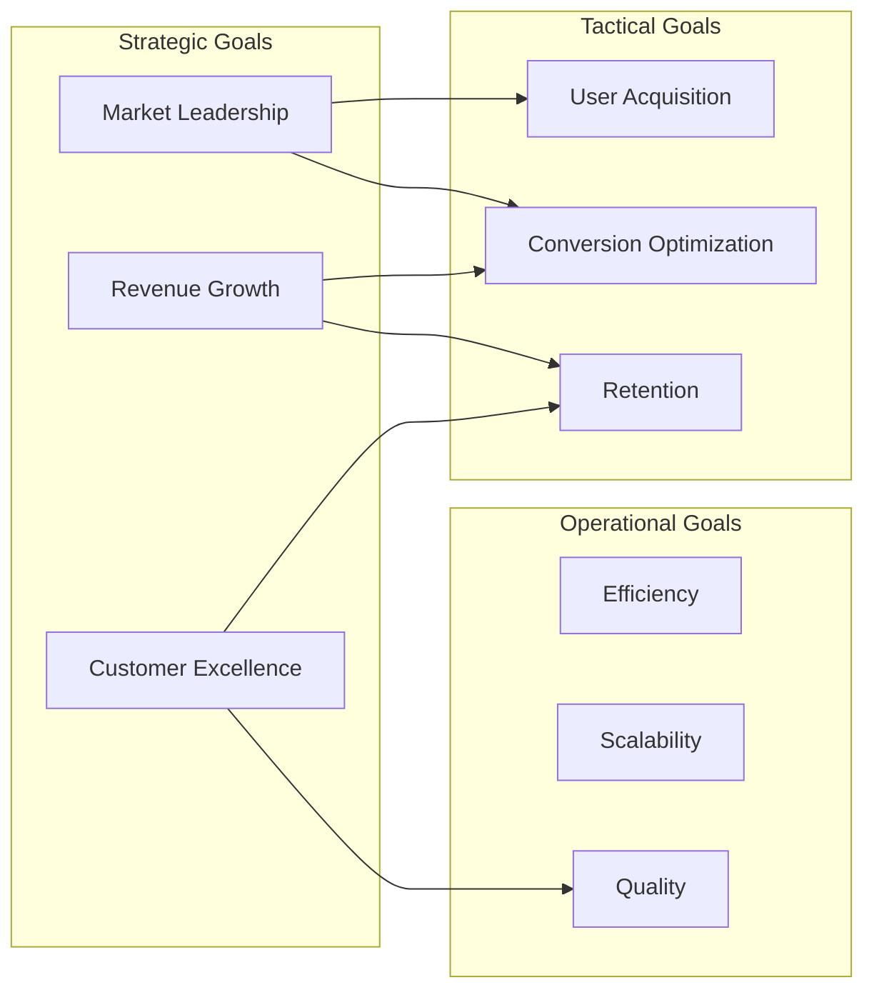
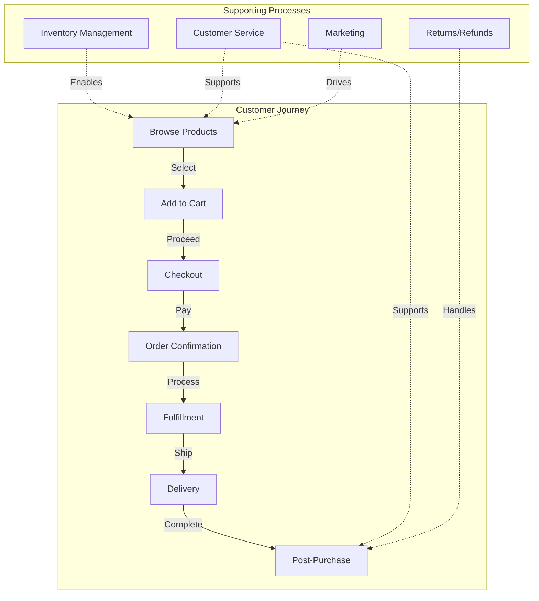
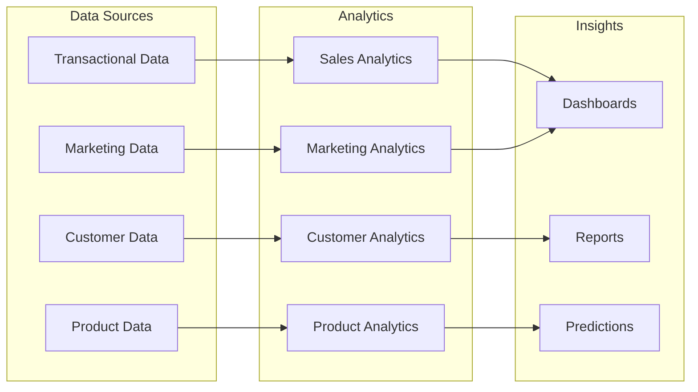
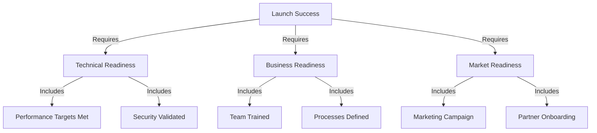
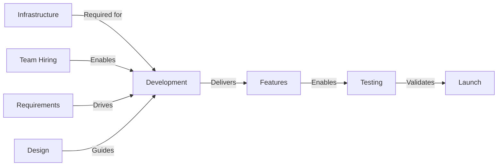

# Business Requirements Document (BRD)

## 1. Document Control

| Attribute | Value |
|-----------|--------|
| **Document ID** | REQ-BR-001 |
| **Version** | 1.0.0 |
| **Status** | Approved |
| **Owner** | Product Management |
| **Approver** | Executive Committee |

## 2. Executive Summary

This Business Requirements Document defines the business needs, objectives, and success criteria for the TechAlly e-commerce platform. It serves as the foundation for all functional and technical specifications.

### 2.1 Business Context

## 3. Business Objectives

### 3.1 Strategic Objectives

| ID | Objective | Success Criteria | Priority |
|----|-----------|------------------|----------|
| `BR-OBJ-001` | Market Leadership | Top 5 smart device e-commerce platform | Critical |
| `BR-OBJ-002` | Revenue Growth | $50M GMV Year 1, $150M Year 3 | Critical |
| `BR-OBJ-003` | Customer Excellence | NPS >70, 4.5+ star rating | High |
| `BR-OBJ-004` | Operational Efficiency | 25% reduction in operational costs | Medium |
| `BR-OBJ-005` | Partner Ecosystem | 200+ brand partnerships | High |

### 3.2 Business Goals Mapping

## 4. Stakeholder Requirements

### 4.1 Customer Requirements

| ID | Requirement | Description | Priority | Related FR |
|----|-------------|-------------|----------|------------|
| `BR-CUST-001` | Product Discovery | Easy search and navigation | Critical | [`FR-SEARCH-001`](./functional-requirements.md#search) |
| `BR-CUST-002` | Product Information | Comprehensive specs and reviews | High | [`FR-PROD-001`](./functional-requirements.md#product) |
| `BR-CUST-003` | Price Transparency | Clear pricing, shipping, taxes | Critical | [`FR-PRICE-001`](./functional-requirements.md#pricing) |
| `BR-CUST-004` | Secure Checkout | Multiple payment options | Critical | [`FR-PAY-001`](./functional-requirements.md#payment) |
| `BR-CUST-005` | Order Tracking | Real-time status updates | High | [`FR-ORDER-001`](./functional-requirements.md#orders) |
| `BR-CUST-006` | Customer Support | 24/7 assistance | High | [`FR-SUPP-001`](./functional-requirements.md#support) |
| `BR-CUST-007` | Mobile Experience | Native mobile apps | High | [`FR-MOB-001`](./functional-requirements.md#mobile) |
| `BR-CUST-008` | Personalization | Tailored recommendations | Medium | [`FR-PERS-001`](./functional-requirements.md#personalization) |

### 4.2 Business Stakeholder Requirements

| ID | Stakeholder | Requirement | Priority | Related Component |
|----|-------------|-------------|----------|------------------|
| `BR-MGMT-001` | Management | Real-time analytics dashboard | Critical | [`MOD-ADM-001`](../architecture/admin-architecture.md) |
| `BR-MGMT-002` | Sales | CRM integration | High | [`SVC-CRM-001`](../api/crm-service.md) |
| `BR-MGMT-003` | Marketing | Campaign management | High | [`SVC-MKT-001`](../api/marketing-service.md) |
| `BR-MGMT-004` | Finance | Financial reporting | Critical | [`SVC-FIN-001`](../api/finance-service.md) |
| `BR-MGMT-005` | Operations | Inventory management | Critical | [`SVC-INV-001`](../api/inventory-service.md) |
| `BR-MGMT-006` | Legal | Compliance monitoring | High | [`MOD-COMP-001`](../architecture/compliance-module.md) |

### 4.3 Partner Requirements

| ID | Partner Type | Requirement | Priority | Integration |
|----|--------------|-------------|----------|-------------|
| `BR-PART-001` | Suppliers | Product catalog sync | Critical | [`INT-SUP-001`](../api/supplier-integration.md) |
| `BR-PART-002` | Logistics | Shipping integration | Critical | [`INT-SHIP-001`](../api/shipping-integration.md) |
| `BR-PART-003` | Payment | Payment gateway | Critical | [`INT-PAY-001`](../api/payment-integration.md) |
| `BR-PART-004` | Brands | Brand portal | High | [`MOD-BRAND-001`](../architecture/brand-portal.md) |
| `BR-PART-005` | Affiliates | Commission tracking | Medium | [`SVC-AFF-001`](../api/affiliate-service.md) |

## 5. Business Processes

### 5.1 Core Business Processes

### 5.2 Process Requirements

| Process | ID | Requirement | SLA | Workflow |
|---------|-----|-------------|-----|----------|
| Product Discovery | `BR-PROC-001` | Search results in <500ms | 99% | [`WF-SEARCH-001`](../workflows/search-workflow.md) |
| Checkout | `BR-PROC-002` | 3-step checkout process | 95% completion | [`WF-CHECK-001`](../workflows/checkout-workflow.md) |
| Order Processing | `BR-PROC-003` | Order confirmation in <2min | 99% | [`WF-ORDER-001`](../workflows/order-workflow.md) |
| Shipping | `BR-PROC-004` | Same-day processing | 90% | [`WF-SHIP-001`](../workflows/shipping-workflow.md) |
| Returns | `BR-PROC-005` | 30-day return window | 100% | [`WF-RET-001`](../workflows/return-workflow.md) |
| Customer Support | `BR-PROC-006` | <2hr response time | 95% | [`WF-SUPP-001`](../workflows/support-workflow.md) |

## 6. Business Rules

### 6.1 Pricing Rules

| ID | Rule | Condition | Action | Priority |
|----|------|-----------|--------|----------|
| `BR-RULE-001` | Volume Discount | Order >$500 | 5% discount | High |
| `BR-RULE-002` | Member Pricing | Active membership | 10% discount | High |
| `BR-RULE-003` | Free Shipping | Order >$100 | Free standard shipping | Medium |
| `BR-RULE-004` | Price Match | Competitor price lower | Match price | Low |
| `BR-RULE-005` | Bundle Discount | Buy 2+ related items | 15% off bundle | Medium |

### 6.2 Inventory Rules

| ID | Rule | Threshold | Action | System |
|----|------|-----------|--------|--------|
| `BR-RULE-006` | Low Stock Alert | <10 units | Notify procurement | [`SVC-INV-001`](../api/inventory-service.md) |
| `BR-RULE-007` | Out of Stock | 0 units | Disable purchase | [`SVC-INV-001`](../api/inventory-service.md) |
| `BR-RULE-008` | Reorder Point | <20% of average | Auto-reorder | [`SVC-INV-001`](../api/inventory-service.md) |
| `BR-RULE-009` | Reserved Stock | Pending orders | Lock inventory | [`SVC-INV-001`](../api/inventory-service.md) |

### 6.3 Customer Rules

| ID | Rule | Condition | Action | Implementation |
|----|------|-----------|--------|----------------|
| `BR-RULE-010` | New Customer | First purchase | Welcome discount | [`SVC-CUST-001`](../api/customer-service.md) |
| `BR-RULE-011` | Loyalty Tier | Annual spend | Tier benefits | [`SVC-LOY-001`](../api/loyalty-service.md) |
| `BR-RULE-012` | Abandoned Cart | 24hr inactive | Email reminder | [`SVC-MKT-001`](../api/marketing-service.md) |
| `BR-RULE-013` | Review Incentive | Post-purchase | Points reward | [`SVC-REV-001`](../api/review-service.md) |

## 7. Data Requirements

### 7.1 Master Data

| Entity | ID | Description | Owner | Schema |
|--------|-----|-------------|-------|--------|
| Products | `BR-DATA-001` | Product catalog | Product Team | [`DB-PROD-001`](../database/product-schema.md) |
| Customers | `BR-DATA-002` | Customer profiles | CRM Team | [`DB-CUST-001`](../database/customer-schema.md) |
| Orders | `BR-DATA-003` | Order records | Operations | [`DB-ORD-001`](../database/order-schema.md) |
| Inventory | `BR-DATA-004` | Stock levels | Warehouse | [`DB-INV-001`](../database/inventory-schema.md) |
| Suppliers | `BR-DATA-005` | Vendor data | Procurement | [`DB-SUPP-001`](../database/supplier-schema.md) |

### 7.2 Analytics Requirements

## 8. Compliance Requirements

### 8.1 Regulatory Compliance

| Regulation | ID | Requirement | Impact | Implementation |
|------------|-----|-------------|--------|----------------|
| PCI DSS | `BR-COMP-001` | Payment card security | Critical | [`SEC-PCI-001`](../architecture/security.md#pci) |
| GDPR | `BR-COMP-002` | Data privacy (EU) | High | [`SEC-GDPR-001`](../architecture/security.md#gdpr) |
| CCPA | `BR-COMP-003` | Data privacy (CA) | High | [`SEC-CCPA-001`](../architecture/security.md#ccpa) |
| ADA | `BR-COMP-004` | Accessibility | High | [`UX-ADA-001`](../architecture/accessibility.md) |
| SOC 2 | `BR-COMP-005` | Security controls | High | [`SEC-SOC2-001`](../architecture/security.md#soc2) |

### 8.2 Industry Standards

| Standard | Requirement | Certification | Timeline |
|----------|-------------|---------------|----------|
| ISO 27001 | Information security | Required | Year 1 |
| WCAG 2.1 | Web accessibility | Level AA | Launch |
| OWASP | Application security | Compliance | Ongoing |

## 9. Success Metrics

### 9.1 Business KPIs

| Category | Metric | Target | Measurement | Dashboard |
|----------|--------|--------|-------------|-----------|
| **Revenue** | GMV | $50M Y1 | Monthly | [`DASH-REV-001`](../architecture/analytics.md#revenue) |
| **Growth** | User Growth | 50% YoY | Monthly | [`DASH-GRW-001`](../architecture/analytics.md#growth) |
| **Conversion** | Conversion Rate | 35% | Daily | [`DASH-CNV-001`](../architecture/analytics.md#conversion) |
| **Customer** | NPS Score | >70 | Quarterly | [`DASH-CUS-001`](../architecture/analytics.md#customer) |
| **Operations** | Order Fulfillment | <24hr | Daily | [`DASH-OPS-001`](../architecture/analytics.md#operations) |

### 9.2 Success Criteria

## 10. Constraints and Assumptions

### 10.1 Constraints

| Type | Constraint | Impact | Mitigation |
|------|------------|--------|------------|
| Budget | $1.2M maximum | Scope limitation | Phased approach |
| Timeline | 8-month delivery | Feature prioritization | MVP first |
| Resources | 20-person team | Capacity limits | Contractors |
| Technology | Cloud-native | Architecture decisions | AWS selection |
| Market | US-only initially | Growth limitation | Phase 2 expansion |

### 10.2 Assumptions

- Market demand remains strong for smart devices
- Cloud infrastructure costs remain stable
- Key technology partners remain available
- Regulatory environment remains consistent
- Competition landscape doesn't drastically change

## 11. Dependencies

### 11.1 External Dependencies

| Dependency | Type | Risk | Contingency |
|------------|------|------|-------------|
| Payment Gateway | Critical | Service outage | Multiple providers |
| Cloud Provider | Critical | Availability | Multi-region setup |
| Shipping Partners | High | Delivery delays | Multiple carriers |
| Supplier APIs | High | Integration issues | Manual processes |
| Marketing Platforms | Medium | Campaign delays | Alternative channels |

### 11.2 Internal Dependencies

## 12. Risk Analysis

### 12.1 Business Risks

| Risk | Probability | Impact | Response | Owner |
|------|-------------|--------|----------|-------|
| Market competition | High | High | Differentiation strategy | CEO |
| Customer acquisition cost | Medium | High | Optimize marketing | CMO |
| Supplier reliability | Medium | Medium | Multiple suppliers | COO |
| Regulatory changes | Low | High | Compliance monitoring | Legal |
| Economic downturn | Medium | High | Cost optimization | CFO |

## 13. Approval Matrix

| Requirement Type | Approver | Authority Level |
|-----------------|----------|-----------------|
| Strategic Changes | CEO | Final |
| Budget Changes | CFO | Final |
| Scope Changes | Steering Committee | Recommend |
| Feature Priority | Product Manager | Decide |
| Technical Approach | CTO | Final |

## 14. Traceability

### 14.1 Requirements Traceability Matrix

| Business Req | Functional Req | Technical Spec | Test Case | Status |
|--------------|---------------|----------------|-----------|--------|
| `BR-CUST-001` | [`FR-SEARCH-001`](./functional-requirements.md) | [`TS-SEARCH-001`](../architecture/search-architecture.md) | [`TC-SEARCH-001`](../testing/search-tests.md) | Approved |
| `BR-CUST-002` | [`FR-PROD-001`](./functional-requirements.md) | [`TS-PROD-001`](../architecture/product-architecture.md) | [`TC-PROD-001`](../testing/product-tests.md) | Approved |
| `BR-CUST-004` | [`FR-PAY-001`](./functional-requirements.md) | [`TS-PAY-001`](../architecture/payment-architecture.md) | [`TC-PAY-001`](../testing/payment-tests.md) | Approved |

## 15. References

- [Project Charter](../project/project-charter.md) - `PRJ-CHARTER-001`
- [Functional Requirements](./functional-requirements.md) - `REQ-FR-001`
- [Non-Functional Requirements](./non-functional-requirements.md) - `REQ-NFR-001`
- [System Architecture](../architecture/system-overview.md) - `ARCH-001`
- [Test Plan](../testing/test-plan.md) - `TEST-001`

---
*This document requires approval from the Executive Committee for any changes to strategic objectives or success criteria.*
