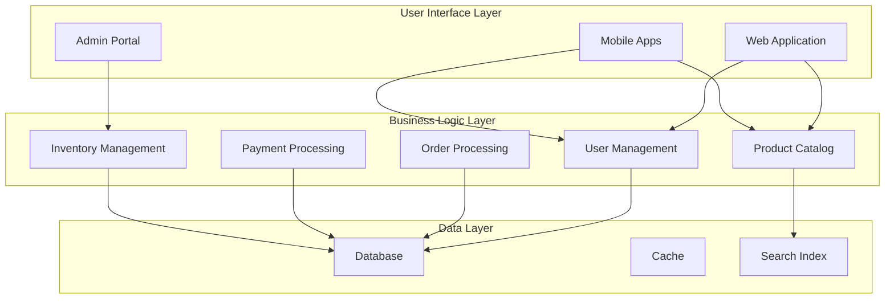
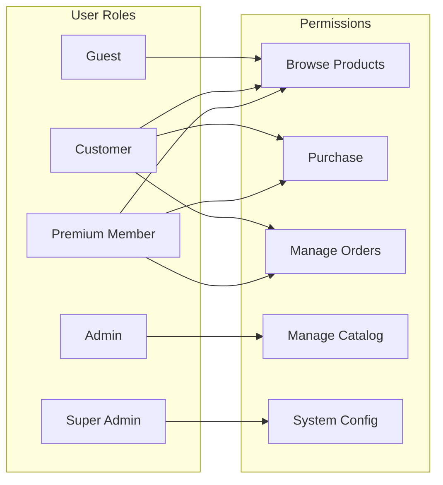
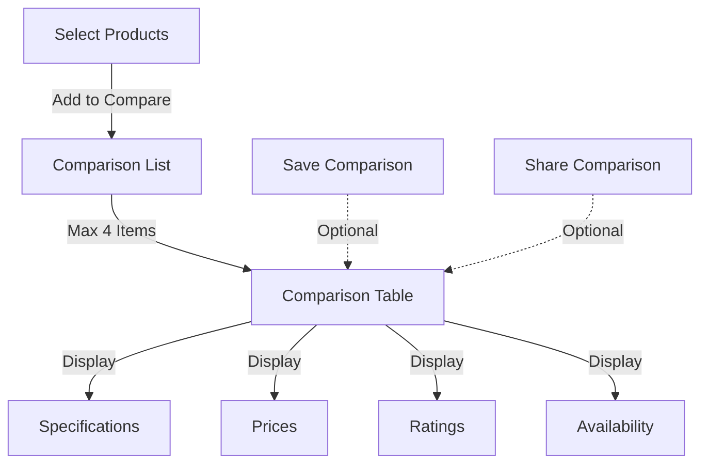
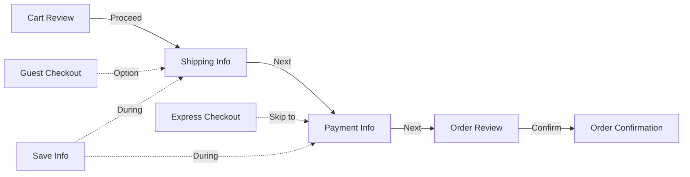
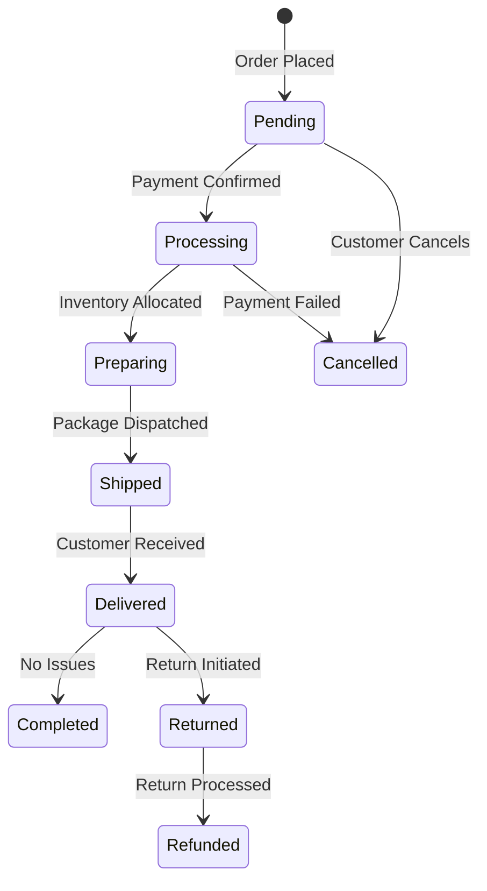
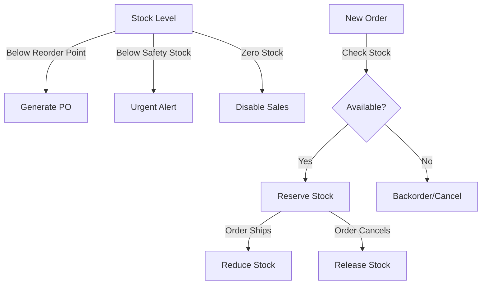
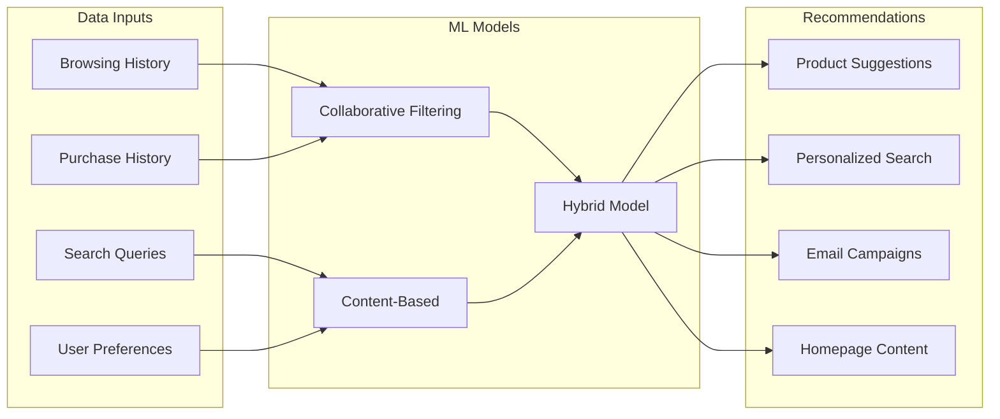
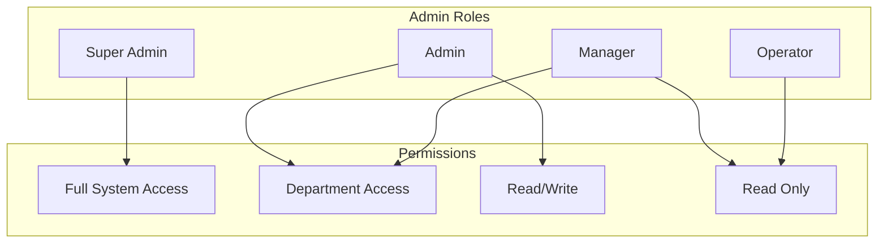

# Functional Requirements Specification (FRS)

## 1. Document Control

| Attribute | Value |
|-----------|--------|
| **Document ID** | REQ-FR-001 |
| **Version** | 1.0.0 |
| **Status** | Approved |
| **Owner** | Product Team |
| **Reviewers** | Technical Lead, QA Lead, Business Analyst |

## 2. Introduction

### 2.1 Purpose

This document specifies the functional requirements for the TechAlly e-commerce platform. Each requirement is traceable to business requirements and will be implemented through specific technical components.

### 2.2 Functional Architecture

## 3. User Management Requirements

### 3.1 User Registration

| ID | Requirement | Priority | Component | API |
|----|-------------|----------|-----------|-----|
| `FR-USER-001` | Email registration with verification | Critical | [`MOD-AUTH-001`](../architecture/auth-module.md) | [`API-AUTH-001`](../api/auth-api.md#register) |
| `FR-USER-002` | Social login (Google, Facebook, Apple) | High | [`MOD-AUTH-002`](../architecture/auth-module.md#social) | [`API-AUTH-002`](../api/auth-api.md#social) |
| `FR-USER-003` | Multi-factor authentication | High | [`MOD-AUTH-003`](../architecture/auth-module.md#mfa) | [`API-AUTH-003`](../api/auth-api.md#mfa) |
| `FR-USER-004` | Password complexity requirements | Critical | [`MOD-AUTH-004`](../architecture/auth-module.md#password) | [`API-AUTH-004`](../api/auth-api.md#password) |
| `FR-USER-005` | Account recovery via email/SMS | High | [`MOD-AUTH-005`](../architecture/auth-module.md#recovery) | [`API-AUTH-005`](../api/auth-api.md#recovery) |

### 3.2 User Profile Management

| ID | Requirement | Priority | Data Model | Test Case |
|----|-------------|----------|------------|-----------|
| `FR-USER-006` | Personal information management | High | [`DB-USER-001`](../database/user-schema.md) | [`TC-USER-001`](../testing/user-tests.md#profile) |
| `FR-USER-007` | Multiple shipping addresses | High | [`DB-ADDR-001`](../database/address-schema.md) | [`TC-USER-002`](../testing/user-tests.md#addresses) |
| `FR-USER-008` | Payment method management | Critical | [`DB-PAY-001`](../database/payment-schema.md) | [`TC-USER-003`](../testing/user-tests.md#payment) |
| `FR-USER-009` | Order history viewing | High | [`DB-ORD-001`](../database/order-schema.md) | [`TC-USER-004`](../testing/user-tests.md#history) |
| `FR-USER-010` | Wishlist management | Medium | [`DB-WISH-001`](../database/wishlist-schema.md) | [`TC-USER-005`](../testing/user-tests.md#wishlist) |

### 3.3 User Roles and Permissions

## 4. Product Catalog Requirements

### 4.1 Product Information Management

| ID | Requirement | Description | Priority | Implementation |
|----|-------------|-------------|----------|----------------|
| `FR-PROD-001` | Product details display | Name, description, specs, images | Critical | [`SVC-PROD-001`](../api/product-service.md#details) |
| `FR-PROD-002` | Product categorization | Multi-level category hierarchy | High | [`SVC-CAT-001`](../api/category-service.md) |
| `FR-PROD-003` | Product variants | Size, color, configuration | High | [`SVC-PROD-002`](../api/product-service.md#variants) |
| `FR-PROD-004` | Product bundles | Related product grouping | Medium | [`SVC-PROD-003`](../api/product-service.md#bundles) |
| `FR-PROD-005` | Digital assets | 360° views, videos, AR | Medium | [`SVC-MEDIA-001`](../api/media-service.md) |

### 4.2 Product Search and Discovery

| ID | Requirement | Features | Priority | Component |
|----|-------------|----------|----------|-----------|
| `FR-SEARCH-001` | Text search | Full-text, autocomplete | Critical | [`MOD-SEARCH-001`](../architecture/search-module.md) |
| `FR-SEARCH-002` | Filter/facets | Price, brand, specs | Critical | [`MOD-SEARCH-002`](../architecture/search-module.md#filters) |
| `FR-SEARCH-003` | Sort options | Price, rating, relevance | High | [`MOD-SEARCH-003`](../architecture/search-module.md#sorting) |
| `FR-SEARCH-004` | Visual search | Image-based search | Low | [`MOD-SEARCH-004`](../architecture/search-module.md#visual) |
| `FR-SEARCH-005` | Voice search | Voice commands | Low | [`MOD-SEARCH-005`](../architecture/search-module.md#voice) |

### 4.3 Product Comparison

## 5. Shopping Cart Requirements

### 5.1 Cart Management

| ID | Requirement | Description | Priority | API Endpoint |
|----|-------------|-------------|----------|--------------|
| `FR-CART-001` | Add to cart | Single/multiple items | Critical | `POST /api/cart/add` |
| `FR-CART-002` | Update quantity | Increase/decrease | Critical | `PUT /api/cart/update` |
| `FR-CART-003` | Remove items | Individual/all | Critical | `DELETE /api/cart/remove` |
| `FR-CART-004` | Save for later | Move to wishlist | Medium | `POST /api/cart/save` |
| `FR-CART-005` | Cart persistence | Cross-device sync | High | [`SVC-CART-001`](../api/cart-service.md#sync) |

### 5.2 Cart Features

| ID | Feature | Description | Business Rule | Priority |
|----|---------|-------------|---------------|----------|
| `FR-CART-006` | Price calculation | Real-time total | [`BR-RULE-001`](./business-requirements.md#pricing-rules) | Critical |
| `FR-CART-007` | Tax calculation | Location-based | [`BR-RULE-014`](./business-requirements.md#tax-rules) | Critical |
| `FR-CART-008` | Shipping estimate | Multiple options | [`BR-RULE-003`](./business-requirements.md#shipping-rules) | High |
| `FR-CART-009` | Promo codes | Discount application | [`BR-RULE-001`](./business-requirements.md#pricing-rules) | High |
| `FR-CART-010` | Stock validation | Availability check | [`BR-RULE-007`](./business-requirements.md#inventory-rules) | Critical |

## 6. Checkout Requirements

### 6.1 Checkout Process

### 6.2 Checkout Features

| ID | Requirement | Description | Priority | Component |
|----|-------------|-------------|----------|-----------|
| `FR-CHECK-001` | Guest checkout | No registration required | High | [`MOD-CHECK-001`](../architecture/checkout-module.md#guest) |
| `FR-CHECK-002` | Express checkout | One-click purchase | Medium | [`MOD-CHECK-002`](../architecture/checkout-module.md#express) |
| `FR-CHECK-003` | Address validation | USPS/Google validation | High | [`INT-ADDR-001`](../api/address-validation.md) |
| `FR-CHECK-004` | Payment processing | Multiple gateways | Critical | [`SVC-PAY-001`](../api/payment-service.md) |
| `FR-CHECK-005` | Order confirmation | Email/SMS notification | Critical | [`SVC-NOTIF-001`](../api/notification-service.md) |

## 7. Payment Requirements

### 7.1 Payment Methods

| ID | Method | Provider | Priority | Integration |
|----|--------|----------|----------|-------------|
| `FR-PAY-001` | Credit/Debit Cards | Stripe | Critical | [`INT-STRIPE-001`](../api/stripe-integration.md) |
| `FR-PAY-002` | PayPal | PayPal | High | [`INT-PAYPAL-001`](../api/paypal-integration.md) |
| `FR-PAY-003` | Apple Pay | Apple | High | [`INT-APPLE-001`](../api/applepay-integration.md) |
| `FR-PAY-004` | Google Pay | Google | High | [`INT-GOOGLE-001`](../api/googlepay-integration.md) |
| `FR-PAY-005` | Buy Now Pay Later | Klarna/Affirm | Medium | [`INT-BNPL-001`](../api/bnpl-integration.md) |
| `FR-PAY-006` | Cryptocurrency | BitPay | Low | [`INT-CRYPTO-001`](../api/crypto-integration.md) |

### 7.2 Payment Security

| ID | Requirement | Standard | Priority | Implementation |
|----|-------------|----------|----------|----------------|
| `FR-PAY-007` | PCI compliance | PCI DSS Level 1 | Critical | [`SEC-PCI-001`](../architecture/security.md#pci) |
| `FR-PAY-008` | Tokenization | Card tokenization | Critical | [`SEC-TOKEN-001`](../architecture/security.md#tokenization) |
| `FR-PAY-009` | 3D Secure | 3DS 2.0 | High | [`SEC-3DS-001`](../architecture/security.md#3ds) |
| `FR-PAY-010` | Fraud detection | ML-based detection | High | [`SVC-FRAUD-001`](../api/fraud-service.md) |

## 8. Order Management Requirements

### 8.1 Order Processing

### 8.2 Order Features

| ID | Requirement | Description | Priority | Service |
|----|-------------|-------------|----------|---------|
| `FR-ORD-001` | Order placement | Create order record | Critical | [`SVC-ORD-001`](../api/order-service.md#create) |
| `FR-ORD-002` | Order tracking | Real-time status | High | [`SVC-TRACK-001`](../api/tracking-service.md) |
| `FR-ORD-003` | Order modification | Pre-shipment changes | Medium | [`SVC-ORD-002`](../api/order-service.md#modify) |
| `FR-ORD-004` | Order cancellation | Customer initiated | High | [`SVC-ORD-003`](../api/order-service.md#cancel) |
| `FR-ORD-005` | Order history | View past orders | High | [`SVC-ORD-004`](../api/order-service.md#history) |
| `FR-ORD-006` | Reorder | Repeat purchase | Medium | [`SVC-ORD-005`](../api/order-service.md#reorder) |
| `FR-ORD-007` | Invoice generation | PDF invoices | High | [`SVC-INV-001`](../api/invoice-service.md) |

## 9. Inventory Management Requirements

### 9.1 Inventory Operations

| ID | Requirement | Description | Priority | Component |
|----|-------------|-------------|----------|-----------|
| `FR-INV-001` | Stock tracking | Real-time levels | Critical | [`SVC-INV-001`](../api/inventory-service.md#tracking) |
| `FR-INV-002` | Stock reservation | Order allocation | Critical | [`SVC-INV-002`](../api/inventory-service.md#reserve) |
| `FR-INV-003` | Multi-warehouse | Location tracking | High | [`SVC-INV-003`](../api/inventory-service.md#warehouse) |
| `FR-INV-004` | Reorder points | Auto-replenishment | Medium | [`SVC-INV-004`](../api/inventory-service.md#reorder) |
| `FR-INV-005` | Stock alerts | Low stock notifications | High | [`SVC-INV-005`](../api/inventory-service.md#alerts) |

### 9.2 Inventory Rules

## 10. Customer Service Requirements

### 10.1 Support Channels

| ID | Channel | Features | Priority | Implementation |
|----|---------|----------|----------|----------------|
| `FR-SUPP-001` | Live Chat | Real-time support | High | [`MOD-CHAT-001`](../architecture/chat-module.md) |
| `FR-SUPP-002` | Email Support | Ticket system | High | [`SVC-TICK-001`](../api/ticket-service.md) |
| `FR-SUPP-003` | Phone Support | Call center integration | Medium | [`INT-CALL-001`](../api/call-integration.md) |
| `FR-SUPP-004` | AI Chatbot | 24/7 automated support | High | [`MOD-BOT-001`](../architecture/chatbot-module.md) |
| `FR-SUPP-005` | Help Center | Self-service KB | High | [`MOD-HELP-001`](../architecture/help-module.md) |

### 10.2 Support Features

| ID | Feature | Description | SLA | Priority |
|----|---------|-------------|-----|----------|
| `FR-SUPP-006` | Ticket creation | Issue logging | Immediate | Critical |
| `FR-SUPP-007` | Ticket routing | Skill-based assignment | <5 min | High |
| `FR-SUPP-008` | Response time | First response | <2 hours | High |
| `FR-SUPP-009` | Escalation | Priority handling | <30 min | High |
| `FR-SUPP-010` | Resolution tracking | Performance metrics | Daily | Medium |

## 11. Reviews and Ratings Requirements

### 11.1 Review System

| ID | Requirement | Description | Priority | Component |
|----|-------------|-------------|----------|-----------|
| `FR-REV-001` | Product reviews | Text reviews | High | [`SVC-REV-001`](../api/review-service.md#create) |
| `FR-REV-002` | Star ratings | 1-5 star scale | High | [`SVC-REV-002`](../api/review-service.md#rating) |
| `FR-REV-003` | Review photos | Image uploads | Medium | [`SVC-REV-003`](../api/review-service.md#photos) |
| `FR-REV-004` | Review videos | Video uploads | Low | [`SVC-REV-004`](../api/review-service.md#videos) |
| `FR-REV-005` | Verified purchase | Purchase validation | High | [`SVC-REV-005`](../api/review-service.md#verify) |
| `FR-REV-006` | Review moderation | Content filtering | High | [`SVC-REV-006`](../api/review-service.md#moderate) |
| `FR-REV-007` | Helpful votes | User voting | Medium | [`SVC-REV-007`](../api/review-service.md#votes) |

## 12. Personalization Requirements

### 12.1 Recommendation Engine

### 12.2 Personalization Features

| ID | Feature | Description | Priority | Service |
|----|---------|-------------|----------|---------|
| `FR-PERS-001` | Product recommendations | AI-powered suggestions | High | [`SVC-REC-001`](../api/recommendation-service.md) |
| `FR-PERS-002` | Personalized search | User-specific results | Medium | [`SVC-SRCH-001`](../api/search-service.md#personalized) |
| `FR-PERS-003` | Dynamic pricing | User-based pricing | Low | [`SVC-PRICE-001`](../api/pricing-service.md#dynamic) |
| `FR-PERS-004` | Personalized emails | Targeted campaigns | High | [`SVC-EMAIL-001`](../api/email-service.md#personalized) |
| `FR-PERS-005` | Custom homepage | User-specific content | Medium | [`MOD-HOME-001`](../architecture/homepage-module.md) |

## 13. Mobile Application Requirements

### 13.1 Mobile Features

| ID | Feature | Platform | Priority | Component |
|----|---------|----------|----------|-----------|
| `FR-MOB-001` | Native apps | iOS/Android | Critical | [`MOB-APP-001`](../architecture/mobile-architecture.md) |
| `FR-MOB-002` | Push notifications | Order/marketing | High | [`MOB-PUSH-001`](../architecture/mobile-push.md) |
| `FR-MOB-003` | Biometric auth | Face/Touch ID | High | [`MOB-AUTH-001`](../architecture/mobile-auth.md) |
| `FR-MOB-004` | Offline mode | Browse offline | Medium | [`MOB-OFF-001`](../architecture/mobile-offline.md) |
| `FR-MOB-005` | Camera integration | Barcode/QR scan | Medium | [`MOB-CAM-001`](../architecture/mobile-camera.md) |
| `FR-MOB-006` | Location services | Store locator | Low | [`MOB-LOC-001`](../architecture/mobile-location.md) |

## 14. Admin Portal Requirements

### 14.1 Admin Functions

| ID | Function | Description | Users | Priority |
|----|----------|-------------|-------|----------|
| `FR-ADM-001` | Dashboard | Analytics overview | All admins | Critical |
| `FR-ADM-002` | Product management | CRUD operations | Product team | Critical |
| `FR-ADM-003` | Order management | Process orders | Operations | Critical |
| `FR-ADM-004` | User management | Customer data | Support | High |
| `FR-ADM-005` | Inventory management | Stock control | Warehouse | Critical |
| `FR-ADM-006` | Marketing tools | Campaigns | Marketing | High |
| `FR-ADM-007` | Reports | Business intelligence | Management | High |
| `FR-ADM-008` | Settings | System configuration | Super admin | High |

### 14.2 Admin Permissions

## 15. Integration Requirements

### 15.1 Third-Party Integrations

| ID | System | Purpose | Priority | Documentation |
|----|--------|---------|----------|---------------|
| `FR-INT-001` | Payment gateways | Transaction processing | Critical | [`INT-PAY-001`](../api/payment-integrations.md) |
| `FR-INT-002` | Shipping carriers | Logistics | Critical | [`INT-SHIP-001`](../api/shipping-integrations.md) |
| `FR-INT-003` | Tax services | Tax calculation | High | [`INT-TAX-001`](../api/tax-integrations.md) |
| `FR-INT-004` | Email providers | Communications | High | [`INT-EMAIL-001`](../api/email-integrations.md) |
| `FR-INT-005` | Analytics tools | Data analysis | High | [`INT-ANAL-001`](../api/analytics-integrations.md) |
| `FR-INT-006` | CRM systems | Customer management | Medium | [`INT-CRM-001`](../api/crm-integrations.md) |
| `FR-INT-007` | ERP systems | Enterprise planning | Medium | [`INT-ERP-001`](../api/erp-integrations.md) |

## 16. Compliance and Security Requirements

### 16.1 Security Features

| ID | Feature | Description | Priority | Implementation |
|----|---------|-------------|----------|----------------|
| `FR-SEC-001` | SSL/TLS | Encrypted connections | Critical | [`SEC-TLS-001`](../architecture/security.md#tls) |
| `FR-SEC-002` | Data encryption | At-rest encryption | Critical | [`SEC-ENC-001`](../architecture/security.md#encryption) |
| `FR-SEC-003` | Session management | Secure sessions | Critical | [`SEC-SESS-001`](../architecture/security.md#sessions) |
| `FR-SEC-004` | CAPTCHA | Bot prevention | High | [`SEC-CAP-001`](../architecture/security.md#captcha) |
| `FR-SEC-005` | Rate limiting | API protection | High | [`SEC-RATE-001`](../architecture/security.md#ratelimit) |

## 17. Reporting Requirements

### 17.1 Business Reports

| ID | Report | Frequency | Audience | Format |
|----|--------|-----------|----------|--------|
| `FR-RPT-001` | Sales report | Daily/Monthly | Management | Dashboard/PDF |
| `FR-RPT-002` | Inventory report | Real-time | Operations | Dashboard |
| `FR-RPT-003` | Customer report | Weekly | Marketing | Excel/CSV |
| `FR-RPT-004` | Financial report | Monthly | Finance | PDF |
| `FR-RPT-005` | Performance report | Real-time | Technical | Dashboard |

## 18. Functional Test Coverage

### 18.1 Test Matrix

| Functional Area | Test Cases | Coverage | Test Plan |
|-----------------|------------|----------|-----------|
| User Management | 45 | 95% | [`TEST-USER-001`](../06_testing/user-test-plan.md) |
| Product Catalog | 62 | 92% | [`TEST-PROD-001`](../06_testing/product-test-plan.md) |
| Shopping Cart | 38 | 90% | [`TEST-CART-001`](../06_testing/cart-test-plan.md) |
| Checkout | 51 | 93% | [`TEST-CHECK-001`](../06_testing/checkout-test-plan.md) |
| Payment | 47 | 95% | [`TEST-PAY-001`](../06_testing/payment-test-plan.md) |
| Orders | 56 | 91% | [`TEST-ORD-001`](../06_testing/order-test-plan.md) |

## 19. Acceptance Criteria

### 19.1 Feature Acceptance

Each functional requirement must meet:
- Functionality works as specified
- Performance meets NFR standards
- Security requirements satisfied
- Accessibility standards met
- Cross-browser compatibility verified
- Mobile responsiveness confirmed

## 20. Traceability

### 20.1 Requirements Traceability

| Functional Req | Business Req | Technical Spec | Test Case |
|----------------|--------------|----------------|-----------|
| `FR-USER-001` | [`BR-CUST-001`](./business-requirements.md) | [`TS-AUTH-001`](../architecture/auth-architecture.md) | [`TC-AUTH-001`](../testing/auth-tests.md) |
| `FR-PROD-001` | [`BR-CUST-002`](./business-requirements.md) | [`TS-PROD-001`](../architecture/product-architecture.md) | [`TC-PROD-001`](../testing/product-tests.md) |
| `FR-CART-001` | [`BR-CUST-003`](./business-requirements.md) | [`TS-CART-001`](../architecture/cart-architecture.md) | [`TC-CART-001`](../testing/cart-tests.md) |

## 21. References

- [Business Requirements](./business-requirements.md) - `REQ-BR-001`
- [Non-Functional Requirements](./non-functional-requirements.md) - `REQ-NFR-001`
- [System Architecture](../architecture/system-overview.md) - `ARCH-001`
- [API Documentation](../api/api-reference.md) - `API-001`
- [Test Plans](../06_testing/master-test-plan.md) - `TEST-001`

---
*This document requires approval from Product Manager and Technical Lead for any changes.*
