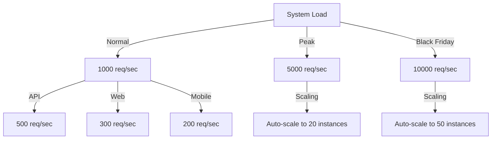
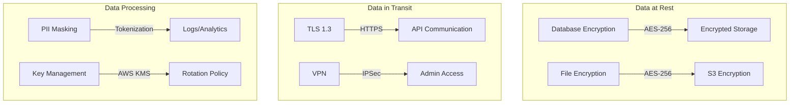

# Non-Functional Requirements Specification

## 1. Performance Requirements

### 1.1 Response Time Requirements

| Transaction Type | Target | Maximum | Percentile | Load Condition |
|-----------------|---------|---------|------------|----------------|
| `NFR-PERF-001` Homepage Load | <1.5s | 3s | 95th | Normal |
| `NFR-PERF-002` Product Search | <500ms | 1s | 95th | Normal |
| `NFR-PERF-003` Add to Cart | <200ms | 500ms | 99th | Normal |
| `NFR-PERF-004` Checkout Process | <2s | 5s | 95th | Normal |
| `NFR-PERF-005` Payment Processing | <5s | 10s | 99th | Peak |
| `NFR-PERF-006` API Response | <200ms | 500ms | 95th | Normal |
| `NFR-PERF-007` Database Query | <50ms | 200ms | 95th | Normal |
| `NFR-PERF-008` Static Content | <50ms | 100ms | 99th | CDN |

### 1.2 Throughput Requirements

## 2. Scalability Requirements

### 2.1 Horizontal Scalability

| Component | Min Instances | Max Instances | Scale Trigger | Scale Down |
|-----------|---------------|---------------|---------------|------------|
| `NFR-SCALE-001` Web Servers | 2 | 20 | CPU >70% | CPU <30% |
| `NFR-SCALE-002` API Services | 3 | 30 | Request rate | Rate <40% |
| `NFR-SCALE-003` Workers | 1 | 10 | Queue depth | Queue <10 |
| `NFR-SCALE-004` Cache Nodes | 2 | 8 | Memory >80% | Memory <40% |

## 3. Reliability Requirements

### 3.1 Availability Requirements

| Service Level | Availability | Downtime/Year | Downtime/Month |
|---------------|--------------|---------------|----------------|
| `NFR-REL-001` Platform | 99.9% | 8.76 hours | 43.2 minutes |
| `NFR-REL-002` Core Services | 99.95% | 4.38 hours | 21.6 minutes |
| `NFR-REL-003` Payment | 99.99% | 52.56 minutes | 4.32 minutes |
| `NFR-REL-004` Search | 99.5% | 43.8 hours | 3.6 hours |

### 3.2 Recovery Requirements

| Metric | Target | Maximum | Measurement |
|--------|--------|---------|-------------|
| `NFR-REL-009` RTO | 2 hours | 4 hours | Full restoration |
| `NFR-REL-010` RPO | 1 hour | 2 hours | Data loss tolerance |
| `NFR-REL-011` MTBF | >30 days | - | System stability |
| `NFR-REL-012` MTTR | <2 hours | 4 hours | Incident resolution |

## 4. Security Requirements

### 4.1 Authentication & Authorization

| Requirement | Description | Standard | Implementation |
|-------------|-------------|----------|----------------|
| `NFR-SEC-001` Password Policy | Complex passwords | NIST 800-63B | Min 12 chars |
| `NFR-SEC-002` MFA Support | Multi-factor auth | TOTP/SMS | Google Authenticator |
| `NFR-SEC-003` Session Management | Secure sessions | OWASP | JWT with refresh |
| `NFR-SEC-004` Role-Based Access | RBAC implementation | - | Permissions matrix |
| `NFR-SEC-005` OAuth Integration | Social login | OAuth 2.0 | Google, Facebook |

### 4.2 Data Security

## 5. Usability Requirements

### 5.1 User Interface Requirements

| Requirement | Description | Metric | Target |
|-------------|-------------|--------|--------|
| `NFR-USE-001` Learning Curve | Time to first purchase | Minutes | <10 min |
| `NFR-USE-002` Task Completion | Checkout success rate | Percentage | >85% |
| `NFR-USE-003` Error Recovery | User error handling | Recovery rate | >90% |
| `NFR-USE-004` Navigation | Find product | Clicks | <4 clicks |

### 5.2 Accessibility Requirements

| Requirement | Standard | Level | Testing |
|-------------|----------|-------|---------|
| `NFR-USE-006` WCAG Compliance | WCAG 2.1 | AA | Automated + Manual |
| `NFR-USE-007` Screen Reader | ARIA labels | Complete | NVDA/JAWS |
| `NFR-USE-008` Keyboard Navigation | Full support | 100% | Tab navigation |
| `NFR-USE-009` Color Contrast | 4.5:1 ratio | Normal text | Automated |

## 6. Compatibility Requirements

### 6.1 Browser Compatibility

| Browser | Minimum Version | Support Level | Market Share |
|---------|----------------|---------------|--------------|
| `NFR-COMP-001` Chrome | 90+ | Full | 65% |
| `NFR-COMP-002` Safari | 14+ | Full | 19% |
| `NFR-COMP-003` Firefox | 88+ | Full | 4% |
| `NFR-COMP-004` Edge | 90+ | Full | 4% |
| `NFR-COMP-005` Mobile Safari | iOS 14+ | Full | Mobile |
| `NFR-COMP-006` Chrome Mobile | Android 10+ | Full | Mobile |

## 7. Maintainability Requirements

### 7.1 Code Quality Standards

| Metric | Target | Tool | Enforcement |
|--------|--------|------|-------------|
| `NFR-MAIN-001` Code Coverage | >90% | Jest/Coverage | CI/CD |
| `NFR-MAIN-002` Cyclomatic Complexity | <10 | SonarQube | PR Check |
| `NFR-MAIN-003` Technical Debt | <5% | SonarQube | Monthly |
| `NFR-MAIN-004` Documentation | 100% public APIs | JSDoc | PR Check |

### 7.2 Deployment Requirements

| Requirement | Description | Target | Method |
|-------------|-------------|--------|--------|
| `NFR-MAIN-006` Deployment Frequency | Regular releases | Daily | CI/CD |
| `NFR-MAIN-007` Deployment Time | Quick deployment | <30 min | Blue-Green |
| `NFR-MAIN-008` Rollback Time | Fast rollback | <5 min | Automated |
| `NFR-MAIN-009` Zero Downtime | No service interruption | 100% | Rolling update |

## 8. Monitoring Requirements

### 8.1 Application Monitoring

| Metric | Monitoring Interval | Retention | Alert Threshold |
|--------|-------------------|-----------|-----------------|
| `NFR-MON-001` Response Time | Real-time | 30 days | >2s |
| `NFR-MON-002` Error Rate | Real-time | 90 days | >1% |
| `NFR-MON-003` Transaction Volume | Per minute | 1 year | Anomaly |
| `NFR-MON-004` User Sessions | Real-time | 30 days | Drop >20% |

## 9. Capacity Requirements

### 9.1 Storage Capacity

| Data Type | Current | Year 1 | Year 3 | Growth Rate |
|-----------|---------|--------|--------|-------------|
| `NFR-CAP-001` Database | 100GB | 1TB | 10TB | 10x/year |
| `NFR-CAP-002` Media Files | 500GB | 5TB | 50TB | 10x/year |
| `NFR-CAP-003` Logs | 50GB/month | 100GB/month | 500GB/month | Linear |
| `NFR-CAP-004` Backups | 1TB | 10TB | 100TB | With data |

### 9.2 Traffic Capacity

| Metric | Normal | Peak | Black Friday |
|--------|--------|------|--------------|
| `NFR-CAP-005` Concurrent Users | 10K | 50K | 100K |
| `NFR-CAP-006` Requests/sec | 1K | 5K | 10K |
| `NFR-CAP-007` Bandwidth | 1Gbps | 5Gbps | 10Gbps |
| `NFR-CAP-008` Database Conn | 500 | 2000 | 5000 |

## 10. Compliance Requirements

### 10.1 Regulatory Compliance

| Regulation | Requirement | Implementation | Audit |
|------------|-------------|----------------|-------|
| `NFR-COMP-001` GDPR | Right to deletion | Soft delete + purge | Annual |
| `NFR-COMP-002` CCPA | Data portability | Export API | Annual |
| `NFR-COMP-003` PCI DSS | Secure payment | Tokenization | Quarterly |
| `NFR-COMP-004` ADA | Accessibility | WCAG 2.1 AA | Continuous |

## 11. Localization Requirements

### 11.1 Language Support

| Language | Code | Priority | Completion |
|----------|------|----------|------------|
| `NFR-LOC-001` English | en-US | Required | 100% |
| `NFR-LOC-002` Spanish | es-ES | High | Phase 1 |
| `NFR-LOC-003` French | fr-FR | Medium | Phase 2 |
| `NFR-LOC-004` German | de-DE | Medium | Phase 2 |

## 12. Testing Requirements

### 12.1 Test Coverage Requirements

| Test Type | Coverage Target | Tool | Frequency |
|-----------|----------------|------|-----------|
| `NFR-TEST-001` Unit Tests | >90% | Jest | Every commit |
| `NFR-TEST-002` Integration | >80% | Supertest | Every PR |
| `NFR-TEST-003` E2E Tests | Critical paths | Cypress | Daily |
| `NFR-TEST-004` Performance | All endpoints | K6 | Weekly |
| `NFR-TEST-005` Security | OWASP Top 10 | OWASP ZAP | Monthly |

## 13. Acceptance Criteria

Each non-functional requirement must be:
- Measurable with defined metrics
- Testable with automated tests where possible
- Monitored in production
- Documented with evidence
- Reviewed quarterly

## 14. References

- [Business Requirements](./business-requirements.md) - `REQ-BR-001`
- [Functional Requirements](./functional-requirements.md) - `REQ-FR-001`
- [System Architecture](../architecture/system-overview.md) - `ARCH-001`
- [Test Plan](../06_testing/test-plan.md) - `TEST-001`
- [Security Architecture](../architecture/security.md) - `SEC-001`

---
*This NFR document is maintained by the Technical Architecture Team and requires approval for changes.*
