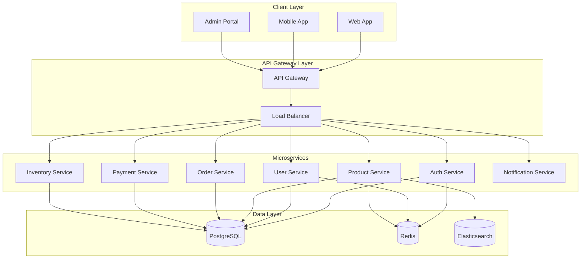
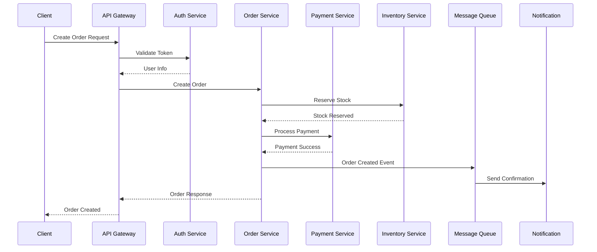
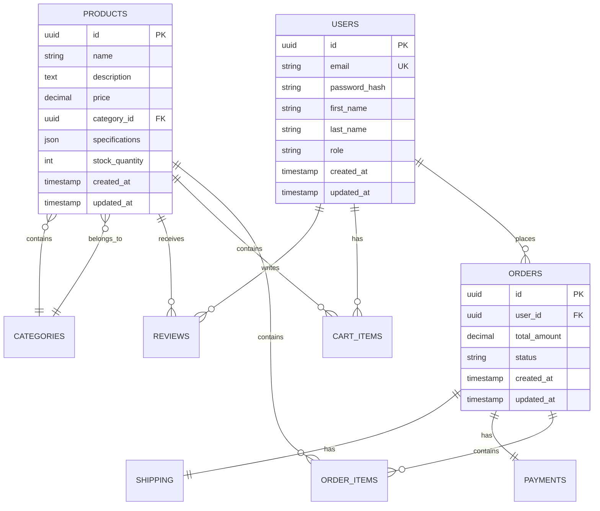
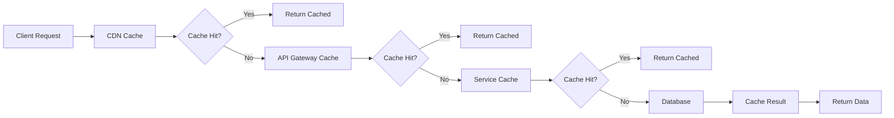

# Backend Architecture

## 1. Architecture Overview

### 1.1 Microservices Architecture



### 1.2 Technology Stack

| Component | Technology | Version | Purpose |
|-----------|------------|---------|---------|
| **Runtime** | Node.js | 18 LTS | JavaScript runtime |
| **Framework** | Express.js | 4.18+ | Web framework |
| **Language** | TypeScript | 5.0+ | Type safety |
| **Database** | PostgreSQL | 15+ | Primary database |
| **Cache** | Redis | 7.0+ | Caching layer |
| **Search** | Elasticsearch | 8.0+ | Search engine |
| **Message Queue** | RabbitMQ | 3.11+ | Async messaging |
| **Monitoring** | DataDog | Latest | APM & monitoring |
| **Containerization** | Docker | 24+ | Container platform |
| **Orchestration** | Kubernetes | 1.27+ | Container orchestration |

## 2. Service Architecture

### 2.1 Service Breakdown

| Service | Responsibility | Port | Database | Dependencies |
|---------|---------------|------|----------|--------------|
| **Auth Service** | Authentication, authorization | 3001 | PostgreSQL | Redis |
| **User Service** | User management, profiles | 3002 | PostgreSQL | Auth Service |
| **Product Service** | Product catalog, search | 3003 | PostgreSQL, Elasticsearch | - |
| **Order Service** | Order processing, tracking | 3004 | PostgreSQL | User, Product, Inventory |
| **Payment Service** | Payment processing | 3005 | PostgreSQL | Order Service |
| **Inventory Service** | Stock management | 3006 | PostgreSQL | Product Service |
| **Notification Service** | Email, SMS, push notifications | 3007 | PostgreSQL | All services |

### 2.2 Service Communication



## 3. API Gateway

### 3.1 Gateway Responsibilities

```yaml
api_gateway:
  responsibilities:
    - Request routing
    - Authentication & authorization
    - Rate limiting
    - Request/response transformation
    - Logging & monitoring
    - Circuit breaking
    - Load balancing
    
  features:
    rate_limiting:
      anonymous: 100 req/min
      authenticated: 1000 req/min
      premium: 5000 req/min
      
    circuit_breaker:
      failure_threshold: 50%
      timeout: 30s
      retry_attempts: 3
      
    caching:
      product_catalog: 5 minutes
      user_profile: 1 minute
      static_content: 1 hour
```

### 3.2 Gateway Configuration

```typescript
// API Gateway setup
import express from 'express';
import { createProxyMiddleware } from 'http-proxy-middleware';
import rateLimit from 'express-rate-limit';
import helmet from 'helmet';

const app = express();

// Security middleware
app.use(helmet());

// Rate limiting
const limiter = rateLimit({
  windowMs: 15 * 60 * 1000, // 15 minutes
  max: 100, // limit each IP to 100 requests per windowMs
  message: 'Too many requests from this IP'
});
app.use(limiter);

// Service proxies
const services = {
  auth: 'http://auth-service:3001',
  users: 'http://user-service:3002',
  products: 'http://product-service:3003',
  orders: 'http://order-service:3004',
  payments: 'http://payment-service:3005'
};

// Route configuration
Object.entries(services).forEach(([path, target]) => {
  app.use(`/api/${path}`, createProxyMiddleware({
    target,
    changeOrigin: true,
    pathRewrite: {
      [`^/api/${path}`]: ''
    },
    onError: (err, req, res) => {
      res.status(503).json({ error: 'Service unavailable' });
    }
  }));
});
```

## 4. Authentication Service

### 4.1 Auth Service Architecture

```typescript
// Auth service structure
interface AuthService {
  // Authentication
  login(credentials: LoginCredentials): Promise<AuthResponse>;
  logout(token: string): Promise<void>;
  refreshToken(refreshToken: string): Promise<AuthResponse>;
  
  // Registration
  register(userData: RegisterData): Promise<User>;
  verifyEmail(token: string): Promise<void>;
  
  // Password management
  resetPassword(email: string): Promise<void>;
  changePassword(userId: string, passwords: PasswordChange): Promise<void>;
  
  // Token management
  validateToken(token: string): Promise<User>;
  revokeToken(token: string): Promise<void>;
}

// JWT implementation
class JWTAuthService implements AuthService {
  private secretKey: string;
  private refreshSecretKey: string;
  
  async login(credentials: LoginCredentials): Promise<AuthResponse> {
    const user = await this.validateCredentials(credentials);
    
    if (!user) {
      throw new UnauthorizedError('Invalid credentials');
    }
    
    const accessToken = this.generateAccessToken(user);
    const refreshToken = this.generateRefreshToken(user);
    
    // Store refresh token
    await this.storeRefreshToken(user.id, refreshToken);
    
    return {
      accessToken,
      refreshToken,
      user: this.sanitizeUser(user),
      expiresIn: 3600 // 1 hour
    };
  }
  
  private generateAccessToken(user: User): string {
    return jwt.sign(
      {
        userId: user.id,
        email: user.email,
        role: user.role
      },
      this.secretKey,
      { expiresIn: '1h' }
    );
  }
}
```

### 4.2 Authorization Middleware

```typescript
// Role-based authorization
export const authorize = (roles: string[] = []) => {
  return async (req: Request, res: Response, next: NextFunction) => {
    try {
      const token = extractToken(req);
      const user = await validateToken(token);
      
      if (roles.length && !roles.includes(user.role)) {
        return res.status(403).json({ error: 'Insufficient permissions' });
      }
      
      req.user = user;
      next();
    } catch (error) {
      res.status(401).json({ error: 'Unauthorized' });
    }
  };
};

// Usage
app.get('/admin/users', authorize(['admin']), getUsersHandler);
app.post('/orders', authorize(['user', 'admin']), createOrderHandler);
```

## 5. Data Layer Architecture

### 5.1 Database Design



### 5.2 Database Connection Pool

```typescript
// Database configuration
import { Pool } from 'pg';
import { Redis } from 'ioredis';

class DatabaseManager {
  private pgPool: Pool;
  private redisClient: Redis;
  
  constructor() {
    this.pgPool = new Pool({
      host: process.env.DB_HOST,
      port: parseInt(process.env.DB_PORT || '5432'),
      database: process.env.DB_NAME,
      user: process.env.DB_USER,
      password: process.env.DB_PASSWORD,
      max: 20, // Maximum number of connections
      idleTimeoutMillis: 30000,
      connectionTimeoutMillis: 2000
    });
    
    this.redisClient = new Redis({
      host: process.env.REDIS_HOST,
      port: parseInt(process.env.REDIS_PORT || '6379'),
      retryDelayOnFailover: 100,
      maxRetriesPerRequest: 3
    });
  }
  
  async query(text: string, params?: any[]): Promise<any> {
    const client = await this.pgPool.connect();
    try {
      const result = await client.query(text, params);
      return result.rows;
    } finally {
      client.release();
    }
  }
  
  async cache(key: string, value: any, ttl: number = 300): Promise<void> {
    await this.redisClient.setex(key, ttl, JSON.stringify(value));
  }
  
  async getCache(key: string): Promise<any> {
    const cached = await this.redisClient.get(key);
    return cached ? JSON.parse(cached) : null;
  }
}
```

## 6. Message Queue Architecture

### 6.1 Event-Driven Communication

```typescript
// Event system
interface DomainEvent {
  id: string;
  type: string;
  aggregateId: string;
  data: any;
  timestamp: Date;
  version: number;
}

class EventBus {
  private publisher: amqp.Channel;
  private subscribers: Map<string, Function[]> = new Map();
  
  async publish(event: DomainEvent): Promise<void> {
    const exchange = 'domain_events';
    const routingKey = event.type;
    
    await this.publisher.publish(
      exchange,
      routingKey,
      Buffer.from(JSON.stringify(event)),
      { persistent: true }
    );
  }
  
  async subscribe(eventType: string, handler: Function): Promise<void> {
    const handlers = this.subscribers.get(eventType) || [];
    handlers.push(handler);
    this.subscribers.set(eventType, handlers);
    
    // Setup RabbitMQ consumer
    const queue = `${eventType}_queue`;
    await this.setupConsumer(queue, eventType, handler);
  }
}

// Event handlers
class OrderEventHandlers {
  @EventHandler('OrderCreated')
  async handleOrderCreated(event: OrderCreatedEvent): Promise<void> {
    // Send confirmation email
    await this.notificationService.sendOrderConfirmation(event.data.orderId);
    
    // Update inventory
    await this.inventoryService.reserveStock(event.data.items);
    
    // Process payment
    await this.paymentService.processPayment(event.data.paymentInfo);
  }
  
  @EventHandler('PaymentCompleted')
  async handlePaymentCompleted(event: PaymentCompletedEvent): Promise<void> {
    // Update order status
    await this.orderService.updateStatus(event.data.orderId, 'paid');
    
    // Trigger fulfillment
    await this.fulfillmentService.createShipment(event.data.orderId);
  }
}
```

### 6.2 Saga Pattern Implementation

```typescript
// Order processing saga
class OrderProcessingSaga {
  private steps: SagaStep[] = [
    { name: 'validateOrder', compensate: 'cancelOrder' },
    { name: 'reserveInventory', compensate: 'releaseInventory' },
    { name: 'processPayment', compensate: 'refundPayment' },
    { name: 'createShipment', compensate: 'cancelShipment' }
  ];
  
  async execute(orderData: OrderData): Promise<void> {
    const sagaId = generateId();
    const context = { sagaId, orderData, completedSteps: [] };
    
    try {
      for (const step of this.steps) {
        await this.executeStep(step, context);
        context.completedSteps.push(step.name);
      }
    } catch (error) {
      await this.compensate(context);
      throw error;
    }
  }
  
  private async compensate(context: SagaContext): Promise<void> {
    const completedSteps = context.completedSteps.reverse();
    
    for (const stepName of completedSteps) {
      const step = this.steps.find(s => s.name === stepName);
      if (step?.compensate) {
        await this.executeCompensation(step.compensate, context);
      }
    }
  }
}
```

## 7. Caching Strategy

### 7.1 Multi-Level Caching



### 7.2 Cache Implementation

```typescript
// Cache service
class CacheService {
  private redis: Redis;
  private localCache: NodeCache;
  
  constructor() {
    this.redis = new Redis(process.env.REDIS_URL);
    this.localCache = new NodeCache({ stdTTL: 60 }); // 1 minute local cache
  }
  
  async get<T>(key: string): Promise<T | null> {
    // Try local cache first
    let cached = this.localCache.get<T>(key);
    if (cached) return cached;
    
    // Try Redis cache
    const redisCached = await this.redis.get(key);
    if (redisCached) {
      cached = JSON.parse(redisCached);
      this.localCache.set(key, cached);
      return cached;
    }
    
    return null;
  }
  
  async set<T>(key: string, value: T, ttl: number = 300): Promise<void> {
    // Set in both caches
    this.localCache.set(key, value, ttl);
    await this.redis.setex(key, ttl, JSON.stringify(value));
  }
  
  async invalidate(pattern: string): Promise<void> {
    // Invalidate local cache
    this.localCache.flushAll();
    
    // Invalidate Redis cache
    const keys = await this.redis.keys(pattern);
    if (keys.length > 0) {
      await this.redis.del(...keys);
    }
  }
}

// Cache decorators
function Cacheable(ttl: number = 300) {
  return function (target: any, propertyName: string, descriptor: PropertyDescriptor) {
    const method = descriptor.value;
    
    descriptor.value = async function (...args: any[]) {
      const cacheKey = `${target.constructor.name}:${propertyName}:${JSON.stringify(args)}`;
      
      let cached = await this.cacheService.get(cacheKey);
      if (cached) return cached;
      
      const result = await method.apply(this, args);
      await this.cacheService.set(cacheKey, result, ttl);
      
      return result;
    };
  };
}

// Usage
class ProductService {
  @Cacheable(600) // 10 minutes
  async getProduct(id: string): Promise<Product> {
    return this.repository.findById(id);
  }
  
  @Cacheable(300) // 5 minutes
  async getProducts(filters: ProductFilters): Promise<Product[]> {
    return this.repository.findByFilters(filters);
  }
}
```

## 8. Error Handling & Resilience

### 8.1 Circuit Breaker Pattern

```typescript
class CircuitBreaker {
  private state: 'CLOSED' | 'OPEN' | 'HALF_OPEN' = 'CLOSED';
  private failureCount = 0;
  private lastFailureTime?: Date;
  
  constructor(
    private failureThreshold: number = 5,
    private recoveryTimeout: number = 60000
  ) {}
  
  async execute<T>(operation: () => Promise<T>): Promise<T> {
    if (this.state === 'OPEN') {
      if (this.shouldAttemptReset()) {
        this.state = 'HALF_OPEN';
      } else {
        throw new Error('Circuit breaker is OPEN');
      }
    }
    
    try {
      const result = await operation();
      this.onSuccess();
      return result;
    } catch (error) {
      this.onFailure();
      throw error;
    }
  }
  
  private onSuccess(): void {
    this.failureCount = 0;
    this.state = 'CLOSED';
  }
  
  private onFailure(): void {
    this.failureCount++;
    this.lastFailureTime = new Date();
    
    if (this.failureCount >= this.failureThreshold) {
      this.state = 'OPEN';
    }
  }
  
  private shouldAttemptReset(): boolean {
    return this.lastFailureTime &&
           Date.now() - this.lastFailureTime.getTime() >= this.recoveryTimeout;
  }
}
```

### 8.2 Retry Logic

```typescript
// Retry decorator
function Retry(maxAttempts: number = 3, delay: number = 1000) {
  return function (target: any, propertyName: string, descriptor: PropertyDescriptor) {
    const method = descriptor.value;
    
    descriptor.value = async function (...args: any[]) {
      let lastError: Error;
      
      for (let attempt = 1; attempt <= maxAttempts; attempt++) {
        try {
          return await method.apply(this, args);
        } catch (error) {
          lastError = error as Error;
          
          if (attempt === maxAttempts) {
            throw lastError;
          }
          
          // Exponential backoff
          const waitTime = delay * Math.pow(2, attempt - 1);
          await new Promise(resolve => setTimeout(resolve, waitTime));
        }
      }
    };
  };
}

// Usage
class PaymentService {
  @Retry(3, 1000)
  async processPayment(paymentData: PaymentData): Promise<PaymentResult> {
    return this.paymentGateway.charge(paymentData);
  }
}
```

## 9. Monitoring & Observability

### 9.1 Application Metrics

```typescript
// Metrics collection
import { createPrometheusMetrics } from 'prometheus-api-metrics';
import { register, Counter, Histogram, Gauge } from 'prom-client';

class MetricsService {
  private requestCounter = new Counter({
    name: 'http_requests_total',
    help: 'Total number of HTTP requests',
    labelNames: ['method', 'route', 'status_code']
  });
  
  private requestDuration = new Histogram({
    name: 'http_request_duration_seconds',
    help: 'Duration of HTTP requests in seconds',
    labelNames: ['method', 'route'],
    buckets: [0.1, 0.5, 1, 2, 5]
  });
  
  private activeConnections = new Gauge({
    name: 'active_connections',
    help: 'Number of active connections'
  });
  
  recordRequest(method: string, route: string, statusCode: number, duration: number): void {
    this.requestCounter.inc({ method, route, status_code: statusCode });
    this.requestDuration.observe({ method, route }, duration);
  }
  
  setActiveConnections(count: number): void {
    this.activeConnections.set(count);
  }
}

// Middleware for automatic metrics collection
export const metricsMiddleware = (req: Request, res: Response, next: NextFunction) => {
  const start = Date.now();
  
  res.on('finish', () => {
    const duration = (Date.now() - start) / 1000;
    metricsService.recordRequest(
      req.method,
      req.route?.path || req.path,
      res.statusCode,
      duration
    );
  });
  
  next();
};
```

### 9.2 Distributed Tracing

```typescript
// OpenTelemetry setup
import { NodeTracerProvider } from '@opentelemetry/sdk-trace-node';
import { JaegerExporter } from '@opentelemetry/exporter-jaeger';
import { BatchSpanProcessor } from '@opentelemetry/sdk-trace-base';

const provider = new NodeTracerProvider();

const jaegerExporter = new JaegerExporter({
  endpoint: process.env.JAEGER_ENDPOINT,
});

provider.addSpanProcessor(new BatchSpanProcessor(jaegerExporter));
provider.register();

// Tracing middleware
export const tracingMiddleware = (req: Request, res: Response, next: NextFunction) => {
  const tracer = trace.getTracer('techally-api');
  const span = tracer.startSpan(`${req.method} ${req.path}`);
  
  span.setAttributes({
    'http.method': req.method,
    'http.url': req.url,
    'http.user_agent': req.get('User-Agent') || ''
  });
  
  res.on('finish', () => {
    span.setAttribute('http.status_code', res.statusCode);
    span.end();
  });
  
  next();
};
```

## 10. Security Implementation

### 10.1 Input Validation

```typescript
// Validation schemas
import Joi from 'joi';

const schemas = {
  createUser: Joi.object({
    email: Joi.string().email().required(),
    password: Joi.string().min(8).pattern(/^(?=.*[a-z])(?=.*[A-Z])(?=.*\d)/).required(),
    firstName: Joi.string().min(2).max(50).required(),
    lastName: Joi.string().min(2).max(50).required()
  }),
  
  createProduct: Joi.object({
    name: Joi.string().min(3).max(255).required(),
    description: Joi.string().max(2000),
    price: Joi.number().positive().precision(2).required(),
    categoryId: Joi.string().uuid().required(),
    specifications: Joi.object()
  })
};

// Validation middleware
export const validate = (schema: Joi.ObjectSchema) => {
  return (req: Request, res: Response, next: NextFunction) => {
    const { error, value } = schema.validate(req.body);
    
    if (error) {
      return res.status(400).json({
        error: 'Validation error',
        details: error.details.map(d => ({
          field: d.path.join('.'),
          message: d.message
        }))
      });
    }
    
    req.body = value;
    next();
  };
};
```

### 10.2 Rate Limiting

```typescript
// Advanced rate limiting
class RateLimiter {
  private redis: Redis;
  
  constructor() {
    this.redis = new Redis(process.env.REDIS_URL);
  }
  
  async isAllowed(key: string, limit: number, window: number): Promise<boolean> {
    const current = await this.redis.incr(key);
    
    if (current === 1) {
      await this.redis.expire(key, window);
    }
    
    return current <= limit;
  }
  
  async getRemainingRequests(key: string, limit: number): Promise<number> {
    const current = await this.redis.get(key);
    return Math.max(0, limit - (parseInt(current || '0')));
  }
}

// Rate limiting middleware
export const rateLimitMiddleware = (
  requests: number,
  windowSeconds: number,
  keyGenerator?: (req: Request) => string
) => {
  const limiter = new RateLimiter();
  
  return async (req: Request, res: Response, next: NextFunction) => {
    const key = keyGenerator ? keyGenerator(req) : req.ip;
    const rateLimitKey = `rate_limit:${key}`;
    
    const allowed = await limiter.isAllowed(rateLimitKey, requests, windowSeconds);
    
    if (!allowed) {
      return res.status(429).json({
        error: 'Too many requests',
        retryAfter: windowSeconds
      });
    }
    
    const remaining = await limiter.getRemainingRequests(rateLimitKey, requests);
    res.set('X-RateLimit-Remaining', remaining.toString());
    
    next();
  };
};
```

## 11. References

- [System Overview](./system-overview.md) - `ARCH-001`
- [API Reference](../04_api/api-reference.md) - `API-001`
- [Database Schema](../05_database/schema-overview.md) - `DB-001`
- [Security Architecture](./security.md) - `SEC-001`
- [Deployment Guide](../09_devops/deployment-guide.md) - `DEVOPS-001`

---
*This backend architecture document is maintained by the Backend Architecture Team.*
