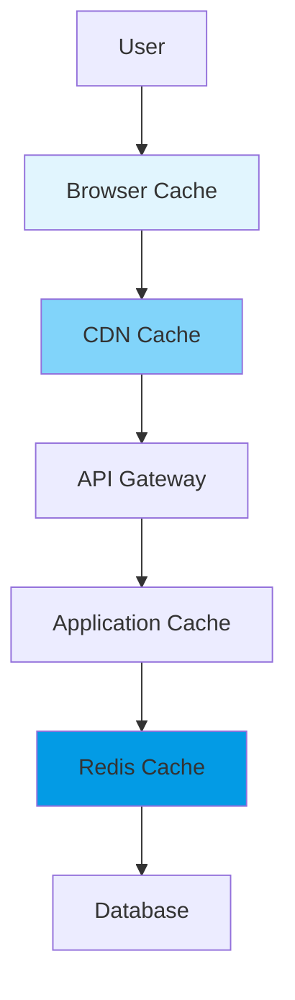

# Caching Strategy

## 1. Multi-Level Cache Architecture



### Cache Layers

| Layer | Technology | TTL | Use Case | Hit Ratio Target |
|-------|------------|-----|----------|------------------|
| **Browser** | HTTP Headers | 1hr - 1yr | Static assets | 95% |
| **CDN** | CloudFront | 5min - 1day | API responses, static | 85% |
| **Application** | Node.js memory | 30s - 5min | Computed values | 75% |
| **Redis** | Redis Cluster | 5min - 24hr | DB queries, sessions | 90% |

## 2. Browser & CDN Caching

### 2.1 Cache Headers

```typescript
export const cacheRules = {
  // Static assets - long cache
  '/static/*': {
    'Cache-Control': 'public, max-age=31536000, immutable'
  },
  // API responses - short cache
  '/api/products': {
    'Cache-Control': 'public, max-age=300, s-maxage=600',
    'Vary': 'Accept, Authorization'
  },
  // User data - no cache
  '/api/user/*': {
    'Cache-Control': 'private, no-cache, no-store'
  }
};
```

### 2.2 CDN Configuration

```terraform
resource "aws_cloudfront_distribution" "main" {
  ordered_cache_behavior {
    path_pattern     = "/static/*"
    default_ttl      = 86400      # 1 day
    max_ttl          = 31536000   # 1 year
    
    forwarded_values {
      query_string = false
      cookies { forward = "none" }
    }
  }
  
  ordered_cache_behavior {
    path_pattern     = "/api/products/*"
    default_ttl      = 300    # 5 minutes
    max_ttl          = 3600   # 1 hour
    
    forwarded_values {
      query_string = true
      headers      = ["Accept"]
    }
  }
}
```

## 3. Application-Level Caching

### 3.1 Memory Cache Implementation

```typescript
export class MemoryCache<T> {
  private cache = new Map<string, CacheEntry<T>>();
  
  constructor(
    private maxSize: number = 1000,
    private defaultTTL: number = 300000
  ) {}
  
  set(key: string, value: T, ttl = this.defaultTTL): void {
    if (this.cache.size >= this.maxSize) {
      this.evictLRU();
    }
    
    this.cache.set(key, {
      value,
      expires: Date.now() + ttl,
      lastAccessed: Date.now()
    });
  }
  
  get(key: string): T | undefined {
    const entry = this.cache.get(key);
    if (!entry || Date.now() > entry.expires) {
      this.cache.delete(key);
      return undefined;
    }
    
    entry.lastAccessed = Date.now();
    return entry.value;
  }
  
  private evictLRU(): void {
    let oldest = Date.now();
    let oldestKey = '';
    
    for (const [key, entry] of this.cache) {
      if (entry.lastAccessed < oldest) {
        oldest = entry.lastAccessed;
        oldestKey = key;
      }
    }
    
    this.cache.delete(oldestKey);
  }
}
```

### 3.2 Cache Decorators

```typescript
export function Cacheable(ttl = 300000) {
  return function (target: any, propertyName: string, descriptor: PropertyDescriptor) {
    const method = descriptor.value;
    const cache = new MemoryCache();
    
    descriptor.value = async function (...args: any[]) {
      const key = `${propertyName}:${JSON.stringify(args)}`;
      
      let cached = cache.get(key);
      if (cached) return cached;
      
      const result = await method.apply(this, args);
      cache.set(key, result, ttl);
      
      return result;
    };
  };
}

// Usage
class ProductService {
  @Cacheable(600000) // 10 minutes
  async getProduct(id: string): Promise<Product> {
    return this.repository.findById(id);
  }
}
```

## 4. Redis Caching

### 4.1 Redis Service

```typescript
import { Redis } from 'ioredis';

export class RedisCacheService {
  private redis: Redis;
  
  constructor() {
    this.redis = new Redis({
      host: process.env.REDIS_HOST,
      port: 6379,
      retryStrategy: times => Math.min(times * 50, 2000)
    });
  }
  
  async get<T>(key: string): Promise<T | null> {
    const data = await this.redis.get(key);
    return data ? JSON.parse(data) : null;
  }
  
  async set<T>(key: string, value: T, ttl?: number): Promise<void> {
    const serialized = JSON.stringify(value);
    
    if (ttl) {
      await this.redis.setex(key, ttl, serialized);
    } else {
      await this.redis.set(key, serialized);
    }
  }
  
  async delete(pattern: string): Promise<number> {
    const keys = await this.redis.keys(pattern);
    return keys.length ? await this.redis.del(...keys) : 0;
  }
  
  // Cache-aside pattern
  async getOrSet<T>(
    key: string,
    factory: () => Promise<T>,
    ttl: number
  ): Promise<T> {
    let value = await this.get<T>(key);
    
    if (!value) {
      value = await factory();
      await this.set(key, value, ttl);
    }
    
    return value;
  }
}
```

### 4.2 Cache Patterns

```typescript
export class CachePatterns {
  constructor(
    private cache: RedisCacheService,
    private db: DatabaseService
  ) {}
  
  // Look-aside (Lazy Loading)
  async lookAside<T>(key: string, ttl: number): Promise<T> {
    const cached = await this.cache.get<T>(key);
    if (cached) return cached;
    
    const data = await this.db.find<T>(key);
    if (data) {
      await this.cache.set(key, data, ttl);
    }
    
    return data;
  }
  
  // Write-through
  async writeThrough<T>(key: string, value: T, ttl: number): Promise<void> {
    await Promise.all([
      this.cache.set(key, value, ttl),
      this.db.save(key, value)
    ]);
  }
  
  // Refresh-ahead
  async refreshAhead<T>(key: string, ttl: number): Promise<T> {
    const remainingTTL = await this.cache.ttl(key);
    
    if (remainingTTL < ttl * 0.2) { // Refresh when 80% expired
      this.backgroundRefresh(key, ttl);
    }
    
    return await this.lookAside<T>(key, ttl);
  }
  
  private backgroundRefresh(key: string, ttl: number): void {
    setImmediate(async () => {
      const fresh = await this.db.find(key);
      if (fresh) {
        await this.cache.set(key, fresh, ttl);
      }
    });
  }
}
```

## 5. Query Result Caching

```typescript
export class QueryCache {
  constructor(private cache: RedisCacheService) {}
  
  async query<T>(sql: string, params: any[], ttl = 300): Promise<T[]> {
    const key = this.generateKey(sql, params);
    
    // Check cache
    const cached = await this.cache.get<T[]>(key);
    if (cached) return cached;
    
    // Execute query
    const result = await this.db.query<T>(sql, params);
    
    // Cache if read-only
    if (this.isCacheable(sql)) {
      await this.cache.set(key, result, ttl);
    }
    
    return result;
  }
  
  private generateKey(sql: string, params: any[]): string {
    const hash = crypto
      .createHash('sha256')
      .update(sql + JSON.stringify(params))
      .digest('hex');
    
    return `query:${hash}`;
  }
  
  private isCacheable(sql: string): boolean {
    return !/^\s*(INSERT|UPDATE|DELETE)/i.test(sql);
  }
}
```

## 6. Cache Invalidation

### 6.1 Invalidation Strategies

```typescript
export class CacheInvalidation {
  constructor(
    private cache: RedisCacheService,
    private cdn: CDNCacheService
  ) {}
  
  // Event-based invalidation
  async onEvent(event: string, data: any): Promise<void> {
    const patterns = this.getPatterns(event, data);
    
    for (const pattern of patterns) {
      await this.cache.delete(pattern);
      await this.cdn.invalidate([pattern]);
    }
  }
  
  private getPatterns(event: string, data: any): string[] {
    const map = {
      'product.updated': [
        `product:${data.id}`,
        `products:category:${data.categoryId}`,
        'products:featured'
      ],
      'order.created': [
        `user:${data.userId}:orders`,
        `product:${data.productId}:stock`
      ],
      'user.updated': [
        `user:${data.id}`,
        `user:${data.id}:*`
      ]
    };
    
    return map[event] || [];
  }
  
  // Tag-based invalidation
  async invalidateTags(tags: string[]): Promise<void> {
    for (const tag of tags) {
      const keys = await this.cache.redis.smembers(`tag:${tag}`);
      
      for (const key of keys) {
        await this.cache.delete(key);
      }
    }
  }
}
```

## 7. Cache Warming

```typescript
export class CacheWarmer {
  private tasks = [
    {
      name: 'featured-products',
      schedule: '0 */6 * * *',
      handler: async () => {
        const products = await this.productService.getFeatured();
        await this.cache.set('products:featured', products, 21600);
      }
    },
    {
      name: 'categories',
      schedule: '0 0 * * *',
      handler: async () => {
        const categories = await this.categoryService.getAll();
        await this.cache.set('categories:all', categories, 86400);
      }
    }
  ];
  
  async warmAll(): Promise<void> {
    await Promise.all(
      this.tasks.map(task => 
        task.handler().catch(err => 
          console.error(`Cache warming failed: ${task.name}`, err)
        )
      )
    );
  }
}
```

## 8. Monitoring & Metrics

```typescript
export class CacheMetrics {
  private stats = {
    hits: 0,
    misses: 0,
    evictions: 0
  };
  
  recordHit(): void {
    this.stats.hits++;
    this.updateHitRate();
  }
  
  recordMiss(): void {
    this.stats.misses++;
    this.updateHitRate();
  }
  
  private updateHitRate(): void {
    const total = this.stats.hits + this.stats.misses;
    const rate = total > 0 ? (this.stats.hits / total) * 100 : 0;
    
    // Alert if hit rate is low
    if (rate < 80 && total > 1000) {
      console.warn(`Low cache hit rate: ${rate.toFixed(2)}%`);
    }
  }
  
  getMetrics() {
    const total = this.stats.hits + this.stats.misses;
    return {
      ...this.stats,
      hitRate: total > 0 ? (this.stats.hits / total) * 100 : 0,
      total
    };
  }
}
```

## 9. Best Practices

### Performance Optimization

| Strategy | Implementation | Impact |
|----------|---------------|--------|
| **Compression** | Compress large objects | 60% size reduction |
| **Pipeline Operations** | Batch Redis commands | 50% latency reduction |
| **Connection Pooling** | Reuse connections | 30% overhead reduction |
| **Probabilistic Expiry** | Random TTL variation | Prevent cache stampede |

### Implementation Guidelines

```yaml
guidelines:
  design:
    - Use appropriate TTLs based on data volatility
    - Implement cache warming for critical data
    - Design for cache failures
    
  monitoring:
    - Track hit rates (target >80%)
    - Monitor cache size and evictions
    - Alert on low hit rates
    
  invalidation:
    - Use event-driven invalidation
    - Implement tag-based invalidation
    - Avoid cache stampedes
```

## 10. References

- [Backend Architecture](./backend-architecture.md) - `ARCH-BE-001`
- [Infrastructure](./infrastructure.md) - `INF-001`
- [Performance Testing](../06_testing/performance-test-plan.md) - `TEST-PERF-001`

---
*This caching strategy document is maintained by the Performance Team.*
