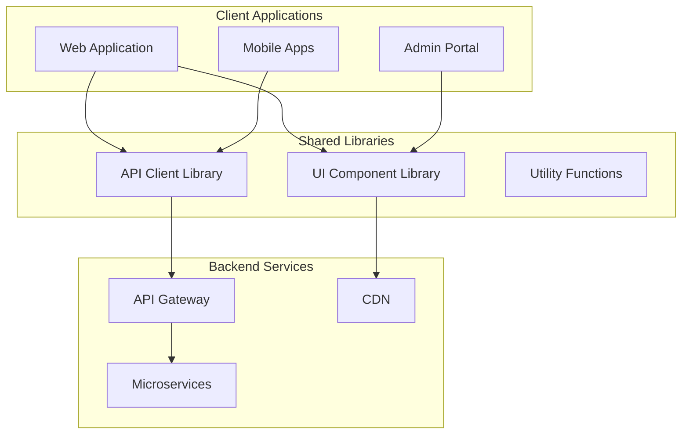
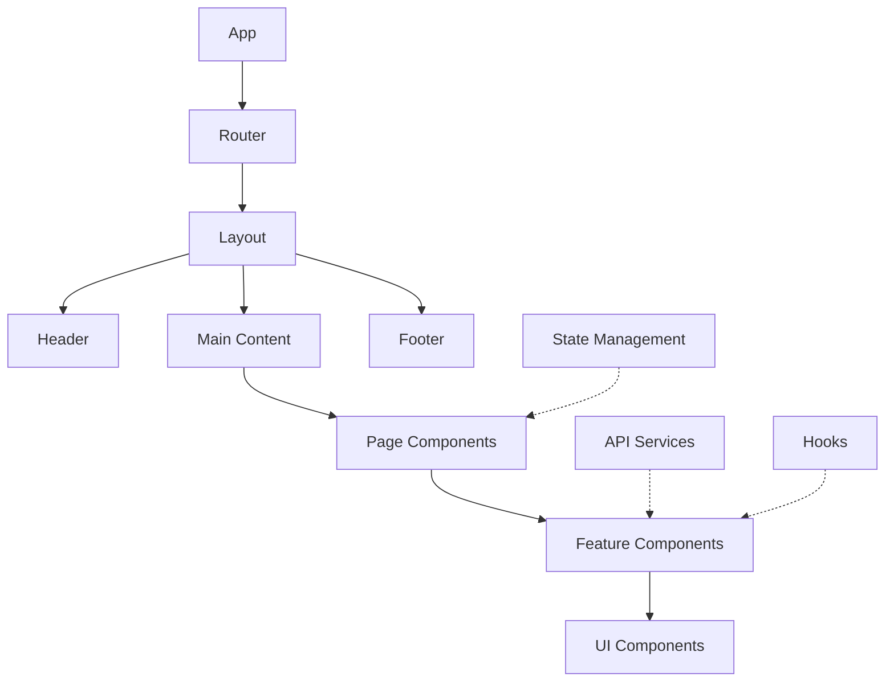
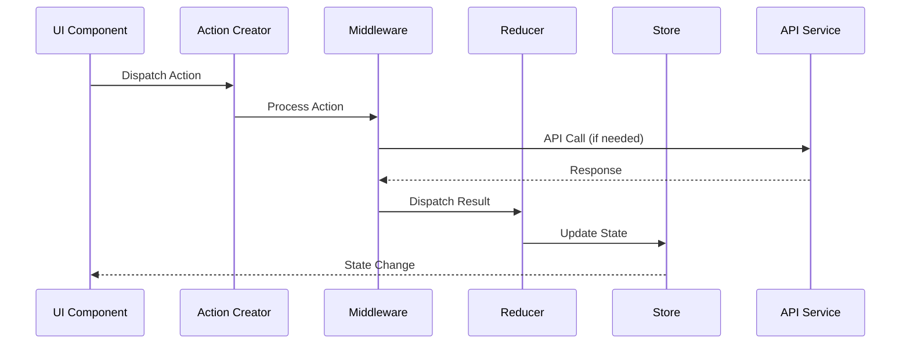
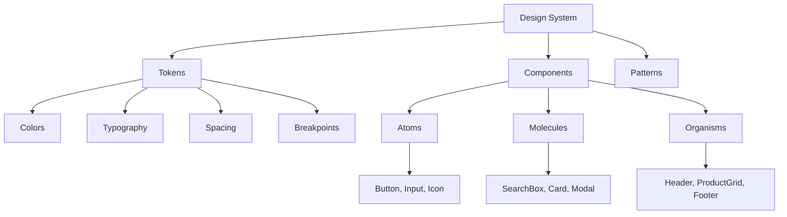
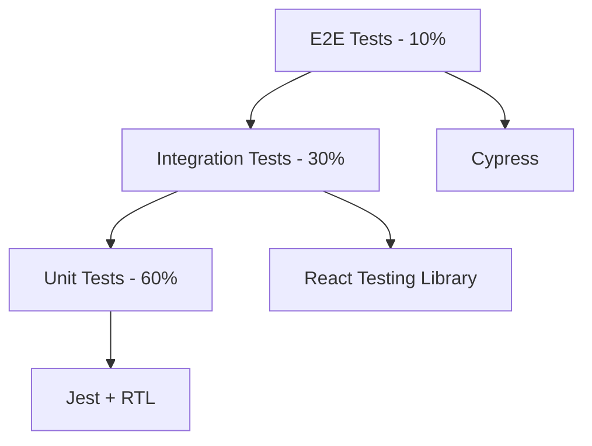
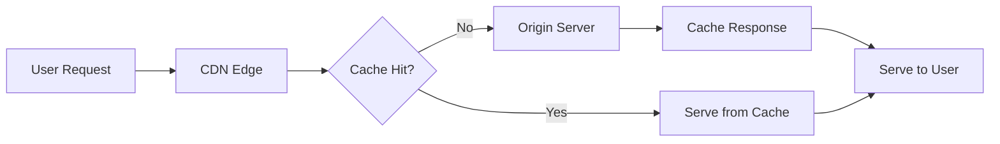

# Frontend Architecture

## 1. Architecture Overview

### 1.1 Frontend Ecosystem



### 1.2 Technology Stack

| Layer | Technology | Version | Purpose |
|-------|------------|---------|---------|
| **Framework** | React | 18.2+ | UI framework |
| **State Management** | Redux Toolkit | 1.9+ | Application state |
| **Routing** | React Router | 6.8+ | Client-side routing |
| **Styling** | Tailwind CSS | 3.3+ | Utility-first CSS |
| **Build Tool** | Vite | 4.3+ | Fast build tool |
| **Testing** | Jest + RTL | Latest | Unit testing |
| **E2E Testing** | Cypress | 12+ | End-to-end testing |
| **Type Safety** | TypeScript | 5.0+ | Static typing |

## 2. Application Architecture

### 2.1 Folder Structure

```
src/
├── components/           # Reusable UI components
│   ├── ui/              # Basic UI elements
│   ├── forms/           # Form components
│   └── layout/          # Layout components
├── pages/               # Page components
│   ├── home/
│   ├── products/
│   ├── cart/
│   └── checkout/
├── hooks/               # Custom React hooks
├── store/               # Redux store configuration
│   ├── slices/          # Redux slices
│   └── middleware/      # Custom middleware
├── services/            # API service layer
├── utils/               # Utility functions
├── types/               # TypeScript type definitions
├── constants/           # Application constants
└── assets/              # Static assets
```

### 2.2 Component Architecture



## 3. State Management

### 3.1 Redux Store Structure

```typescript
interface RootState {
  auth: AuthState;
  user: UserState;
  products: ProductsState;
  cart: CartState;
  orders: OrdersState;
  ui: UIState;
}

interface AuthState {
  isAuthenticated: boolean;
  user: User | null;
  token: string | null;
  loading: boolean;
  error: string | null;
}

interface ProductsState {
  items: Product[];
  categories: Category[];
  filters: FilterState;
  loading: boolean;
  error: string | null;
}

interface CartState {
  items: CartItem[];
  total: number;
  shipping: ShippingInfo | null;
  loading: boolean;
}
```

### 3.2 State Flow



## 4. Component Design System

### 4.1 Component Hierarchy



### 4.2 Component Standards

```typescript
// Component interface example
interface ButtonProps {
  variant: 'primary' | 'secondary' | 'outline';
  size: 'sm' | 'md' | 'lg';
  disabled?: boolean;
  loading?: boolean;
  children: React.ReactNode;
  onClick?: () => void;
}

const Button: React.FC<ButtonProps> = ({
  variant = 'primary',
  size = 'md',
  disabled = false,
  loading = false,
  children,
  onClick
}) => {
  const baseClasses = 'font-medium rounded-lg transition-colors';
  const variantClasses = {
    primary: 'bg-blue-600 text-white hover:bg-blue-700',
    secondary: 'bg-gray-200 text-gray-900 hover:bg-gray-300',
    outline: 'border border-gray-300 text-gray-700 hover:bg-gray-50'
  };
  const sizeClasses = {
    sm: 'px-3 py-1.5 text-sm',
    md: 'px-4 py-2 text-base',
    lg: 'px-6 py-3 text-lg'
  };
  
  return (
    <button
      className={`${baseClasses} ${variantClasses[variant]} ${sizeClasses[size]}`}
      disabled={disabled || loading}
      onClick={onClick}
    >
      {loading ? <Spinner /> : children}
    </button>
  );
};
```

## 5. Routing Architecture

### 5.1 Route Structure

```typescript
const routes = [
  {
    path: '/',
    element: <HomePage />,
    loader: homeLoader
  },
  {
    path: '/products',
    element: <ProductsLayout />,
    children: [
      {
        index: true,
        element: <ProductsList />,
        loader: productsLoader
      },
      {
        path: ':id',
        element: <ProductDetail />,
        loader: productLoader
      }
    ]
  },
  {
    path: '/cart',
    element: <CartPage />,
    loader: cartLoader
  },
  {
    path: '/checkout',
    element: <CheckoutPage />,
    loader: checkoutLoader,
    action: checkoutAction
  },
  {
    path: '/account',
    element: <AccountLayout />,
    loader: requireAuth,
    children: [
      {
        path: 'profile',
        element: <ProfilePage />
      },
      {
        path: 'orders',
        element: <OrdersPage />
      }
    ]
  }
];
```

### 5.2 Route Guards

```typescript
// Authentication guard
export const requireAuth: LoaderFunction = async ({ request }) => {
  const token = localStorage.getItem('authToken');
  
  if (!token) {
    throw redirect('/login');
  }
  
  try {
    const user = await validateToken(token);
    return user;
  } catch (error) {
    localStorage.removeItem('authToken');
    throw redirect('/login');
  }
};

// Role-based guard
export const requireRole = (roles: string[]): LoaderFunction => {
  return async ({ request }) => {
    const user = await requireAuth({ request, params: {} });
    
    if (!roles.includes(user.role)) {
      throw new Response('Forbidden', { status: 403 });
    }
    
    return user;
  };
};
```

## 6. API Integration

### 6.1 API Client Architecture

```typescript
class ApiClient {
  private baseURL: string;
  private token: string | null = null;
  
  constructor(baseURL: string) {
    this.baseURL = baseURL;
  }
  
  setToken(token: string) {
    this.token = token;
  }
  
  private async request<T>(
    endpoint: string,
    options: RequestInit = {}
  ): Promise<T> {
    const url = `${this.baseURL}${endpoint}`;
    const headers = {
      'Content-Type': 'application/json',
      ...(this.token && { Authorization: `Bearer ${this.token}` }),
      ...options.headers
    };
    
    const response = await fetch(url, {
      ...options,
      headers
    });
    
    if (!response.ok) {
      throw new ApiError(response.status, await response.text());
    }
    
    return response.json();
  }
  
  get<T>(endpoint: string): Promise<T> {
    return this.request<T>(endpoint);
  }
  
  post<T>(endpoint: string, data: any): Promise<T> {
    return this.request<T>(endpoint, {
      method: 'POST',
      body: JSON.stringify(data)
    });
  }
}
```

### 6.2 Service Layer

```typescript
// Products service
export class ProductsService {
  constructor(private apiClient: ApiClient) {}
  
  async getProducts(params: ProductsParams): Promise<ProductsResponse> {
    const queryString = new URLSearchParams(params).toString();
    return this.apiClient.get(`/products?${queryString}`);
  }
  
  async getProduct(id: string): Promise<Product> {
    return this.apiClient.get(`/products/${id}`);
  }
  
  async searchProducts(query: string): Promise<Product[]> {
    return this.apiClient.get(`/products/search?q=${encodeURIComponent(query)}`);
  }
}

// Cart service
export class CartService {
  constructor(private apiClient: ApiClient) {}
  
  async addToCart(productId: string, quantity: number): Promise<Cart> {
    return this.apiClient.post('/cart/add', { productId, quantity });
  }
  
  async updateCartItem(itemId: string, quantity: number): Promise<Cart> {
    return this.apiClient.put(`/cart/items/${itemId}`, { quantity });
  }
  
  async removeFromCart(itemId: string): Promise<Cart> {
    return this.apiClient.delete(`/cart/items/${itemId}`);
  }
}
```

## 7. Performance Optimization

### 7.1 Code Splitting

```typescript
// Route-based code splitting
const HomePage = lazy(() => import('../pages/HomePage'));
const ProductsPage = lazy(() => import('../pages/ProductsPage'));
const CartPage = lazy(() => import('../pages/CartPage'));

// Component-based code splitting
const ProductModal = lazy(() => import('../components/ProductModal'));

// Usage with Suspense
<Suspense fallback={<PageLoader />}>
  <Routes>
    <Route path="/" element={<HomePage />} />
    <Route path="/products" element={<ProductsPage />} />
    <Route path="/cart" element={<CartPage />} />
  </Routes>
</Suspense>
```

### 7.2 Optimization Strategies

```typescript
// Memoization
const ProductCard = memo(({ product }: { product: Product }) => {
  return (
    <div className="product-card">
      
      <h3>{product.name}</h3>
      <p>${product.price}</p>
    </div>
  );
});

// Virtual scrolling for large lists
const VirtualizedProductList = () => {
  return (
    <FixedSizeList
      height={600}
      itemCount={products.length}
      itemSize={200}
      itemData={products}
    >
      {ProductCard}
    </FixedSizeList>
  );
};

// Image optimization
const OptimizedImage = ({ src, alt, ...props }) => {
  return (
    
  );
};
```

## 8. Testing Strategy

### 8.1 Testing Pyramid



### 8.2 Test Examples

```typescript
// Unit test example
describe('Button Component', () => {
  it('renders with correct text', () => {
    render(<Button>Click me</Button>);
    expect(screen.getByText('Click me')).toBeInTheDocument();
  });
  
  it('calls onClick when clicked', () => {
    const handleClick = jest.fn();
    render(<Button onClick={handleClick}>Click me</Button>);
    fireEvent.click(screen.getByText('Click me'));
    expect(handleClick).toHaveBeenCalledTimes(1);
  });
});

// Integration test example
describe('Product Search', () => {
  it('searches and displays products', async () => {
    const mockProducts = [
      { id: '1', name: 'iPhone', price: 999 }
    ];
    
    jest.spyOn(api, 'searchProducts').mockResolvedValue(mockProducts);
    
    render(<ProductSearch />);
    
    const searchInput = screen.getByPlaceholderText('Search products...');
    fireEvent.change(searchInput, { target: { value: 'iPhone' } });
    fireEvent.click(screen.getByText('Search'));
    
    await waitFor(() => {
      expect(screen.getByText('iPhone')).toBeInTheDocument();
    });
  });
});
```

## 9. Security Considerations

### 9.1 Frontend Security

```typescript
// XSS Prevention
const sanitizeInput = (input: string): string => {
  return DOMPurify.sanitize(input);
};

// CSRF Protection
const apiClient = axios.create({
  withCredentials: true,
  headers: {
    'X-Requested-With': 'XMLHttpRequest'
  }
});

// Content Security Policy
const cspConfig = {
  directives: {
    defaultSrc: ["'self'"],
    scriptSrc: ["'self'", "'unsafe-inline'"],
    styleSrc: ["'self'", "'unsafe-inline'"],
    imgSrc: ["'self'", "data:", "https:"],
    connectSrc: ["'self'", "https://api.techally.com"]
  }
};
```

## 10. Deployment Architecture

### 10.1 Build Process

```yaml
# Build configuration
build:
  environment: production
  node_version: 18
  commands:
    - npm ci
    - npm run build
    - npm run test:ci
  
  optimization:
    - Tree shaking
    - Code splitting
    - Asset optimization
    - Bundle analysis
    
  output:
    directory: dist/
    assets: static/
    index: index.html
```

### 10.2 CDN Strategy



## 11. Monitoring & Analytics

### 11.1 Performance Monitoring

```typescript
// Web Vitals tracking
import { getCLS, getFID, getFCP, getLCP, getTTFB } from 'web-vitals';

const sendToAnalytics = (metric) => {
  analytics.track('Web Vital', {
    name: metric.name,
    value: metric.value,
    id: metric.id
  });
};

getCLS(sendToAnalytics);
getFID(sendToAnalytics);
getFCP(sendToAnalytics);
getLCP(sendToAnalytics);
getTTFB(sendToAnalytics);
```

### 11.2 Error Tracking

```typescript
// Error boundary
class ErrorBoundary extends Component {
  constructor(props) {
    super(props);
    this.state = { hasError: false };
  }
  
  static getDerivedStateFromError(error) {
    return { hasError: true };
  }
  
  componentDidCatch(error, errorInfo) {
    // Log error to monitoring service
    errorReporting.captureException(error, {
      extra: errorInfo,
      tags: {
        component: 'ErrorBoundary'
      }
    });
  }
  
  render() {
    if (this.state.hasError) {
      return <ErrorFallback />;
    }
    
    return this.props.children;
  }
}
```

## 12. References

- [System Overview](./system-overview.md) - `ARCH-001`
- [API Reference](../04_api/api-reference.md) - `API-001`
- [Functional Requirements](../02_requirements/functional-requirements.md) - `REQ-FR-001`
- [Mobile Architecture](./mobile-architecture.md) - `MOB-001`

---
*This frontend architecture document is maintained by the Frontend Architecture Team.*
