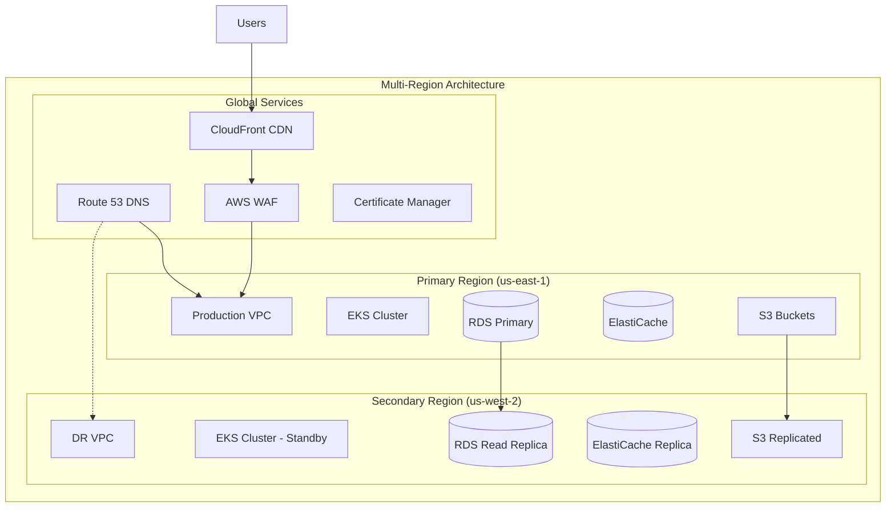
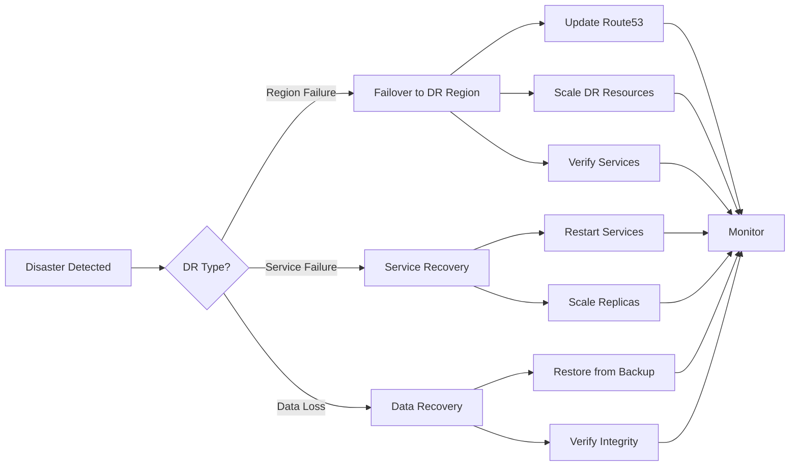

# Infrastructure Architecture

## 1. Infrastructure Overview

### 1.1 Cloud Architecture



### 1.2 Technology Stack

| Layer | Technology | Purpose | Version |
|-------|------------|---------|---------|
| **Cloud Provider** | AWS | Infrastructure platform | - |
| **Container Orchestration** | Kubernetes/EKS | Container management | 1.27+ |
| **Service Mesh** | Istio | Traffic management | 1.18+ |
| **Infrastructure as Code** | Terraform | Resource provisioning | 1.5+ |
| **Configuration Management** | Helm | K8s package management | 3.12+ |
| **CI/CD** | GitHub Actions + ArgoCD | Deployment automation | Latest |
| **Monitoring** | Prometheus + Grafana | Metrics and dashboards | Latest |
| **Logging** | ELK Stack | Centralized logging | 8.0+ |

## 2. Network Architecture

### 2.1 VPC Design

```yaml
vpc_configuration:
  production:
    cidr: 10.0.0.0/16
    region: us-east-1
    availability_zones: 3
    
    subnets:
      public:
        - cidr: 10.0.1.0/24  # AZ-1a
        - cidr: 10.0.2.0/24  # AZ-1b
        - cidr: 10.0.3.0/24  # AZ-1c
      
      private:
        - cidr: 10.0.10.0/24  # AZ-1a - Applications
        - cidr: 10.0.11.0/24  # AZ-1b - Applications
        - cidr: 10.0.12.0/24  # AZ-1c - Applications
        
      database:
        - cidr: 10.0.20.0/24  # AZ-1a - Databases
        - cidr: 10.0.21.0/24  # AZ-1b - Databases
        - cidr: 10.0.22.0/24  # AZ-1c - Databases
    
    nat_gateways: 3  # One per AZ
    internet_gateway: 1
    
  disaster_recovery:
    cidr: 10.1.0.0/16
    region: us-west-2
    availability_zones: 2
```

### 2.2 Security Groups

```terraform
# Application Load Balancer Security Group
resource "aws_security_group" "alb" {
  name        = "techally-alb-sg"
  description = "Security group for Application Load Balancer"
  vpc_id      = aws_vpc.main.id

  ingress {
    from_port   = 443
    to_port     = 443
    protocol    = "tcp"
    cidr_blocks = ["0.0.0.0/0"]
    description = "HTTPS from Internet"
  }

  ingress {
    from_port   = 80
    to_port     = 80
    protocol    = "tcp"
    cidr_blocks = ["0.0.0.0/0"]
    description = "HTTP from Internet (redirect to HTTPS)"
  }

  egress {
    from_port   = 0
    to_port     = 0
    protocol    = "-1"
    cidr_blocks = ["0.0.0.0/0"]
    description = "All outbound traffic"
  }
}

# EKS Node Security Group
resource "aws_security_group" "eks_nodes" {
  name        = "techally-eks-nodes-sg"
  description = "Security group for EKS worker nodes"
  vpc_id      = aws_vpc.main.id

  ingress {
    from_port       = 0
    to_port         = 65535
    protocol        = "tcp"
    security_groups = [aws_security_group.alb.id]
    description     = "Allow from ALB"
  }

  ingress {
    from_port = 0
    to_port   = 65535
    protocol  = "tcp"
    self      = true
    description = "Allow node-to-node communication"
  }
}

# Database Security Group
resource "aws_security_group" "database" {
  name        = "techally-database-sg"
  description = "Security group for RDS instances"
  vpc_id      = aws_vpc.main.id

  ingress {
    from_port       = 5432
    to_port         = 5432
    protocol        = "tcp"
    security_groups = [aws_security_group.eks_nodes.id]
    description     = "PostgreSQL from EKS nodes"
  }
}
```

## 3. Kubernetes Architecture

### 3.1 EKS Cluster Configuration

```yaml
apiVersion: eksctl.io/v1alpha5
kind: ClusterConfig

metadata:
  name: techally-production
  region: us-east-1
  version: "1.27"

vpc:
  id: vpc-xxxxx
  subnets:
    private:
      us-east-1a:
        id: subnet-xxxxx
      us-east-1b:
        id: subnet-xxxxx
      us-east-1c:
        id: subnet-xxxxx

nodeGroups:
  - name: general-workloads
    instanceType: m5.xlarge
    desiredCapacity: 3
    minSize: 3
    maxSize: 10
    privateNetworking: true
    volumeSize: 100
    volumeType: gp3
    labels:
      workload-type: general
    taints:
      - key: workload
        value: general
        effect: NoSchedule
    
  - name: compute-intensive
    instanceType: c5.2xlarge
    desiredCapacity: 2
    minSize: 2
    maxSize: 8
    privateNetworking: true
    spot: true
    spotInstancePools: 3
    labels:
      workload-type: compute
      
  - name: memory-intensive
    instanceType: r5.xlarge
    desiredCapacity: 2
    minSize: 2
    maxSize: 6
    privateNetworking: true
    labels:
      workload-type: memory

addons:
  - name: vpc-cni
    version: latest
  - name: coredns
    version: latest
  - name: kube-proxy
    version: latest
  - name: aws-ebs-csi-driver
    version: latest
```

### 3.2 Namespace Strategy

```yaml
# namespaces/production.yaml
apiVersion: v1
kind: Namespace
metadata:
  name: production
  labels:
    environment: production
    istio-injection: enabled
---
apiVersion: v1
kind: Namespace
metadata:
  name: staging
  labels:
    environment: staging
    istio-injection: enabled
---
apiVersion: v1
kind: Namespace
metadata:
  name: development
  labels:
    environment: development
    istio-injection: enabled
---
apiVersion: v1
kind: ResourceQuota
metadata:
  name: production-quota
  namespace: production
spec:
  hard:
    requests.cpu: "100"
    requests.memory: 200Gi
    persistentvolumeclaims: "10"
    services.loadbalancers: "2"
---
apiVersion: networking.k8s.io/v1
kind: NetworkPolicy
metadata:
  name: production-network-policy
  namespace: production
spec:
  podSelector: {}
  policyTypes:
  - Ingress
  - Egress
  ingress:
  - from:
    - namespaceSelector:
        matchLabels:
          environment: production
  egress:
  - to:
    - namespaceSelector:
        matchLabels:
          environment: production
  - to:
    - namespaceSelector:
        matchLabels:
          name: kube-system
  - to:
    - podSelector: {}
    ports:
    - protocol: TCP
      port: 53
    - protocol: UDP
      port: 53
```

## 4. Service Deployment

### 4.1 Deployment Template

```yaml
# deployments/auth-service.yaml
apiVersion: apps/v1
kind: Deployment
metadata:
  name: auth-service
  namespace: production
  labels:
    app: auth-service
    version: v1
spec:
  replicas: 3
  revisionHistoryLimit: 10
  strategy:
    type: RollingUpdate
    rollingUpdate:
      maxSurge: 1
      maxUnavailable: 0
  selector:
    matchLabels:
      app: auth-service
  template:
    metadata:
      labels:
        app: auth-service
        version: v1
      annotations:
        prometheus.io/scrape: "true"
        prometheus.io/port: "9090"
    spec:
      serviceAccountName: auth-service
      
      affinity:
        podAntiAffinity:
          preferredDuringSchedulingIgnoredDuringExecution:
          - weight: 100
            podAffinityTerm:
              labelSelector:
                matchExpressions:
                - key: app
                  operator: In
                  values:
                  - auth-service
              topologyKey: kubernetes.io/hostname
      
      containers:
      - name: auth-service
        image: xxx.dkr.ecr.us-east-1.amazonaws.com/auth-service:v1.0.0
        imagePullPolicy: Always
        
        ports:
        - containerPort: 3001
          name: http
          protocol: TCP
        - containerPort: 9090
          name: metrics
          protocol: TCP
        
        env:
        - name: NODE_ENV
          value: "production"
        - name: DATABASE_URL
          valueFrom:
            secretKeyRef:
              name: database-credentials
              key: url
        - name: JWT_SECRET
          valueFrom:
            secretKeyRef:
              name: auth-secrets
              key: jwt-secret
        
        resources:
          requests:
            cpu: 100m
            memory: 256Mi
          limits:
            cpu: 500m
            memory: 512Mi
        
        livenessProbe:
          httpGet:
            path: /health/live
            port: 3001
          initialDelaySeconds: 30
          periodSeconds: 10
          timeoutSeconds: 5
          failureThreshold: 3
        
        readinessProbe:
          httpGet:
            path: /health/ready
            port: 3001
          initialDelaySeconds: 10
          periodSeconds: 5
          timeoutSeconds: 3
          failureThreshold: 3
        
        volumeMounts:
        - name: config
          mountPath: /app/config
          readOnly: true
        
      volumes:
      - name: config
        configMap:
          name: auth-service-config
```

### 4.2 Service Mesh Configuration

```yaml
# istio/virtual-service.yaml
apiVersion: networking.istio.io/v1beta1
kind: VirtualService
metadata:
  name: auth-service
  namespace: production
spec:
  hosts:
  - auth.techally.com
  gateways:
  - techally-gateway
  http:
  - match:
    - uri:
        prefix: /api/auth
    route:
    - destination:
        host: auth-service
        port:
          number: 3001
      weight: 100
    timeout: 30s
    retries:
      attempts: 3
      perTryTimeout: 10s
      retryOn: 5xx,reset,connect-failure,refused-stream
---
apiVersion: networking.istio.io/v1beta1
kind: DestinationRule
metadata:
  name: auth-service
  namespace: production
spec:
  host: auth-service
  trafficPolicy:
    connectionPool:
      tcp:
        maxConnections: 100
      http:
        http1MaxPendingRequests: 100
        http2MaxRequests: 100
        maxRequestsPerConnection: 2
    loadBalancer:
      simple: LEAST_REQUEST
    outlierDetection:
      consecutive5xxErrors: 5
      interval: 30s
      baseEjectionTime: 30s
      maxEjectionPercent: 50
```

## 5. Database Infrastructure

### 5.1 RDS Configuration

```terraform
resource "aws_db_instance" "primary" {
  identifier     = "techally-primary"
  engine         = "postgres"
  engine_version = "15.3"
  instance_class = "db.r6g.2xlarge"
  
  allocated_storage     = 100
  storage_type          = "gp3"
  storage_encrypted     = true
  kms_key_id           = aws_kms_key.database.arn
  
  db_name  = "techally"
  username = "admin"
  password = random_password.db_password.result
  
  vpc_security_group_ids = [aws_security_group.database.id]
  db_subnet_group_name   = aws_db_subnet_group.database.name
  
  backup_retention_period = 30
  backup_window          = "03:00-04:00"
  maintenance_window     = "sun:04:00-sun:05:00"
  
  multi_az               = true
  publicly_accessible    = false
  deletion_protection    = true
  skip_final_snapshot    = false
  
  performance_insights_enabled = true
  performance_insights_retention_period = 7
  
  enabled_cloudwatch_logs_exports = ["postgresql"]
  
  tags = {
    Name        = "techally-primary-db"
    Environment = "production"
  }
}

resource "aws_db_instance" "read_replica" {
  count                    = 2
  identifier              = "techally-read-replica-${count.index + 1}"
  replicate_source_db     = aws_db_instance.primary.identifier
  instance_class          = "db.r6g.xlarge"
  
  publicly_accessible    = false
  auto_minor_version_upgrade = false
  
  performance_insights_enabled = true
  
  tags = {
    Name        = "techally-read-replica-${count.index + 1}"
    Environment = "production"
  }
}
```

### 5.2 ElastiCache Redis

```terraform
resource "aws_elasticache_replication_group" "redis" {
  replication_group_id       = "techally-redis"
  replication_group_description = "Redis cluster for TechAlly"
  
  engine               = "redis"
  engine_version       = "7.0"
  node_type           = "cache.r6g.xlarge"
  number_cache_clusters = 3
  
  parameter_group_name = aws_elasticache_parameter_group.redis.name
  subnet_group_name    = aws_elasticache_subnet_group.redis.name
  security_group_ids   = [aws_security_group.redis.id]
  
  at_rest_encryption_enabled = true
  transit_encryption_enabled = true
  auth_token                = random_password.redis_auth.result
  
  automatic_failover_enabled = true
  multi_az_enabled          = true
  
  snapshot_retention_limit = 5
  snapshot_window          = "03:00-05:00"
  
  log_delivery_configuration {
    destination      = aws_cloudwatch_log_group.redis.name
    destination_type = "cloudwatch-logs"
    log_format       = "json"
    log_type        = "slow-log"
  }
  
  tags = {
    Name        = "techally-redis"
    Environment = "production"
  }
}
```

## 6. Storage Solutions

### 6.1 S3 Bucket Configuration

```terraform
# Static Assets Bucket
resource "aws_s3_bucket" "static_assets" {
  bucket = "techally-static-assets"
}

resource "aws_s3_bucket_versioning" "static_assets" {
  bucket = aws_s3_bucket.static_assets.id
  versioning_configuration {
    status = "Enabled"
  }
}

resource "aws_s3_bucket_public_access_block" "static_assets" {
  bucket = aws_s3_bucket.static_assets.id
  
  block_public_acls       = false
  block_public_policy     = false
  ignore_public_acls      = false
  restrict_public_buckets = false
}

resource "aws_s3_bucket_cors_configuration" "static_assets" {
  bucket = aws_s3_bucket.static_assets.id
  
  cors_rule {
    allowed_headers = ["*"]
    allowed_methods = ["GET", "HEAD"]
    allowed_origins = ["https://techally.com"]
    expose_headers  = ["ETag"]
    max_age_seconds = 3000
  }
}

# Media Storage Bucket
resource "aws_s3_bucket" "media" {
  bucket = "techally-media"
}

resource "aws_s3_bucket_lifecycle_configuration" "media" {
  bucket = aws_s3_bucket.media.id
  
  rule {
    id     = "transition-to-ia"
    status = "Enabled"
    
    transition {
      days          = 30
      storage_class = "STANDARD_IA"
    }
    
    transition {
      days          = 90
      storage_class = "GLACIER"
    }
  }
}

resource "aws_s3_bucket_intelligent_tiering_configuration" "media" {
  bucket = aws_s3_bucket.media.id
  name   = "media-tiering"
  
  tiering {
    access_tier = "ARCHIVE_ACCESS"
    days        = 90
  }
  
  tiering {
    access_tier = "DEEP_ARCHIVE_ACCESS"
    days        = 180
  }
}
```

### 6.2 EFS for Shared Storage

```terraform
resource "aws_efs_file_system" "shared" {
  creation_token = "techally-shared"
  encrypted      = true
  
  performance_mode = "generalPurpose"
  throughput_mode  = "elastic"
  
  lifecycle_policy {
    transition_to_ia = "AFTER_30_DAYS"
  }
  
  lifecycle_policy {
    transition_to_primary_storage_class = "AFTER_1_ACCESS"
  }
  
  tags = {
    Name        = "techally-shared-storage"
    Environment = "production"
  }
}

resource "aws_efs_mount_target" "shared" {
  count           = length(var.private_subnets)
  file_system_id  = aws_efs_file_system.shared.id
  subnet_id       = var.private_subnets[count.index]
  security_groups = [aws_security_group.efs.id]
}
```

## 7. CDN Configuration

### 7.1 CloudFront Distribution

```terraform
resource "aws_cloudfront_distribution" "main" {
  enabled             = true
  is_ipv6_enabled    = true
  default_root_object = "index.html"
  aliases            = ["techally.com", "www.techally.com"]
  
  origin {
    domain_name = aws_lb.main.dns_name
    origin_id   = "ALB"
    
    custom_origin_config {
      http_port              = 80
      https_port             = 443
      origin_protocol_policy = "https-only"
      origin_ssl_protocols   = ["TLSv1.2"]
    }
  }
  
  origin {
    domain_name = aws_s3_bucket.static_assets.bucket_regional_domain_name
    origin_id   = "S3-static"
    
    s3_origin_config {
      origin_access_identity = aws_cloudfront_origin_access_identity.static.cloudfront_access_identity_path
    }
  }
  
  default_cache_behavior {
    allowed_methods  = ["DELETE", "GET", "HEAD", "OPTIONS", "PATCH", "POST", "PUT"]
    cached_methods   = ["GET", "HEAD"]
    target_origin_id = "ALB"
    
    forwarded_values {
      query_string = true
      headers      = ["Host", "Origin", "Authorization"]
      
      cookies {
        forward = "all"
      }
    }
    
    viewer_protocol_policy = "redirect-to-https"
    min_ttl                = 0
    default_ttl            = 0
    max_ttl                = 0
    compress               = true
  }
  
  ordered_cache_behavior {
    path_pattern     = "/static/*"
    allowed_methods  = ["GET", "HEAD"]
    cached_methods   = ["GET", "HEAD"]
    target_origin_id = "S3-static"
    
    forwarded_values {
      query_string = false
      cookies {
        forward = "none"
      }
    }
    
    viewer_protocol_policy = "https-only"
    min_ttl                = 0
    default_ttl            = 86400
    max_ttl                = 31536000
    compress               = true
  }
  
  restrictions {
    geo_restriction {
      restriction_type = "none"
    }
  }
  
  viewer_certificate {
    acm_certificate_arn = aws_acm_certificate.main.arn
    ssl_support_method  = "sni-only"
  }
  
  web_acl_id = aws_wafv2_web_acl.main.arn
}
```

## 8. Auto-Scaling

### 8.1 Horizontal Pod Autoscaler

```yaml
apiVersion: autoscaling/v2
kind: HorizontalPodAutoscaler
metadata:
  name: auth-service-hpa
  namespace: production
spec:
  scaleTargetRef:
    apiVersion: apps/v1
    kind: Deployment
    name: auth-service
  minReplicas: 3
  maxReplicas: 10
  metrics:
  - type: Resource
    resource:
      name: cpu
      target:
        type: Utilization
        averageUtilization: 70
  - type: Resource
    resource:
      name: memory
      target:
        type: Utilization
        averageUtilization: 80
  - type: Pods
    pods:
      metric:
        name: http_requests_per_second
      target:
        type: AverageValue
        averageValue: "100"
  behavior:
    scaleDown:
      stabilizationWindowSeconds: 300
      policies:
      - type: Percent
        value: 10
        periodSeconds: 60
      - type: Pods
        value: 1
        periodSeconds: 60
      selectPolicy: Min
    scaleUp:
      stabilizationWindowSeconds: 60
      policies:
      - type: Percent
        value: 100
        periodSeconds: 30
      - type: Pods
        value: 2
        periodSeconds: 30
      selectPolicy: Max
```

### 8.2 Cluster Autoscaler

```yaml
apiVersion: apps/v1
kind: Deployment
metadata:
  name: cluster-autoscaler
  namespace: kube-system
spec:
  template:
    spec:
      containers:
      - image: k8s.gcr.io/autoscaling/cluster-autoscaler:v1.27.0
        name: cluster-autoscaler
        command:
        - ./cluster-autoscaler
        - --v=4
        - --stderrthreshold=info
        - --cloud-provider=aws
        - --skip-nodes-with-local-storage=false
        - --expander=least-waste
        - --node-group-auto-discovery=asg:tag=k8s.io/cluster-autoscaler/enabled,k8s.io/cluster-autoscaler/techally-production
        - --balance-similar-node-groups
        - --skip-nodes-with-system-pods=false
        env:
        - name: AWS_REGION
          value: us-east-1
```

## 9. Disaster Recovery

### 9.1 Backup Strategy

```yaml
backup_strategy:
  databases:
    rds:
      automated_backups:
        retention_period: 30
        backup_window: "03:00-04:00"
      manual_snapshots:
        frequency: weekly
        retention: 90 days
      cross_region_backup:
        target_region: us-west-2
        retention: 30 days
    
    elasticache:
      automated_snapshots:
        retention_limit: 7
        snapshot_window: "04:00-05:00"
      manual_snapshots:
        frequency: daily
        retention: 14 days
  
  application_data:
    s3:
      versioning: enabled
      cross_region_replication:
        target_region: us-west-2
        storage_class: STANDARD_IA
      lifecycle_policies:
        transition_to_ia: 30 days
        transition_to_glacier: 90 days
    
    efs:
      backup_policy:
        frequency: daily
        retention: 30 days
        vault: aws_backup_vault
  
  kubernetes:
    etcd:
      backup_frequency: every 6 hours
      retention: 7 days
      storage: s3://techally-backups/etcd
    
    persistent_volumes:
      snapshot_frequency: daily
      retention: 14 days
```

### 9.2 Disaster Recovery Plan



## 10. Cost Optimization

### 10.1 Resource Tagging Strategy

```terraform
locals {
  common_tags = {
    Project     = "TechAlly"
    Environment = var.environment
    ManagedBy   = "Terraform"
    CostCenter  = "Engineering"
    Owner       = "infrastructure@techally.com"
  }
  
  auto_shutdown_tags = {
    AutoShutdown = "true"
    Schedule     = "0 20 * * 1-5"  # Shutdown at 8 PM weekdays
  }
}
```

### 10.2 Cost Optimization Measures

| Strategy | Implementation | Estimated Savings |
|----------|---------------|-------------------|
| **Spot Instances** | Non-critical workloads | 70% EC2 costs |
| **Reserved Instances** | Steady-state workloads | 40% EC2 costs |
| **S3 Intelligent Tiering** | Automatic tier optimization | 30% storage costs |
| **Auto-scaling** | Right-sizing resources | 25% overall |
| **Scheduled Scaling** | Dev/test environments | 40% non-prod costs |
| **Data Transfer Optimization** | VPC endpoints, CDN | 20% transfer costs |

## 11. References

- [System Overview](./system-overview.md) - `ARCH-001`
- [Backend Architecture](./backend-architecture.md) - `ARCH-BE-001`
- [Security Architecture](./security.md) - `SEC-001`
- [Deployment Guide](../09_devops/deployment-guide.md) - `DEVOPS-001`

---
*This infrastructure architecture document is maintained by the Infrastructure Team.*
