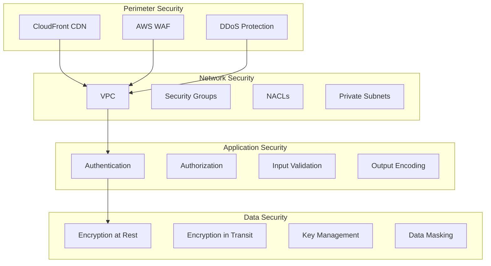
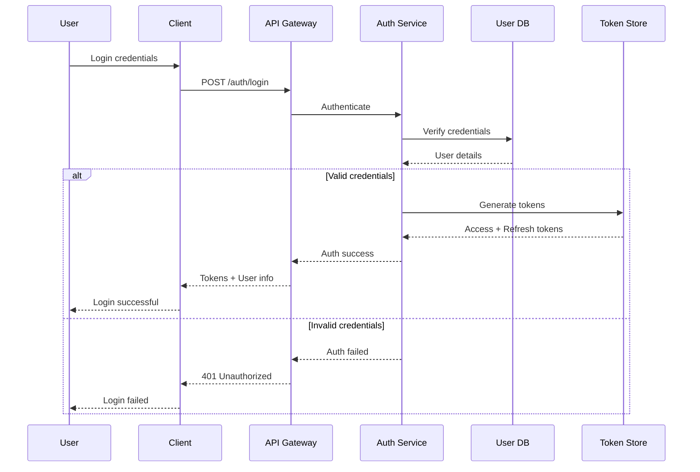
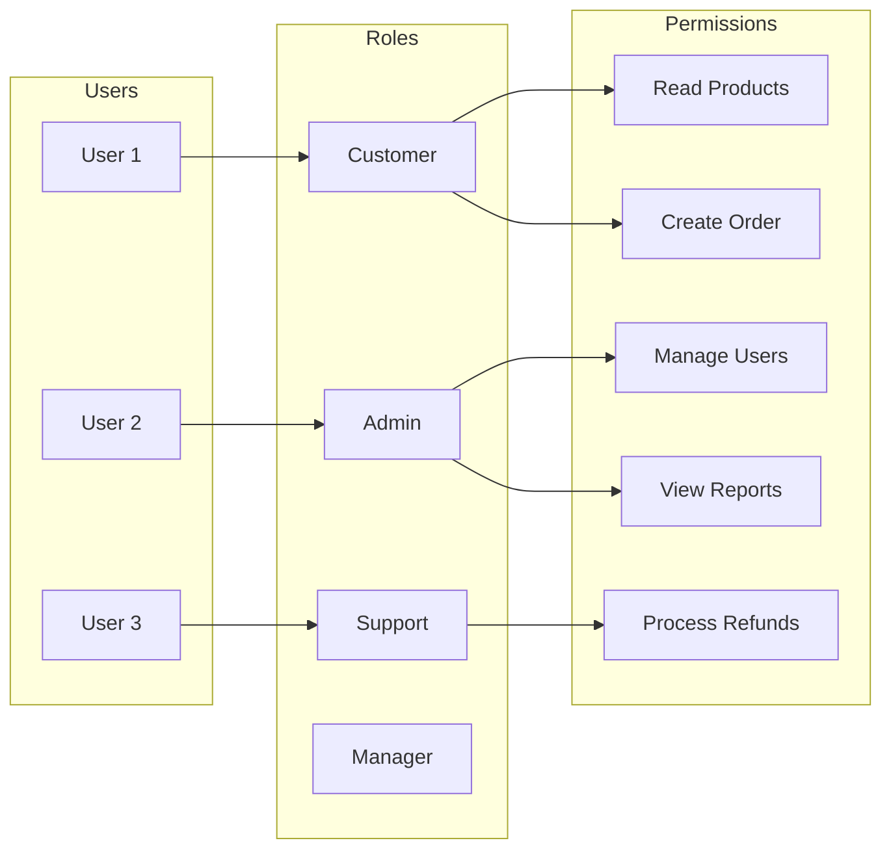
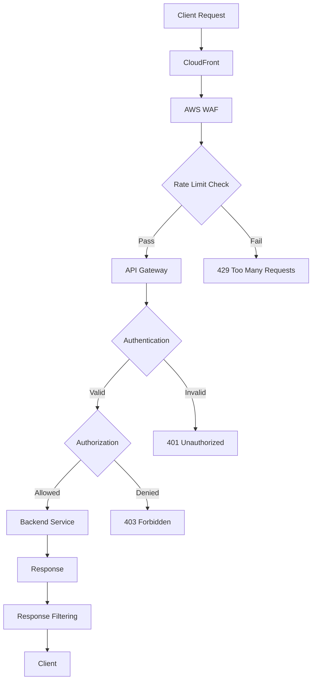
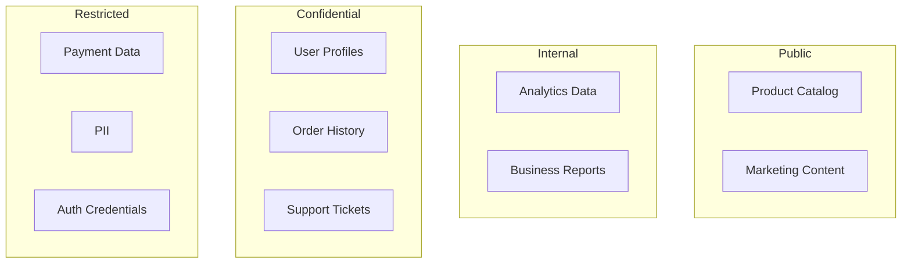
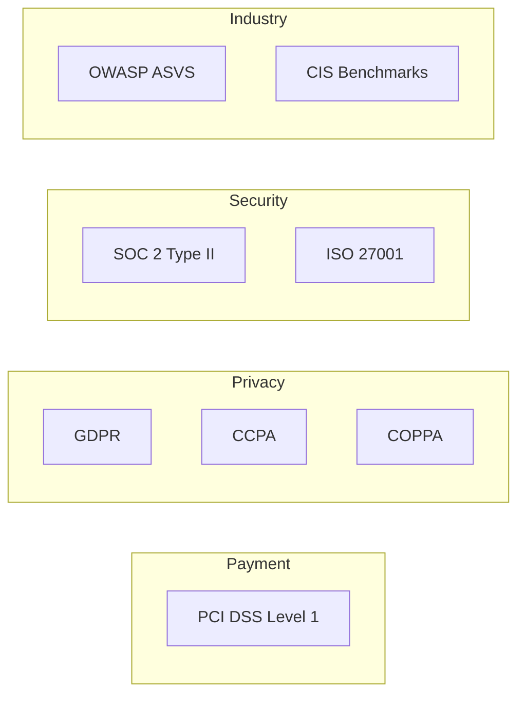
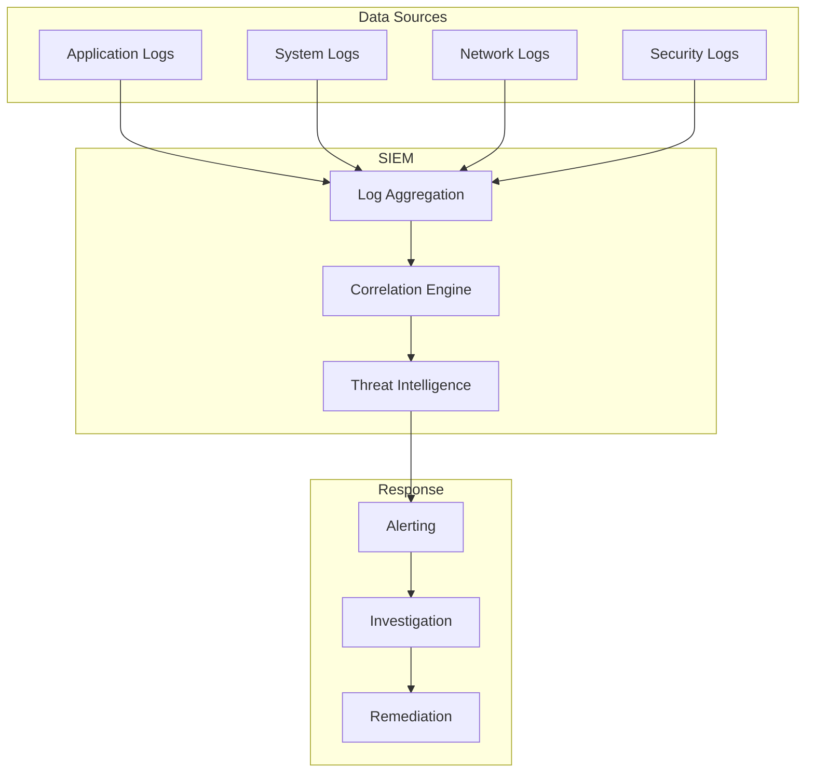
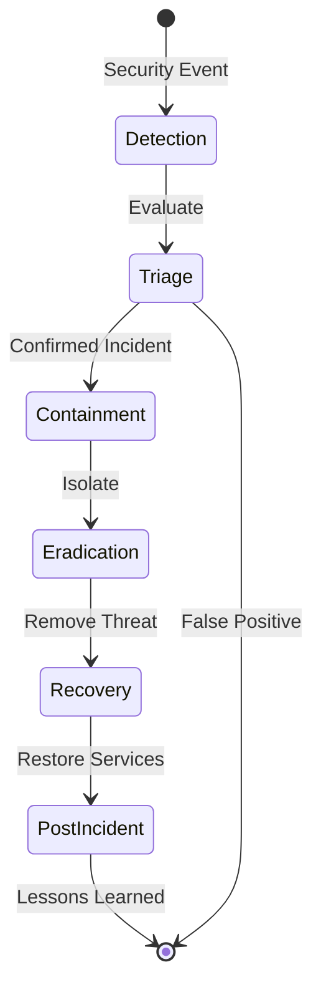
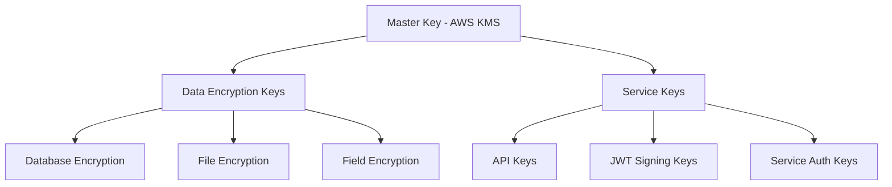

# Security Architecture Documentation

## 1. Security Overview

### 1.1 Security Architecture Layers



### 1.2 Security Principles

| Principle | Description | Implementation |
|-----------|-------------|----------------|
| Defense in Depth | Multiple layers of security | WAF, Firewall, Application, Data |
| Least Privilege | Minimal access rights | RBAC, IAM policies |
| Zero Trust | Never trust, always verify | Authentication, Authorization |
| Secure by Default | Security enabled by default | TLS, Encryption, Strong passwords |
| Fail Secure | Secure failure modes | Deny by default |
| Separation of Duties | Split critical functions | Multi-person approval |

## 2. Authentication Architecture

### 2.1 Authentication Flow



### 2.2 Authentication Methods

| Method | Implementation | Use Case | Security Level |
|--------|----------------|----------|----------------|
| `SEC-AUTH-001` Password | Bcrypt hashing | Primary auth | Medium |
| `SEC-AUTH-002` MFA/2FA | TOTP (RFC 6238) | Additional security | High |
| `SEC-AUTH-003` OAuth 2.0 | Google, Facebook | Social login | Medium |
| `SEC-AUTH-004` Biometric | FaceID, TouchID | Mobile apps | High |
| `SEC-AUTH-005` API Key | UUID v4 | Service-to-service | Medium |
| `SEC-AUTH-006` JWT | RS256 signed | Session management | High |

### 2.3 Password Policy

```yaml
passwordPolicy:
  minLength: 12
  maxLength: 128
  requirements:
    - uppercase: true
    - lowercase: true
    - numbers: true
    - specialChars: true
  restrictions:
    - noCommonPasswords: true
    - noUserInfo: true
    - noDictionaryWords: true
    - noRepeatingChars: 3
  expiry:
    - maxAge: 90 # days
    - warningPeriod: 14 # days
  history:
    - rememberLast: 5
    - preventReuse: true
  lockout:
    - maxAttempts: 5
    - lockoutDuration: 30 # minutes
    - resetAfter: 24 # hours
```

## 3. Authorization Architecture

### 3.1 RBAC Model



### 3.2 Permission Matrix

| Role | Products | Orders | Users | Payments | Reports | Admin |
|------|----------|--------|-------|----------|---------|-------|
| Guest | Read | - | - | - | - | - |
| Customer | Read | CRUD own | Read own | CRUD own | - | - |
| Support | Read | Read all | Read all | Read all | Read | - |
| Manager | CRUD | CRUD all | Read all | Read all | CRUD | - |
| Admin | CRUD | CRUD all | CRUD all | CRUD all | CRUD | CRUD |

### 3.3 Access Control Implementation

```javascript
// Example RBAC middleware
const permissions = {
  'customer': ['products:read', 'orders:create', 'orders:read:own'],
  'admin': ['*:*'],
  'support': ['orders:read', 'users:read', 'refunds:process']
};

function authorize(requiredPermission) {
  return (req, res, next) => {
    const userRole = req.user.role;
    const userPerms = permissions[userRole];
    
    if (userPerms.includes('*:*') || 
        userPerms.includes(requiredPermission)) {
      return next();
    }
    
    return res.status(403).json({
      error: 'Insufficient permissions'
    });
  };
}
```

## 4. API Security

### 4.1 API Security Controls

| Control | Implementation | Purpose | Configuration |
|---------|----------------|---------|---------------|
| `SEC-API-001` Rate Limiting | Token bucket | Prevent abuse | 1000 req/min |
| `SEC-API-002` API Keys | UUID validation | Service auth | Required |
| `SEC-API-003` CORS | Whitelist origins | Cross-origin | Strict |
| `SEC-API-004` Input Validation | JSON Schema | Data integrity | All endpoints |
| `SEC-API-005` Output Filtering | Response sanitization | Data leakage | All responses |
| `SEC-API-006` Request Signing | HMAC-SHA256 | Integrity | Critical ops |

### 4.2 API Gateway Security



## 5. Data Security

### 5.1 Encryption Strategy

| Data State | Encryption | Algorithm | Key Management |
|------------|------------|-----------|----------------|
| `SEC-ENC-001` At Rest - Database | AES-256 | AES-256-GCM | AWS KMS |
| `SEC-ENC-002` At Rest - Files | AES-256 | AES-256-GCM | S3 SSE-KMS |
| `SEC-ENC-003` In Transit - API | TLS 1.3 | ECDHE-RSA | Certificate Manager |
| `SEC-ENC-004` In Transit - Internal | TLS 1.2+ | ECDHE-RSA | Internal CA |
| `SEC-ENC-005` PII Fields | Field-level | AES-256-GCM | Vault |
| `SEC-ENC-006` Passwords | One-way hash | Bcrypt | N/A |

### 5.2 Data Classification



### 5.3 Data Protection Matrix

| Data Type | Encryption | Access Control | Retention | Audit |
|-----------|------------|----------------|-----------|-------|
| Payment Cards | Tokenized | PCI Compliant | 7 years | Yes |
| Passwords | Hashed | Write-only | Forever | Yes |
| Personal Info | Encrypted | RBAC | Per policy | Yes |
| Session Data | Encrypted | User-only | 30 days | No |
| Logs | Compressed | Admin-only | 90 days | No |

## 6. Infrastructure Security

### 6.1 Network Security

```yaml
vpc:
  cidr: 10.0.0.0/16
  subnets:
    public:
      - cidr: 10.0.1.0/24
        az: us-east-1a
        components: [ALB, NAT Gateway]
    private:
      - cidr: 10.0.10.0/24
        az: us-east-1a
        components: [EKS Nodes, RDS]
    database:
      - cidr: 10.0.20.0/24
        az: us-east-1a
        components: [RDS, ElastiCache]
        
securityGroups:
  - name: alb-sg
    ingress:
      - protocol: tcp
        ports: [80, 443]
        source: 0.0.0.0/0
  - name: app-sg
    ingress:
      - protocol: tcp
        ports: [3000]
        source: alb-sg
  - name: db-sg
    ingress:
      - protocol: tcp
        ports: [5432]
        source: app-sg
```

### 6.2 Container Security

| Control | Implementation | Scanning | Enforcement |
|---------|----------------|----------|-------------|
| `SEC-CONT-001` Base Images | Official only | Daily | CI/CD |
| `SEC-CONT-002` Vulnerability Scan | Trivy, Snyk | Build time | Block critical |
| `SEC-CONT-003` Runtime Security | Falco | Continuous | Alert |
| `SEC-CONT-004` Image Signing | Docker Content Trust | All images | Required |
| `SEC-CONT-005` Secrets Management | K8s Secrets | Encrypted | RBAC |
| `SEC-CONT-006` Network Policies | Calico | Defined | Enforced |

## 7. Application Security

### 7.1 OWASP Top 10 Mitigation

| Vulnerability | Mitigation | Implementation | Testing |
|---------------|------------|----------------|---------|
| SQL Injection | Parameterized queries | ORM with escaping | SQLMap |
| Broken Auth | MFA, strong sessions | JWT with expiry | Burp Suite |
| Sensitive Data | Encryption, masking | TLS, field encryption | Manual |
| XML External Entities | Disable DTDs | Parser config | XXE tests |
| Broken Access Control | RBAC testing | Permission checks | Auth tests |
| Security Misconfig | Hardening | Security headers | Scanner |
| XSS | Output encoding | React escaping | XSS Hunter |
| Insecure Deserialization | Input validation | Schema validation | Fuzzing |
| Known Vulnerabilities | Dependency scanning | Dependabot | Daily scan |
| Insufficient Logging | Comprehensive logs | Structured logging | Review |

### 7.2 Security Headers

```nginx
# Security headers configuration
add_header X-Frame-Options "SAMEORIGIN" always;
add_header X-Content-Type-Options "nosniff" always;
add_header X-XSS-Protection "1; mode=block" always;
add_header Referrer-Policy "strict-origin-when-cross-origin" always;
add_header Content-Security-Policy "default-src 'self'; script-src 'self' 'unsafe-inline' https://cdn.jsdelivr.net; style-src 'self' 'unsafe-inline';" always;
add_header Strict-Transport-Security "max-age=31536000; includeSubDomains; preload" always;
add_header Permissions-Policy "geolocation=(), microphone=(), camera=()" always;
```

## 8. Compliance & Standards

### 8.1 Compliance Requirements



### 8.2 PCI DSS Requirements

| Requirement | Implementation | Evidence | Audit |
|-------------|----------------|----------|-------|
| Build secure networks | Firewalls, secure configs | Network diagrams | Quarterly |
| Protect cardholder data | Encryption, tokenization | Encryption logs | Quarterly |
| Maintain vulnerability program | Patching, AV | Scan reports | Quarterly |
| Implement access controls | RBAC, MFA | Access logs | Quarterly |
| Monitor networks | Logging, monitoring | Log analysis | Daily |
| Maintain security policy | Policies, training | Documentation | Annual |

## 9. Security Monitoring

### 9.1 Security Event Monitoring



### 9.2 Security Metrics

| Metric | Target | Current | Trend |
|--------|--------|---------|-------|
| Failed login attempts | <100/day | 87 | ↓ |
| Security incidents | 0 critical | 0 | → |
| Patch compliance | 100% | 98% | ↑ |
| Vulnerability count | <10 high | 3 | ↓ |
| Security training | 100% | 95% | ↑ |
| Incident response time | <1 hour | 45 min | ↓ |

## 10. Incident Response

### 10.1 Incident Response Plan



### 10.2 Incident Severity Levels

| Severity | Description | Response Time | Team | Examples |
|----------|-------------|---------------|------|----------|
| P1 - Critical | Data breach, system compromise | 15 min | All hands | PII exposure |
| P2 - High | Service disruption, attempted breach | 1 hour | Security + Ops | DDoS attack |
| P3 - Medium | Policy violation, suspicious activity | 4 hours | Security | Failed logins |
| P4 - Low | Minor issue, informational | 24 hours | Security | Scan activity |

## 11. Security Testing

### 11.1 Security Testing Schedule

| Test Type | Frequency | Scope | Tools |
|-----------|-----------|-------|-------|
| SAST | Every commit | Source code | SonarQube |
| DAST | Weekly | Running app | OWASP ZAP |
| Dependency Scan | Daily | Dependencies | Snyk |
| Penetration Test | Quarterly | Full system | External |
| Security Audit | Annual | Compliance | Third-party |

## 12. Key Management

### 12.1 Key Hierarchy



### 12.2 Key Rotation Policy

| Key Type | Rotation Period | Method | Responsible |
|----------|-----------------|--------|-------------|
| Master Keys | Annual | AWS KMS | Security Team |
| Data Keys | 90 days | Automated | System |
| API Keys | 60 days | Manual | Dev Team |
| JWT Keys | 30 days | Automated | Auth Service |
| Service Keys | 90 days | Automated | DevOps |

## 13. Security Training

### 13.1 Security Training Program

| Training | Audience | Frequency | Topics |
|----------|----------|-----------|--------|
| Security Awareness | All staff | Annual | Phishing, passwords |
| Secure Coding | Developers | Quarterly | OWASP, best practices |
| Incident Response | Ops team | Bi-annual | Procedures, tools |
| Compliance | Management | Annual | Regulations, policies |

## 14. References

- [OWASP Top 10](https://owasp.org/Top10/)
- [PCI DSS Requirements](https://www.pcisecuritystandards.org/)
- [NIST Cybersecurity Framework](https://www.nist.gov/cyberframework)
- [AWS Security Best Practices](https://aws.amazon.com/security/best-practices/)
- [CIS Benchmarks](https://www.cisecurity.org/cis-benchmarks/)

---
*This security documentation is maintained by the Security Team and requires CISO approval for changes.*
