# System Architecture Overview

## 1. Executive Summary

The TechAlly platform employs a modern microservices architecture built on cloud-native principles, ensuring scalability, reliability, and maintainability. This document provides a comprehensive overview of the system architecture, components, and their interactions.

## 2. Architecture Principles

### 2.1 Core Principles

| Principle | Description | Implementation |
|-----------|-------------|----------------|
| **Scalability** | Horizontal scaling capability | Containerized microservices |
| **Resilience** | Fault tolerance and recovery | Circuit breakers, retries |
| **Security** | Defense in depth | Multiple security layers |
| **Performance** | Sub-second response times | Caching, CDN, optimization |
| **Maintainability** | Easy to modify and extend | Modular design, clear APIs |
| **Observability** | Full system visibility | Comprehensive monitoring |

### 2.2 Architectural Patterns

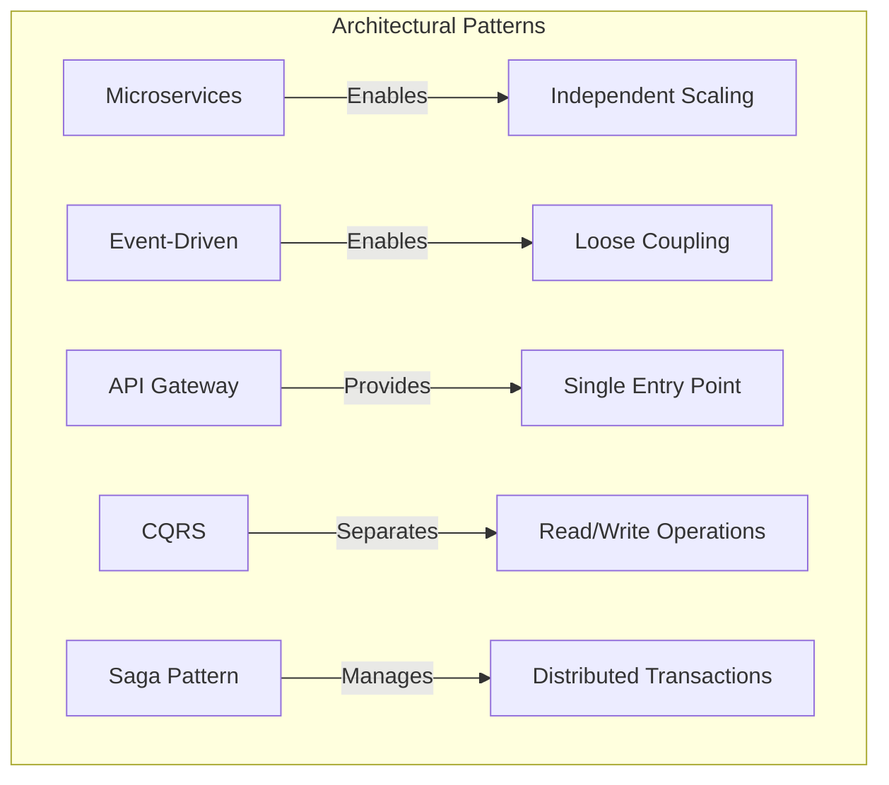

## 3. High-Level Architecture

### 3.1 System Architecture Diagram

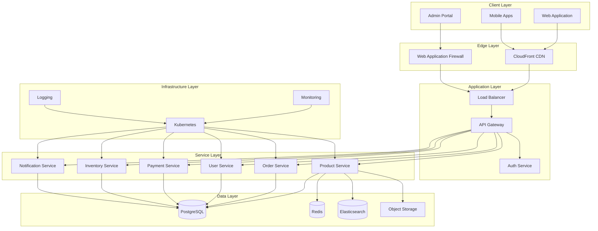

## 4. Component Architecture

### 4.1 Frontend Components

| Component | Technology | Purpose | Repository |
|-----------|------------|---------|------------|
| [`WEB-001`] Web App | React 18, Next.js 14 | Customer portal | `/frontend/web` |
| [`MOB-001`] Mobile iOS | React Native | iOS application | `/mobile/ios` |
| [`MOB-002`] Mobile Android | React Native | Android application | `/mobile/android` |
| [`ADM-001`] Admin Portal | React, TypeScript | Management interface | `/frontend/admin` |
| [`UI-001`] Design System | Storybook | Shared components | `/packages/ui` |

### 4.2 Backend Services

| Service ID | Service | Responsibility | Technology | Port |
|------------|---------|---------------|------------|------|
| [`SVC-AUTH-001`] | Auth Service | Authentication & authorization | Node.js, JWT | 3001 |
| [`SVC-USER-001`] | User Service | User management | Node.js, Express | 3002 |
| [`SVC-PROD-001`] | Product Service | Product catalog | Node.js, GraphQL | 3003 |
| [`SVC-ORD-001`] | Order Service | Order processing | Node.js, Express | 3004 |
| [`SVC-PAY-001`] | Payment Service | Payment processing | Node.js, Express | 3005 |
| [`SVC-INV-001`] | Inventory Service | Stock management | Node.js, Express | 3006 |
| [`SVC-NOTIF-001`] | Notification Service | Email/SMS/Push | Node.js, Express | 3007 |
| [`SVC-SEARCH-001`] | Search Service | Product search | Node.js, Elasticsearch | 3008 |
| [`SVC-REC-001`] | Recommendation Service | ML recommendations | Python, FastAPI | 3009 |
| [`SVC-ANALYT-001`] | Analytics Service | Data analytics | Node.js, Express | 3010 |

### 4.3 Service Communication

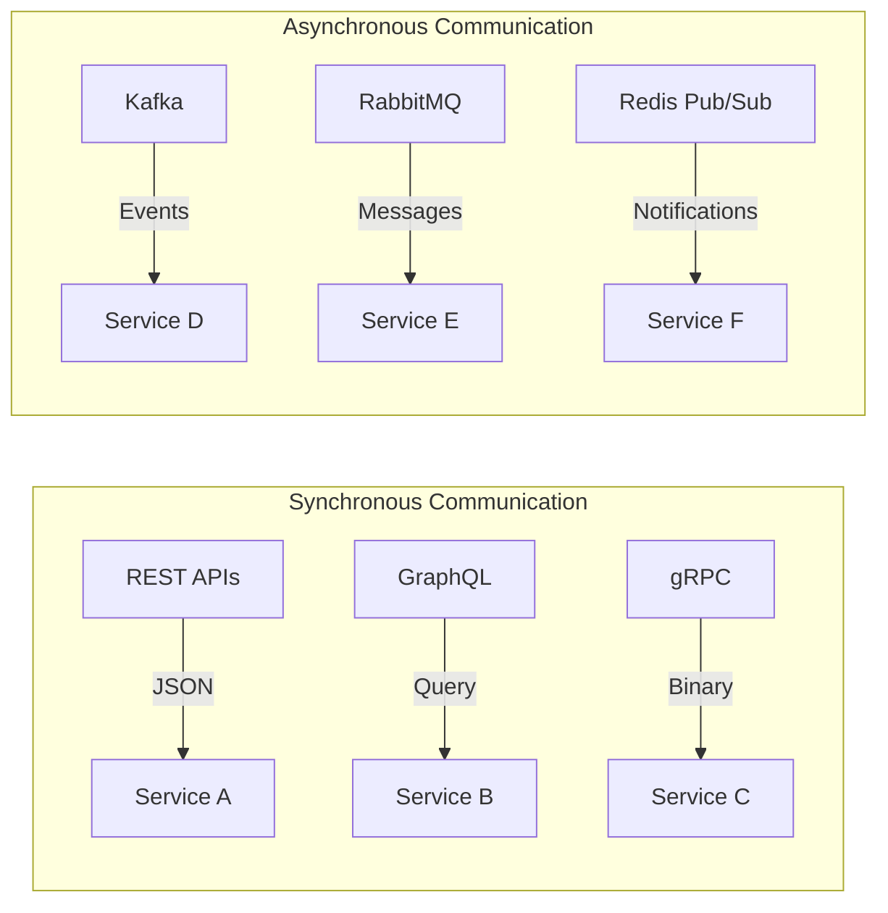

## 5. Data Architecture

### 5.1 Data Storage Strategy

| Data Type | Storage | Technology | Purpose |
|-----------|---------|------------|---------|
| Transactional | Primary DB | PostgreSQL 15 | ACID compliance |
| Session | Cache | Redis 7 | Fast access |
| Search | Index | Elasticsearch 8 | Full-text search |
| Files | Object Store | AWS S3 | Media storage |
| Analytics | Data Lake | S3 + Athena | Business intelligence |
| Logs | Time Series | CloudWatch | Operational data |

### 5.2 Database Schema Overview

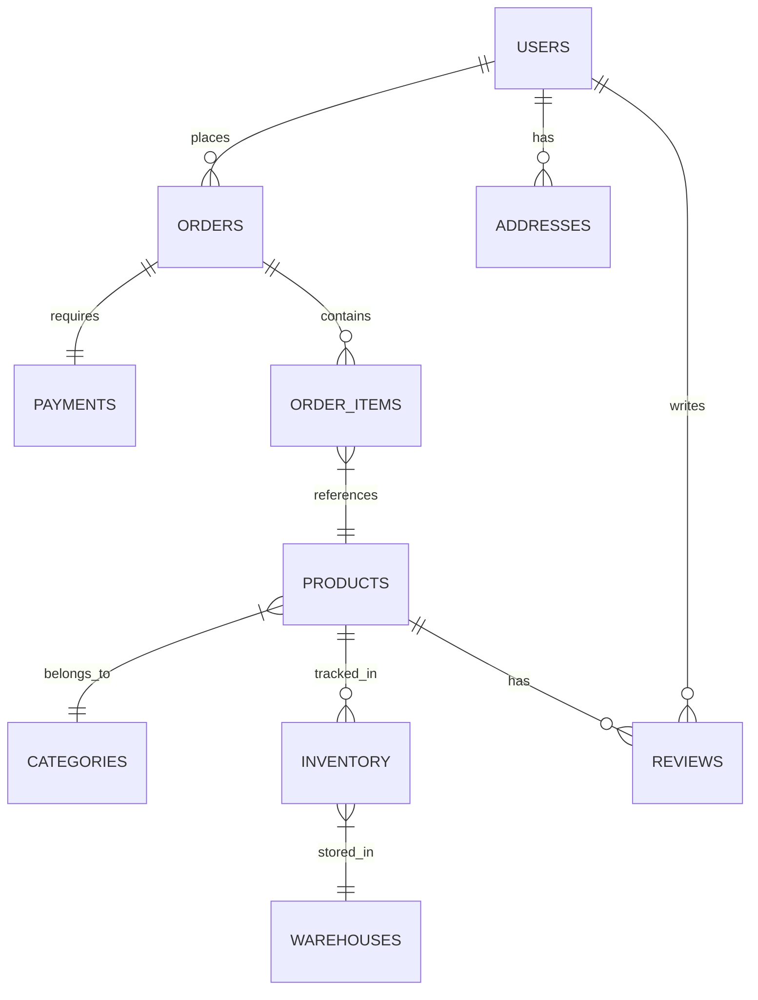

### 5.3 Data Flow Architecture

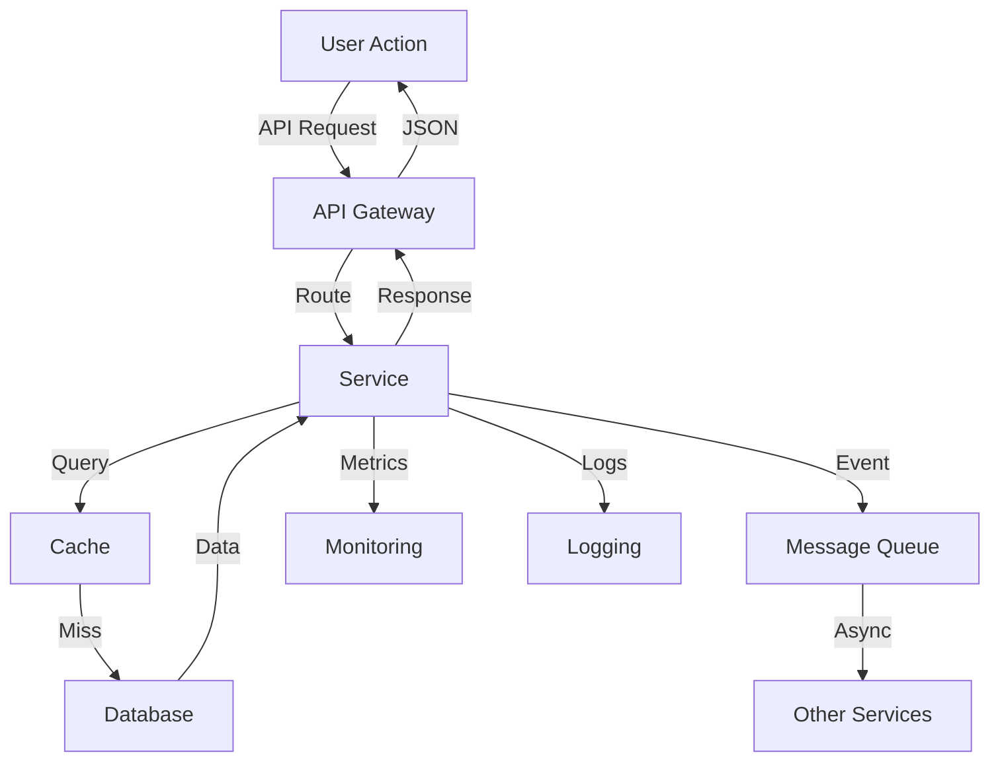

## 6. Security Architecture

### 6.1 Security Layers

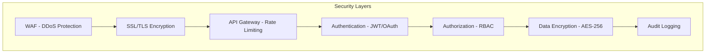

### 6.2 Security Components

| Component | Purpose | Implementation | Reference |
|-----------|---------|----------------|-----------|
| [`SEC-WAF-001`] | Web Application Firewall | AWS WAF | [Security Doc](./security.md#waf) |
| [`SEC-AUTH-001`] | Authentication | Auth0/JWT | [Auth Module](./auth-module.md) |
| [`SEC-AUTHZ-001`] | Authorization | RBAC | [RBAC Design](./rbac-design.md) |
| [`SEC-VAULT-001`] | Secret Management | AWS Secrets Manager | [Secrets Doc](./secrets-management.md) |
| [`SEC-AUDIT-001`] | Audit Logging | CloudTrail | [Audit Doc](./audit-logging.md) |

## 7. Infrastructure Architecture

### 7.1 Cloud Infrastructure

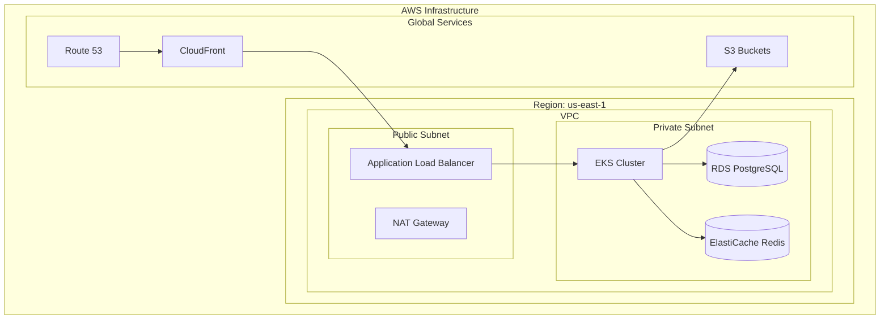

### 7.2 Kubernetes Architecture

| Component | Purpose | Configuration |
|-----------|---------|---------------|
| [`K8S-NS-001`] | Namespaces | Environment separation |
| [`K8S-DEP-001`] | Deployments | Service instances |
| [`K8S-SVC-001`] | Services | Internal networking |
| [`K8S-ING-001`] | Ingress | External access |
| [`K8S-HPA-001`] | HPA | Auto-scaling |
| [`K8S-CM-001`] | ConfigMaps | Configuration |
| [`K8S-SEC-001`] | Secrets | Sensitive data |

## 8. Integration Architecture

### 8.1 External Integrations

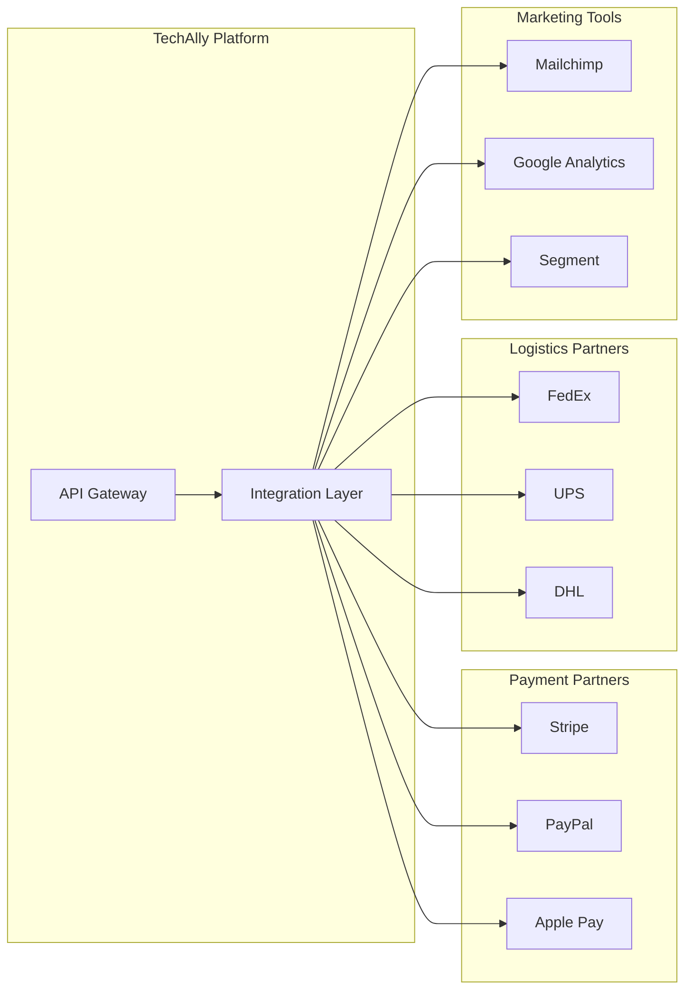

### 8.2 Integration Patterns

| Pattern | Use Case | Implementation |
|---------|----------|----------------|
| API Gateway | Central routing | Kong/AWS API Gateway |
| Adapter Pattern | Protocol conversion | Custom adapters |
| Circuit Breaker | Fault tolerance | Hystrix pattern |
| Retry Logic | Transient failures | Exponential backoff |
| Message Queue | Async processing | Kafka/RabbitMQ |

## 9. Performance Architecture

### 9.1 Performance Optimization

| Layer | Optimization | Technology | Target |
|-------|--------------|------------|--------|
| CDN | Static content | CloudFront | Global <50ms |
| Cache | Database queries | Redis | <10ms |
| Search | Product search | Elasticsearch | <100ms |
| API | Response time | Node.js cluster | <200ms |
| Database | Query optimization | PostgreSQL | <50ms |
| Frontend | Bundle size | Webpack | <200KB |

### 9.2 Caching Strategy

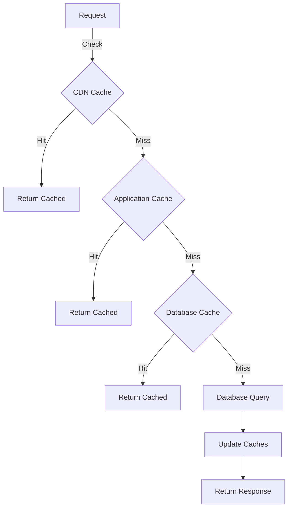

## 10. Scalability Design

### 10.1 Horizontal Scaling

| Component | Scaling Trigger | Min/Max | Strategy |
|-----------|----------------|---------|----------|
| Web Servers | CPU > 70% | 2/20 | Auto-scaling |
| API Services | Request rate | 3/30 | HPA |
| Database | Connections | 1/5 | Read replicas |
| Cache | Memory | 2/10 | Cluster mode |
| Queue Workers | Queue depth | 1/20 | Auto-scaling |

### 10.2 Load Distribution

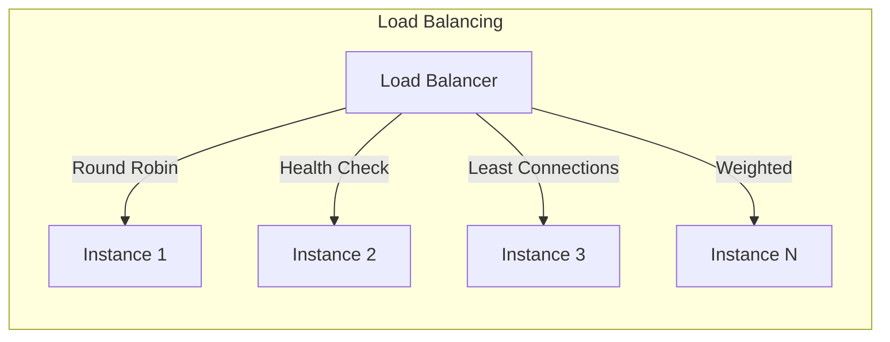

## 11. Deployment Architecture

### 11.1 CI/CD Pipeline

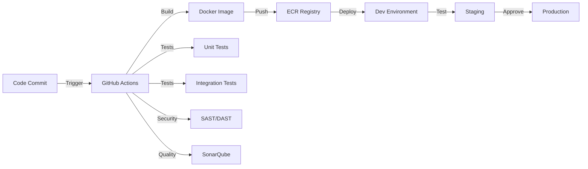

### 11.2 Environment Strategy

| Environment | Purpose | Configuration | Access |
|-------------|---------|---------------|--------|
| Development | Feature testing | Minimal resources | Developers |
| Staging | Pre-production | Production-like | QA Team |
| Production | Live system | Full resources | Limited |
| DR | Disaster recovery | Standby | Emergency |

## 12. Monitoring Architecture

### 12.1 Observability Stack

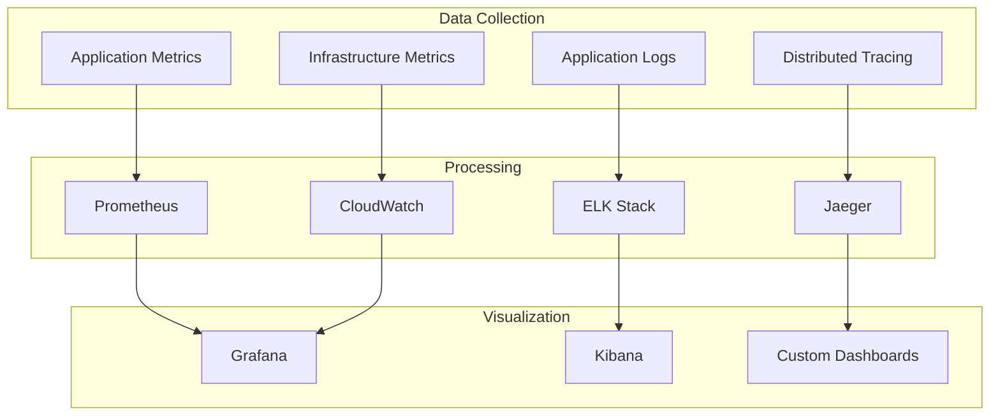

### 12.2 Key Metrics

| Category | Metric | Threshold | Alert |
|----------|--------|-----------|-------|
| Availability | Uptime | <99.9% | Critical |
| Performance | Response Time | >2s | Warning |
| Error Rate | 5xx Errors | >1% | Critical |
| Traffic | Request Rate | >10K/s | Info |
| Resource | CPU Usage | >80% | Warning |
| Business | Conversion | <20% | Warning |

## 13. Disaster Recovery

### 13.1 DR Strategy

| Component | RPO | RTO | Backup Strategy |
|-----------|-----|-----|----------------|
| Database | 1 hour | 2 hours | Continuous replication |
| Application | 0 | 30 min | Multi-region |
| Files | 24 hours | 4 hours | S3 cross-region |
| Configuration | 0 | 15 min | Git repository |

### 13.2 Failover Architecture

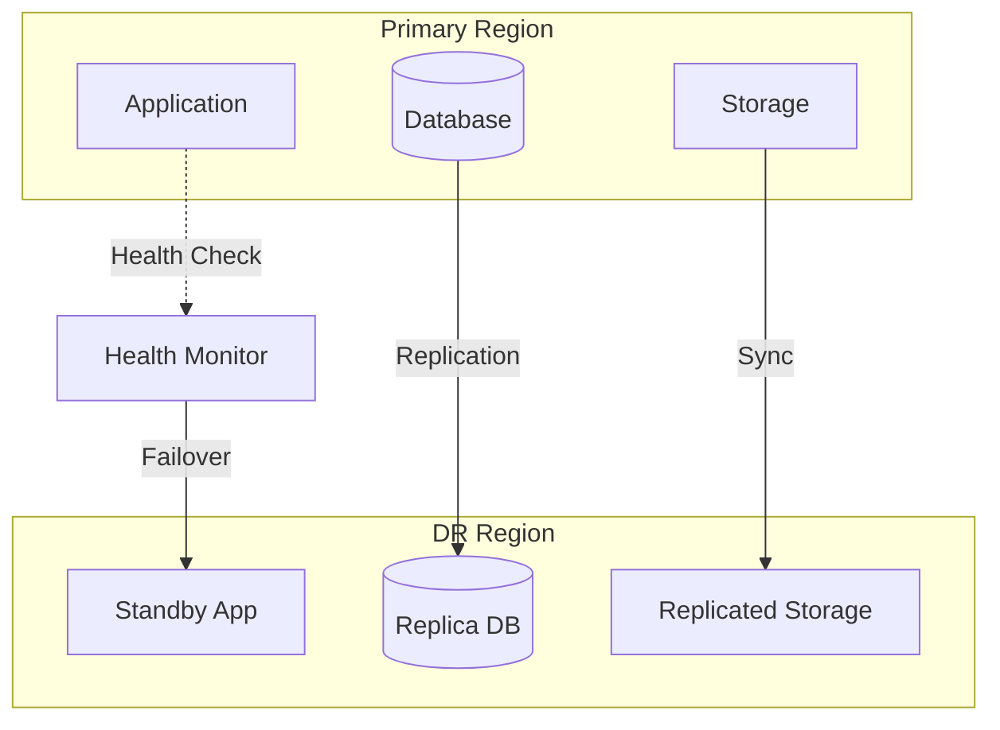

## 14. Technology Stack Summary

### 14.1 Complete Stack

| Layer | Technology | Version | Purpose |
|-------|------------|---------|---------|
| **Frontend** |
| Framework | React | 18.x | UI components |
| Meta-framework | Next.js | 14.x | SSR/SSG |
| State | Redux Toolkit | 2.x | State management |
| Styling | Tailwind CSS | 3.x | CSS framework |
| **Backend** |
| Runtime | Node.js | 20.x | JavaScript runtime |
| Framework | Express/Fastify | Latest | Web framework |
| API | GraphQL | 16.x | Query language |
| **Database** |
| Primary | PostgreSQL | 15.x | Relational DB |
| Cache | Redis | 7.x | In-memory cache |
| Search | Elasticsearch | 8.x | Full-text search |
| **Infrastructure** |
| Cloud | AWS | - | Cloud provider |
| Container | Docker | Latest | Containerization |
| Orchestration | Kubernetes | 1.28 | Container orchestration |
| CI/CD | GitHub Actions | - | Automation |

## 15. Architecture Decisions Record (ADR)

### 15.1 Key Decisions

| Decision | Rationale | Alternatives | Impact |
|----------|-----------|--------------|--------|
| Microservices | Scalability, team independence | Monolith | Higher complexity |
| PostgreSQL | ACID compliance, features | MySQL, MongoDB | Relational model |
| React | Ecosystem, performance | Vue, Angular | Developer availability |
| AWS | Features, reliability | Azure, GCP | Vendor lock-in |
| Kubernetes | Orchestration, portability | ECS, Fargate | Learning curve |

## 16. References

- [Frontend Architecture](./frontend-architecture.md) - [`ARCH-FE-001`]
- [Backend Architecture](./backend-architecture.md) - [`ARCH-BE-001`]
- [Database Design](../database/schema-overview.md) - [`DB-001`]
- [API Documentation](../api/api-reference.md) - [`API-001`]
- [Security Architecture](./security.md) - [`SEC-001`]
- [Infrastructure as Code](./infrastructure.md) - [`INF-001`]

---
*This architecture document is maintained by the Technical Architecture Team and requires CTO approval for major changes.*
