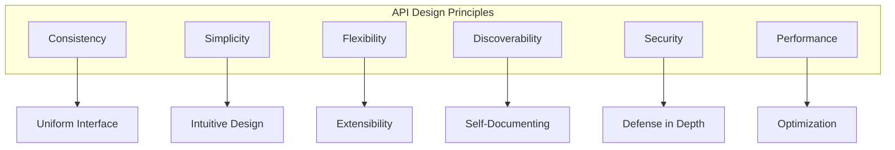
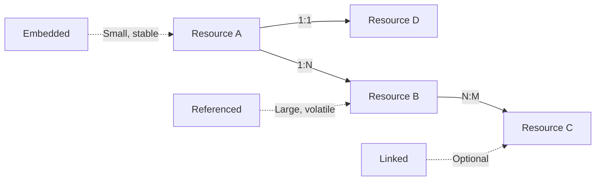
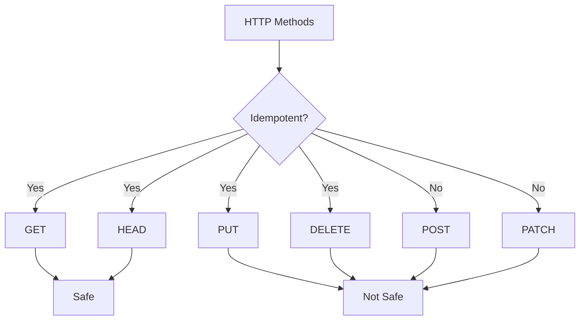
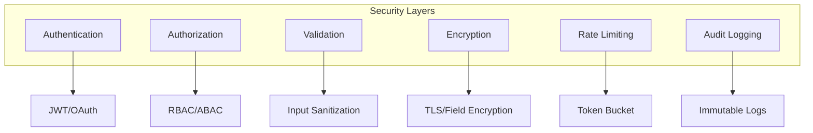
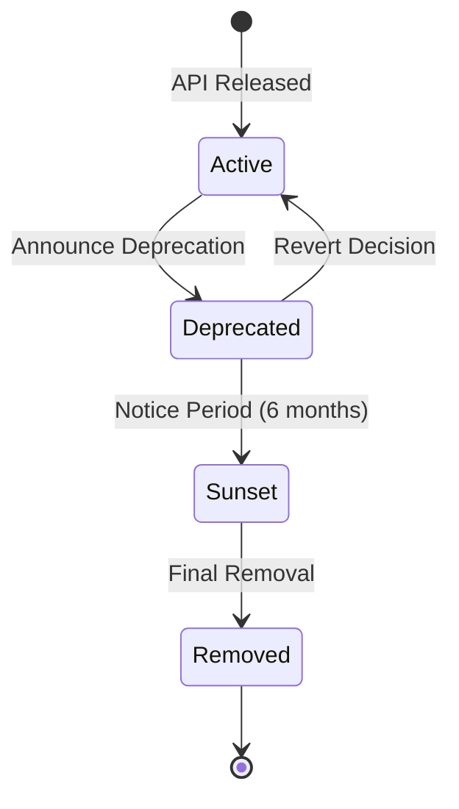
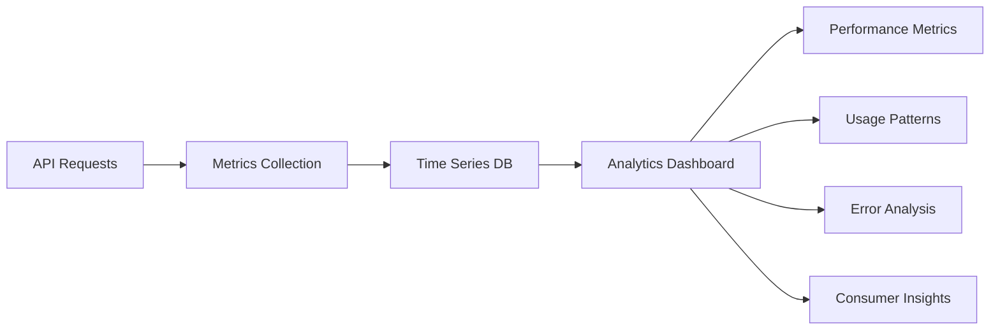

# API Design Principles and Best Practices

## 1. Core Design Principles

### 1.1 Fundamental Principles



### 1.2 Design Philosophy

| Principle | Description | Implementation | Benefits |
|-----------|-------------|----------------|----------|
| **RESTful** | Follow REST constraints | Stateless, resource-based | Standard, scalable |
| **Contract-First** | Design API before implementation | OpenAPI spec | Clear contract |
| **Version-Tolerant** | Backward compatibility | Deprecation strategy | Smooth migration |
| **Developer-Friendly** | Easy to understand and use | Clear naming, docs | Fast adoption |
| **Platform-Agnostic** | Technology independent | Standard protocols | Wide compatibility |
| **Business-Aligned** | Reflect business domains | Domain-driven design | Business value |

## 2. Resource-Oriented Design

### 2.1 Resource Modeling

```yaml
resource_design:
  principles:
    - Resources are nouns, not verbs
    - Collections are plural
    - Relationships are explicit
    - Actions use HTTP methods
    
  hierarchy:
    /users:
      description: User collection
      operations: [GET, POST]
      
    /users/{id}:
      description: Individual user
      operations: [GET, PUT, PATCH, DELETE]
      
    /users/{id}/orders:
      description: User's orders
      operations: [GET, POST]
      
    /users/{id}/orders/{orderId}:
      description: Specific order
      operations: [GET, PUT, DELETE]
```

### 2.2 Resource Relationships



### 2.3 Resource Representation

```json
{
  "resource_patterns": {
    "single_resource": {
      "example": "/api/v1/products/123",
      "response": {
        "id": "123",
        "type": "product",
        "attributes": {},
        "links": {
          "self": "/api/v1/products/123"
        }
      }
    },
    "collection": {
      "example": "/api/v1/products",
      "response": {
        "data": [],
        "meta": {
          "total": 100,
          "page": 1
        },
        "links": {
          "self": "/api/v1/products?page=1",
          "next": "/api/v1/products?page=2"
        }
      }
    }
  }
}
```

## 3. Consistency Standards

### 3.1 Naming Conventions

| Element | Convention | Example | Anti-pattern |
|---------|------------|---------|--------------|
| **URLs** | kebab-case, plural | `/shopping-carts` | `/shoppingCart` |
| **Query params** | camelCase | `?sortBy=price` | `?sort_by=price` |
| **JSON fields** | camelCase | `"firstName"` | `"first_name"` |
| **Headers** | Pascal-Case | `X-Request-Id` | `x_request_id` |
| **Enums** | UPPER_SNAKE | `PAYMENT_PENDING` | `paymentPending` |

### 3.2 Date and Time Standards

```yaml
datetime_standards:
  format: ISO 8601
  timezone: UTC
  examples:
    date: "2025-09-23"
    time: "14:30:00"
    datetime: "2025-09-23T14:30:00Z"
    duration: "P3DT4H30M"
  
  field_naming:
    created: createdAt
    updated: updatedAt
    deleted: deletedAt
    expires: expiresAt
```

### 3.3 Consistent Error Format

```json
{
  "error": {
    "code": "RESOURCE_NOT_FOUND",
    "message": "The requested product was not found",
    "status": 404,
    "details": {
      "resource": "product",
      "id": "prod_123"
    },
    "help": "https://api.techally.com/docs/errors/RESOURCE_NOT_FOUND"
  }
}
```

## 4. Idempotency and Safety

### 4.1 Idempotent Operations



### 4.2 Idempotency Keys

```http
POST /api/v1/payments
Idempotency-Key: 7b92e4a4-8b6e-4f3a-9c1d-2e5f8a1b3d4c
Content-Type: application/json

{
  "amount": 100.00,
  "currency": "USD",
  "paymentMethod": "card_123"
}
```

### 4.3 Safe Retry Logic

```yaml
retry_strategy:
  safe_methods:
    - GET
    - HEAD
    - OPTIONS
    max_retries: 3
    
  idempotent_methods:
    - PUT
    - DELETE
    max_retries: 2
    require_idempotency_key: false
    
  non_idempotent_methods:
    - POST
    - PATCH
    max_retries: 1
    require_idempotency_key: true
```

## 5. Pagination Patterns

### 5.1 Pagination Strategies

| Strategy | Use Case | Pros | Cons |
|----------|----------|------|------|
| **Offset** | Simple lists | Easy to implement | Performance on large datasets |
| **Cursor** | Large datasets | Efficient, stable | Complex implementation |
| **Keyset** | Sorted results | Fast, consistent | Limited sorting options |
| **Page-based** | UI pagination | User-friendly | Can miss/duplicate items |

### 5.2 Pagination Implementation

```json
// Offset-based
{
  "pagination": {
    "offset": 20,
    "limit": 10,
    "total": 100,
    "links": {
      "first": "?offset=0&limit=10",
      "prev": "?offset=10&limit=10",
      "next": "?offset=30&limit=10",
      "last": "?offset=90&limit=10"
    }
  }
}

// Cursor-based
{
  "pagination": {
    "cursor": "eyJpZCI6MTIzfQ==",
    "limit": 10,
    "hasNext": true,
    "hasPrev": true,
    "links": {
      "next": "?cursor=eyJpZCI6MTMzfQ==&limit=10",
      "prev": "?cursor=eyJpZCI6MTEzfQ==&limit=10"
    }
  }
}
```

## 6. Filtering and Searching

### 6.1 Filter Patterns

```http
# Simple equality
GET /products?category=electronics

# Multiple values (OR)
GET /products?brand=apple,samsung,sony

# Range filters
GET /products?price[min]=100&price[max]=500

# Nested properties
GET /products?specs.ram=8GB

# Complex queries
GET /products?filter={"$and":[{"price":{"$lte":1000}},{"rating":{"$gte":4}}]}
```

### 6.2 Search Patterns

```yaml
search_patterns:
  simple_search:
    endpoint: GET /products?q=laptop
    description: Full-text search
    
  faceted_search:
    endpoint: GET /products/search
    body:
      query: "gaming laptop"
      filters:
        category: ["computers"]
        price_range: [500, 1500]
      facets: ["brand", "processor", "ram"]
      
  advanced_search:
    endpoint: POST /products/search
    body:
      must: [{match: {name: "laptop"}}]
      should: [{match: {description: "gaming"}}]
      filter: [{range: {price: {lte: 2000}}}]
```

## 7. Versioning Strategy

### 7.1 Versioning Approaches

```mermaid
graph LR
    A[Versioning Methods] --> B[URL Path]
    A --> C[Query Parameter]
    A --> D[Header]
    A --> E[Content Negotiation]
    
    B --> F[/api/v1/products]
    C --> G[/api/products?version=1]
    D --> H[X-API-Version: 1]
    E --> I[Accept: application/vnd.api+json;version=1]
```

### 7.2 Version Lifecycle

```yaml
version_lifecycle:
  stages:
    alpha:
      stability: unstable
      support: none
      access: internal
      
    beta:
      stability: mostly_stable
      support: best_effort
      access: limited
      
    ga:
      stability: stable
      support: full
      access: public
      
    deprecated:
      stability: stable
      support: security_only
      notice_period: 6_months
      
    sunset:
      stability: removed
      support: none
      migration_guide: required
```

## 8. Performance Optimization

### 8.1 Response Optimization

```yaml
optimization_techniques:
  field_filtering:
    description: Return only requested fields
    example: GET /products?fields=id,name,price
    
  compression:
    description: Compress responses
    headers:
      - Accept-Encoding: gzip
      - Content-Encoding: gzip
      
  caching:
    description: Use HTTP caching
    headers:
      - Cache-Control: public, max-age=3600
      - ETag: "abc123"
      
  pagination:
    description: Limit response size
    default_limit: 20
    max_limit: 100
```

### 8.2 Query Optimization

```javascript
// N+1 Query Prevention
{
  "bad_practice": {
    "description": "Multiple queries for related data",
    "queries": [
      "SELECT * FROM users",
      "SELECT * FROM orders WHERE user_id = 1",
      "SELECT * FROM orders WHERE user_id = 2"
    ]
  },
  "best_practice": {
    "description": "Single query with joins or includes",
    "query": "SELECT * FROM users LEFT JOIN orders ON users.id = orders.user_id",
    "api": "GET /users?include=orders"
  }
}
```

## 9. Security Principles

### 9.1 Security by Design



### 9.2 Security Headers

```http
HTTP/1.1 200 OK
X-Content-Type-Options: nosniff
X-Frame-Options: DENY
X-XSS-Protection: 1; mode=block
Strict-Transport-Security: max-age=31536000; includeSubDomains
Content-Security-Policy: default-src 'self'
X-Request-Id: 7b92e4a4-8b6e-4f3a-9c1d-2e5f8a1b3d4c
```

## 10. Backward Compatibility

### 10.1 Breaking Changes

```yaml
breaking_changes:
  never_do:
    - Remove fields from responses
    - Change field types
    - Rename fields
    - Change URL structure
    - Remove endpoints
    
  safe_changes:
    - Add optional fields
    - Add new endpoints
    - Add new optional parameters
    - Add new response codes
    - Deprecate with notice
```

### 10.2 Deprecation Process



## 11. Documentation Standards

### 11.1 API Documentation Requirements

| Component | Description | Format | Tool |
|-----------|-------------|--------|------|
| **Specification** | Complete API definition | OpenAPI 3.0 | Swagger |
| **Reference** | Endpoint documentation | Markdown | Redoc |
| **Guides** | How-to tutorials | Markdown | Docusaurus |
| **Examples** | Code samples | Multiple languages | Postman |
| **Changelog** | Version history | Markdown | Git |

### 11.2 Self-Documenting APIs

```json
{
  "links": {
    "self": "/api/v1/products/123",
    "related": {
      "category": "/api/v1/categories/456",
      "reviews": "/api/v1/products/123/reviews"
    },
    "actions": {
      "update": {
        "href": "/api/v1/products/123",
        "method": "PUT"
      },
      "delete": {
        "href": "/api/v1/products/123",
        "method": "DELETE"
      }
    }
  }
}
```

## 12. Monitoring and Analytics

### 12.1 API Metrics

```yaml
key_metrics:
  availability:
    target: 99.9%
    measurement: uptime_percentage
    
  latency:
    p50: <100ms
    p95: <500ms
    p99: <1000ms
    
  error_rate:
    target: <1%
    measurement: errors/total_requests
    
  usage:
    metrics:
      - requests_per_second
      - unique_consumers
      - endpoint_usage
```

### 12.2 API Analytics



## 13. Testing Principles

### 13.1 API Testing Layers

| Layer | Purpose | Coverage | Tools |
|-------|---------|----------|-------|
| **Unit** | Logic testing | 90% | Jest, Mocha |
| **Integration** | Component interaction | 80% | Supertest |
| **Contract** | API contract | 100% | Pact |
| **Performance** | Load testing | Critical paths | K6, JMeter |
| **Security** | Vulnerability testing | All endpoints | OWASP ZAP |

### 13.2 Test Data Management

```yaml
test_data:
  strategies:
    fixtures:
      description: Predefined test data
      use_case: Unit tests
      
    factories:
      description: Dynamic data generation
      use_case: Integration tests
      
    sandbox:
      description: Isolated test environment
      use_case: E2E tests
      
    production_mirror:
      description: Anonymized production data
      use_case: Performance tests
```

## 14. Internationalization

### 14.1 I18n Support

```http
# Request with language preference
GET /api/v1/products
Accept-Language: es-ES,es;q=0.9,en;q=0.8

# Response with localized content
{
  "name": "Reloj Inteligente",
  "description": "Reloj inteligente con múltiples funciones",
  "price": {
    "amount": 299.99,
    "currency": "EUR",
    "formatted": "€299,99"
  }
}
```

## 15. References

- [REST API Structure](./rest-api-structure.md) - `API-REST-001`
- [API Reference](./api-reference.md) - `API-001`
- [Non-Functional Requirements](../02_requirements/non-functional-requirements.md) - `REQ-NFR-001`
- [Security Architecture](../03_architecture/security.md) - `SEC-001`
- [Testing Strategy](../06_testing/test-strategy.md) - `TEST-STRAT-001`

---
*This API design principles document is maintained by the Architecture Team and serves as the foundation for all API development.*
