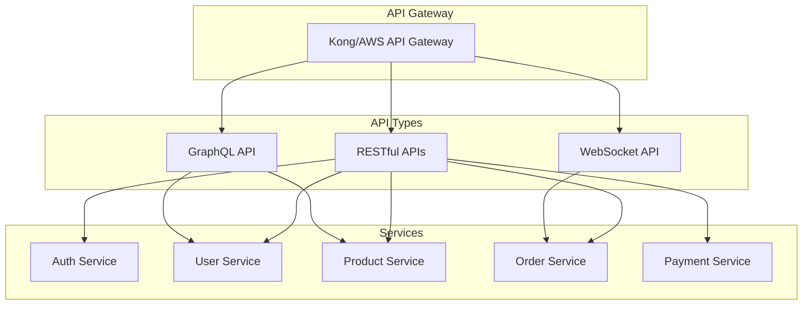
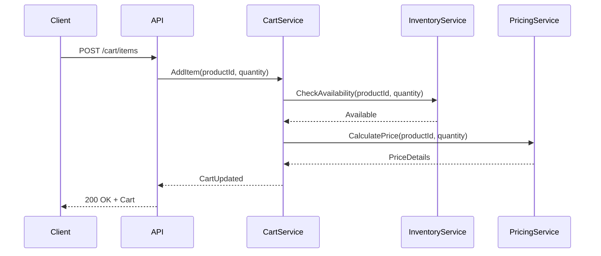
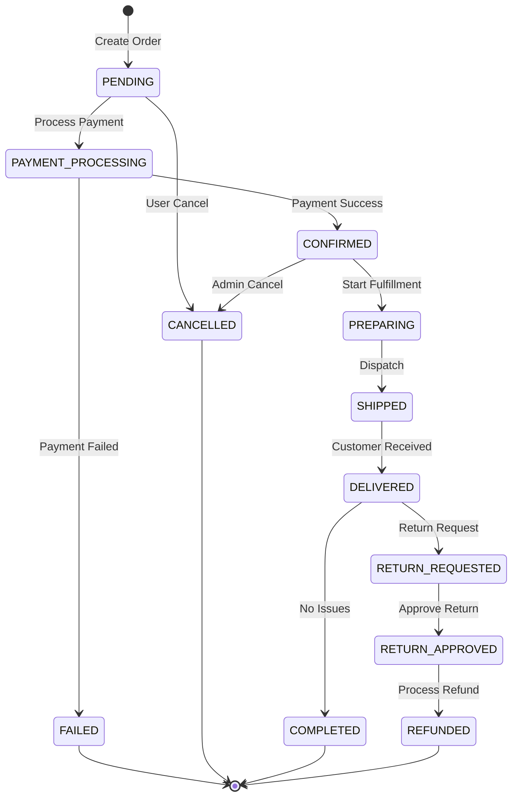
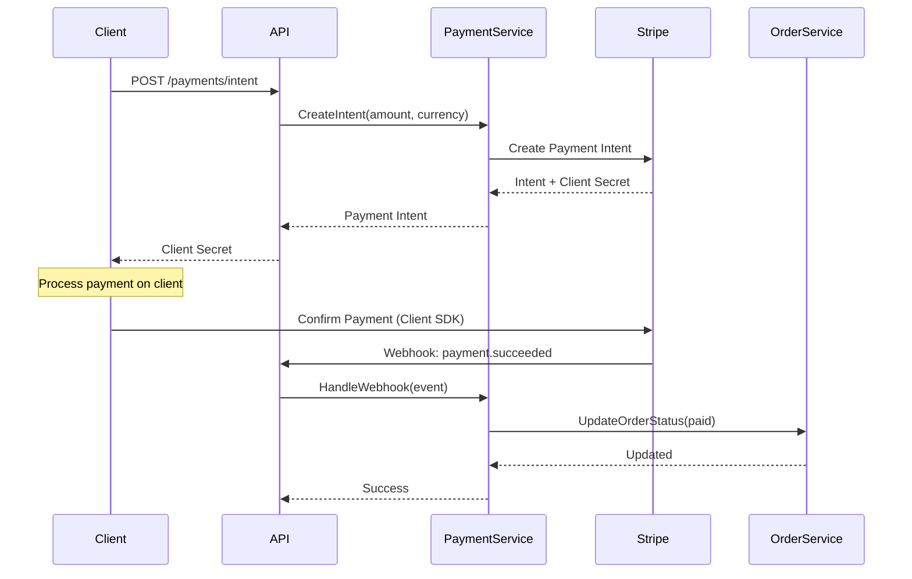
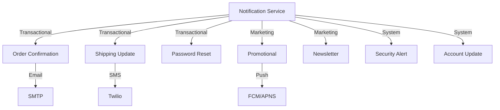
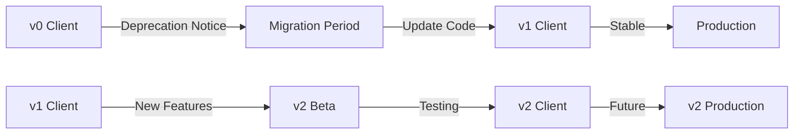

# API Reference Documentation

## 1. API Overview

### 1.1 API Architecture



### 1.2 API Standards

| Standard | Description | Implementation |
|----------|-------------|----------------|
| REST | RESTful design principles | JSON, HTTP methods |
| Versioning | URL path versioning | `/api/v1/`, `/api/v2/` |
| Authentication | Bearer token (JWT) | `Authorization: Bearer <token>` |
| Rate Limiting | Request throttling | 1000 req/min per user |
| Pagination | Cursor-based | `?cursor=xxx&limit=20` |
| Error Format | RFC 7807 | Problem Details JSON |

## 2. Authentication API

### 2.1 Endpoints

| Method | Endpoint | Description | Auth Required |
|--------|----------|-------------|---------------|
| POST | `/api/v1/auth/register` | User registration | No |
| POST | `/api/v1/auth/login` | User login | No |
| POST | `/api/v1/auth/logout` | User logout | Yes |
| POST | `/api/v1/auth/refresh` | Refresh token | Yes |
| POST | `/api/v1/auth/forgot-password` | Password reset request | No |
| POST | `/api/v1/auth/reset-password` | Password reset confirm | No |
| GET | `/api/v1/auth/verify-email` | Email verification | No |
| POST | `/api/v1/auth/mfa/enable` | Enable MFA | Yes |
| POST | `/api/v1/auth/mfa/verify` | Verify MFA code | Yes |

### 2.2 Request/Response Examples

#### 2.2.1 User Registration

**Request:**
```http
POST /api/v1/auth/register
Content-Type: application/json

{
  "email": "user@example.com",
  "password": "SecurePass123!",
  "firstName": "John",
  "lastName": "Doe",
  "acceptTerms": true
}
```

**Response:**
```json
{
  "success": true,
  "data": {
    "userId": "usr_1234567890",
    "email": "user@example.com",
    "emailVerified": false,
    "createdAt": "2025-09-23T10:00:00Z"
  },
  "message": "Registration successful. Please verify your email."
}
```

#### 2.2.2 User Login

**Request:**
```http
POST /api/v1/auth/login
Content-Type: application/json

{
  "email": "user@example.com",
  "password": "SecurePass123!",
  "rememberMe": true
}
```

**Response:**
```json
{
  "success": true,
  "data": {
    "accessToken": "eyJhbGciOiJIUzI1NiIs...",
    "refreshToken": "refresh_token_here",
    "tokenType": "Bearer",
    "expiresIn": 3600,
    "user": {
      "id": "usr_1234567890",
      "email": "user@example.com",
      "firstName": "John",
      "lastName": "Doe",
      "role": "customer"
    }
  }
}
```

## 3. User Service API

### 3.1 Endpoints

| Method | Endpoint | Description | Scope |
|--------|----------|-------------|-------|
| GET | `/api/v1/users/me` | Get current user | `user:read` |
| PUT | `/api/v1/users/me` | Update user profile | `user:write` |
| DELETE | `/api/v1/users/me` | Delete user account | `user:delete` |
| GET | `/api/v1/users/me/addresses` | List addresses | `user:read` |
| POST | `/api/v1/users/me/addresses` | Add address | `user:write` |
| PUT | `/api/v1/users/me/addresses/{id}` | Update address | `user:write` |
| DELETE | `/api/v1/users/me/addresses/{id}` | Delete address | `user:write` |
| GET | `/api/v1/users/me/payment-methods` | List payment methods | `payment:read` |
| POST | `/api/v1/users/me/payment-methods` | Add payment method | `payment:write` |

### 3.2 User Profile Schema

```json
{
  "type": "object",
  "properties": {
    "id": {
      "type": "string",
      "pattern": "^usr_[a-zA-Z0-9]{10}$"
    },
    "email": {
      "type": "string",
      "format": "email"
    },
    "firstName": {
      "type": "string",
      "maxLength": 50
    },
    "lastName": {
      "type": "string",
      "maxLength": 50
    },
    "phoneNumber": {
      "type": "string",
      "pattern": "^\\+?[1-9]\\d{1,14}$"
    },
    "dateOfBirth": {
      "type": "string",
      "format": "date"
    },
    "preferences": {
      "type": "object",
      "properties": {
        "newsletter": {"type": "boolean"},
        "notifications": {"type": "boolean"},
        "language": {"type": "string"},
        "currency": {"type": "string"}
      }
    }
  },
  "required": ["id", "email", "firstName", "lastName"]
}
```

## 4. Product Service API

### 4.1 REST Endpoints

| Method | Endpoint | Description | Cache |
|--------|----------|-------------|-------|
| GET | `/api/v1/products` | List products | 5 min |
| GET | `/api/v1/products/{id}` | Get product details | 10 min |
| GET | `/api/v1/products/search` | Search products | 2 min |
| GET | `/api/v1/products/{id}/reviews` | Get product reviews | 5 min |
| POST | `/api/v1/products/{id}/reviews` | Add review | No |
| GET | `/api/v1/products/{id}/availability` | Check availability | Real-time |
| GET | `/api/v1/categories` | List categories | 1 hour |
| GET | `/api/v1/categories/{id}/products` | Products by category | 5 min |

### 4.2 GraphQL Schema

```graphql
type Query {
  product(id: ID!): Product
  products(
    filter: ProductFilter
    sort: ProductSort
    pagination: PaginationInput
  ): ProductConnection!
  searchProducts(
    query: String!
    filters: SearchFilters
  ): SearchResults!
  categories: [Category!]!
  recommendedProducts(userId: ID!): [Product!]!
}

type Product {
  id: ID!
  sku: String!
  name: String!
  description: String!
  price: Price!
  images: [Image!]!
  specifications: JSON
  category: Category!
  brand: Brand!
  rating: Rating
  reviews(first: Int, after: String): ReviewConnection!
  inventory: Inventory!
  variants: [ProductVariant!]
  relatedProducts: [Product!]
}

type Price {
  amount: Float!
  currency: String!
  discountedAmount: Float
  discountPercentage: Float
}

type Inventory {
  available: Boolean!
  quantity: Int!
  warehouse: String!
  estimatedRestockDate: DateTime
}

input ProductFilter {
  category: ID
  brand: ID
  priceRange: PriceRangeInput
  inStock: Boolean
  rating: Float
}

input ProductSort {
  field: ProductSortField!
  direction: SortDirection!
}

enum ProductSortField {
  NAME
  PRICE
  RATING
  CREATED_AT
  POPULARITY
}
```

### 4.3 Search API

**Request:**
```http
GET /api/v1/products/search?q=smart+watch&category=wearables&min_price=100&max_price=500&sort=rating_desc
```

**Response:**
```json
{
  "success": true,
  "data": {
    "products": [
      {
        "id": "prod_abc123",
        "name": "TechAlly Smart Watch Pro",
        "price": 299.99,
        "rating": 4.8,
        "image": "https://cdn.techally.com/products/watch-pro.jpg",
        "inStock": true
      }
    ],
    "facets": {
      "brands": [
        {"name": "TechAlly", "count": 15},
        {"name": "Apple", "count": 8}
      ],
      "priceRanges": [
        {"range": "0-100", "count": 5},
        {"range": "100-300", "count": 12}
      ]
    },
    "pagination": {
      "total": 45,
      "page": 1,
      "limit": 20,
      "hasMore": true
    }
  }
}
```

## 5. Cart Service API

### 5.1 Endpoints

| Method | Endpoint | Description | Session |
|--------|----------|-------------|---------|
| GET | `/api/v1/cart` | Get cart contents | Required |
| POST | `/api/v1/cart/items` | Add item to cart | Required |
| PUT | `/api/v1/cart/items/{id}` | Update item quantity | Required |
| DELETE | `/api/v1/cart/items/{id}` | Remove item | Required |
| DELETE | `/api/v1/cart` | Clear cart | Required |
| POST | `/api/v1/cart/apply-coupon` | Apply coupon code | Required |
| DELETE | `/api/v1/cart/coupon` | Remove coupon | Required |
| GET | `/api/v1/cart/summary` | Get cart summary | Required |

### 5.2 Cart Operations



## 6. Order Service API

### 6.1 Order Endpoints

| Method | Endpoint | Description | Status |
|--------|----------|-------------|--------|
| POST | `/api/v1/orders` | Create order | Authenticated |
| GET | `/api/v1/orders` | List user orders | Authenticated |
| GET | `/api/v1/orders/{id}` | Get order details | Authenticated |
| PUT | `/api/v1/orders/{id}/cancel` | Cancel order | Authenticated |
| GET | `/api/v1/orders/{id}/tracking` | Get tracking info | Authenticated |
| POST | `/api/v1/orders/{id}/return` | Initiate return | Authenticated |
| GET | `/api/v1/orders/{id}/invoice` | Download invoice | Authenticated |

### 6.2 Order State Machine



### 6.3 Create Order Request

```json
{
  "shippingAddress": {
    "firstName": "John",
    "lastName": "Doe",
    "street": "123 Main St",
    "city": "San Francisco",
    "state": "CA",
    "zipCode": "94105",
    "country": "US",
    "phone": "+14155551234"
  },
  "billingAddress": {
    "sameAsShipping": true
  },
  "paymentMethod": {
    "type": "card",
    "token": "tok_visa_4242",
    "saveForFuture": true
  },
  "shippingMethod": {
    "carrier": "fedex",
    "service": "ground",
    "estimatedDays": 3
  },
  "items": [
    {
      "productId": "prod_abc123",
      "quantity": 2,
      "price": 299.99
    }
  ],
  "couponCode": "WELCOME10",
  "metadata": {
    "source": "web",
    "campaign": "summer_sale"
  }
}
```

## 7. Payment Service API

### 7.1 Payment Endpoints

| Method | Endpoint | Description | PCI Scope |
|--------|----------|-------------|-----------|
| POST | `/api/v1/payments/intent` | Create payment intent | Yes |
| POST | `/api/v1/payments/confirm` | Confirm payment | Yes |
| POST | `/api/v1/payments/capture` | Capture authorized payment | Yes |
| POST | `/api/v1/payments/refund` | Process refund | Yes |
| GET | `/api/v1/payments/{id}` | Get payment details | Yes |
| POST | `/api/v1/payments/webhook` | Payment provider webhook | No |

### 7.2 Payment Flow



## 8. Inventory Service API

### 8.1 Inventory Endpoints

| Method | Endpoint | Description | Access |
|--------|----------|-------------|--------|
| GET | `/api/v1/inventory/{productId}` | Get stock level | Public |
| POST | `/api/v1/inventory/reserve` | Reserve stock | Internal |
| POST | `/api/v1/inventory/release` | Release reservation | Internal |
| PUT | `/api/v1/inventory/adjust` | Adjust stock | Admin |
| GET | `/api/v1/inventory/movements` | Stock movements | Admin |
| POST | `/api/v1/inventory/transfer` | Transfer between warehouses | Admin |

### 8.2 Stock Management

```json
{
  "productId": "prod_abc123",
  "warehouses": [
    {
      "id": "wh_us_west",
      "location": "California",
      "available": 150,
      "reserved": 20,
      "onHand": 170,
      "incoming": 50,
      "outgoing": 15
    },
    {
      "id": "wh_us_east",
      "location": "New York",
      "available": 80,
      "reserved": 10,
      "onHand": 90,
      "incoming": 0,
      "outgoing": 5
    }
  ],
  "totalAvailable": 230,
  "totalReserved": 30,
  "restockDate": "2025-10-01",
  "lowStockThreshold": 50,
  "autoReorderEnabled": true
}
```

## 9. Notification Service API

### 9.1 Notification Endpoints

| Method | Endpoint | Description | Channel |
|--------|----------|-------------|---------|
| POST | `/api/v1/notifications/email` | Send email | Email |
| POST | `/api/v1/notifications/sms` | Send SMS | SMS |
| POST | `/api/v1/notifications/push` | Send push notification | Mobile |
| POST | `/api/v1/notifications/batch` | Batch notifications | Multi |
| GET | `/api/v1/notifications/templates` | List templates | All |
| GET | `/api/v1/notifications/history` | Notification history | All |

### 9.2 Notification Types



## 10. WebSocket API

### 10.1 Real-time Events

| Event | Description | Payload |
|-------|-------------|---------|
| `order.status.updated` | Order status change | Order object |
| `inventory.updated` | Stock level change | Product + quantity |
| `price.updated` | Price change | Product + price |
| `cart.updated` | Cart modification | Cart object |
| `notification.new` | New notification | Notification object |

### 10.2 WebSocket Connection

```javascript
// Client connection example
const ws = new WebSocket('wss://api.techally.com/ws');

ws.on('open', () => {
  // Authenticate
  ws.send(JSON.stringify({
    type: 'auth',
    token: 'Bearer eyJhbGci...'
  }));
  
  // Subscribe to events
  ws.send(JSON.stringify({
    type: 'subscribe',
    events: ['order.status.updated', 'cart.updated']
  }));
});

ws.on('message', (data) => {
  const event = JSON.parse(data);
  switch(event.type) {
    case 'order.status.updated':
      handleOrderUpdate(event.payload);
      break;
    case 'cart.updated':
      handleCartUpdate(event.payload);
      break;
  }
});
```

## 11. Rate Limiting

### 11.1 Rate Limit Rules

| Tier | Requests/Min | Requests/Hour | Requests/Day |
|------|--------------|---------------|--------------|
| Anonymous | 60 | 1,000 | 10,000 |
| Authenticated | 600 | 10,000 | 100,000 |
| Premium | 1,200 | 20,000 | 200,000 |
| Admin | Unlimited | Unlimited | Unlimited |

### 11.2 Rate Limit Headers

```http
HTTP/1.1 200 OK
X-RateLimit-Limit: 600
X-RateLimit-Remaining: 598
X-RateLimit-Reset: 1695463200
X-RateLimit-Retry-After: 60
```

## 12. Error Handling

### 12.1 Error Response Format

```json
{
  "type": "https://api.techally.com/errors/validation",
  "title": "Validation Error",
  "status": 400,
  "detail": "The request contains invalid parameters",
  "instance": "/api/v1/products",
  "timestamp": "2025-09-23T10:00:00Z",
  "traceId": "abc123xyz",
  "errors": [
    {
      "field": "price",
      "message": "Price must be greater than 0",
      "code": "INVALID_PRICE"
    }
  ]
}
```

### 12.2 Common Error Codes

| HTTP Status | Error Code | Description |
|-------------|------------|-------------|
| 400 | `BAD_REQUEST` | Invalid request parameters |
| 401 | `UNAUTHORIZED` | Authentication required |
| 403 | `FORBIDDEN` | Insufficient permissions |
| 404 | `NOT_FOUND` | Resource not found |
| 409 | `CONFLICT` | Resource conflict |
| 422 | `UNPROCESSABLE` | Business rule violation |
| 429 | `RATE_LIMITED` | Too many requests |
| 500 | `INTERNAL_ERROR` | Server error |
| 503 | `SERVICE_UNAVAILABLE` | Service temporarily down |

## 13. API Versioning

### 13.1 Version Strategy

| Version | Status | Sunset Date | Notes |
|---------|--------|-------------|-------|
| v1 | Current | - | Production |
| v2 | Beta | - | Testing |
| v0 | Deprecated | 2025-12-31 | Legacy support |

### 13.2 Version Migration



## 14. API Security

### 14.1 Security Measures

| Measure | Implementation | Purpose |
|---------|----------------|---------|
| HTTPS | TLS 1.3 | Encryption in transit |
| API Keys | UUID v4 | Service identification |
| JWT | RS256 | User authentication |
| OAuth 2.0 | PKCE flow | Third-party auth |
| CORS | Whitelist origins | Cross-origin control |
| CSP | Content policies | XSS prevention |
| Input Validation | JSON Schema | Data integrity |
| SQL Injection | Parameterized queries | Database security |

## 15. API Testing

### 15.1 Test Coverage

| API | Unit Tests | Integration Tests | E2E Tests |
|-----|------------|-------------------|-----------|
| Auth API | 95% | 90% | 85% |
| User API | 93% | 88% | 82% |
| Product API | 91% | 87% | 80% |
| Order API | 94% | 89% | 83% |
| Payment API | 96% | 91% | 85% |

### 15.2 API Testing Tools

```bash
# Example API test using curl
curl -X POST https://api.techally.com/api/v1/auth/login \
  -H "Content-Type: application/json" \
  -d '{
    "email": "test@example.com",
    "password": "TestPass123!"
  }'

# Example using httpie
http POST api.techally.com/api/v1/auth/login \
  email=test@example.com \
  password=TestPass123!

# Example using Postman collection
newman run techally-api-collection.json \
  --environment production.json \
  --reporters cli,html
```

## 16. API Documentation Tools

### 16.1 Interactive Documentation

- **Swagger UI**: [https://api.techally.com/docs](https://api.techally.com/docs)
- **GraphQL Playground**: [https://api.techally.com/graphql](https://api.techally.com/graphql)
- **Postman Collection**: [Download](https://api.techally.com/postman)
- **OpenAPI Spec**: [Download](https://api.techally.com/openapi.json)

## 17. References

- [Service Catalog](./service-catalog.md) - [`SVC-CAT-001`]
- [Authentication Guide](./auth-guide.md) - [`AUTH-001`]
- [GraphQL Schema](./graphql-schema.md) - [`GQL-001`]
- [WebSocket Guide](./websocket-guide.md) - [`WS-001`]
- [Error Codes](./error-codes.md) - [`ERR-001`]
- [Rate Limiting](./rate-limiting.md) - [`RATE-001`]

---
*This API documentation is maintained by the API Development Team. For support, contact api-support@techally.com*
