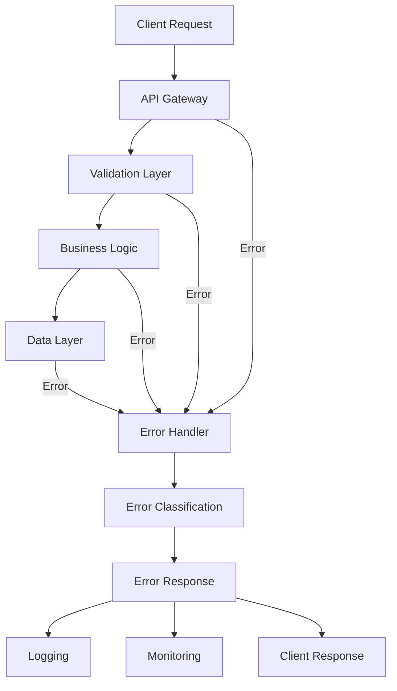
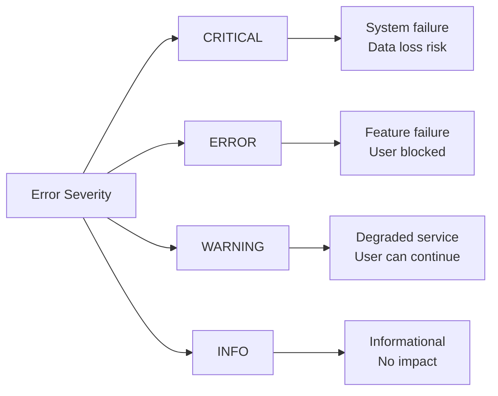

# Error Handling Guide

## 1. Error Handling Overview

### 1.1 Error Handling Architecture



### 1.2 Error Handling Principles

| Principle | Description | Implementation |
|-----------|-------------|----------------|
| **Consistency** | Uniform error format | Standard error schema |
| **Clarity** | Clear error messages | Human-readable descriptions |
| **Security** | No sensitive data exposure | Sanitized messages |
| **Actionability** | Guide user to resolution | Include help links |
| **Traceability** | Track error occurrence | Unique error IDs |
| **Graceful Degradation** | Maintain service availability | Fallback mechanisms |

## 2. Error Classification

### 2.1 Error Categories

```yaml
error_categories:
  client_errors:
    description: User/client-side errors
    http_codes: [400-499]
    examples:
      - Invalid input
      - Authentication failure
      - Resource not found
      - Rate limit exceeded
      
  server_errors:
    description: Server-side errors
    http_codes: [500-599]
    examples:
      - Database connection failure
      - Service unavailable
      - Internal logic error
      - Timeout
      
  business_errors:
    description: Business rule violations
    http_codes: [422]
    examples:
      - Insufficient funds
      - Out of stock
      - Order limit exceeded
      - Invalid coupon
```

### 2.2 Error Severity Levels



## 3. Standard Error Format

### 3.1 Error Response Schema

```json
{
  "error": {
    "code": "RESOURCE_NOT_FOUND",
    "message": "The requested product was not found",
    "status": 404,
    "timestamp": "2025-09-23T10:30:45.123Z",
    "path": "/api/v1/products/invalid-id",
    "requestId": "req_abc123xyz",
    "details": {
      "resource": "product",
      "id": "invalid-id",
      "suggestion": "Please check the product ID and try again"
    },
    "help": "https://api.techally.com/docs/errors/RESOURCE_NOT_FOUND"
  }
}
```

### 3.2 Error Response Fields

| Field | Type | Required | Description |
|-------|------|----------|-------------|
| `code` | string | Yes | Machine-readable error code |
| `message` | string | Yes | Human-readable error message |
| `status` | integer | Yes | HTTP status code |
| `timestamp` | string | Yes | ISO 8601 timestamp |
| `path` | string | Yes | Request path |
| `requestId` | string | Yes | Unique request identifier |
| `details` | object | No | Additional error details |
| `help` | string | No | Link to documentation |

## 4. Common Error Codes

### 4.1 Client Error Codes (4xx)

| HTTP Status | Error Code | Description | User Action |
|-------------|------------|-------------|-------------|
| 400 | `BAD_REQUEST` | Malformed request | Check request syntax |
| 400 | `INVALID_INPUT` | Invalid input data | Correct input values |
| 400 | `MISSING_PARAMETER` | Required parameter missing | Include all required fields |
| 401 | `UNAUTHORIZED` | Authentication required | Provide valid credentials |
| 401 | `TOKEN_EXPIRED` | Auth token expired | Refresh token |
| 403 | `FORBIDDEN` | Insufficient permissions | Check access rights |
| 404 | `NOT_FOUND` | Resource not found | Verify resource exists |
| 405 | `METHOD_NOT_ALLOWED` | HTTP method not supported | Use correct HTTP method |
| 409 | `CONFLICT` | Resource conflict | Resolve conflict |
| 422 | `UNPROCESSABLE_ENTITY` | Business rule violation | Follow business rules |
| 429 | `RATE_LIMITED` | Too many requests | Wait and retry |

### 4.2 Server Error Codes (5xx)

| HTTP Status | Error Code | Description | System Action |
|-------------|------------|-------------|---------------|
| 500 | `INTERNAL_ERROR` | Unexpected server error | Log and alert |
| 502 | `BAD_GATEWAY` | Upstream service error | Retry with backoff |
| 503 | `SERVICE_UNAVAILABLE` | Service temporarily down | Circuit breaker |
| 504 | `GATEWAY_TIMEOUT` | Upstream timeout | Increase timeout |
| 507 | `INSUFFICIENT_STORAGE` | Storage limit reached | Alert operations |

## 5. Error Handling Implementation

### 5.1 Express.js Error Middleware

```javascript
// errorHandler.js
class ApiError extends Error {
  constructor(statusCode, code, message, details = null) {
    super(message);
    this.statusCode = statusCode;
    this.code = code;
    this.details = details;
  }
  
  static badRequest(message, details) {
    return new ApiError(400, 'BAD_REQUEST', message, details);
  }
  
  static unauthorized(message) {
    return new ApiError(401, 'UNAUTHORIZED', message);
  }
  
  static forbidden(message) {
    return new ApiError(403, 'FORBIDDEN', message);
  }
  
  static notFound(resource, id) {
    return new ApiError(404, 'NOT_FOUND', 
      `${resource} not found`, { resource, id });
  }
  
  static internal(message) {
    return new ApiError(500, 'INTERNAL_ERROR', 
      'An internal error occurred', { debug: message });
  }
}

// Error handling middleware
const errorHandler = (err, req, res, next) => {
  let error = err;
  
  // Convert non-ApiError to ApiError
  if (!(error instanceof ApiError)) {
    error = ApiError.internal(err.message);
  }
  
  // Log error
  logger.error({
    error: {
      code: error.code,
      message: error.message,
      stack: error.stack,
      statusCode: error.statusCode,
      details: error.details
    },
    request: {
      method: req.method,
      url: req.url,
      headers: req.headers,
      body: req.body,
      ip: req.ip
    },
    timestamp: new Date().toISOString()
  });
  
  // Send error response
  res.status(error.statusCode).json({
    error: {
      code: error.code,
      message: error.message,
      status: error.statusCode,
      timestamp: new Date().toISOString(),
      path: req.path,
      requestId: req.id,
      details: error.details,
      help: `https://api.techally.com/docs/errors/${error.code}`
    }
  });
};
```

### 5.2 Async Error Handling

```javascript
// asyncHandler.js
const asyncHandler = (fn) => (req, res, next) => {
  Promise.resolve(fn(req, res, next)).catch(next);
};

// Usage in routes
router.get('/products/:id', asyncHandler(async (req, res) => {
  const product = await productService.getById(req.params.id);
  
  if (!product) {
    throw ApiError.notFound('Product', req.params.id);
  }
  
  res.json({ data: product });
}));
```

## 6. Validation Error Handling

### 6.1 Input Validation Errors

```javascript
// Joi validation example
const productSchema = Joi.object({
  name: Joi.string().min(3).max(255).required(),
  price: Joi.number().positive().required(),
  category: Joi.string().valid('electronics', 'clothing', 'books').required(),
  description: Joi.string().max(1000)
});

const validateProduct = (req, res, next) => {
  const { error, value } = productSchema.validate(req.body, {
    abortEarly: false,
    stripUnknown: true
  });
  
  if (error) {
    const details = error.details.map(detail => ({
      field: detail.path.join('.'),
      message: detail.message,
      type: detail.type
    }));
    
    throw new ApiError(400, 'VALIDATION_ERROR', 
      'The request contains invalid fields', { errors: details });
  }
  
  req.validatedBody = value;
  next();
};
```

### 6.2 Validation Error Response

```json
{
  "error": {
    "code": "VALIDATION_ERROR",
    "message": "The request contains invalid fields",
    "status": 400,
    "details": {
      "errors": [
        {
          "field": "price",
          "message": "\"price\" must be greater than 0",
          "type": "number.positive"
        },
        {
          "field": "category",
          "message": "\"category\" must be one of [electronics, clothing, books]",
          "type": "string.valid"
        }
      ]
    }
  }
}
```

## 7. Business Error Handling

### 7.1 Business Rule Violations

```javascript
// Business error examples
class BusinessError extends ApiError {
  constructor(code, message, details) {
    super(422, code, message, details);
  }
  
  static insufficientStock(productId, requested, available) {
    return new BusinessError(
      'INSUFFICIENT_STOCK',
      'The requested quantity is not available',
      { productId, requested, available }
    );
  }
  
  static orderLimitExceeded(limit) {
    return new BusinessError(
      'ORDER_LIMIT_EXCEEDED',
      `Order exceeds maximum limit of ${limit} items`,
      { limit }
    );
  }
  
  static invalidCoupon(couponCode, reason) {
    return new BusinessError(
      'INVALID_COUPON',
      'The coupon code is invalid or expired',
      { couponCode, reason }
    );
  }
}

// Usage
if (product.stock < quantity) {
  throw BusinessError.insufficientStock(
    product.id, 
    quantity, 
    product.stock
  );
}
```

## 8. Database Error Handling

### 8.1 Database Error Mapping

```javascript
const handleDatabaseError = (error) => {
  // PostgreSQL error codes
  switch (error.code) {
    case '23505': // Unique violation
      return new ApiError(409, 'DUPLICATE_RESOURCE', 
        'A resource with this identifier already exists', 
        { field: extractFieldFromError(error) });
        
    case '23503': // Foreign key violation
      return new ApiError(400, 'INVALID_REFERENCE', 
        'Referenced resource does not exist');
        
    case '23502': // Not null violation
      return new ApiError(400, 'MISSING_REQUIRED_FIELD', 
        'A required field is missing');
        
    case '22P02': // Invalid text representation
      return new ApiError(400, 'INVALID_DATA_FORMAT', 
        'Invalid data format');
        
    case '08006': // Connection failure
    case '08001': // Unable to connect
      return new ApiError(503, 'DATABASE_UNAVAILABLE', 
        'Database service is temporarily unavailable');
        
    default:
      return new ApiError(500, 'DATABASE_ERROR', 
        'A database error occurred');
  }
};
```

## 9. External Service Error Handling

### 9.1 Circuit Breaker Pattern

```javascript
class CircuitBreaker {
  constructor(options = {}) {
    this.failureThreshold = options.failureThreshold || 5;
    this.resetTimeout = options.resetTimeout || 60000;
    this.state = 'CLOSED';
    this.failureCount = 0;
    this.nextAttempt = Date.now();
  }
  
  async execute(operation) {
    if (this.state === 'OPEN') {
      if (Date.now() < this.nextAttempt) {
        throw new ApiError(503, 'SERVICE_UNAVAILABLE', 
          'Service is temporarily unavailable');
      }
      this.state = 'HALF_OPEN';
    }
    
    try {
      const result = await operation();
      this.onSuccess();
      return result;
    } catch (error) {
      this.onFailure();
      throw error;
    }
  }
  
  onSuccess() {
    this.failureCount = 0;
    this.state = 'CLOSED';
  }
  
  onFailure() {
    this.failureCount++;
    if (this.failureCount >= this.failureThreshold) {
      this.state = 'OPEN';
      this.nextAttempt = Date.now() + this.resetTimeout;
    }
  }
}

// Usage
const paymentCircuit = new CircuitBreaker({
  failureThreshold: 3,
  resetTimeout: 30000
});

const processPayment = async (paymentData) => {
  try {
    return await paymentCircuit.execute(async () => {
      return await paymentGateway.charge(paymentData);
    });
  } catch (error) {
    if (error.code === 'SERVICE_UNAVAILABLE') {
      // Try fallback payment provider
      return await fallbackPaymentProvider.charge(paymentData);
    }
    throw error;
  }
};
```

## 10. Error Logging and Monitoring

### 10.1 Structured Error Logging

```javascript
// Error logging with context
const logError = (error, context = {}) => {
  const errorLog = {
    timestamp: new Date().toISOString(),
    level: getErrorLevel(error),
    error: {
      name: error.name,
      message: error.message,
      code: error.code,
      statusCode: error.statusCode,
      stack: error.stack
    },
    context: {
      ...context,
      environment: process.env.NODE_ENV,
      service: 'api-service',
      version: process.env.APP_VERSION
    }
  };
  
  // Log to different destinations based on severity
  if (error.statusCode >= 500) {
    logger.error(errorLog);
    alertingService.sendAlert(errorLog);
  } else {
    logger.warn(errorLog);
  }
  
  // Send to monitoring service
  monitoringService.recordError(errorLog);
};
```

### 10.2 Error Metrics

```yaml
error_metrics:
  counters:
    - error_total: Total number of errors
    - error_by_type: Errors grouped by type
    - error_by_endpoint: Errors per endpoint
    
  gauges:
    - error_rate: Current error rate
    - availability: Service availability percentage
    
  histograms:
    - error_response_time: Time to generate error response
    - recovery_time: Time to recover from error
```

## 11. Error Recovery Strategies

### 11.1 Retry Logic

```javascript
const retryWithBackoff = async (
  operation, 
  maxRetries = 3, 
  baseDelay = 1000
) => {
  for (let i = 0; i < maxRetries; i++) {
    try {
      return await operation();
    } catch (error) {
      if (i === maxRetries - 1) throw error;
      
      // Exponential backoff with jitter
      const delay = baseDelay * Math.pow(2, i) + Math.random() * 1000;
      await new Promise(resolve => setTimeout(resolve, delay));
      
      logger.info(`Retry attempt ${i + 1}/${maxRetries} after ${delay}ms`);
    }
  }
};

// Usage
const result = await retryWithBackoff(
  () => externalService.call(data),
  3,
  1000
);
```

### 11.2 Graceful Degradation

```javascript
// Fallback mechanisms
const getProductWithFallback = async (productId) => {
  try {
    // Try primary data source
    return await primaryDB.getProduct(productId);
  } catch (error) {
    logger.warn('Primary DB failed, trying cache', error);
    
    try {
      // Try cache
      const cached = await cache.getProduct(productId);
      if (cached) {
        return { ...cached, fromCache: true };
      }
    } catch (cacheError) {
      logger.warn('Cache failed, trying read replica', cacheError);
    }
    
    try {
      // Try read replica
      return await replicaDB.getProduct(productId);
    } catch (replicaError) {
      logger.error('All data sources failed', replicaError);
      throw new ApiError(503, 'SERVICE_DEGRADED', 
        'Unable to retrieve product data');
    }
  }
};
```

## 12. Client Error Handling

### 12.1 Client-Side Error Handler

```javascript
// JavaScript client error handling
class ApiClient {
  async request(url, options = {}) {
    try {
      const response = await fetch(url, {
        ...options,
        headers: {
          'Content-Type': 'application/json',
          ...options.headers
        }
      });
      
      const data = await response.json();
      
      if (!response.ok) {
        throw new ApiError(data.error);
      }
      
      return data;
    } catch (error) {
      if (error instanceof ApiError) {
        this.handleApiError(error);
      } else {
        this.handleNetworkError(error);
      }
      throw error;
    }
  }
  
  handleApiError(error) {
    switch (error.code) {
      case 'UNAUTHORIZED':
        // Redirect to login
        window.location.href = '/login';
        break;
        
      case 'RATE_LIMITED':
        // Show rate limit message
        this.showNotification('Too many requests. Please wait.');
        break;
        
      case 'VALIDATION_ERROR':
        // Highlight invalid fields
        this.highlightErrors(error.details.errors);
        break;
        
      default:
        // Show generic error message
        this.showNotification(error.message);
    }
  }
  
  handleNetworkError(error) {
    this.showNotification('Network error. Please check your connection.');
  }
}
```

## 13. Error Documentation

### 13.1 Error Catalog

```markdown
## Error Reference

### INSUFFICIENT_STOCK
- **HTTP Status**: 422
- **Description**: The requested quantity exceeds available stock
- **Cause**: Attempting to order more items than available
- **Resolution**: Reduce quantity or wait for restock
- **Example**:
  ```json
  {
    "error": {
      "code": "INSUFFICIENT_STOCK",
      "message": "Only 5 items available",
      "details": {
        "requested": 10,
        "available": 5
      }
    }
  }
  ```
```

## 14. Testing Error Handling

### 14.1 Error Handling Tests

```javascript
describe('Error Handling Tests', () => {
  test('Returns 404 for non-existent resource', async () => {
    const response = await request(app)
      .get('/api/v1/products/non-existent');
    
    expect(response.status).toBe(404);
    expect(response.body.error.code).toBe('NOT_FOUND');
    expect(response.body.error.requestId).toBeDefined();
  });
  
  test('Returns 400 for invalid input', async () => {
    const response = await request(app)
      .post('/api/v1/products')
      .send({ price: -100 });
    
    expect(response.status).toBe(400);
    expect(response.body.error.code).toBe('VALIDATION_ERROR');
    expect(response.body.error.details.errors).toBeArray();
  });
  
  test('Handles database errors gracefully', async () => {
    // Simulate database failure
    jest.spyOn(db, 'query').mockRejectedValue(new Error('Connection lost'));
    
    const response = await request(app)
      .get('/api/v1/products');
    
    expect(response.status).toBe(503);
    expect(response.body.error.code).toBe('SERVICE_UNAVAILABLE');
  });
});
```

## 15. Best Practices

### 15.1 Error Handling Best Practices

| Practice | Description | Benefit |
|----------|-------------|---------|
| **Fail Fast** | Detect errors early | Prevent cascading failures |
| **Be Specific** | Clear error messages | Faster resolution |
| **Log Everything** | Comprehensive logging | Better debugging |
| **Don't Expose Internals** | Sanitize error messages | Security |
| **Use Standards** | HTTP status codes | Consistency |
| **Provide Context** | Include request ID | Traceability |
| **Document Errors** | Error catalog | Developer experience |
| **Monitor Errors** | Track error rates | Proactive fixes |

## 16. References

- [REST API Structure](./rest-api-structure.md) - `API-REST-001`
- [API Design Principles](./api-design-principles.md) - `API-DESIGN-001`
- [API Testing](../06_testing/api-testing.md) - `TEST-API-001`
- [Monitoring Guide](../08_devops/monitoring.md) - `MON-001`
- [Security Architecture](../03_architecture/security.md) - `SEC-001`

---
*This error handling guide is maintained by the API Development Team.*
