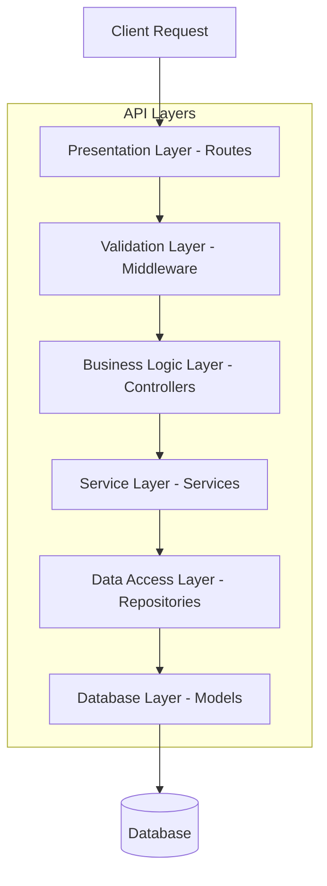

# REST API Structure and Standards

## 1. API Architecture Overview

### 1.1 RESTful Design Pattern



### 1.2 API Versioning Strategy

| Version | URL Pattern | Status | Sunset Date | Notes |
|---------|-------------|--------|-------------|-------|
| v1 | `/api/v1/*` | Current | - | Production |
| v2 | `/api/v2/*` | Beta | - | Testing |
| v0 | `/api/v0/*` | Deprecated | 2025-12-31 | Legacy support |

## 2. URL Structure and Naming Conventions

### 2.1 Resource Naming

```yaml
naming_conventions:
  resources:
    pattern: /api/{version}/{resource}/{id?}/{subresource?}
    rules:
      - Use plural nouns for collections
      - Use kebab-case for multi-word resources
      - Avoid verbs in URLs (use HTTP methods)
      - Keep URLs shallow (max 3 levels)
    
  examples:
    collections:
      - GET /api/v1/products
      - GET /api/v1/users
      - GET /api/v1/shopping-carts
    
    single_resource:
      - GET /api/v1/products/{id}
      - GET /api/v1/users/{id}
      - GET /api/v1/orders/{id}
    
    nested_resources:
      - GET /api/v1/users/{id}/addresses
      - GET /api/v1/products/{id}/reviews
      - GET /api/v1/orders/{id}/items
```

### 2.2 HTTP Methods Mapping

| Method | Operation | URL Pattern | Request Body | Idempotent | Safe |
|--------|-----------|-------------|--------------|------------|------|
| GET | Read | `/resource/{id}` | No | Yes | Yes |
| POST | Create | `/resource` | Yes | No | No |
| PUT | Full Update | `/resource/{id}` | Yes | Yes | No |
| PATCH | Partial Update | `/resource/{id}` | Yes | No | No |
| DELETE | Delete | `/resource/{id}` | No | Yes | No |
| HEAD | Headers Only | `/resource/{id}` | No | Yes | Yes |
| OPTIONS | Get Options | `/resource` | No | Yes | Yes |

## 3. Request/Response Structure

### 3.1 Standard Request Format

```json
{
  "headers": {
    "Content-Type": "application/json",
    "Accept": "application/json",
    "Authorization": "Bearer {token}",
    "X-Request-ID": "uuid-v4",
    "X-Client-Version": "1.0.0",
    "Accept-Language": "en-US"
  },
  "body": {
    "data": {
      "type": "product",
      "attributes": {
        "name": "Smart Watch Pro",
        "price": 299.99,
        "category": "wearables"
      }
    }
  }
}
```

### 3.2 Standard Response Format

```json
{
  "success": true,
  "data": {
    "type": "product",
    "id": "prod_123",
    "attributes": {
      "name": "Smart Watch Pro",
      "price": 299.99,
      "category": "wearables",
      "createdAt": "2025-09-23T10:00:00Z",
      "updatedAt": "2025-09-23T10:00:00Z"
    },
    "relationships": {
      "category": {
        "data": {
          "type": "category",
          "id": "cat_456"
        }
      },
      "reviews": {
        "links": {
          "self": "/api/v1/products/prod_123/reviews"
        }
      }
    }
  },
  "meta": {
    "timestamp": "2025-09-23T10:00:00Z",
    "version": "1.0.0",
    "requestId": "req_abc123"
  }
}
```

### 3.3 Error Response Format

```json
{
  "success": false,
  "error": {
    "code": "VALIDATION_ERROR",
    "message": "The request contains invalid parameters",
    "status": 400,
    "details": [
      {
        "field": "price",
        "message": "Price must be greater than 0",
        "code": "INVALID_PRICE"
      }
    ],
    "timestamp": "2025-09-23T10:00:00Z",
    "path": "/api/v1/products",
    "requestId": "req_xyz789"
  }
}
```

## 4. Query Parameters

### 4.1 Filtering

```http
# Simple filtering
GET /api/v1/products?category=electronics&brand=apple

# Comparison operators
GET /api/v1/products?price[gte]=100&price[lte]=500

# Array values
GET /api/v1/products?tags[]=smart&tags[]=wireless

# Date range
GET /api/v1/orders?createdAt[after]=2025-09-01&createdAt[before]=2025-09-30
```

### 4.2 Pagination

```http
# Offset-based pagination
GET /api/v1/products?page=2&limit=20

# Cursor-based pagination
GET /api/v1/products?cursor=eyJpZCI6MTIzfQ&limit=20

# Response includes pagination metadata
{
  "data": [...],
  "meta": {
    "pagination": {
      "total": 500,
      "page": 2,
      "limit": 20,
      "totalPages": 25,
      "hasNext": true,
      "hasPrev": true,
      "nextCursor": "eyJpZCI6MTQzfQ"
    }
  }
}
```

### 4.3 Sorting

```http
# Single field sorting
GET /api/v1/products?sort=price

# Descending order
GET /api/v1/products?sort=-price

# Multiple fields
GET /api/v1/products?sort=category,-price,name
```

### 4.4 Field Selection

```http
# Include specific fields
GET /api/v1/products?fields=id,name,price

# Exclude specific fields
GET /api/v1/products?exclude=description,metadata

# Include related resources
GET /api/v1/products?include=category,reviews
```

## 5. Status Codes

### 5.1 Success Codes

| Code | Status | Use Case | Example |
|------|--------|----------|---------|
| 200 | OK | Successful GET, PUT | Fetch resource |
| 201 | Created | Successful POST | Create resource |
| 202 | Accepted | Async processing | Queued for processing |
| 204 | No Content | Successful DELETE | Delete resource |
| 206 | Partial Content | Partial response | Range request |

### 5.2 Client Error Codes

| Code | Status | Use Case | Response |
|------|--------|----------|----------|
| 400 | Bad Request | Invalid syntax | Validation errors |
| 401 | Unauthorized | Missing/invalid auth | Auth required |
| 403 | Forbidden | Insufficient permissions | Access denied |
| 404 | Not Found | Resource doesn't exist | Resource not found |
| 405 | Method Not Allowed | Wrong HTTP method | Method not supported |
| 409 | Conflict | Resource conflict | Duplicate entry |
| 422 | Unprocessable Entity | Business rule violation | Business error |
| 429 | Too Many Requests | Rate limit exceeded | Retry after X seconds |

### 5.3 Server Error Codes

| Code | Status | Use Case | Action |
|------|--------|----------|--------|
| 500 | Internal Server Error | Unexpected error | Log and investigate |
| 502 | Bad Gateway | Upstream error | Retry |
| 503 | Service Unavailable | Maintenance/overload | Retry later |
| 504 | Gateway Timeout | Upstream timeout | Retry with backoff |

## 6. Authentication & Authorization

### 6.1 Authentication Methods

```yaml
authentication:
  bearer_token:
    header: "Authorization: Bearer {jwt_token}"
    expiry: 3600  # 1 hour
    refresh: true
    
  api_key:
    header: "X-API-Key: {api_key}"
    usage: service-to-service
    
  oauth2:
    flows:
      - authorization_code
      - client_credentials
    providers:
      - google
      - github
      - facebook
```

### 6.2 Authorization Patterns

```javascript
// Resource-based authorization
{
  "endpoint": "GET /api/v1/users/{id}/profile",
  "rules": [
    {
      "condition": "user.id === resource.owner_id",
      "allow": true
    },
    {
      "condition": "user.role === 'admin'",
      "allow": true
    }
  ]
}

// Role-based authorization
{
  "endpoint": "POST /api/v1/products",
  "required_roles": ["admin", "product_manager"],
  "required_scopes": ["products:write"]
}
```

## 7. API Rate Limiting

### 7.1 Rate Limit Configuration

```yaml
rate_limits:
  anonymous:
    requests_per_minute: 60
    requests_per_hour: 1000
    burst: 10
    
  authenticated:
    requests_per_minute: 600
    requests_per_hour: 10000
    burst: 50
    
  premium:
    requests_per_minute: 1200
    requests_per_hour: 20000
    burst: 100
```

### 7.2 Rate Limit Headers

```http
HTTP/1.1 200 OK
X-RateLimit-Limit: 600
X-RateLimit-Remaining: 598
X-RateLimit-Reset: 1695463200
X-RateLimit-Retry-After: 60
X-RateLimit-Burst-Limit: 50
X-RateLimit-Burst-Remaining: 49
```

## 8. Content Negotiation

### 8.1 Supported Formats

```yaml
content_types:
  request:
    - application/json
    - application/x-www-form-urlencoded
    - multipart/form-data
    
  response:
    - application/json
    - application/xml
    - text/csv
    - application/pdf
```

### 8.2 Content Type Headers

```http
# Request specific format
GET /api/v1/reports/123
Accept: application/pdf

# Language negotiation
GET /api/v1/products
Accept-Language: es-ES,es;q=0.9,en;q=0.8

# Compression
GET /api/v1/products
Accept-Encoding: gzip, deflate, br
```

## 9. Caching Strategy

### 9.1 Cache Headers

```http
# Response caching
HTTP/1.1 200 OK
Cache-Control: public, max-age=3600
ETag: "abc123"
Last-Modified: Wed, 23 Sep 2025 10:00:00 GMT
Vary: Accept-Encoding, Accept-Language

# Conditional requests
GET /api/v1/products/123
If-None-Match: "abc123"
If-Modified-Since: Wed, 23 Sep 2025 10:00:00 GMT
```

### 9.2 Cache Strategies

| Resource Type | Cache Strategy | TTL | Invalidation |
|---------------|----------------|-----|--------------|
| Static data | Public cache | 1 day | Manual |
| Product catalog | Public cache | 1 hour | On update |
| User data | Private cache | 5 min | On change |
| Real-time data | No cache | - | - |

## 10. Bulk Operations

### 10.1 Batch Requests

```json
POST /api/v1/batch
{
  "operations": [
    {
      "method": "POST",
      "path": "/products",
      "body": {
        "name": "Product 1",
        "price": 99.99
      }
    },
    {
      "method": "PUT",
      "path": "/products/123",
      "body": {
        "price": 89.99
      }
    },
    {
      "method": "DELETE",
      "path": "/products/456"
    }
  ]
}
```

### 10.2 Bulk Response

```json
{
  "results": [
    {
      "index": 0,
      "status": 201,
      "body": {
        "id": "prod_789",
        "name": "Product 1"
      }
    },
    {
      "index": 1,
      "status": 200,
      "body": {
        "id": "prod_123",
        "price": 89.99
      }
    },
    {
      "index": 2,
      "status": 204,
      "body": null
    }
  ]
}
```

## 11. Webhooks

### 11.1 Webhook Configuration

```json
{
  "url": "https://client.example.com/webhooks",
  "events": [
    "order.created",
    "order.updated",
    "payment.completed"
  ],
  "headers": {
    "X-Webhook-Secret": "secret_key"
  },
  "retry": {
    "max_attempts": 3,
    "backoff": "exponential"
  }
}
```

### 11.2 Webhook Payload

```json
{
  "id": "evt_123",
  "type": "order.created",
  "timestamp": "2025-09-23T10:00:00Z",
  "data": {
    "order_id": "ord_456",
    "amount": 299.99,
    "status": "pending"
  },
  "signature": "sha256=abc123..."
}
```

## 12. API Documentation

### 12.1 OpenAPI Specification

```yaml
openapi: 3.0.0
info:
  title: TechAlly API
  version: 1.0.0
  description: E-commerce API for smart devices
  
servers:
  - url: https://api.techally.com/v1
    description: Production
  - url: https://staging-api.techally.com/v1
    description: Staging
    
paths:
  /products:
    get:
      summary: List products
      parameters:
        - name: category
          in: query
          schema:
            type: string
      responses:
        '200':
          description: Success
          content:
            application/json:
              schema:
                $ref: '#/components/schemas/ProductList'
```

## 13. Testing Endpoints

### 13.1 Health Check

```http
GET /api/v1/health

Response:
{
  "status": "healthy",
  "timestamp": "2025-09-23T10:00:00Z",
  "services": {
    "database": "healthy",
    "redis": "healthy",
    "elasticsearch": "healthy"
  }
}
```

### 13.2 API Info

```http
GET /api/v1/info

Response:
{
  "version": "1.0.0",
  "environment": "production",
  "uptime": 3600,
  "features": {
    "authentication": true,
    "websocket": true,
    "graphql": false
  }
}
```

## 14. References

- [API Design Principles](./api-design-principles.md) - `API-DESIGN-001`
- [API Reference](./api-reference.md) - `API-001`
- [Authentication Guide](./auth-guide.md) - `AUTH-001`
- [Error Handling](./error-handling.md) - `ERR-001`
- [Functional Requirements](../02_requirements/functional-requirements.md) - `REQ-FR-001`

---
*This REST API structure document is maintained by the API Development Team.*
