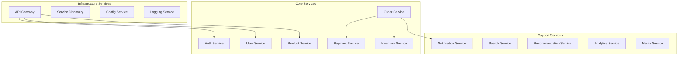
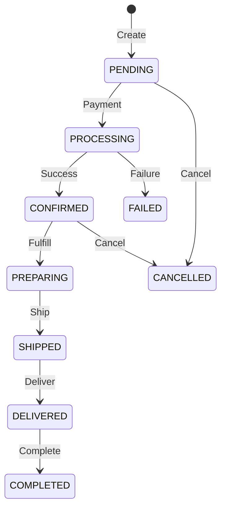
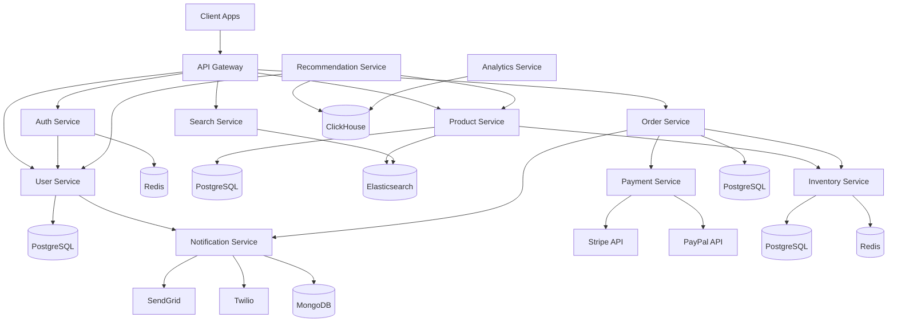

# Microservices Catalog

## 1. Service Overview

### 1.1 Service Architecture Map



### 1.2 Service Communication Matrix

| Service | Sync Dependencies | Async Dependencies | Database | Cache |
|---------|------------------|-------------------|----------|-------|
| Auth Service | User Service | - | PostgreSQL | Redis |
| User Service | - | Notification | PostgreSQL | Redis |
| Product Service | Inventory | Analytics | PostgreSQL | Redis |
| Order Service | Payment, Inventory | Notification | PostgreSQL | Redis |
| Payment Service | - | Analytics | PostgreSQL | - |
| Inventory Service | - | Analytics | PostgreSQL | Redis |
| Notification Service | - | - | MongoDB | - |
| Search Service | Product Service | - | Elasticsearch | - |
| Recommendation Service | User, Product | Analytics | PostgreSQL | Redis |

## 2. Core Services

### 2.1 Auth Service

**Service ID**: `SVC-AUTH-001`  
**Repository**: `/services/auth-service`  
**Port**: 3001  
**Technology**: Node.js, Express, JWT

#### 2.1.1 Responsibilities
- User authentication
- JWT token generation and validation
- Session management
- Password reset
- MFA/2FA support
- OAuth integration

#### 2.1.2 API Endpoints

| Method | Endpoint | Description | Auth |
|--------|----------|-------------|------|
| POST | /auth/register | User registration | No |
| POST | /auth/login | User login | No |
| POST | /auth/logout | User logout | Yes |
| POST | /auth/refresh | Refresh token | Yes |
| POST | /auth/verify | Email verification | No |
| POST | /auth/password/reset | Password reset | No |

#### 2.1.3 Dependencies
```yaml
dependencies:
  internal:
    - user-service: User data validation
  external:
    - redis: Session storage
    - postgres: User credentials
    - sendgrid: Email notifications
    - auth0: OAuth provider
```

#### 2.1.4 Configuration
```yaml
auth-service:
  jwt:
    secret: ${JWT_SECRET}
    expiresIn: 1h
    refreshExpiresIn: 7d
  session:
    maxAge: 86400000
    secure: true
  password:
    minLength: 12
    maxAttempts: 5
    lockoutDuration: 1800
```

### 2.2 User Service

**Service ID**: `SVC-USER-001`  
**Repository**: `/services/user-service`  
**Port**: 3002  
**Technology**: Node.js, Express

#### 2.2.1 Responsibilities
- User profile management
- Address management
- Preference management
- User activity tracking
- Account settings
- GDPR compliance

#### 2.2.2 API Endpoints

| Method | Endpoint | Description | Auth |
|--------|----------|-------------|------|
| GET | /users/me | Get current user | Yes |
| PUT | /users/me | Update profile | Yes |
| DELETE | /users/me | Delete account | Yes |
| GET | /users/me/addresses | List addresses | Yes |
| POST | /users/me/addresses | Add address | Yes |
| GET | /users/me/preferences | Get preferences | Yes |

#### 2.2.3 Event Publishing
```yaml
events:
  published:
    - user.created
    - user.updated
    - user.deleted
    - address.added
    - address.updated
    - preferences.changed
```

### 2.3 Product Service

**Service ID**: `SVC-PROD-001`  
**Repository**: `/services/product-service`  
**Port**: 3003  
**Technology**: Node.js, GraphQL

#### 2.3.1 Responsibilities
- Product catalog management
- Category management
- Product variants
- Pricing management
- Product reviews
- Product recommendations

#### 2.3.2 GraphQL Schema
```graphql
type Query {
  product(id: ID!): Product
  products(filter: ProductFilter, pagination: Pagination): ProductConnection
  categories: [Category!]!
  searchProducts(query: String!): [Product!]!
}

type Mutation {
  createProduct(input: ProductInput!): Product
  updateProduct(id: ID!, input: ProductInput!): Product
  deleteProduct(id: ID!): Boolean
  addReview(productId: ID!, review: ReviewInput!): Review
}

type Product {
  id: ID!
  sku: String!
  name: String!
  description: String!
  price: Price!
  category: Category!
  images: [Image!]!
  variants: [ProductVariant!]
  reviews: ReviewConnection
  inventory: Inventory
}
```

### 2.4 Order Service

**Service ID**: `SVC-ORD-001`  
**Repository**: `/services/order-service`  
**Port**: 3004  
**Technology**: Node.js, Express

#### 2.4.1 Responsibilities
- Order creation and management
- Order status tracking
- Order fulfillment coordination
- Returns and refunds
- Order history
- Invoice generation

#### 2.4.2 Order State Machine


#### 2.4.3 Service Integration
```yaml
integrations:
  sync:
    payment-service:
      - processPayment
      - refundPayment
    inventory-service:
      - reserveStock
      - releaseStock
  async:
    notification-service:
      - orderConfirmation
      - statusUpdate
    analytics-service:
      - orderMetrics
```

### 2.5 Payment Service

**Service ID**: `SVC-PAY-001`  
**Repository**: `/services/payment-service`  
**Port**: 3005  
**Technology**: Node.js, Express

#### 2.5.1 Responsibilities
- Payment processing
- Payment method management
- Refund processing
- Payment validation
- PCI compliance
- Fraud detection

#### 2.5.2 Payment Providers
```yaml
providers:
  stripe:
    enabled: true
    api_version: "2023-10-16"
    webhook_secret: ${STRIPE_WEBHOOK_SECRET}
  paypal:
    enabled: true
    mode: production
  apple_pay:
    enabled: true
    merchant_id: ${APPLE_MERCHANT_ID}
```

### 2.6 Inventory Service

**Service ID**: `SVC-INV-001`  
**Repository**: `/services/inventory-service`  
**Port**: 3006  
**Technology**: Node.js, Express

#### 2.6.1 Responsibilities
- Stock level management
- Stock reservation
- Warehouse management
- Stock movements tracking
- Reorder management
- Stock alerts

#### 2.6.2 Stock Operations
```yaml
operations:
  reserve:
    timeout: 30s
    rollback: automatic
  release:
    trigger: order_cancelled
  adjust:
    authorization: admin_only
  transfer:
    validation: source_availability
  reorder:
    automatic: true
    threshold: 20%
```

## 3. Support Services

### 3.1 Notification Service

**Service ID**: `SVC-NOTIF-001`  
**Repository**: `/services/notification-service`  
**Port**: 3007  
**Technology**: Node.js, Bull Queue

#### 3.1.1 Responsibilities
- Email notifications
- SMS notifications
- Push notifications
- In-app notifications
- Template management
- Delivery tracking

#### 3.1.2 Notification Types
```yaml
notifications:
  transactional:
    - order_confirmation
    - shipping_update
    - password_reset
    - account_verification
  marketing:
    - promotional
    - newsletter
    - abandoned_cart
  system:
    - security_alert
    - maintenance_notice
```

### 3.2 Search Service

**Service ID**: `SVC-SEARCH-001`  
**Repository**: `/services/search-service`  
**Port**: 3008  
**Technology**: Node.js, Elasticsearch

#### 3.2.1 Responsibilities
- Full-text search
- Faceted search
- Search suggestions
- Search analytics
- Index management
- Synonym management

#### 3.2.2 Search Configuration
```yaml
elasticsearch:
  indices:
    products:
      shards: 3
      replicas: 2
      refresh_interval: 1s
    users:
      shards: 1
      replicas: 1
  analyzers:
    - standard
    - keyword
    - ngram
  features:
    - fuzzy_matching
    - synonyms
    - stemming
```

### 3.3 Recommendation Service

**Service ID**: `SVC-REC-001`  
**Repository**: `/services/recommendation-service`  
**Port**: 3009  
**Technology**: Python, TensorFlow

#### 3.3.1 Responsibilities
- Product recommendations
- Personalized content
- Similar products
- Trending products
- User segmentation
- A/B testing

#### 3.3.2 ML Models
```yaml
models:
  collaborative_filtering:
    algorithm: matrix_factorization
    update_frequency: daily
  content_based:
    algorithm: cosine_similarity
    features: [category, brand, price, attributes]
  hybrid:
    weight_collaborative: 0.6
    weight_content: 0.4
```

### 3.4 Analytics Service

**Service ID**: `SVC-ANALYT-001`  
**Repository**: `/services/analytics-service`  
**Port**: 3010  
**Technology**: Node.js, ClickHouse

#### 3.4.1 Responsibilities
- Event tracking
- Metrics aggregation
- Report generation
- Real-time dashboards
- Custom analytics
- Data export

#### 3.4.2 Metrics Collection
```yaml
metrics:
  business:
    - revenue
    - orders
    - conversion_rate
    - average_order_value
  performance:
    - page_load_time
    - api_response_time
    - error_rate
  user:
    - sessions
    - page_views
    - bounce_rate
    - retention
```

## 4. Infrastructure Services

### 4.1 API Gateway

**Service ID**: `SVC-GW-001`  
**Technology**: Kong / AWS API Gateway  
**Port**: 8080

#### 4.1.1 Features
- Request routing
- Authentication/Authorization
- Rate limiting
- Request/Response transformation
- Caching
- Monitoring

#### 4.1.2 Route Configuration
```yaml
routes:
  - path: /api/v1/auth
    service: auth-service
    methods: [GET, POST, PUT, DELETE]
    rate_limit: 100/minute
  - path: /api/v1/users
    service: user-service
    methods: [GET, POST, PUT, DELETE]
    auth: required
  - path: /api/v1/products
    service: product-service
    methods: [GET]
    cache: 5m
```

### 4.2 Service Discovery

**Service ID**: `SVC-DISC-001`  
**Technology**: Consul / Kubernetes Service Discovery

#### 4.2.1 Service Registration
```yaml
service:
  name: product-service
  id: product-service-1
  address: 10.0.1.10
  port: 3003
  tags:
    - primary
    - v1.0.0
  health_check:
    interval: 10s
    timeout: 5s
    path: /health
```

## 5. Service Health and Monitoring

### 5.1 Health Check Endpoints

| Service | Health Endpoint | Ready Endpoint | Metrics Endpoint |
|---------|----------------|----------------|------------------|
| Auth | /health | /ready | /metrics |
| User | /health | /ready | /metrics |
| Product | /health | /ready | /metrics |
| Order | /health | /ready | /metrics |
| Payment | /health | /ready | /metrics |
| Inventory | /health | /ready | /metrics |

### 5.2 Service Level Objectives (SLOs)

```yaml
slos:
  availability:
    target: 99.9%
    window: 30d
  latency:
    p50: 100ms
    p95: 500ms
    p99: 1000ms
  error_rate:
    target: <1%
    window: 1h
```

## 6. Service Dependencies Graph



## 7. Service Deployment Configuration

### 7.1 Container Configuration

```yaml
services:
  auth-service:
    image: techally/auth-service:1.0.0
    replicas: 3
    resources:
      requests:
        cpu: 250m
        memory: 256Mi
      limits:
        cpu: 500m
        memory: 512Mi
    env:
      NODE_ENV: production
      PORT: 3001
    health_check:
      path: /health
      interval: 30s
      timeout: 5s
      retries: 3
```

## 8. Service Documentation Links

| Service | API Docs | Source Code | Runbook | Owner |
|---------|----------|-------------|---------|-------|
| Auth | [API](./auth-api.md) | [GitHub](https://github.com/techally/auth-service) | [Runbook](../devops/runbooks/auth-service.md) | Auth Team |
| User | [API](./user-api.md) | [GitHub](https://github.com/techally/user-service) | [Runbook](../devops/runbooks/user-service.md) | User Team |
| Product | [API](./product-api.md) | [GitHub](https://github.com/techally/product-service) | [Runbook](../devops/runbooks/product-service.md) | Product Team |
| Order | [API](./order-api.md) | [GitHub](https://github.com/techally/order-service) | [Runbook](../devops/runbooks/order-service.md) | Order Team |
| Payment | [API](./payment-api.md) | [GitHub](https://github.com/techally/payment-service) | [Runbook](../devops/runbooks/payment-service.md) | Payment Team |

## 9. References

- [Microservices Architecture](../architecture/system-overview.md) - `ARCH-001`
- [API Reference](./api-reference.md) - `API-001`
- [Deployment Guide](../devops/deployment-guide.md) - `DEVOPS-001`
- [Service Mesh Configuration](../devops/service-mesh.md) - `MESH-001`

---
*This service catalog is maintained by the Architecture Team and is updated with each service change.*
