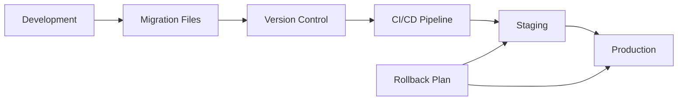

# Database Migration Guide

## 1. Migration Strategy

### 1.1 Overview



### 1.2 Migration Principles

| Principle | Description |
|-----------|-------------|
| **Version Control** | All migrations tracked in Git |
| **Forward-Only** | No modification of existing migrations |
| **Atomic** | Each migration is a complete unit |
| **Reversible** | Include rollback scripts |
| **Tested** | Validate in staging first |
| **Documented** | Clear description and impact |

## 2. Migration Tools

### 2.1 Flyway Configuration

```javascript
// flyway.config.js
module.exports = {
  flywayArgs: {
    url: process.env.DATABASE_URL,
    schemas: 'public',
    locations: 'filesystem:./migrations',
    user: process.env.DB_USER,
    password: process.env.DB_PASSWORD,
    connectRetries: 3,
    cleanDisabled: true,
    baselineOnMigrate: true,
    validateOnMigrate: true,
    placeholders: {
      environment: process.env.NODE_ENV
    }
  },
  
  // Migration naming convention
  convention: 'V{version}__{description}.sql',
  
  // Environments
  environments: {
    development: {
      schemas: 'public,test'
    },
    staging: {
      schemas: 'public'
    },
    production: {
      schemas: 'public',
      outOfOrder: false,
      cleanDisabled: true
    }
  }
};
```

### 2.2 Migration CLI Commands

```bash
# Check migration status
npm run db:status

# Run pending migrations
npm run db:migrate

# Validate migrations
npm run db:validate

# Create new migration
npm run db:create -- --name=add_user_preferences

# Rollback last migration (dev only)
npm run db:rollback

# Reset database (dev only)
npm run db:reset
```

## 3. Migration Files Structure

### 3.1 File Organization

```
migrations/
├── V001__initial_schema.sql
├── V002__create_users.sql
├── V003__create_products.sql
├── V004__create_orders.sql
├── V005__add_indexes.sql
├── V006__add_constraints.sql
├── R__views.sql              # Repeatable migrations
├── R__functions.sql
├── rollback/
│   ├── V001__rollback.sql
│   ├── V002__rollback.sql
│   └── ...
└── seeds/
    ├── development.sql
    ├── staging.sql
    └── test.sql
```

### 3.2 Migration Template

```sql
-- V{VERSION}__{DESCRIPTION}.sql
-- Author: {AUTHOR}
-- Date: {DATE}
-- Description: {DETAILED_DESCRIPTION}
-- Rollback: migrations/rollback/V{VERSION}__rollback.sql

-- ============================================
-- Migration Start
-- ============================================

BEGIN;

-- Create tables
CREATE TABLE IF NOT EXISTS {table_name} (
    id UUID PRIMARY KEY DEFAULT gen_random_uuid(),
    -- columns
    created_at TIMESTAMP WITH TIME ZONE DEFAULT NOW(),
    updated_at TIMESTAMP WITH TIME ZONE DEFAULT NOW()
);

-- Add indexes
CREATE INDEX CONCURRENTLY IF NOT EXISTS idx_{table}_{column} 
ON {table}({column});

-- Add constraints
ALTER TABLE {table} 
ADD CONSTRAINT {constraint_name} 
CHECK ({condition});

-- Data migration
UPDATE {table} 
SET {column} = {value} 
WHERE {condition};

-- Verify migration
DO $$
BEGIN
    -- Validation checks
    IF NOT EXISTS (
        SELECT 1 FROM information_schema.tables 
        WHERE table_name = '{table_name}'
    ) THEN
        RAISE EXCEPTION 'Migration failed: table not created';
    END IF;
END $$;

COMMIT;

-- ============================================
-- Migration End
-- ============================================
```

## 4. Common Migration Patterns

### 4.1 Adding Columns

```sql
-- V007__add_user_preferences.sql
BEGIN;

-- Add column with default
ALTER TABLE users 
ADD COLUMN IF NOT EXISTS preferences JSONB DEFAULT '{}';

-- Backfill existing data
UPDATE users 
SET preferences = '{"theme": "light", "notifications": true}'::jsonb
WHERE preferences = '{}'::jsonb;

-- Add NOT NULL after backfill
ALTER TABLE users 
ALTER COLUMN preferences SET NOT NULL;

COMMIT;
```

### 4.2 Renaming Columns

```sql
-- V008__rename_product_title.sql
BEGIN;

-- Add new column
ALTER TABLE products 
ADD COLUMN IF NOT EXISTS name VARCHAR(255);

-- Copy data
UPDATE products 
SET name = title 
WHERE name IS NULL;

-- Add constraints to new column
ALTER TABLE products 
ALTER COLUMN name SET NOT NULL;

-- Create indexes on new column
CREATE INDEX CONCURRENTLY idx_products_name 
ON products(name);

-- Drop old column (in next migration after app deployment)
-- ALTER TABLE products DROP COLUMN title;

COMMIT;
```

### 4.3 Adding Indexes

```sql
-- V009__add_performance_indexes.sql

-- Use CONCURRENTLY to avoid locking
CREATE INDEX CONCURRENTLY IF NOT EXISTS idx_orders_user_created 
ON orders(user_id, created_at DESC);

CREATE INDEX CONCURRENTLY IF NOT EXISTS idx_products_search 
ON products USING GIN(to_tsvector('english', name || ' ' || description));

-- Partial indexes for common queries
CREATE INDEX CONCURRENTLY IF NOT EXISTS idx_orders_pending 
ON orders(created_at) 
WHERE status = 'pending';
```

### 4.4 Data Type Changes

```sql
-- V010__change_price_precision.sql
BEGIN;

-- Add new column with new type
ALTER TABLE products 
ADD COLUMN price_new DECIMAL(12, 4);

-- Migrate data with conversion
UPDATE products 
SET price_new = price::DECIMAL(12, 4);

-- Rename columns
ALTER TABLE products 
RENAME COLUMN price TO price_old;

ALTER TABLE products 
RENAME COLUMN price_new TO price;

-- Drop old column after verification
-- ALTER TABLE products DROP COLUMN price_old;

COMMIT;
```

## 5. Complex Migrations

### 5.1 Table Partitioning

```sql
-- V011__partition_order_history.sql
BEGIN;

-- Create partitioned table
CREATE TABLE order_status_history_new (
    LIKE order_status_history INCLUDING ALL
) PARTITION BY RANGE (created_at);

-- Create partitions
CREATE TABLE order_status_history_2024_01 
PARTITION OF order_status_history_new 
FOR VALUES FROM ('2024-01-01') TO ('2024-02-01');

CREATE TABLE order_status_history_2024_02 
PARTITION OF order_status_history_new 
FOR VALUES FROM ('2024-02-01') TO ('2024-03-01');

-- Migrate data
INSERT INTO order_status_history_new 
SELECT * FROM order_status_history;

-- Swap tables
ALTER TABLE order_status_history RENAME TO order_status_history_old;
ALTER TABLE order_status_history_new RENAME TO order_status_history;

-- Clean up (after verification)
-- DROP TABLE order_status_history_old;

COMMIT;
```

### 5.2 Schema Refactoring

```sql
-- V012__split_user_profile.sql
BEGIN;

-- Create new tables
CREATE TABLE user_profiles (
    id UUID PRIMARY KEY DEFAULT gen_random_uuid(),
    user_id UUID NOT NULL REFERENCES users(id),
    first_name VARCHAR(100),
    last_name VARCHAR(100),
    bio TEXT,
    avatar_url VARCHAR(500),
    created_at TIMESTAMP WITH TIME ZONE DEFAULT NOW()
);

CREATE TABLE user_settings (
    id UUID PRIMARY KEY DEFAULT gen_random_uuid(),
    user_id UUID NOT NULL REFERENCES users(id),
    preferences JSONB DEFAULT '{}',
    notifications_enabled BOOLEAN DEFAULT true,
    created_at TIMESTAMP WITH TIME ZONE DEFAULT NOW()
);

-- Migrate data
INSERT INTO user_profiles (user_id, first_name, last_name, bio, avatar_url)
SELECT id, first_name, last_name, bio, avatar_url 
FROM users;

INSERT INTO user_settings (user_id, preferences, notifications_enabled)
SELECT id, preferences, notifications_enabled 
FROM users;

-- Add indexes
CREATE INDEX idx_user_profiles_user_id ON user_profiles(user_id);
CREATE INDEX idx_user_settings_user_id ON user_settings(user_id);

-- Drop columns from original table (in next migration)
-- ALTER TABLE users DROP COLUMN first_name, ...;

COMMIT;
```

## 6. Performance Optimization

### 6.1 Index Strategy

```sql
-- V013__optimize_indexes.sql

-- Remove redundant indexes
DROP INDEX IF EXISTS idx_orders_created_at;
DROP INDEX IF EXISTS idx_orders_user_id;

-- Create compound index that covers both
CREATE INDEX CONCURRENTLY idx_orders_user_created 
ON orders(user_id, created_at DESC);

-- Analyze tables after index creation
ANALYZE orders;
```

### 6.2 Vacuum and Analyze

```sql
-- V014__maintenance_operations.sql

-- Update statistics
ANALYZE;

-- Maintenance script (not in migration, scheduled job)
-- VACUUM ANALYZE orders;
-- REINDEX TABLE orders;
```

## 7. Rollback Procedures

### 7.1 Rollback Script Template

```sql
-- rollback/V{VERSION}__rollback.sql
-- Rollback for: V{VERSION}__{DESCRIPTION}.sql
-- Author: {AUTHOR}
-- Date: {DATE}

BEGIN;

-- Reverse operations in opposite order

-- Drop added constraints
ALTER TABLE {table} 
DROP CONSTRAINT IF EXISTS {constraint_name};

-- Drop added indexes
DROP INDEX IF EXISTS idx_{table}_{column};

-- Drop added columns
ALTER TABLE {table} 
DROP COLUMN IF EXISTS {column};

-- Drop added tables
DROP TABLE IF EXISTS {table} CASCADE;

-- Restore previous state
UPDATE {table} 
SET {column} = {old_value} 
WHERE {condition};

COMMIT;
```

### 7.2 Emergency Rollback Process

```bash
#!/bin/bash
# emergency_rollback.sh

# Stop application
kubectl scale deployment api --replicas=0

# Create backup
pg_dump $DATABASE_URL > backup_$(date +%Y%m%d_%H%M%S).sql

# Run rollback migration
psql $DATABASE_URL < migrations/rollback/V${VERSION}__rollback.sql

# Verify rollback
psql $DATABASE_URL -c "SELECT * FROM flyway_schema_history ORDER BY installed_rank DESC LIMIT 1;"

# Restart application with previous version
kubectl set image deployment/api api=techally:$PREVIOUS_VERSION
kubectl scale deployment api --replicas=3
```

## 8. Testing Migrations

### 8.1 Migration Test Suite

```javascript
// test/migrations.test.js
const { execSync } = require('child_process');
const { Pool } = require('pg');

describe('Database Migrations', () => {
  let pool;
  
  beforeAll(async () => {
    // Create test database
    execSync('createdb techally_test');
    pool = new Pool({ database: 'techally_test' });
  });
  
  afterAll(async () => {
    await pool.end();
    execSync('dropdb techally_test');
  });
  
  test('All migrations should run successfully', async () => {
    // Run migrations
    execSync('npm run db:migrate -- --env=test');
    
    // Verify schema
    const tables = await pool.query(`
      SELECT table_name 
      FROM information_schema.tables 
      WHERE table_schema = 'public'
    `);
    
    expect(tables.rows).toContainEqual({ table_name: 'users' });
    expect(tables.rows).toContainEqual({ table_name: 'products' });
    expect(tables.rows).toContainEqual({ table_name: 'orders' });
  });
  
  test('Rollback should work', async () => {
    // Run specific rollback
    execSync('psql techally_test -f migrations/rollback/V003__rollback.sql');
    
    // Verify rollback
    const tables = await pool.query(`
      SELECT table_name 
      FROM information_schema.tables 
      WHERE table_name = 'orders'
    `);
    
    expect(tables.rows).toHaveLength(0);
  });
});
```

### 8.2 Performance Testing

```sql
-- test/performance/migration_performance.sql
-- Test migration performance impact

-- Before migration
EXPLAIN (ANALYZE, BUFFERS) 
SELECT * FROM orders 
WHERE user_id = '123' 
ORDER BY created_at DESC 
LIMIT 10;

-- Run migration
-- ... migration SQL ...

-- After migration
EXPLAIN (ANALYZE, BUFFERS) 
SELECT * FROM orders 
WHERE user_id = '123' 
ORDER BY created_at DESC 
LIMIT 10;

-- Compare execution times
```

## 9. Best Practices

### 9.1 Migration Checklist

- [ ] Migration is atomic (wrapped in transaction)
- [ ] Includes rollback script
- [ ] Tested in development environment
- [ ] Performance impact assessed
- [ ] No breaking changes for running application
- [ ] Indexes created CONCURRENTLY
- [ ] Large data updates batched
- [ ] Migration documented
- [ ] Peer reviewed
- [ ] Backup plan in place

### 9.2 Common Pitfalls

| Pitfall | Solution |
|---------|----------|
| **Table locks** | Use CONCURRENTLY for index creation |
| **Breaking changes** | Use blue-green deployments |
| **Large data updates** | Batch updates, use background jobs |
| **Missing rollback** | Always create rollback scripts |
| **Untested migrations** | Test in staging first |
| **No validation** | Add verification checks |

## 10. Monitoring and Alerts

### 10.1 Migration Monitoring

```javascript
// monitoring/migration-monitor.js
const monitoring = {
  preMigration: async () => {
    // Record current state
    await metrics.gauge('db.table_count', tableCount);
    await metrics.gauge('db.index_count', indexCount);
    await metrics.gauge('db.size_mb', dbSize);
  },
  
  postMigration: async () => {
    // Check migration success
    const migrationTime = Date.now() - startTime;
    await metrics.histogram('db.migration_duration', migrationTime);
    
    // Alert if migration took too long
    if (migrationTime > 60000) {
      await alerts.send('Migration took longer than expected');
    }
  }
};
```

## 11. References

- [Schema Overview](./schema-overview.md) - `DB-001`
- [User Schema](./user-schema.md) - `DB-USER-001`
- [Product Schema](./product-schema.md) - `DB-PROD-001`
- [Order Schema](./order-schema.md) - `DB-ORD-001`
- [Deployment Guide](../09_devops/deployment-guide.md) - `DEVOPS-001`

---
*This migration guide is maintained by the Database Architecture Team.*
