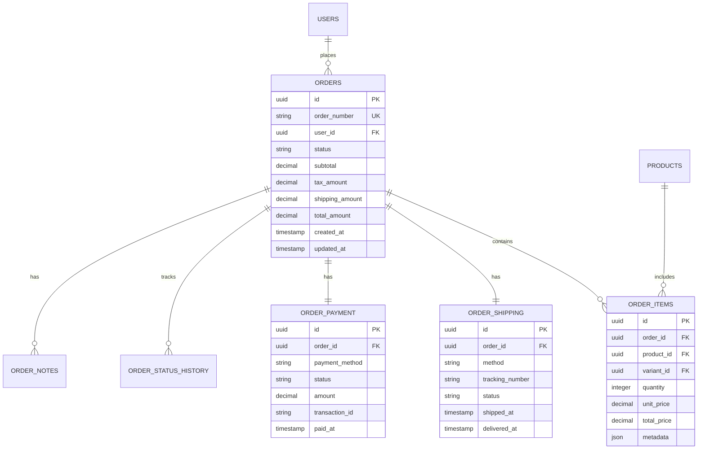

# Order Database Schema

## 1. Schema Overview

### 1.1 Order-Related Tables



## 2. Table Definitions

### 2.1 Orders Table

```sql
CREATE TABLE orders (
    id UUID PRIMARY KEY DEFAULT gen_random_uuid(),
    order_number VARCHAR(50) UNIQUE NOT NULL,
    user_id UUID REFERENCES users(id),
    guest_email VARCHAR(255),
    status VARCHAR(50) NOT NULL DEFAULT 'pending',
    
    -- Financial
    subtotal DECIMAL(10, 2) NOT NULL DEFAULT 0,
    discount_amount DECIMAL(10, 2) DEFAULT 0,
    tax_amount DECIMAL(10, 2) DEFAULT 0,
    shipping_amount DECIMAL(10, 2) DEFAULT 0,
    total_amount DECIMAL(10, 2) NOT NULL,
    currency VARCHAR(3) NOT NULL DEFAULT 'USD',
    
    -- Addresses
    billing_address_id UUID REFERENCES addresses(id),
    shipping_address_id UUID REFERENCES addresses(id),
    
    -- Tracking
    ip_address INET,
    user_agent TEXT,
    referrer TEXT,
    channel VARCHAR(50) DEFAULT 'web',
    
    -- Timestamps
    created_at TIMESTAMP WITH TIME ZONE DEFAULT NOW(),
    updated_at TIMESTAMP WITH TIME ZONE DEFAULT NOW(),
    completed_at TIMESTAMP WITH TIME ZONE,
    cancelled_at TIMESTAMP WITH TIME ZONE,
    
    -- Metadata
    notes TEXT,
    metadata JSONB DEFAULT '{}',
    
    CONSTRAINT orders_status_check CHECK (status IN (
        'pending', 'processing', 'confirmed', 'shipped', 
        'delivered', 'completed', 'cancelled', 'refunded'
    )),
    CONSTRAINT orders_channel_check CHECK (channel IN ('web', 'mobile', 'api', 'admin')),
    CONSTRAINT orders_user_or_guest CHECK (
        (user_id IS NOT NULL AND guest_email IS NULL) OR 
        (user_id IS NULL AND guest_email IS NOT NULL)
    )
);

-- Indexes
CREATE INDEX idx_orders_order_number ON orders(order_number);
CREATE INDEX idx_orders_user_id ON orders(user_id);
CREATE INDEX idx_orders_guest_email ON orders(guest_email);
CREATE INDEX idx_orders_status ON orders(status);
CREATE INDEX idx_orders_created_at ON orders(created_at);
CREATE INDEX idx_orders_completed_at ON orders(completed_at);

-- Function to generate order number
CREATE OR REPLACE FUNCTION generate_order_number()
RETURNS TRIGGER AS $$
BEGIN
    NEW.order_number := 'ORD-' || 
                       TO_CHAR(NOW(), 'YYYYMMDD') || '-' || 
                       LPAD(nextval('order_number_seq')::TEXT, 6, '0');
    RETURN NEW;
END;
$$ LANGUAGE plpgsql;

CREATE SEQUENCE order_number_seq;

CREATE TRIGGER generate_order_number_trigger
    BEFORE INSERT ON orders
    FOR EACH ROW
    WHEN (NEW.order_number IS NULL)
    EXECUTE FUNCTION generate_order_number();

-- Updated_at trigger
CREATE TRIGGER update_orders_updated_at 
    BEFORE UPDATE ON orders 
    FOR EACH ROW 
    EXECUTE FUNCTION update_updated_at_column();
```

### 2.2 Order Items Table

```sql
CREATE TABLE order_items (
    id UUID PRIMARY KEY DEFAULT gen_random_uuid(),
    order_id UUID NOT NULL REFERENCES orders(id) ON DELETE CASCADE,
    product_id UUID NOT NULL REFERENCES products(id),
    variant_id UUID REFERENCES product_variants(id),
    
    -- Product snapshot at time of order
    product_name VARCHAR(255) NOT NULL,
    product_sku VARCHAR(100) NOT NULL,
    variant_name VARCHAR(255),
    variant_attributes JSONB,
    
    -- Pricing
    quantity INTEGER NOT NULL CHECK (quantity > 0),
    unit_price DECIMAL(10, 2) NOT NULL CHECK (unit_price >= 0),
    discount_amount DECIMAL(10, 2) DEFAULT 0,
    tax_amount DECIMAL(10, 2) DEFAULT 0,
    total_price DECIMAL(10, 2) NOT NULL,
    
    -- Fulfillment
    fulfilled_quantity INTEGER DEFAULT 0,
    returned_quantity INTEGER DEFAULT 0,
    refunded_quantity INTEGER DEFAULT 0,
    
    -- Metadata
    notes TEXT,
    metadata JSONB DEFAULT '{}',
    
    created_at TIMESTAMP WITH TIME ZONE DEFAULT NOW(),
    updated_at TIMESTAMP WITH TIME ZONE DEFAULT NOW(),
    
    CONSTRAINT order_items_fulfilled_check CHECK (fulfilled_quantity <= quantity),
    CONSTRAINT order_items_returned_check CHECK (returned_quantity <= fulfilled_quantity),
    CONSTRAINT order_items_refunded_check CHECK (refunded_quantity <= quantity)
);

-- Indexes
CREATE INDEX idx_order_items_order_id ON order_items(order_id);
CREATE INDEX idx_order_items_product_id ON order_items(product_id);
CREATE INDEX idx_order_items_variant_id ON order_items(variant_id);

-- Trigger to calculate total price
CREATE OR REPLACE FUNCTION calculate_order_item_total()
RETURNS TRIGGER AS $$
BEGIN
    NEW.total_price := (NEW.unit_price * NEW.quantity) - 
                       COALESCE(NEW.discount_amount, 0) + 
                       COALESCE(NEW.tax_amount, 0);
    RETURN NEW;
END;
$$ LANGUAGE plpgsql;

CREATE TRIGGER calculate_order_item_total_trigger
    BEFORE INSERT OR UPDATE ON order_items
    FOR EACH ROW
    EXECUTE FUNCTION calculate_order_item_total();
```

### 2.3 Order Shipping Table

```sql
CREATE TABLE order_shipping (
    id UUID PRIMARY KEY DEFAULT gen_random_uuid(),
    order_id UUID NOT NULL UNIQUE REFERENCES orders(id) ON DELETE CASCADE,
    
    -- Shipping Address
    first_name VARCHAR(100) NOT NULL,
    last_name VARCHAR(100) NOT NULL,
    company VARCHAR(255),
    address_line_1 VARCHAR(255) NOT NULL,
    address_line_2 VARCHAR(255),
    city VARCHAR(100) NOT NULL,
    state VARCHAR(100) NOT NULL,
    postal_code VARCHAR(20) NOT NULL,
    country VARCHAR(2) NOT NULL,
    phone VARCHAR(20),
    
    -- Shipping Method
    method VARCHAR(100) NOT NULL,
    carrier VARCHAR(100),
    service_code VARCHAR(100),
    shipping_rate DECIMAL(10, 2),
    estimated_days INTEGER,
    
    -- Tracking
    tracking_number VARCHAR(255),
    tracking_url TEXT,
    status VARCHAR(50) NOT NULL DEFAULT 'pending',
    
    -- Timestamps
    shipped_at TIMESTAMP WITH TIME ZONE,
    delivered_at TIMESTAMP WITH TIME ZONE,
    estimated_delivery DATE,
    
    -- Metadata
    weight DECIMAL(10, 3),
    dimensions JSONB,
    insurance_amount DECIMAL(10, 2),
    signature_required BOOLEAN DEFAULT FALSE,
    notes TEXT,
    
    created_at TIMESTAMP WITH TIME ZONE DEFAULT NOW(),
    updated_at TIMESTAMP WITH TIME ZONE DEFAULT NOW(),
    
    CONSTRAINT order_shipping_status_check CHECK (status IN (
        'pending', 'processing', 'shipped', 'in_transit', 
        'out_for_delivery', 'delivered', 'failed', 'returned'
    ))
);

-- Indexes
CREATE INDEX idx_order_shipping_order_id ON order_shipping(order_id);
CREATE INDEX idx_order_shipping_status ON order_shipping(status);
CREATE INDEX idx_order_shipping_tracking_number ON order_shipping(tracking_number);
CREATE INDEX idx_order_shipping_shipped_at ON order_shipping(shipped_at);
```

### 2.4 Order Payment Table

```sql
CREATE TABLE order_payments (
    id UUID PRIMARY KEY DEFAULT gen_random_uuid(),
    order_id UUID NOT NULL REFERENCES orders(id) ON DELETE CASCADE,
    
    -- Payment Method
    payment_method VARCHAR(50) NOT NULL,
    payment_provider VARCHAR(100),
    
    -- Transaction Details
    transaction_id VARCHAR(255) UNIQUE,
    reference_number VARCHAR(255),
    authorization_code VARCHAR(255),
    
    -- Amounts
    amount DECIMAL(10, 2) NOT NULL,
    currency VARCHAR(3) NOT NULL DEFAULT 'USD',
    exchange_rate DECIMAL(10, 6) DEFAULT 1.0,
    fee_amount DECIMAL(10, 2) DEFAULT 0,
    
    -- Status
    status VARCHAR(50) NOT NULL DEFAULT 'pending',
    
    -- Card Details (tokenized)
    card_last_four VARCHAR(4),
    card_brand VARCHAR(50),
    card_exp_month VARCHAR(2),
    card_exp_year VARCHAR(4),
    
    -- Billing Address
    billing_name VARCHAR(255),
    billing_email VARCHAR(255),
    billing_phone VARCHAR(20),
    billing_address JSONB,
    
    -- Timestamps
    paid_at TIMESTAMP WITH TIME ZONE,
    failed_at TIMESTAMP WITH TIME ZONE,
    refunded_at TIMESTAMP WITH TIME ZONE,
    
    -- Error Handling
    failure_reason TEXT,
    failure_code VARCHAR(100),
    
    -- Metadata
    metadata JSONB DEFAULT '{}',
    
    created_at TIMESTAMP WITH TIME ZONE DEFAULT NOW(),
    updated_at TIMESTAMP WITH TIME ZONE DEFAULT NOW(),
    
    CONSTRAINT order_payments_status_check CHECK (status IN (
        'pending', 'processing', 'authorized', 'captured', 
        'paid', 'failed', 'cancelled', 'refunded', 'partial_refund'
    )),
    CONSTRAINT order_payments_method_check CHECK (payment_method IN (
        'credit_card', 'debit_card', 'paypal', 'apple_pay', 
        'google_pay', 'bank_transfer', 'cash_on_delivery'
    ))
);

-- Indexes
CREATE INDEX idx_order_payments_order_id ON order_payments(order_id);
CREATE INDEX idx_order_payments_transaction_id ON order_payments(transaction_id);
CREATE INDEX idx_order_payments_status ON order_payments(status);
CREATE INDEX idx_order_payments_payment_method ON order_payments(payment_method);
CREATE INDEX idx_order_payments_paid_at ON order_payments(paid_at);
```

### 2.5 Order Status History Table

```sql
CREATE TABLE order_status_history (
    id UUID PRIMARY KEY DEFAULT gen_random_uuid(),
    order_id UUID NOT NULL REFERENCES orders(id) ON DELETE CASCADE,
    from_status VARCHAR(50),
    to_status VARCHAR(50) NOT NULL,
    reason TEXT,
    notes TEXT,
    changed_by UUID REFERENCES users(id),
    created_at TIMESTAMP WITH TIME ZONE DEFAULT NOW()
);

-- Indexes
CREATE INDEX idx_order_status_history_order_id ON order_status_history(order_id);
CREATE INDEX idx_order_status_history_created_at ON order_status_history(created_at);

-- Trigger to track status changes
CREATE OR REPLACE FUNCTION track_order_status_change()
RETURNS TRIGGER AS $$
BEGIN
    IF OLD.status IS DISTINCT FROM NEW.status THEN
        INSERT INTO order_status_history (
            order_id, from_status, to_status
        ) VALUES (
            NEW.id, OLD.status, NEW.status
        );
        
        -- Update completion timestamp
        IF NEW.status = 'completed' THEN
            NEW.completed_at = NOW();
        ELSIF NEW.status = 'cancelled' THEN
            NEW.cancelled_at = NOW();
        END IF;
    END IF;
    RETURN NEW;
END;
$$ LANGUAGE plpgsql;

CREATE TRIGGER track_order_status_change_trigger
    BEFORE UPDATE ON orders
    FOR EACH ROW
    EXECUTE FUNCTION track_order_status_change();
```

### 2.6 Order Refunds Table

```sql
CREATE TABLE order_refunds (
    id UUID PRIMARY KEY DEFAULT gen_random_uuid(),
    order_id UUID NOT NULL REFERENCES orders(id) ON DELETE CASCADE,
    payment_id UUID REFERENCES order_payments(id),
    
    -- Refund Details
    refund_number VARCHAR(50) UNIQUE NOT NULL,
    reason VARCHAR(255) NOT NULL,
    type VARCHAR(50) NOT NULL DEFAULT 'full',
    status VARCHAR(50) NOT NULL DEFAULT 'pending',
    
    -- Amounts
    requested_amount DECIMAL(10, 2) NOT NULL,
    approved_amount DECIMAL(10, 2),
    refunded_amount DECIMAL(10, 2),
    currency VARCHAR(3) NOT NULL DEFAULT 'USD',
    
    -- Transaction
    transaction_id VARCHAR(255),
    gateway_response JSONB,
    
    -- Processing
    requested_by UUID REFERENCES users(id),
    approved_by UUID REFERENCES users(id),
    processed_by UUID REFERENCES users(id),
    
    -- Timestamps
    requested_at TIMESTAMP WITH TIME ZONE DEFAULT NOW(),
    approved_at TIMESTAMP WITH TIME ZONE,
    processed_at TIMESTAMP WITH TIME ZONE,
    
    -- Items
    refund_items JSONB,
    
    -- Notes
    customer_notes TEXT,
    internal_notes TEXT,
    
    created_at TIMESTAMP WITH TIME ZONE DEFAULT NOW(),
    updated_at TIMESTAMP WITH TIME ZONE DEFAULT NOW(),
    
    CONSTRAINT order_refunds_type_check CHECK (type IN ('full', 'partial', 'item')),
    CONSTRAINT order_refunds_status_check CHECK (status IN (
        'pending', 'approved', 'processing', 'completed', 'failed', 'cancelled'
    ))
);

-- Indexes
CREATE INDEX idx_order_refunds_order_id ON order_refunds(order_id);
CREATE INDEX idx_order_refunds_payment_id ON order_refunds(payment_id);
CREATE INDEX idx_order_refunds_status ON order_refunds(status);
CREATE INDEX idx_order_refunds_refund_number ON order_refunds(refund_number);
```

### 2.7 Shopping Cart Table

```sql
CREATE TABLE shopping_carts (
    id UUID PRIMARY KEY DEFAULT gen_random_uuid(),
    user_id UUID REFERENCES users(id),
    session_id VARCHAR(255),
    status VARCHAR(50) NOT NULL DEFAULT 'active',
    
    -- Totals
    item_count INTEGER DEFAULT 0,
    subtotal DECIMAL(10, 2) DEFAULT 0,
    
    -- Tracking
    ip_address INET,
    user_agent TEXT,
    
    -- Timestamps
    created_at TIMESTAMP WITH TIME ZONE DEFAULT NOW(),
    updated_at TIMESTAMP WITH TIME ZONE DEFAULT NOW(),
    expires_at TIMESTAMP WITH TIME ZONE,
    converted_at TIMESTAMP WITH TIME ZONE,
    
    -- Conversion
    order_id UUID REFERENCES orders(id),
    
    CONSTRAINT shopping_carts_status_check CHECK (status IN ('active', 'abandoned', 'converted', 'expired')),
    CONSTRAINT shopping_carts_user_or_session CHECK (
        user_id IS NOT NULL OR session_id IS NOT NULL
    )
);

-- Indexes
CREATE INDEX idx_shopping_carts_user_id ON shopping_carts(user_id);
CREATE INDEX idx_shopping_carts_session_id ON shopping_carts(session_id);
CREATE INDEX idx_shopping_carts_status ON shopping_carts(status);
CREATE INDEX idx_shopping_carts_expires_at ON shopping_carts(expires_at);

-- Cart Items Table
CREATE TABLE cart_items (
    id UUID PRIMARY KEY DEFAULT gen_random_uuid(),
    cart_id UUID NOT NULL REFERENCES shopping_carts(id) ON DELETE CASCADE,
    product_id UUID NOT NULL REFERENCES products(id),
    variant_id UUID REFERENCES product_variants(id),
    quantity INTEGER NOT NULL CHECK (quantity > 0),
    price DECIMAL(10, 2) NOT NULL,
    
    -- Metadata
    saved_for_later BOOLEAN DEFAULT FALSE,
    metadata JSONB DEFAULT '{}',
    
    created_at TIMESTAMP WITH TIME ZONE DEFAULT NOW(),
    updated_at TIMESTAMP WITH TIME ZONE DEFAULT NOW(),
    
    CONSTRAINT cart_items_unique UNIQUE(cart_id, product_id, variant_id)
);

-- Indexes
CREATE INDEX idx_cart_items_cart_id ON cart_items(cart_id);
CREATE INDEX idx_cart_items_product_id ON cart_items(product_id);
```

## 3. Order Processing Functions

### 3.1 Order Totals Calculation

```sql
-- Function to recalculate order totals
CREATE OR REPLACE FUNCTION recalculate_order_totals(p_order_id UUID)
RETURNS void AS $$
DECLARE
    v_subtotal DECIMAL(10, 2);
    v_tax_amount DECIMAL(10, 2);
    v_shipping_amount DECIMAL(10, 2);
    v_discount_amount DECIMAL(10, 2);
BEGIN
    -- Calculate subtotal from order items
    SELECT COALESCE(SUM(total_price), 0)
    INTO v_subtotal
    FROM order_items
    WHERE order_id = p_order_id;
    
    -- Get shipping amount
    SELECT COALESCE(shipping_rate, 0)
    INTO v_shipping_amount
    FROM order_shipping
    WHERE order_id = p_order_id;
    
    -- Get tax amount (simplified - should use tax service)
    v_tax_amount := v_subtotal * 0.08; -- 8% tax
    
    -- Get discount amount
    SELECT COALESCE(discount_amount, 0)
    INTO v_discount_amount
    FROM orders
    WHERE id = p_order_id;
    
    -- Update order totals
    UPDATE orders
    SET 
        subtotal = v_subtotal,
        tax_amount = v_tax_amount,
        shipping_amount = v_shipping_amount,
        total_amount = v_subtotal + v_tax_amount + v_shipping_amount - v_discount_amount,
        updated_at = NOW()
    WHERE id = p_order_id;
END;
$$ LANGUAGE plpgsql;

-- Trigger to recalculate on item changes
CREATE OR REPLACE FUNCTION trigger_recalculate_order_totals()
RETURNS TRIGGER AS $$
BEGIN
    PERFORM recalculate_order_totals(
        CASE 
            WHEN TG_OP = 'DELETE' THEN OLD.order_id
            ELSE NEW.order_id
        END
    );
    RETURN NEW;
END;
$$ LANGUAGE plpgsql;

CREATE TRIGGER recalculate_order_totals_trigger
    AFTER INSERT OR UPDATE OR DELETE ON order_items
    FOR EACH ROW
    EXECUTE FUNCTION trigger_recalculate_order_totals();
```

### 3.2 Inventory Management

```sql
-- Function to reserve inventory for order
CREATE OR REPLACE FUNCTION reserve_order_inventory(p_order_id UUID)
RETURNS BOOLEAN AS $$
DECLARE
    v_item RECORD;
    v_available INTEGER;
BEGIN
    -- Check availability and reserve for each item
    FOR v_item IN 
        SELECT oi.*, pv.stock_quantity, pv.reserved_quantity
        FROM order_items oi
        JOIN product_variants pv ON oi.variant_id = pv.id
        WHERE oi.order_id = p_order_id
    LOOP
        v_available := v_item.stock_quantity - v_item.reserved_quantity;
        
        IF v_available < v_item.quantity THEN
            RAISE EXCEPTION 'Insufficient stock for variant %', v_item.variant_id;
            RETURN FALSE;
        END IF;
        
        -- Reserve stock
        UPDATE product_variants
        SET reserved_quantity = reserved_quantity + v_item.quantity
        WHERE id = v_item.variant_id;
        
        -- Create reservation record
        INSERT INTO stock_reservations (
            variant_id, order_id, quantity, expires_at
        ) VALUES (
            v_item.variant_id, p_order_id, v_item.quantity, NOW() + INTERVAL '30 minutes'
        );
    END LOOP;
    
    RETURN TRUE;
END;
$$ LANGUAGE plpgsql;

-- Function to release inventory reservation
CREATE OR REPLACE FUNCTION release_order_inventory(p_order_id UUID)
RETURNS void AS $$
BEGIN
    -- Update variant quantities
    UPDATE product_variants pv
    SET reserved_quantity = reserved_quantity - sr.quantity
    FROM stock_reservations sr
    WHERE sr.variant_id = pv.id 
      AND sr.order_id = p_order_id 
      AND sr.status = 'reserved';
    
    -- Mark reservations as released
    UPDATE stock_reservations
    SET status = 'released', released_at = NOW()
    WHERE order_id = p_order_id AND status = 'reserved';
END;
$$ LANGUAGE plpgsql;
```

## 4. Data Access Patterns

### 4.1 Common Queries

```sql
-- Get complete order with all details
SELECT 
    o.*,
    json_build_object(
        'items', json_agg(DISTINCT oi.*),
        'shipping', os.*,
        'payment', op.*
    ) AS details
FROM orders o
LEFT JOIN order_items oi ON o.id = oi.order_id
LEFT JOIN order_shipping os ON o.id = os.order_id
LEFT JOIN order_payments op ON o.id = op.order_id
WHERE o.order_number = $1
GROUP BY o.id, os.*, op.*;

-- Get user's recent orders
SELECT 
    o.id,
    o.order_number,
    o.status,
    o.total_amount,
    o.created_at,
    COUNT(oi.id) AS item_count
FROM orders o
LEFT JOIN order_items oi ON o.id = oi.order_id
WHERE o.user_id = $1
GROUP BY o.id
ORDER BY o.created_at DESC
LIMIT $2 OFFSET $3;

-- Get orders by status
SELECT * FROM orders
WHERE status = $1
  AND created_at BETWEEN $2 AND $3
ORDER BY created_at DESC;

-- Get abandoned carts
SELECT 
    sc.*,
    COUNT(ci.id) AS item_count,
    SUM(ci.quantity * ci.price) AS estimated_value
FROM shopping_carts sc
LEFT JOIN cart_items ci ON sc.id = ci.cart_id
WHERE sc.status = 'active'
  AND sc.updated_at < NOW() - INTERVAL '1 hour'
  AND sc.order_id IS NULL
GROUP BY sc.id
ORDER BY sc.updated_at DESC;
```

### 4.2 Reporting Queries

```sql
-- Daily sales report
SELECT 
    DATE_TRUNC('day', created_at) AS date,
    COUNT(*) AS order_count,
    SUM(total_amount) AS revenue,
    AVG(total_amount) AS avg_order_value,
    COUNT(DISTINCT user_id) AS unique_customers
FROM orders
WHERE status IN ('completed', 'shipped', 'delivered')
  AND created_at >= CURRENT_DATE - INTERVAL '30 days'
GROUP BY DATE_TRUNC('day', created_at)
ORDER BY date DESC;

-- Product sales performance
SELECT 
    p.name AS product_name,
    COUNT(DISTINCT oi.order_id) AS order_count,
    SUM(oi.quantity) AS units_sold,
    SUM(oi.total_price) AS revenue,
    AVG(oi.unit_price) AS avg_price
FROM order_items oi
JOIN orders o ON oi.order_id = o.id
JOIN products p ON oi.product_id = p.id
WHERE o.status IN ('completed', 'shipped', 'delivered')
  AND o.created_at >= $1
GROUP BY p.id, p.name
ORDER BY revenue DESC
LIMIT $2;
```

## 5. Migration Scripts

### 5.1 Initial Migration

```sql
-- V003__create_order_tables.sql
BEGIN;

-- Create all order-related tables
-- (Include all CREATE TABLE statements from above)

-- Create indexes for foreign keys
CREATE INDEX idx_orders_billing_address_id ON orders(billing_address_id);
CREATE INDEX idx_orders_shipping_address_id ON orders(shipping_address_id);

-- Create composite indexes for common queries
CREATE INDEX idx_orders_user_status ON orders(user_id, status);
CREATE INDEX idx_orders_status_created ON orders(status, created_at);

COMMIT;
```

## 6. References

- [Schema Overview](./schema-overview.md) - `DB-001`
- [User Schema](./user-schema.md) - `DB-USER-001`
- [Product Schema](./product-schema.md) - `DB-PROD-001`
- [Order Workflow](../06_workflows/order-workflow.md) - `WF-ORD-001`

---
*This order schema document is maintained by the Database Architecture Team.*
