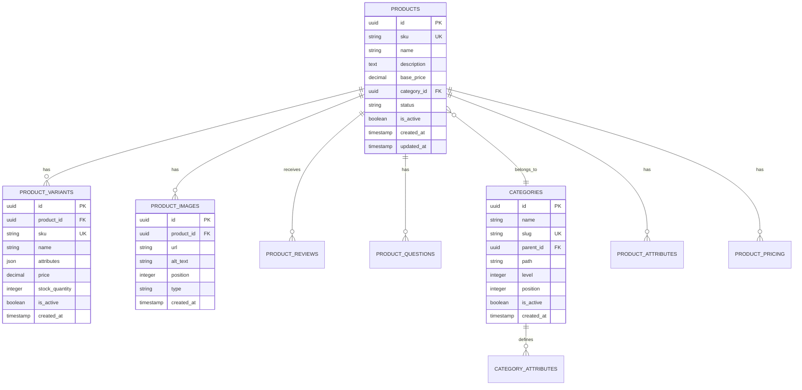

# Product Database Schema

## 1. Schema Overview

### 1.1 Product-Related Tables



## 2. Table Definitions

### 2.1 Products Table

```sql
CREATE TABLE products (
    id UUID PRIMARY KEY DEFAULT gen_random_uuid(),
    sku VARCHAR(100) UNIQUE NOT NULL,
    name VARCHAR(255) NOT NULL,
    slug VARCHAR(255) UNIQUE NOT NULL,
    description TEXT,
    short_description VARCHAR(500),
    base_price DECIMAL(10, 2) NOT NULL CHECK (base_price >= 0),
    cost DECIMAL(10, 2) CHECK (cost >= 0),
    category_id UUID REFERENCES categories(id),
    brand_id UUID REFERENCES brands(id),
    status VARCHAR(50) NOT NULL DEFAULT 'draft',
    is_active BOOLEAN DEFAULT FALSE,
    is_featured BOOLEAN DEFAULT FALSE,
    weight DECIMAL(10, 3),
    dimensions JSONB,
    meta_title VARCHAR(255),
    meta_description TEXT,
    meta_keywords TEXT[],
    tags TEXT[],
    search_vector tsvector,
    created_at TIMESTAMP WITH TIME ZONE DEFAULT NOW(),
    updated_at TIMESTAMP WITH TIME ZONE DEFAULT NOW(),
    published_at TIMESTAMP WITH TIME ZONE,
    deleted_at TIMESTAMP WITH TIME ZONE,
    
    CONSTRAINT products_status_check CHECK (status IN ('draft', 'pending', 'active', 'discontinued')),
    CONSTRAINT products_price_check CHECK (base_price >= 0)
);

-- Indexes
CREATE INDEX idx_products_sku ON products(sku);
CREATE INDEX idx_products_slug ON products(slug);
CREATE INDEX idx_products_category_id ON products(category_id);
CREATE INDEX idx_products_brand_id ON products(brand_id);
CREATE INDEX idx_products_status ON products(status);
CREATE INDEX idx_products_is_active ON products(is_active) WHERE is_active = TRUE;
CREATE INDEX idx_products_is_featured ON products(is_featured) WHERE is_featured = TRUE;
CREATE INDEX idx_products_search ON products USING GIN (search_vector);
CREATE INDEX idx_products_tags ON products USING GIN (tags);
CREATE INDEX idx_products_deleted_at ON products(deleted_at) WHERE deleted_at IS NULL;

-- Full-text search trigger
CREATE OR REPLACE FUNCTION update_product_search_vector()
RETURNS TRIGGER AS $$
BEGIN
    NEW.search_vector := 
        setweight(to_tsvector('english', COALESCE(NEW.name, '')), 'A') ||
        setweight(to_tsvector('english', COALESCE(NEW.description, '')), 'B') ||
        setweight(to_tsvector('english', COALESCE(NEW.short_description, '')), 'C') ||
        setweight(to_tsvector('english', COALESCE(array_to_string(NEW.tags, ' '), '')), 'D');
    RETURN NEW;
END;
$$ LANGUAGE plpgsql;

CREATE TRIGGER update_product_search_vector_trigger
    BEFORE INSERT OR UPDATE ON products
    FOR EACH ROW
    EXECUTE FUNCTION update_product_search_vector();

-- Updated_at trigger
CREATE TRIGGER update_products_updated_at 
    BEFORE UPDATE ON products 
    FOR EACH ROW 
    EXECUTE FUNCTION update_updated_at_column();
```

### 2.2 Categories Table

```sql
CREATE TABLE categories (
    id UUID PRIMARY KEY DEFAULT gen_random_uuid(),
    name VARCHAR(100) NOT NULL,
    slug VARCHAR(100) UNIQUE NOT NULL,
    parent_id UUID REFERENCES categories(id),
    path TEXT NOT NULL,
    level INTEGER NOT NULL DEFAULT 0,
    position INTEGER NOT NULL DEFAULT 0,
    description TEXT,
    image_url VARCHAR(500),
    is_active BOOLEAN DEFAULT TRUE,
    meta_title VARCHAR(255),
    meta_description TEXT,
    created_at TIMESTAMP WITH TIME ZONE DEFAULT NOW(),
    updated_at TIMESTAMP WITH TIME ZONE DEFAULT NOW(),
    
    CONSTRAINT categories_level_check CHECK (level >= 0),
    CONSTRAINT categories_position_check CHECK (position >= 0)
);

-- Indexes
CREATE INDEX idx_categories_slug ON categories(slug);
CREATE INDEX idx_categories_parent_id ON categories(parent_id);
CREATE INDEX idx_categories_path ON categories(path);
CREATE INDEX idx_categories_level ON categories(level);
CREATE INDEX idx_categories_position ON categories(position);
CREATE INDEX idx_categories_is_active ON categories(is_active);

-- Function to update category path
CREATE OR REPLACE FUNCTION update_category_path()
RETURNS TRIGGER AS $$
DECLARE
    parent_path TEXT;
BEGIN
    IF NEW.parent_id IS NULL THEN
        NEW.path := NEW.id::TEXT;
        NEW.level := 0;
    ELSE
        SELECT path, level + 1 INTO parent_path, NEW.level
        FROM categories WHERE id = NEW.parent_id;
        NEW.path := parent_path || '.' || NEW.id::TEXT;
    END IF;
    RETURN NEW;
END;
$$ LANGUAGE plpgsql;

CREATE TRIGGER update_category_path_trigger
    BEFORE INSERT OR UPDATE OF parent_id ON categories
    FOR EACH ROW
    EXECUTE FUNCTION update_category_path();
```

### 2.3 Product Variants Table

```sql
CREATE TABLE product_variants (
    id UUID PRIMARY KEY DEFAULT gen_random_uuid(),
    product_id UUID NOT NULL REFERENCES products(id) ON DELETE CASCADE,
    sku VARCHAR(100) UNIQUE NOT NULL,
    name VARCHAR(255) NOT NULL,
    attributes JSONB NOT NULL DEFAULT '{}',
    price DECIMAL(10, 2) NOT NULL CHECK (price >= 0),
    compare_at_price DECIMAL(10, 2) CHECK (compare_at_price >= 0),
    cost DECIMAL(10, 2) CHECK (cost >= 0),
    weight DECIMAL(10, 3),
    stock_quantity INTEGER NOT NULL DEFAULT 0 CHECK (stock_quantity >= 0),
    reserved_quantity INTEGER NOT NULL DEFAULT 0 CHECK (reserved_quantity >= 0),
    low_stock_threshold INTEGER DEFAULT 10,
    is_active BOOLEAN DEFAULT TRUE,
    position INTEGER DEFAULT 0,
    created_at TIMESTAMP WITH TIME ZONE DEFAULT NOW(),
    updated_at TIMESTAMP WITH TIME ZONE DEFAULT NOW()
);

-- Indexes
CREATE INDEX idx_product_variants_product_id ON product_variants(product_id);
CREATE INDEX idx_product_variants_sku ON product_variants(sku);
CREATE INDEX idx_product_variants_is_active ON product_variants(is_active);
CREATE INDEX idx_product_variants_attributes ON product_variants USING GIN (attributes);
CREATE INDEX idx_product_variants_stock ON product_variants(stock_quantity);

-- Trigger for available stock calculation
CREATE OR REPLACE FUNCTION calculate_available_stock()
RETURNS TRIGGER AS $$
BEGIN
    -- Ensure reserved quantity doesn't exceed stock quantity
    IF NEW.reserved_quantity > NEW.stock_quantity THEN
        RAISE EXCEPTION 'Reserved quantity cannot exceed stock quantity';
    END IF;
    RETURN NEW;
END;
$$ LANGUAGE plpgsql;

CREATE TRIGGER check_available_stock_trigger
    BEFORE INSERT OR UPDATE ON product_variants
    FOR EACH ROW
    EXECUTE FUNCTION calculate_available_stock();
```

### 2.4 Product Images Table

```sql
CREATE TABLE product_images (
    id UUID PRIMARY KEY DEFAULT gen_random_uuid(),
    product_id UUID REFERENCES products(id) ON DELETE CASCADE,
    variant_id UUID REFERENCES product_variants(id) ON DELETE CASCADE,
    url VARCHAR(500) NOT NULL,
    cdn_url VARCHAR(500),
    alt_text VARCHAR(255),
    title VARCHAR(255),
    position INTEGER NOT NULL DEFAULT 0,
    type VARCHAR(50) NOT NULL DEFAULT 'gallery',
    width INTEGER,
    height INTEGER,
    file_size INTEGER,
    created_at TIMESTAMP WITH TIME ZONE DEFAULT NOW(),
    
    CONSTRAINT product_images_type_check CHECK (type IN ('main', 'gallery', 'thumbnail', 'zoom')),
    CONSTRAINT product_images_product_or_variant CHECK (
        (product_id IS NOT NULL AND variant_id IS NULL) OR 
        (product_id IS NULL AND variant_id IS NOT NULL)
    )
);

-- Indexes
CREATE INDEX idx_product_images_product_id ON product_images(product_id);
CREATE INDEX idx_product_images_variant_id ON product_images(variant_id);
CREATE INDEX idx_product_images_position ON product_images(position);
CREATE INDEX idx_product_images_type ON product_images(type);
```

### 2.5 Product Attributes Table

```sql
CREATE TABLE product_attributes (
    id UUID PRIMARY KEY DEFAULT gen_random_uuid(),
    product_id UUID NOT NULL REFERENCES products(id) ON DELETE CASCADE,
    attribute_key VARCHAR(100) NOT NULL,
    attribute_value TEXT NOT NULL,
    attribute_group VARCHAR(100),
    display_order INTEGER DEFAULT 0,
    is_visible BOOLEAN DEFAULT TRUE,
    created_at TIMESTAMP WITH TIME ZONE DEFAULT NOW(),
    updated_at TIMESTAMP WITH TIME ZONE DEFAULT NOW(),
    
    CONSTRAINT product_attributes_unique UNIQUE(product_id, attribute_key)
);

-- Indexes
CREATE INDEX idx_product_attributes_product_id ON product_attributes(product_id);
CREATE INDEX idx_product_attributes_key ON product_attributes(attribute_key);
CREATE INDEX idx_product_attributes_group ON product_attributes(attribute_group);
CREATE INDEX idx_product_attributes_visible ON product_attributes(is_visible);
```

### 2.6 Product Pricing Table

```sql
CREATE TABLE product_pricing (
    id UUID PRIMARY KEY DEFAULT gen_random_uuid(),
    product_id UUID REFERENCES products(id) ON DELETE CASCADE,
    variant_id UUID REFERENCES product_variants(id) ON DELETE CASCADE,
    price_type VARCHAR(50) NOT NULL,
    price DECIMAL(10, 2) NOT NULL CHECK (price >= 0),
    currency VARCHAR(3) NOT NULL DEFAULT 'USD',
    min_quantity INTEGER DEFAULT 1,
    max_quantity INTEGER,
    customer_group VARCHAR(100),
    start_date TIMESTAMP WITH TIME ZONE,
    end_date TIMESTAMP WITH TIME ZONE,
    priority INTEGER DEFAULT 0,
    created_at TIMESTAMP WITH TIME ZONE DEFAULT NOW(),
    updated_at TIMESTAMP WITH TIME ZONE DEFAULT NOW(),
    
    CONSTRAINT product_pricing_type_check CHECK (price_type IN ('regular', 'sale', 'tier', 'group', 'promotional')),
    CONSTRAINT product_pricing_quantity_check CHECK (min_quantity > 0 AND (max_quantity IS NULL OR max_quantity >= min_quantity)),
    CONSTRAINT product_pricing_dates_check CHECK (end_date IS NULL OR end_date > start_date),
    CONSTRAINT product_pricing_product_or_variant CHECK (
        (product_id IS NOT NULL AND variant_id IS NULL) OR 
        (product_id IS NULL AND variant_id IS NOT NULL)
    )
);

-- Indexes
CREATE INDEX idx_product_pricing_product_id ON product_pricing(product_id);
CREATE INDEX idx_product_pricing_variant_id ON product_pricing(variant_id);
CREATE INDEX idx_product_pricing_type ON product_pricing(price_type);
CREATE INDEX idx_product_pricing_dates ON product_pricing(start_date, end_date);
CREATE INDEX idx_product_pricing_customer_group ON product_pricing(customer_group);
```

### 2.7 Product Reviews Table

```sql
CREATE TABLE product_reviews (
    id UUID PRIMARY KEY DEFAULT gen_random_uuid(),
    product_id UUID NOT NULL REFERENCES products(id) ON DELETE CASCADE,
    user_id UUID NOT NULL REFERENCES users(id),
    order_item_id UUID REFERENCES order_items(id),
    rating INTEGER NOT NULL CHECK (rating >= 1 AND rating <= 5),
    title VARCHAR(255),
    comment TEXT,
    pros TEXT[],
    cons TEXT[],
    is_verified_purchase BOOLEAN DEFAULT FALSE,
    is_featured BOOLEAN DEFAULT FALSE,
    helpful_count INTEGER DEFAULT 0,
    unhelpful_count INTEGER DEFAULT 0,
    status VARCHAR(50) NOT NULL DEFAULT 'pending',
    moderator_notes TEXT,
    created_at TIMESTAMP WITH TIME ZONE DEFAULT NOW(),
    updated_at TIMESTAMP WITH TIME ZONE DEFAULT NOW(),
    published_at TIMESTAMP WITH TIME ZONE,
    
    CONSTRAINT product_reviews_status_check CHECK (status IN ('pending', 'approved', 'rejected', 'flagged'))
);

-- Indexes
CREATE INDEX idx_product_reviews_product_id ON product_reviews(product_id);
CREATE INDEX idx_product_reviews_user_id ON product_reviews(user_id);
CREATE INDEX idx_product_reviews_rating ON product_reviews(rating);
CREATE INDEX idx_product_reviews_status ON product_reviews(status);
CREATE INDEX idx_product_reviews_is_verified ON product_reviews(is_verified_purchase);
CREATE INDEX idx_product_reviews_created_at ON product_reviews(created_at);
```

## 3. Inventory Management

### 3.1 Stock Movements Table

```sql
CREATE TABLE stock_movements (
    id UUID PRIMARY KEY DEFAULT gen_random_uuid(),
    variant_id UUID NOT NULL REFERENCES product_variants(id),
    type VARCHAR(50) NOT NULL,
    quantity INTEGER NOT NULL,
    reference_type VARCHAR(50),
    reference_id UUID,
    reason VARCHAR(255),
    notes TEXT,
    created_by UUID REFERENCES users(id),
    created_at TIMESTAMP WITH TIME ZONE DEFAULT NOW(),
    
    CONSTRAINT stock_movements_type_check CHECK (type IN ('in', 'out', 'adjustment', 'transfer', 'return'))
);

-- Indexes
CREATE INDEX idx_stock_movements_variant_id ON stock_movements(variant_id);
CREATE INDEX idx_stock_movements_type ON stock_movements(type);
CREATE INDEX idx_stock_movements_reference ON stock_movements(reference_type, reference_id);
CREATE INDEX idx_stock_movements_created_at ON stock_movements(created_at);

-- Function to update stock quantity
CREATE OR REPLACE FUNCTION update_stock_on_movement()
RETURNS TRIGGER AS $$
BEGIN
    IF NEW.type IN ('in', 'return') THEN
        UPDATE product_variants 
        SET stock_quantity = stock_quantity + NEW.quantity
        WHERE id = NEW.variant_id;
    ELSIF NEW.type = 'out' THEN
        UPDATE product_variants 
        SET stock_quantity = stock_quantity - NEW.quantity
        WHERE id = NEW.variant_id;
    ELSIF NEW.type = 'adjustment' THEN
        UPDATE product_variants 
        SET stock_quantity = NEW.quantity
        WHERE id = NEW.variant_id;
    END IF;
    RETURN NEW;
END;
$$ LANGUAGE plpgsql;

CREATE TRIGGER update_stock_on_movement_trigger
    AFTER INSERT ON stock_movements
    FOR EACH ROW
    EXECUTE FUNCTION update_stock_on_movement();
```

### 3.2 Stock Reservations Table

```sql
CREATE TABLE stock_reservations (
    id UUID PRIMARY KEY DEFAULT gen_random_uuid(),
    variant_id UUID NOT NULL REFERENCES product_variants(id),
    order_id UUID REFERENCES orders(id),
    quantity INTEGER NOT NULL CHECK (quantity > 0),
    status VARCHAR(50) NOT NULL DEFAULT 'reserved',
    expires_at TIMESTAMP WITH TIME ZONE NOT NULL,
    created_at TIMESTAMP WITH TIME ZONE DEFAULT NOW(),
    released_at TIMESTAMP WITH TIME ZONE,
    
    CONSTRAINT stock_reservations_status_check CHECK (status IN ('reserved', 'confirmed', 'released', 'expired'))
);

-- Indexes
CREATE INDEX idx_stock_reservations_variant_id ON stock_reservations(variant_id);
CREATE INDEX idx_stock_reservations_order_id ON stock_reservations(order_id);
CREATE INDEX idx_stock_reservations_status ON stock_reservations(status);
CREATE INDEX idx_stock_reservations_expires_at ON stock_reservations(expires_at);

-- Function to release expired reservations
CREATE OR REPLACE FUNCTION release_expired_reservations()
RETURNS INTEGER AS $$
DECLARE
    released_count INTEGER;
BEGIN
    WITH expired_reservations AS (
        UPDATE stock_reservations 
        SET status = 'expired', released_at = NOW()
        WHERE status = 'reserved' 
          AND expires_at < NOW()
        RETURNING variant_id, quantity
    )
    UPDATE product_variants pv
    SET reserved_quantity = reserved_quantity - er.quantity
    FROM expired_reservations er
    WHERE pv.id = er.variant_id;
    
    GET DIAGNOSTICS released_count = ROW_COUNT;
    RETURN released_count;
END;
$$ LANGUAGE plpgsql;
```

## 4. Data Access Patterns

### 4.1 Common Queries

```sql
-- Get product with variants and images
SELECT 
    p.*,
    json_agg(DISTINCT pv.*) AS variants,
    json_agg(DISTINCT pi.*) AS images
FROM products p
LEFT JOIN product_variants pv ON p.id = pv.product_id
LEFT JOIN product_images pi ON p.id = pi.product_id
WHERE p.slug = $1 AND p.deleted_at IS NULL
GROUP BY p.id;

-- Search products with full-text search
SELECT 
    p.id, p.name, p.slug, p.base_price,
    ts_rank(p.search_vector, plainto_tsquery('english', $1)) AS rank
FROM products p
WHERE p.search_vector @@ plainto_tsquery('english', $1)
  AND p.is_active = TRUE
  AND p.deleted_at IS NULL
ORDER BY rank DESC
LIMIT $2 OFFSET $3;

-- Get products by category with pagination
WITH RECURSIVE category_tree AS (
    SELECT id FROM categories WHERE slug = $1
    UNION ALL
    SELECT c.id FROM categories c
    JOIN category_tree ct ON c.parent_id = ct.id
)
SELECT p.* FROM products p
WHERE p.category_id IN (SELECT id FROM category_tree)
  AND p.is_active = TRUE
  AND p.deleted_at IS NULL
ORDER BY p.created_at DESC
LIMIT $2 OFFSET $3;

-- Get product availability
SELECT 
    pv.id,
    pv.sku,
    pv.name,
    pv.stock_quantity,
    pv.reserved_quantity,
    (pv.stock_quantity - pv.reserved_quantity) AS available_quantity,
    CASE 
        WHEN pv.stock_quantity - pv.reserved_quantity <= 0 THEN 'out_of_stock'
        WHEN pv.stock_quantity - pv.reserved_quantity <= pv.low_stock_threshold THEN 'low_stock'
        ELSE 'in_stock'
    END AS stock_status
FROM product_variants pv
WHERE pv.product_id = $1 AND pv.is_active = TRUE;
```

### 4.2 Performance Optimization

```sql
-- Materialized view for product statistics
CREATE MATERIALIZED VIEW product_statistics AS
SELECT 
    p.id AS product_id,
    COUNT(DISTINCT pr.id) AS review_count,
    AVG(pr.rating) AS average_rating,
    COUNT(DISTINCT oi.order_id) AS order_count,
    SUM(oi.quantity) AS units_sold
FROM products p
LEFT JOIN product_reviews pr ON p.id = pr.product_id AND pr.status = 'approved'
LEFT JOIN order_items oi ON p.id = oi.product_id
GROUP BY p.id;

CREATE UNIQUE INDEX ON product_statistics (product_id);

-- Refresh function
CREATE OR REPLACE FUNCTION refresh_product_statistics()
RETURNS void AS $$
BEGIN
    REFRESH MATERIALIZED VIEW CONCURRENTLY product_statistics;
END;
$$ LANGUAGE plpgsql;
```

## 5. Migration Scripts

### 5.1 Initial Migration

```sql
-- V002__create_product_tables.sql
BEGIN;

-- Create all product-related tables
-- (Include all CREATE TABLE statements from above)

-- Create sample categories
INSERT INTO categories (name, slug, parent_id, position) VALUES
('Electronics', 'electronics', NULL, 1),
('Computers', 'computers', (SELECT id FROM categories WHERE slug = 'electronics'), 1),
('Smartphones', 'smartphones', (SELECT id FROM categories WHERE slug = 'electronics'), 2),
('Accessories', 'accessories', NULL, 2);

-- Create sample products
INSERT INTO products (sku, name, slug, description, base_price, category_id, status, is_active) VALUES
('LAPTOP-001', 'High-Performance Laptop', 'high-performance-laptop', 'Professional grade laptop', 1299.99, 
 (SELECT id FROM categories WHERE slug = 'computers'), 'active', TRUE),
('PHONE-001', 'Flagship Smartphone', 'flagship-smartphone', 'Latest model smartphone', 999.99,
 (SELECT id FROM categories WHERE slug = 'smartphones'), 'active', TRUE);

COMMIT;
```

## 6. References

- [Schema Overview](./schema-overview.md) - `DB-001`
- [User Schema](./user-schema.md) - `DB-USER-001`
- [Order Schema](./order-schema.md) - `DB-ORD-001`
- [Backend Architecture](../03_architecture/backend-architecture.md) - `ARCH-BE-001`

---
*This product schema document is maintained by the Database Architecture Team.*
