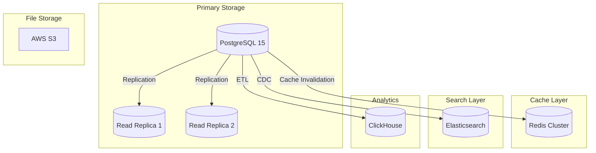
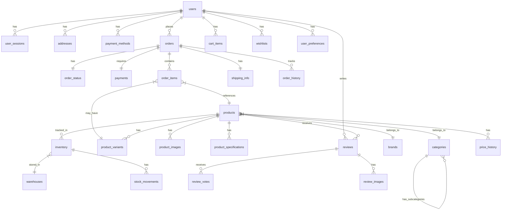
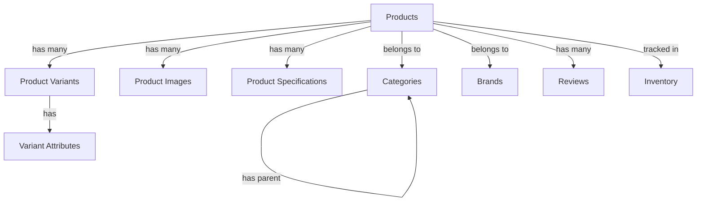
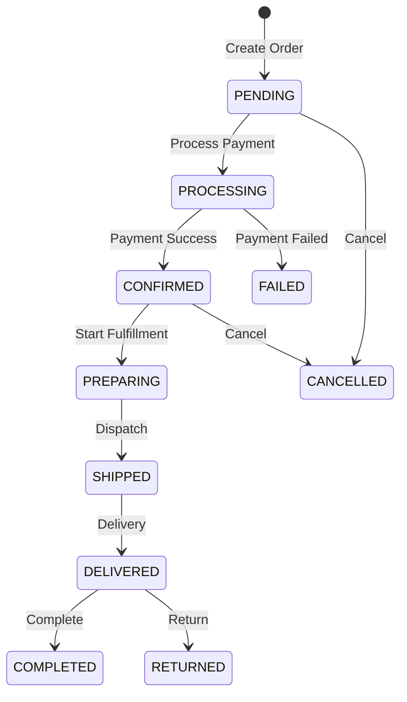
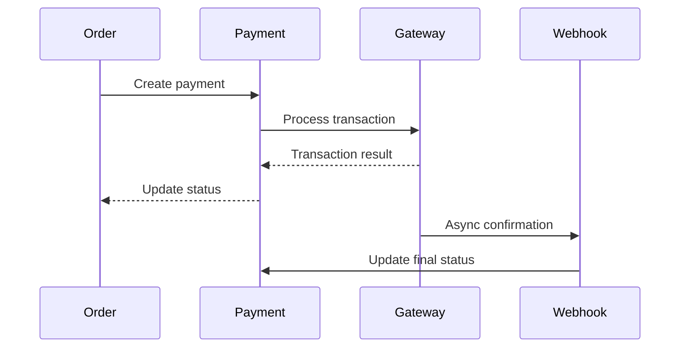
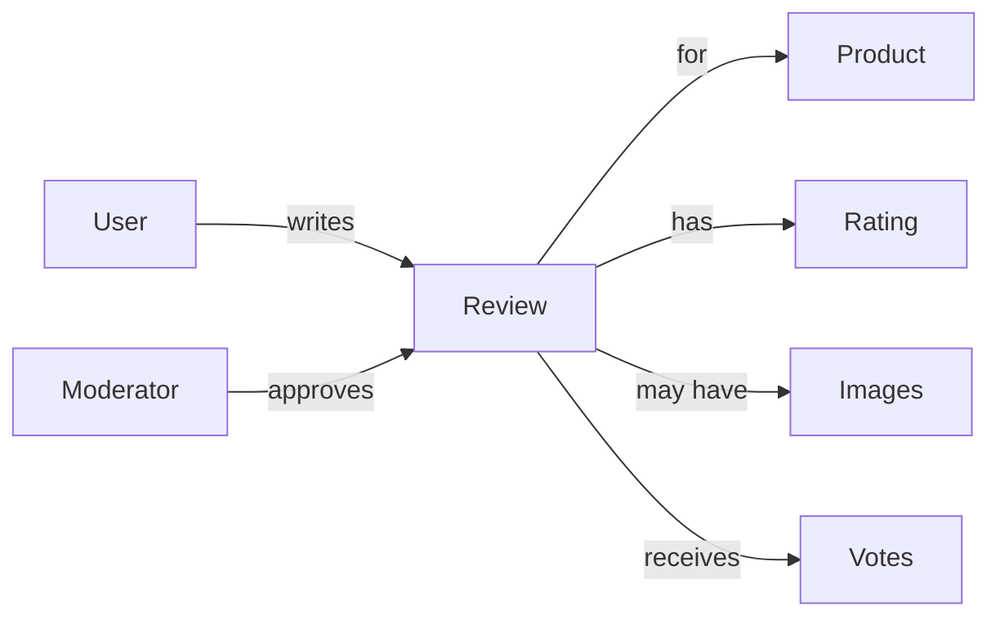

# Database Schema Overview

## 1. Database Architecture

### 1.1 Database Systems



### 1.2 Database Design Principles

| Principle | Description | Implementation |
|-----------|-------------|----------------|
| Normalization | 3NF for transactional data | Reduce redundancy |
| Denormalization | Strategic for performance | Materialized views |
| Partitioning | Time-based for large tables | Monthly partitions |
| Indexing | Optimize query performance | B-tree, GIN, GiST |
| Audit Trail | Track all changes | Trigger-based |
| Soft Delete | Logical deletion | deleted_at column |

## 2. Core Schema Entities

### 2.1 Entity Relationship Diagram



## 3. User Management Schema

### 3.1 Users Table

```sql
CREATE TABLE users (
    id UUID PRIMARY KEY DEFAULT gen_random_uuid(),
    email VARCHAR(255) UNIQUE NOT NULL,
    email_verified BOOLEAN DEFAULT false,
    password_hash VARCHAR(255) NOT NULL,
    first_name VARCHAR(100) NOT NULL,
    last_name VARCHAR(100) NOT NULL,
    phone_number VARCHAR(20),
    date_of_birth DATE,
    gender VARCHAR(20),
    avatar_url TEXT,
    role VARCHAR(50) DEFAULT 'customer',
    status VARCHAR(50) DEFAULT 'active',
    last_login_at TIMESTAMP WITH TIME ZONE,
    failed_login_attempts INT DEFAULT 0,
    locked_until TIMESTAMP WITH TIME ZONE,
    mfa_enabled BOOLEAN DEFAULT false,
    mfa_secret VARCHAR(255),
    created_at TIMESTAMP WITH TIME ZONE DEFAULT CURRENT_TIMESTAMP,
    updated_at TIMESTAMP WITH TIME ZONE DEFAULT CURRENT_TIMESTAMP,
    deleted_at TIMESTAMP WITH TIME ZONE,
    CONSTRAINT chk_role CHECK (role IN ('customer', 'admin', 'super_admin', 'support')),
    CONSTRAINT chk_status CHECK (status IN ('active', 'inactive', 'suspended', 'deleted'))
);

-- Indexes
CREATE INDEX idx_users_email ON users(email);
CREATE INDEX idx_users_status ON users(status) WHERE deleted_at IS NULL;
CREATE INDEX idx_users_created_at ON users(created_at);
```

### 3.2 Related User Tables

| Table | Purpose | Key Fields | Relationships |
|-------|---------|------------|---------------|
| [`user_sessions`] | Session management | token_hash, expires_at | users.id |
| [`addresses`] | Shipping/billing addresses | street, city, postal_code | users.id |
| [`payment_methods`] | Saved payment methods | card_last4, gateway_id | users.id |
| [`user_preferences`] | User settings | notifications, language | users.id |
| [`user_activity`] | Activity tracking | action_type, timestamp | users.id |

## 4. Product Catalog Schema

### 4.1 Products Table Structure

| Column | Type | Description | Index |
|--------|------|-------------|-------|
| id | UUID | Primary key | Primary |
| sku | VARCHAR(100) | Stock keeping unit | Unique |
| name | VARCHAR(255) | Product name | Full-text |
| slug | VARCHAR(255) | URL slug | Unique |
| description | TEXT | Full description | Full-text |
| category_id | UUID | Category reference | B-tree |
| brand_id | UUID | Brand reference | B-tree |
| base_price | DECIMAL(10,2) | Base price | B-tree |
| search_vector | tsvector | Full-text search | GIN |

### 4.2 Product Relationships



## 5. Order Management Schema

### 5.1 Order State Flow



### 5.2 Order Tables

| Table | Purpose | Key Relationships |
|-------|---------|-------------------|
| [`orders`] | Main order records | users, payments |
| [`order_items`] | Line items | orders, products |
| [`order_status_history`] | Status tracking | orders |
| [`order_shipping`] | Shipping details | orders, addresses |
| [`order_notes`] | Internal notes | orders, users |

## 6. Inventory Schema

### 6.1 Inventory Management

```sql
-- Core inventory tracking
CREATE TABLE inventory (
    id UUID PRIMARY KEY,
    product_id UUID NOT NULL REFERENCES products(id),
    warehouse_id UUID NOT NULL REFERENCES warehouses(id),
    quantity_on_hand INT NOT NULL DEFAULT 0,
    quantity_reserved INT NOT NULL DEFAULT 0,
    quantity_available INT GENERATED ALWAYS AS 
        (quantity_on_hand - quantity_reserved) STORED,
    reorder_point INT,
    reorder_quantity INT,
    UNIQUE(product_id, warehouse_id)
);
```

### 6.2 Stock Movement Types

| Type | Description | Impact |
|------|-------------|--------|
| purchase | New stock arrival | Increase |
| sale | Customer purchase | Decrease |
| return | Customer return | Increase |
| adjustment | Manual adjustment | Variable |
| transfer | Warehouse transfer | Variable |
| damage | Damaged goods | Decrease |

## 7. Payment Schema

### 7.1 Payment Flow



### 7.2 Payment Tables

| Table | Purpose | Security Level |
|-------|---------|----------------|
| [`payments`] | Transaction records | High - PCI |
| [`payment_methods`] | Saved cards/accounts | Critical - Encrypted |
| [`payment_logs`] | Gateway communication | High - Audit |
| [`refunds`] | Refund tracking | High - Financial |

## 8. Review System Schema

### 8.1 Review Components



### 8.2 Review Moderation States

| Status | Description | Visibility |
|--------|-------------|------------|
| pending | Awaiting moderation | Hidden |
| approved | Approved for display | Public |
| rejected | Failed moderation | Hidden |
| flagged | User reported | Under review |

## 9. Database Optimization

### 9.1 Index Strategy

| Table | Index Type | Columns | Purpose |
|-------|------------|---------|---------|
| products | GIN | search_vector | Full-text search |
| products | B-tree | (category_id, is_published) | Category listing |
| orders | B-tree | (user_id, created_at DESC) | User history |
| inventory | B-tree | (product_id, warehouse_id) | Stock lookup |

### 9.2 Materialized Views

```sql
-- Product ratings summary
CREATE MATERIALIZED VIEW product_ratings AS
SELECT 
    product_id,
    COUNT(*) as review_count,
    AVG(rating)::DECIMAL(3,2) as avg_rating
FROM reviews
WHERE deleted_at IS NULL 
    AND moderator_status = 'approved'
GROUP BY product_id;

-- Category product counts
CREATE MATERIALIZED VIEW category_counts AS
SELECT 
    category_id,
    COUNT(*) as product_count,
    COUNT(*) FILTER (WHERE is_published) as active_count
FROM products
WHERE deleted_at IS NULL
GROUP BY category_id;
```

## 10. Database Security

### 10.1 Security Measures

| Measure | Implementation | Purpose |
|---------|----------------|---------|
| Encryption at rest | AES-256 | Data protection |
| SSL connections | TLS 1.3 | Transport security |
| Row-level security | PostgreSQL RLS | Access control |
| Audit logging | Triggers | Compliance |
| Data masking | Functions | PII protection |

### 10.2 Access Control

```sql
-- Application roles
CREATE ROLE techally_app;
CREATE ROLE techally_readonly;
CREATE ROLE techally_admin;

-- Row-level security
ALTER TABLE orders ENABLE ROW LEVEL SECURITY;

CREATE POLICY user_orders ON orders
    FOR ALL
    TO techally_app
    USING (user_id = current_setting('app.current_user_id')::UUID);
```

## 11. Performance Monitoring

### 11.1 Key Metrics

| Metric | Target | Alert Threshold |
|--------|--------|-----------------|
| Query time | <50ms | >200ms |
| Connection count | <80% max | >90% max |
| Cache hit ratio | >95% | <90% |
| Replication lag | <1s | >5s |
| Table bloat | <20% | >30% |

### 11.2 Monitoring Queries

```sql
-- Slow queries
SELECT query, calls, mean_time, max_time
FROM pg_stat_statements
ORDER BY mean_time DESC
LIMIT 20;

-- Table sizes
SELECT 
    tablename,
    pg_size_pretty(pg_total_relation_size(tablename::regclass)) AS size
FROM pg_tables
WHERE schemaname = 'public'
ORDER BY pg_total_relation_size(tablename::regclass) DESC;
```

## 12. Backup and Recovery

### 12.1 Backup Strategy

| Type | Frequency | Retention | RPO |
|------|-----------|-----------|-----|
| Full backup | Daily | 30 days | 24h |
| Incremental | Hourly | 7 days | 1h |
| WAL archive | Continuous | 7 days | 5 min |
| Snapshots | Daily | 7 days | 24h |

### 12.2 Recovery Procedures

```bash
# Point-in-time recovery
pg_restore -d techally -t "2025-09-23 10:00:00" backup.dump

# Replica promotion
pg_ctl promote -D /var/lib/postgresql/data
```

## 13. Data Lifecycle

### 13.1 Data Retention Policies

| Data Type | Active Period | Archive Period | Deletion |
|-----------|---------------|----------------|----------|
| Orders | 2 years | 5 years | 7 years |
| User data | Active | 2 years after inactive | On request |
| Logs | 90 days | 1 year | After archive |
| Sessions | 30 days | - | Auto-delete |
| Analytics | 1 year | 3 years | Aggregate only |

## 14. References

- [User Schema Details](./user-schema.md) - [`DB-USER-001`]
- [Product Schema Details](./product-schema.md) - [`DB-PROD-001`]
- [Order Schema Details](./order-schema.md) - [`DB-ORD-001`]
- [Inventory Schema Details](./inventory-schema.md) - [`DB-INV-001`]
- [Payment Schema Details](./payment-schema.md) - [`DB-PAY-001`]
- [Migration Guide](./migration-guide.md) - [`DB-MIG-001`]

---
*This database schema documentation is maintained by the Database Architecture Team.*
