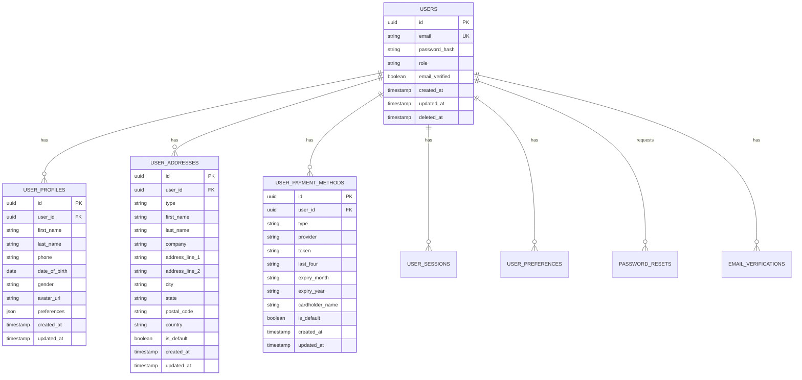

# User Database Schema

## 1. Schema Overview

### 1.1 User-Related Tables



## 2. Table Definitions

### 2.1 Users Table

```sql
CREATE TABLE users (
    id UUID PRIMARY KEY DEFAULT gen_random_uuid(),
    email VARCHAR(255) UNIQUE NOT NULL,
    password_hash VARCHAR(255) NOT NULL,
    role VARCHAR(50) NOT NULL DEFAULT 'customer',
    email_verified BOOLEAN DEFAULT FALSE,
    two_factor_enabled BOOLEAN DEFAULT FALSE,
    account_locked BOOLEAN DEFAULT FALSE,
    failed_login_attempts INTEGER DEFAULT 0,
    last_login_at TIMESTAMP WITH TIME ZONE,
    created_at TIMESTAMP WITH TIME ZONE DEFAULT NOW(),
    updated_at TIMESTAMP WITH TIME ZONE DEFAULT NOW(),
    deleted_at TIMESTAMP WITH TIME ZONE,
    
    CONSTRAINT users_email_check CHECK (email ~* '^[A-Za-z0-9._%+-]+@[A-Za-z0-9.-]+\.[A-Za-z]{2,}$'),
    CONSTRAINT users_role_check CHECK (role IN ('customer', 'admin', 'vendor', 'support'))
);

-- Indexes
CREATE INDEX idx_users_email ON users(email);
CREATE INDEX idx_users_role ON users(role);
CREATE INDEX idx_users_created_at ON users(created_at);
CREATE INDEX idx_users_deleted_at ON users(deleted_at) WHERE deleted_at IS NULL;

-- Trigger for updated_at
CREATE OR REPLACE FUNCTION update_updated_at_column()
RETURNS TRIGGER AS $$
BEGIN
    NEW.updated_at = NOW();
    RETURN NEW;
END;
$$ language 'plpgsql';

CREATE TRIGGER update_users_updated_at 
    BEFORE UPDATE ON users 
    FOR EACH ROW 
    EXECUTE FUNCTION update_updated_at_column();
```

### 2.2 User Profiles Table

```sql
CREATE TABLE user_profiles (
    id UUID PRIMARY KEY DEFAULT gen_random_uuid(),
    user_id UUID NOT NULL REFERENCES users(id) ON DELETE CASCADE,
    first_name VARCHAR(100),
    last_name VARCHAR(100),
    phone VARCHAR(20),
    date_of_birth DATE,
    gender VARCHAR(20),
    avatar_url TEXT,
    bio TEXT,
    preferences JSONB DEFAULT '{}',
    marketing_consent BOOLEAN DEFAULT FALSE,
    newsletter_subscription BOOLEAN DEFAULT FALSE,
    created_at TIMESTAMP WITH TIME ZONE DEFAULT NOW(),
    updated_at TIMESTAMP WITH TIME ZONE DEFAULT NOW(),
    
    CONSTRAINT user_profiles_user_id_unique UNIQUE(user_id),
    CONSTRAINT user_profiles_gender_check CHECK (gender IN ('male', 'female', 'other', 'prefer_not_to_say')),
    CONSTRAINT user_profiles_phone_check CHECK (phone ~ '^\+?[1-9]\d{1,14}$')
);

-- Indexes
CREATE INDEX idx_user_profiles_user_id ON user_profiles(user_id);
CREATE INDEX idx_user_profiles_name ON user_profiles(first_name, last_name);

-- Trigger for updated_at
CREATE TRIGGER update_user_profiles_updated_at 
    BEFORE UPDATE ON user_profiles 
    FOR EACH ROW 
    EXECUTE FUNCTION update_updated_at_column();
```

### 2.3 User Addresses Table

```sql
CREATE TABLE user_addresses (
    id UUID PRIMARY KEY DEFAULT gen_random_uuid(),
    user_id UUID NOT NULL REFERENCES users(id) ON DELETE CASCADE,
    type VARCHAR(50) NOT NULL DEFAULT 'shipping',
    first_name VARCHAR(100) NOT NULL,
    last_name VARCHAR(100) NOT NULL,
    company VARCHAR(255),
    address_line_1 VARCHAR(255) NOT NULL,
    address_line_2 VARCHAR(255),
    city VARCHAR(100) NOT NULL,
    state VARCHAR(100) NOT NULL,
    postal_code VARCHAR(20) NOT NULL,
    country VARCHAR(2) NOT NULL DEFAULT 'US',
    is_default BOOLEAN DEFAULT FALSE,
    created_at TIMESTAMP WITH TIME ZONE DEFAULT NOW(),
    updated_at TIMESTAMP WITH TIME ZONE DEFAULT NOW(),
    
    CONSTRAINT user_addresses_type_check CHECK (type IN ('shipping', 'billing', 'both')),
    CONSTRAINT user_addresses_country_check CHECK (LENGTH(country) = 2)
);

-- Indexes
CREATE INDEX idx_user_addresses_user_id ON user_addresses(user_id);
CREATE INDEX idx_user_addresses_type ON user_addresses(type);
CREATE INDEX idx_user_addresses_default ON user_addresses(user_id, is_default) WHERE is_default = TRUE;

-- Trigger for updated_at
CREATE TRIGGER update_user_addresses_updated_at 
    BEFORE UPDATE ON user_addresses 
    FOR EACH ROW 
    EXECUTE FUNCTION update_updated_at_column();

-- Function to ensure only one default address per type per user
CREATE OR REPLACE FUNCTION ensure_single_default_address()
RETURNS TRIGGER AS $$
BEGIN
    IF NEW.is_default = TRUE THEN
        UPDATE user_addresses 
        SET is_default = FALSE 
        WHERE user_id = NEW.user_id 
          AND type = NEW.type 
          AND id != NEW.id;
    END IF;
    RETURN NEW;
END;
$$ LANGUAGE plpgsql;

CREATE TRIGGER ensure_single_default_address_trigger
    BEFORE INSERT OR UPDATE ON user_addresses
    FOR EACH ROW
    EXECUTE FUNCTION ensure_single_default_address();
```

### 2.4 User Payment Methods Table

```sql
CREATE TABLE user_payment_methods (
    id UUID PRIMARY KEY DEFAULT gen_random_uuid(),
    user_id UUID NOT NULL REFERENCES users(id) ON DELETE CASCADE,
    type VARCHAR(50) NOT NULL,
    provider VARCHAR(100) NOT NULL,
    token VARCHAR(255) NOT NULL, -- Tokenized payment method
    last_four VARCHAR(4),
    expiry_month VARCHAR(2),
    expiry_year VARCHAR(4),
    cardholder_name VARCHAR(255),
    billing_address_id UUID REFERENCES user_addresses(id),
    is_default BOOLEAN DEFAULT FALSE,
    is_verified BOOLEAN DEFAULT FALSE,
    created_at TIMESTAMP WITH TIME ZONE DEFAULT NOW(),
    updated_at TIMESTAMP WITH TIME ZONE DEFAULT NOW(),
    
    CONSTRAINT user_payment_methods_type_check CHECK (type IN ('credit_card', 'debit_card', 'paypal', 'apple_pay', 'google_pay')),
    CONSTRAINT user_payment_methods_expiry_month_check CHECK (expiry_month ~ '^(0[1-9]|1[0-2])$'),
    CONSTRAINT user_payment_methods_expiry_year_check CHECK (expiry_year ~ '^\d{4}$')
);

-- Indexes
CREATE INDEX idx_user_payment_methods_user_id ON user_payment_methods(user_id);
CREATE INDEX idx_user_payment_methods_type ON user_payment_methods(type);
CREATE INDEX idx_user_payment_methods_default ON user_payment_methods(user_id, is_default) WHERE is_default = TRUE;

-- Trigger for updated_at
CREATE TRIGGER update_user_payment_methods_updated_at 
    BEFORE UPDATE ON user_payment_methods 
    FOR EACH ROW 
    EXECUTE FUNCTION update_updated_at_column();

-- Function to ensure only one default payment method per user
CREATE OR REPLACE FUNCTION ensure_single_default_payment_method()
RETURNS TRIGGER AS $$
BEGIN
    IF NEW.is_default = TRUE THEN
        UPDATE user_payment_methods 
        SET is_default = FALSE 
        WHERE user_id = NEW.user_id 
          AND id != NEW.id;
    END IF;
    RETURN NEW;
END;
$$ LANGUAGE plpgsql;

CREATE TRIGGER ensure_single_default_payment_method_trigger
    BEFORE INSERT OR UPDATE ON user_payment_methods
    FOR EACH ROW
    EXECUTE FUNCTION ensure_single_default_payment_method();
```

### 2.5 User Sessions Table

```sql
CREATE TABLE user_sessions (
    id UUID PRIMARY KEY DEFAULT gen_random_uuid(),
    user_id UUID NOT NULL REFERENCES users(id) ON DELETE CASCADE,
    session_token VARCHAR(255) UNIQUE NOT NULL,
    refresh_token VARCHAR(255) UNIQUE,
    device_info JSONB,
    ip_address INET,
    user_agent TEXT,
    is_active BOOLEAN DEFAULT TRUE,
    expires_at TIMESTAMP WITH TIME ZONE NOT NULL,
    created_at TIMESTAMP WITH TIME ZONE DEFAULT NOW(),
    last_accessed_at TIMESTAMP WITH TIME ZONE DEFAULT NOW(),
    
    CONSTRAINT user_sessions_expires_check CHECK (expires_at > created_at)
);

-- Indexes
CREATE INDEX idx_user_sessions_user_id ON user_sessions(user_id);
CREATE INDEX idx_user_sessions_token ON user_sessions(session_token);
CREATE INDEX idx_user_sessions_refresh_token ON user_sessions(refresh_token);
CREATE INDEX idx_user_sessions_expires_at ON user_sessions(expires_at);
CREATE INDEX idx_user_sessions_active ON user_sessions(is_active) WHERE is_active = TRUE;

-- Function to clean up expired sessions
CREATE OR REPLACE FUNCTION cleanup_expired_sessions()
RETURNS INTEGER AS $$
DECLARE
    deleted_count INTEGER;
BEGIN
    DELETE FROM user_sessions 
    WHERE expires_at < NOW() OR is_active = FALSE;
    
    GET DIAGNOSTICS deleted_count = ROW_COUNT;
    RETURN deleted_count;
END;
$$ LANGUAGE plpgsql;
```

### 2.6 Password Reset Tokens Table

```sql
CREATE TABLE password_reset_tokens (
    id UUID PRIMARY KEY DEFAULT gen_random_uuid(),
    user_id UUID NOT NULL REFERENCES users(id) ON DELETE CASCADE,
    token VARCHAR(255) UNIQUE NOT NULL,
    expires_at TIMESTAMP WITH TIME ZONE NOT NULL,
    used_at TIMESTAMP WITH TIME ZONE,
    created_at TIMESTAMP WITH TIME ZONE DEFAULT NOW(),
    
    CONSTRAINT password_reset_tokens_expires_check CHECK (expires_at > created_at)
);

-- Indexes
CREATE INDEX idx_password_reset_tokens_user_id ON password_reset_tokens(user_id);
CREATE INDEX idx_password_reset_tokens_token ON password_reset_tokens(token);
CREATE INDEX idx_password_reset_tokens_expires_at ON password_reset_tokens(expires_at);
```

### 2.7 Email Verification Tokens Table

```sql
CREATE TABLE email_verification_tokens (
    id UUID PRIMARY KEY DEFAULT gen_random_uuid(),
    user_id UUID NOT NULL REFERENCES users(id) ON DELETE CASCADE,
    email VARCHAR(255) NOT NULL,
    token VARCHAR(255) UNIQUE NOT NULL,
    expires_at TIMESTAMP WITH TIME ZONE NOT NULL,
    verified_at TIMESTAMP WITH TIME ZONE,
    created_at TIMESTAMP WITH TIME ZONE DEFAULT NOW(),
    
    CONSTRAINT email_verification_tokens_expires_check CHECK (expires_at > created_at)
);

-- Indexes
CREATE INDEX idx_email_verification_tokens_user_id ON email_verification_tokens(user_id);
CREATE INDEX idx_email_verification_tokens_token ON email_verification_tokens(token);
CREATE INDEX idx_email_verification_tokens_email ON email_verification_tokens(email);
```

## 3. Data Access Patterns

### 3.1 Common Queries

```sql
-- Get user with profile
SELECT 
    u.id, u.email, u.role, u.email_verified,
    p.first_name, p.last_name, p.phone, p.avatar_url
FROM users u
LEFT JOIN user_profiles p ON u.id = p.user_id
WHERE u.id = $1 AND u.deleted_at IS NULL;

-- Get user's default addresses
SELECT * FROM user_addresses 
WHERE user_id = $1 AND is_default = TRUE;

-- Get user's payment methods
SELECT 
    id, type, provider, last_four, 
    expiry_month, expiry_year, cardholder_name, is_default
FROM user_payment_methods 
WHERE user_id = $1 
ORDER BY is_default DESC, created_at DESC;

-- Check active session
SELECT u.id, u.email, u.role, s.expires_at
FROM user_sessions s
JOIN users u ON s.user_id = u.id
WHERE s.session_token = $1 
  AND s.is_active = TRUE 
  AND s.expires_at > NOW()
  AND u.deleted_at IS NULL;
```

### 3.2 Performance Considerations

```sql
-- Partitioning for user_sessions (by month)
CREATE TABLE user_sessions_y2025m01 PARTITION OF user_sessions
FOR VALUES FROM ('2025-01-01') TO ('2025-02-01');

-- Materialized view for user statistics
CREATE MATERIALIZED VIEW user_stats AS
SELECT 
    DATE_TRUNC('day', created_at) as date,
    COUNT(*) as new_users,
    COUNT(*) FILTER (WHERE email_verified = TRUE) as verified_users
FROM users
WHERE deleted_at IS NULL
GROUP BY DATE_TRUNC('day', created_at)
ORDER BY date;

CREATE UNIQUE INDEX ON user_stats (date);
```

## 4. Security Considerations

### 4.1 Data Protection

```sql
-- Row Level Security for user data
ALTER TABLE user_profiles ENABLE ROW LEVEL SECURITY;

CREATE POLICY user_profiles_policy ON user_profiles
    FOR ALL TO application_role
    USING (user_id = current_setting('app.current_user_id')::UUID);

-- Audit trail for sensitive operations
CREATE TABLE user_audit_log (
    id UUID PRIMARY KEY DEFAULT gen_random_uuid(),
    user_id UUID NOT NULL,
    action VARCHAR(100) NOT NULL,
    table_name VARCHAR(100) NOT NULL,
    old_values JSONB,
    new_values JSONB,
    ip_address INET,
    user_agent TEXT,
    created_at TIMESTAMP WITH TIME ZONE DEFAULT NOW()
);

-- Audit trigger function
CREATE OR REPLACE FUNCTION audit_user_changes()
RETURNS TRIGGER AS $$
BEGIN
    INSERT INTO user_audit_log (
        user_id, action, table_name, old_values, new_values
    ) VALUES (
        COALESCE(NEW.user_id, OLD.user_id),
        TG_OP,
        TG_TABLE_NAME,
        CASE WHEN TG_OP = 'DELETE' THEN row_to_json(OLD) ELSE NULL END,
        CASE WHEN TG_OP = 'INSERT' OR TG_OP = 'UPDATE' THEN row_to_json(NEW) ELSE NULL END
    );
    
    RETURN COALESCE(NEW, OLD);
END;
$$ LANGUAGE plpgsql;

-- Apply audit triggers
CREATE TRIGGER audit_users_trigger
    AFTER INSERT OR UPDATE OR DELETE ON users
    FOR EACH ROW EXECUTE FUNCTION audit_user_changes();
```

## 5. Migration Scripts

### 5.1 Initial Migration

```sql
-- V001__create_user_tables.sql
BEGIN;

-- Create users table
-- (Include all CREATE TABLE statements from above)

-- Insert default admin user
INSERT INTO users (email, password_hash, role, email_verified) 
VALUES ('admin@techally.com', '$2b$12$...', 'admin', TRUE);

-- Insert default user profile
INSERT INTO user_profiles (user_id, first_name, last_name)
SELECT id, 'System', 'Administrator' FROM users WHERE email = 'admin@techally.com';

COMMIT;
```

### 5.2 Sample Data

```sql
-- Sample users for development
INSERT INTO users (email, password_hash, role, email_verified) VALUES
('john.doe@example.com', '$2b$12$...', 'customer', TRUE),
('jane.smith@example.com', '$2b$12$...', 'customer', TRUE),
('vendor@example.com', '$2b$12$...', 'vendor', TRUE);

-- Sample profiles
INSERT INTO user_profiles (user_id, first_name, last_name, phone) 
SELECT u.id, 
       CASE u.email 
           WHEN 'john.doe@example.com' THEN 'John'
           WHEN 'jane.smith@example.com' THEN 'Jane'
           WHEN 'vendor@example.com' THEN 'Vendor'
       END,
       CASE u.email 
           WHEN 'john.doe@example.com' THEN 'Doe'
           WHEN 'jane.smith@example.com' THEN 'Smith'
           WHEN 'vendor@example.com' THEN 'User'
       END,
       '+1234567890'
FROM users u WHERE u.email IN ('john.doe@example.com', 'jane.smith@example.com', 'vendor@example.com');
```

## 6. References

- [Schema Overview](./schema-overview.md) - `DB-001`
- [Functional Requirements](../02_requirements/functional-requirements.md) - `REQ-FR-001`
- [Backend Architecture](../03_architecture/backend-architecture.md) - `ARCH-BE-001`
- [Security Architecture](../03_architecture/security.md) - `SEC-001`

---
*This user schema document is maintained by the Database Architecture Team.*
