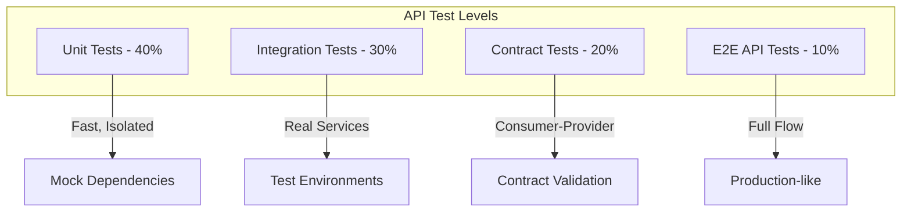
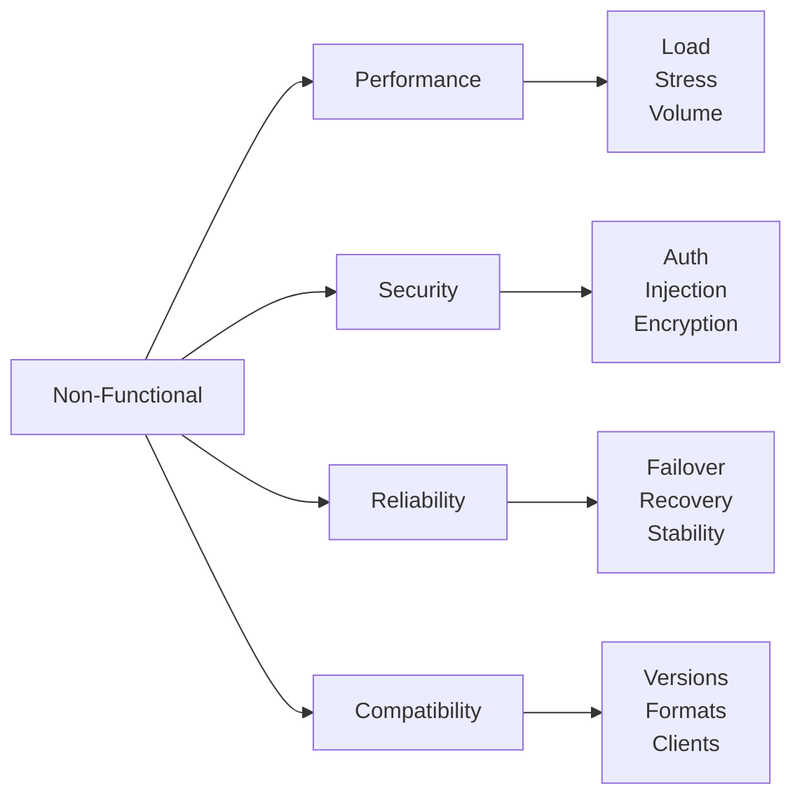
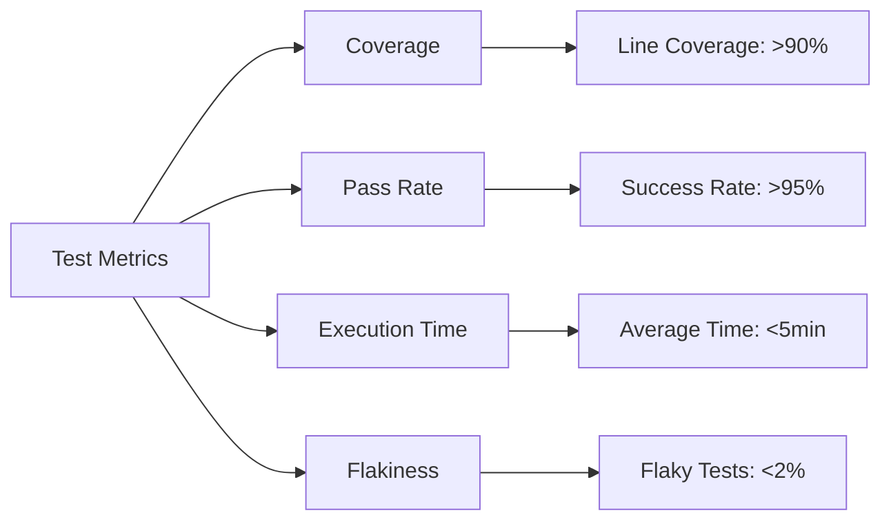

# API Testing Guide

## 1. API Testing Overview

### 1.1 API Testing Pyramid



### 1.2 API Testing Strategy

| Test Type | Purpose | Scope | Tools | Execution |
|-----------|---------|-------|-------|-----------|
| **Unit** | Logic validation | Single function | Jest, Mocha | Every commit |
| **Integration** | Service interaction | Multiple components | Supertest | Every build |
| **Contract** | API contract | Consumer-Provider | Pact | Daily |
| **Performance** | Load testing | Full API | K6, JMeter | Weekly |
| **Security** | Vulnerability | All endpoints | OWASP ZAP | Daily |
| **E2E** | User flows | Complete system | Postman | Per release |

## 2. API Test Categories

### 2.1 Functional Testing

```yaml
functional_tests:
  happy_path:
    description: Normal successful flows
    coverage: 100%
    examples:
      - Create resource successfully
      - Retrieve existing resource
      - Update with valid data
      - Delete existing resource
      
  negative_testing:
    description: Error scenarios
    coverage: 100%
    examples:
      - Invalid input data
      - Resource not found
      - Unauthorized access
      - Constraint violations
      
  boundary_testing:
    description: Edge cases
    coverage: Critical paths
    examples:
      - Maximum field lengths
      - Minimum/maximum values
      - Empty/null values
      - Special characters
```

### 2.2 Non-Functional Testing



## 3. API Test Implementation

### 3.1 Test Structure

```javascript
// API Test Structure Example
describe('Product API Tests', () => {
  let authToken;
  let testProductId;
  
  // Setup
  beforeAll(async () => {
    authToken = await getAuthToken();
    await setupTestData();
  });
  
  // Teardown
  afterAll(async () => {
    await cleanupTestData();
  });
  
  describe('GET /api/v1/products', () => {
    test('should return paginated products', async () => {
      const response = await request(app)
        .get('/api/v1/products')
        .set('Authorization', `Bearer ${authToken}`)
        .query({ page: 1, limit: 20 });
      
      expect(response.status).toBe(200);
      expect(response.body).toHaveProperty('data');
      expect(response.body.data).toBeArray();
      expect(response.body.meta.pagination).toBeDefined();
    });
    
    test('should filter products by category', async () => {
      const response = await request(app)
        .get('/api/v1/products')
        .set('Authorization', `Bearer ${authToken}`)
        .query({ category: 'electronics' });
      
      expect(response.status).toBe(200);
      response.body.data.forEach(product => {
        expect(product.category).toBe('electronics');
      });
    });
  });
});
```

### 3.2 Test Data Management

```yaml
test_data_strategy:
  approaches:
    fixtures:
      description: Static test data files
      use_case: Predictable scenarios
      location: /test/fixtures
      format: JSON/YAML
      
    factories:
      description: Dynamic data generation
      use_case: Unique test data
      library: faker.js
      example: generateUser(), generateProduct()
      
    builders:
      description: Fluent API for test objects
      use_case: Complex objects
      pattern: |
        new ProductBuilder()
          .withName('Test Product')
          .withPrice(99.99)
          .build()
          
    database_seeds:
      description: Pre-populated test database
      use_case: Integration tests
      reset: Before each test suite
```

## 4. HTTP Method Testing

### 4.1 GET Method Tests

```javascript
describe('GET Method Testing', () => {
  const testCases = [
    {
      description: 'Get all resources',
      endpoint: '/api/v1/products',
      expectedStatus: 200,
      validations: ['isPaginated', 'hasData', 'hasMetadata']
    },
    {
      description: 'Get single resource',
      endpoint: '/api/v1/products/{id}',
      expectedStatus: 200,
      validations: ['hasId', 'hasAllFields', 'correctDataTypes']
    },
    {
      description: 'Get non-existent resource',
      endpoint: '/api/v1/products/invalid-id',
      expectedStatus: 404,
      validations: ['hasErrorMessage', 'hasErrorCode']
    },
    {
      description: 'Get with query parameters',
      endpoint: '/api/v1/products?category=electronics&sort=-price',
      expectedStatus: 200,
      validations: ['isFiltered', 'isSorted']
    }
  ];
  
  testCases.forEach(testCase => {
    test(testCase.description, async () => {
      const response = await makeRequest('GET', testCase.endpoint);
      expect(response.status).toBe(testCase.expectedStatus);
      runValidations(response, testCase.validations);
    });
  });
});
```

### 4.2 POST Method Tests

```javascript
describe('POST Method Testing', () => {
  test('Create resource with valid data', async () => {
    const newProduct = {
      name: 'Test Product',
      price: 99.99,
      category: 'electronics'
    };
    
    const response = await request(app)
      .post('/api/v1/products')
      .set('Authorization', `Bearer ${authToken}`)
      .send(newProduct);
    
    expect(response.status).toBe(201);
    expect(response.body.data.id).toBeDefined();
    expect(response.headers.location).toContain(response.body.data.id);
  });
  
  test('Prevent duplicate creation (idempotency)', async () => {
    const idempotencyKey = generateUUID();
    const productData = { name: 'Product', price: 50 };
    
    const response1 = await request(app)
      .post('/api/v1/products')
      .set('Idempotency-Key', idempotencyKey)
      .send(productData);
    
    const response2 = await request(app)
      .post('/api/v1/products')
      .set('Idempotency-Key', idempotencyKey)
      .send(productData);
    
    expect(response1.body.data.id).toBe(response2.body.data.id);
  });
});
```

### 4.3 PUT/PATCH Method Tests

```javascript
describe('PUT/PATCH Method Testing', () => {
  test('Full update with PUT', async () => {
    const updatedProduct = {
      name: 'Updated Product',
      price: 149.99,
      category: 'electronics',
      description: 'Updated description'
    };
    
    const response = await request(app)
      .put(`/api/v1/products/${productId}`)
      .set('Authorization', `Bearer ${authToken}`)
      .send(updatedProduct);
    
    expect(response.status).toBe(200);
    expect(response.body.data).toMatchObject(updatedProduct);
  });
  
  test('Partial update with PATCH', async () => {
    const partialUpdate = {
      price: 129.99
    };
    
    const response = await request(app)
      .patch(`/api/v1/products/${productId}`)
      .set('Authorization', `Bearer ${authToken}`)
      .send(partialUpdate);
    
    expect(response.status).toBe(200);
    expect(response.body.data.price).toBe(129.99);
    // Other fields should remain unchanged
    expect(response.body.data.name).toBe(originalName);
  });
});
```

### 4.4 DELETE Method Tests

```javascript
describe('DELETE Method Testing', () => {
  test('Delete existing resource', async () => {
    const deleteResponse = await request(app)
      .delete(`/api/v1/products/${productId}`)
      .set('Authorization', `Bearer ${authToken}`);
    
    expect(deleteResponse.status).toBe(204);
    
    // Verify deletion
    const getResponse = await request(app)
      .get(`/api/v1/products/${productId}`)
      .set('Authorization', `Bearer ${authToken}`);
    
    expect(getResponse.status).toBe(404);
  });
  
  test('Idempotent delete', async () => {
    // First delete
    await request(app)
      .delete(`/api/v1/products/${productId}`)
      .set('Authorization', `Bearer ${authToken}`);
    
    // Second delete should also succeed (idempotent)
    const response = await request(app)
      .delete(`/api/v1/products/${productId}`)
      .set('Authorization', `Bearer ${authToken}`);
    
    expect([204, 404]).toContain(response.status);
  });
});
```

## 5. Response Validation

### 5.1 Status Code Validation

```yaml
status_code_tests:
  2xx_success:
    200_ok: [GET successful, PUT successful]
    201_created: [POST successful with resource creation]
    204_no_content: [DELETE successful, PUT with no response body]
    
  4xx_client_errors:
    400_bad_request: [Invalid request body, Missing required fields]
    401_unauthorized: [Missing auth token, Expired token]
    403_forbidden: [Insufficient permissions]
    404_not_found: [Resource doesn't exist]
    409_conflict: [Duplicate resource, Constraint violation]
    429_too_many_requests: [Rate limit exceeded]
    
  5xx_server_errors:
    500_internal_server: [Unexpected server error]
    502_bad_gateway: [Upstream service error]
    503_service_unavailable: [Service maintenance]
    504_gateway_timeout: [Upstream timeout]
```

### 5.2 Response Schema Validation

```javascript
// JSON Schema Validation
const productSchema = {
  type: 'object',
  required: ['id', 'name', 'price', 'category'],
  properties: {
    id: { type: 'string', pattern: '^prod_[a-zA-Z0-9]+$' },
    name: { type: 'string', minLength: 1, maxLength: 255 },
    price: { type: 'number', minimum: 0 },
    category: { type: 'string', enum: ['electronics', 'clothing', 'books'] },
    description: { type: 'string' },
    createdAt: { type: 'string', format: 'date-time' },
    updatedAt: { type: 'string', format: 'date-time' }
  }
};

test('Validate response schema', async () => {
  const response = await request(app)
    .get(`/api/v1/products/${productId}`);
  
  const valid = ajv.validate(productSchema, response.body.data);
  expect(valid).toBe(true);
  if (!valid) console.log(ajv.errors);
});
```

## 6. Authentication & Authorization Testing

### 6.1 Authentication Tests

```javascript
describe('Authentication Testing', () => {
  test('Access without token returns 401', async () => {
    const response = await request(app)
      .get('/api/v1/users/me');
    
    expect(response.status).toBe(401);
    expect(response.body.error.code).toBe('UNAUTHORIZED');
  });
  
  test('Access with invalid token returns 401', async () => {
    const response = await request(app)
      .get('/api/v1/users/me')
      .set('Authorization', 'Bearer invalid-token');
    
    expect(response.status).toBe(401);
  });
  
  test('Access with expired token returns 401', async () => {
    const expiredToken = generateExpiredToken();
    const response = await request(app)
      .get('/api/v1/users/me')
      .set('Authorization', `Bearer ${expiredToken}`);
    
    expect(response.status).toBe(401);
    expect(response.body.error.code).toBe('TOKEN_EXPIRED');
  });
});
```

### 6.2 Authorization Tests

```javascript
describe('Authorization Testing', () => {
  test('User cannot access admin endpoints', async () => {
    const userToken = await getUserToken();
    const response = await request(app)
      .get('/api/v1/admin/users')
      .set('Authorization', `Bearer ${userToken}`);
    
    expect(response.status).toBe(403);
    expect(response.body.error.code).toBe('INSUFFICIENT_PERMISSIONS');
  });
  
  test('User can only modify own resources', async () => {
    const userToken = await getUserToken();
    const otherUserId = 'user_456';
    
    const response = await request(app)
      .put(`/api/v1/users/${otherUserId}`)
      .set('Authorization', `Bearer ${userToken}`)
      .send({ name: 'Hacker' });
    
    expect(response.status).toBe(403);
  });
});
```

## 7. Error Handling Tests

### 7.1 Input Validation Tests

```javascript
describe('Input Validation Testing', () => {
  const invalidInputs = [
    {
      description: 'Missing required field',
      input: { price: 100 }, // missing 'name'
      expectedError: 'MISSING_REQUIRED_FIELD'
    },
    {
      description: 'Invalid data type',
      input: { name: 'Product', price: 'not-a-number' },
      expectedError: 'INVALID_DATA_TYPE'
    },
    {
      description: 'Value out of range',
      input: { name: 'Product', price: -10 },
      expectedError: 'VALUE_OUT_OF_RANGE'
    },
    {
      description: 'String too long',
      input: { name: 'A'.repeat(256), price: 100 },
      expectedError: 'STRING_TOO_LONG'
    }
  ];
  
  invalidInputs.forEach(({ description, input, expectedError }) => {
    test(description, async () => {
      const response = await request(app)
        .post('/api/v1/products')
        .send(input);
      
      expect(response.status).toBe(400);
      expect(response.body.error.code).toBe(expectedError);
    });
  });
});
```

### 7.2 Business Logic Error Tests

```javascript
describe('Business Logic Error Testing', () => {
  test('Cannot order out-of-stock item', async () => {
    const outOfStockProductId = 'prod_out_of_stock';
    
    const response = await request(app)
      .post('/api/v1/orders')
      .send({
        items: [{ productId: outOfStockProductId, quantity: 1 }]
      });
    
    expect(response.status).toBe(422);
    expect(response.body.error.code).toBe('OUT_OF_STOCK');
  });
  
  test('Cannot apply expired coupon', async () => {
    const response = await request(app)
      .post('/api/v1/cart/apply-coupon')
      .send({ couponCode: 'EXPIRED2023' });
    
    expect(response.status).toBe(422);
    expect(response.body.error.code).toBe('COUPON_EXPIRED');
  });
});
```

## 8. Performance Testing

### 8.1 Response Time Tests

```javascript
describe('API Performance Testing', () => {
  test('Response time should be under threshold', async () => {
    const startTime = Date.now();
    
    const response = await request(app)
      .get('/api/v1/products')
      .query({ limit: 100 });
    
    const responseTime = Date.now() - startTime;
    
    expect(response.status).toBe(200);
    expect(responseTime).toBeLessThan(2000); // 2 seconds
    
    // Log for monitoring
    console.log(`Response time: ${responseTime}ms`);
  });
  
  test('Bulk operations performance', async () => {
    const bulkData = Array(100).fill(null).map((_, i) => ({
      name: `Product ${i}`,
      price: Math.random() * 100
    }));
    
    const startTime = Date.now();
    
    const response = await request(app)
      .post('/api/v1/products/bulk')
      .send({ products: bulkData });
    
    const responseTime = Date.now() - startTime;
    
    expect(response.status).toBe(201);
    expect(responseTime).toBeLessThan(5000); // 5 seconds for 100 items
  });
});
```

### 8.2 Load Testing with K6

```javascript
// k6-load-test.js
import http from 'k6/http';
import { check, sleep } from 'k6';
import { Rate } from 'k6/metrics';

const errorRate = new Rate('errors');

export const options = {
  stages: [
    { duration: '2m', target: 100 }, // Ramp up
    { duration: '5m', target: 100 }, // Stay at 100 users
    { duration: '2m', target: 200 }, // Ramp up
    { duration: '5m', target: 200 }, // Stay at 200 users
    { duration: '2m', target: 0 },   // Ramp down
  ],
  thresholds: {
    http_req_duration: ['p(95)<2000'], // 95% of requests under 2s
    errors: ['rate<0.05'],             // Error rate under 5%
  },
};

export default function () {
  const response = http.get('https://api.techally.com/v1/products');
  
  const success = check(response, {
    'status is 200': (r) => r.status === 200,
    'response time < 2000ms': (r) => r.timings.duration < 2000,
    'has products': (r) => JSON.parse(r.body).data.length > 0,
  });
  
  errorRate.add(!success);
  sleep(1);
}
```

## 9. Security Testing

### 9.1 Common Security Tests

```javascript
describe('API Security Testing', () => {
  test('SQL Injection prevention', async () => {
    const maliciousInput = "'; DROP TABLE users; --";
    
    const response = await request(app)
      .get('/api/v1/products')
      .query({ search: maliciousInput });
    
    expect(response.status).not.toBe(500);
    // Verify database is intact
    const dbCheck = await checkDatabaseIntegrity();
    expect(dbCheck).toBe(true);
  });
  
  test('XSS prevention', async () => {
    const xssPayload = '<script>alert("XSS")</script>';
    
    const response = await request(app)
      .post('/api/v1/products')
      .send({
        name: xssPayload,
        price: 100
      });
    
    // If accepted, verify it's escaped in response
    if (response.status === 201) {
      expect(response.body.data.name).not.toContain('<script>');
      expect(response.body.data.name).toContain('&lt;script&gt;');
    }
  });
  
  test('Rate limiting enforcement', async () => {
    const requests = Array(150).fill(null).map(() => 
      request(app).get('/api/v1/products')
    );
    
    const responses = await Promise.all(requests);
    const rateLimited = responses.filter(r => r.status === 429);
    
    expect(rateLimited.length).toBeGreaterThan(0);
  });
});
```

## 10. Contract Testing

### 10.1 Consumer-Provider Contract

```javascript
// Pact Consumer Test
describe('Product API Consumer Contract', () => {
  const provider = new Pact({
    consumer: 'Frontend',
    provider: 'ProductAPI',
  });
  
  beforeAll(() => provider.setup());
  afterAll(() => provider.finalize());
  
  test('Get product by ID', async () => {
    await provider.addInteraction({
      state: 'product exists',
      uponReceiving: 'a request for a product',
      withRequest: {
        method: 'GET',
        path: '/api/v1/products/prod_123',
      },
      willRespondWith: {
        status: 200,
        headers: { 'Content-Type': 'application/json' },
        body: {
          id: 'prod_123',
          name: like('Product Name'),
          price: like(99.99),
          category: term({
            matcher: 'electronics|clothing|books',
            generate: 'electronics'
          })
        }
      }
    });
    
    const response = await getProduct('prod_123');
    expect(response.id).toBe('prod_123');
  });
});
```

## 11. Test Automation Framework

### 11.1 Test Framework Structure

```yaml
test_framework:
  structure:
    /tests:
      /unit:        # Unit tests
      /integration: # Integration tests
      /e2e:        # End-to-end tests
      /performance: # Performance tests
      /security:   # Security tests
      /contracts:  # Contract tests
      /fixtures:   # Test data
      /helpers:    # Utility functions
      /config:     # Test configuration
      
  configuration:
    test_runner: Jest
    assertion_library: Chai/Expect
    http_client: Supertest/Axios
    mocking: Jest mocks/Sinon
    coverage: Istanbul/NYC
```

## 12. Continuous Integration

### 12.1 CI Pipeline Integration

```yaml
# .github/workflows/api-tests.yml
name: API Tests
on: [push, pull_request]

jobs:
  api-tests:
    runs-on: ubuntu-latest
    steps:
      - uses: actions/checkout@v2
      
      - name: Setup Node.js
        uses: actions/setup-node@v2
        with:
          node-version: '18'
          
      - name: Install dependencies
        run: npm ci
        
      - name: Run unit tests
        run: npm run test:unit
        
      - name: Run integration tests
        run: npm run test:integration
        
      - name: Run contract tests
        run: npm run test:contracts
        
      - name: Upload coverage
        uses: codecov/codecov-action@v2
        
      - name: Run security tests
        run: npm run test:security
        
      - name: Performance tests
        if: github.event_name == 'push' && github.ref == 'refs/heads/main'
        run: npm run test:performance
```

## 13. Test Reporting

### 13.1 Test Metrics



## 14. Best Practices

### 14.1 API Testing Best Practices

| Practice | Description | Implementation |
|----------|-------------|----------------|
| **Test Independence** | Tests don't depend on each other | Setup/teardown for each |
| **Data Isolation** | Separate test data | Test-specific database |
| **Deterministic** | Same result every time | No random/time-based data |
| **Fast Execution** | Quick feedback | Parallel execution |
| **Clear Assertions** | Obvious failure reasons | Descriptive messages |
| **Version Testing** | Test all API versions | Version matrix |
| **Documentation** | Document test cases | Comments and descriptions |

## 15. References

- [REST API Structure](../04_api/rest-api-structure.md) - `API-REST-001`
- [API Design Principles](../04_api/api-design-principles.md) - `API-DESIGN-001`
- [Test Criteria](./test-criteria.md) - `TEST-CRIT-001`
- [Test Plan](./test-plan.md) - `TEST-001`
- [Security Testing](./security-test-plan.md) - `TEST-SEC-001`

---
*This API testing guide is maintained by the QA Team and updated with each API change.*
