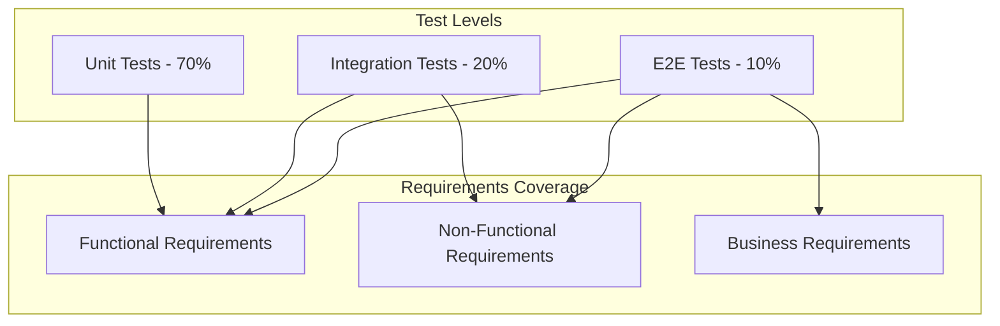
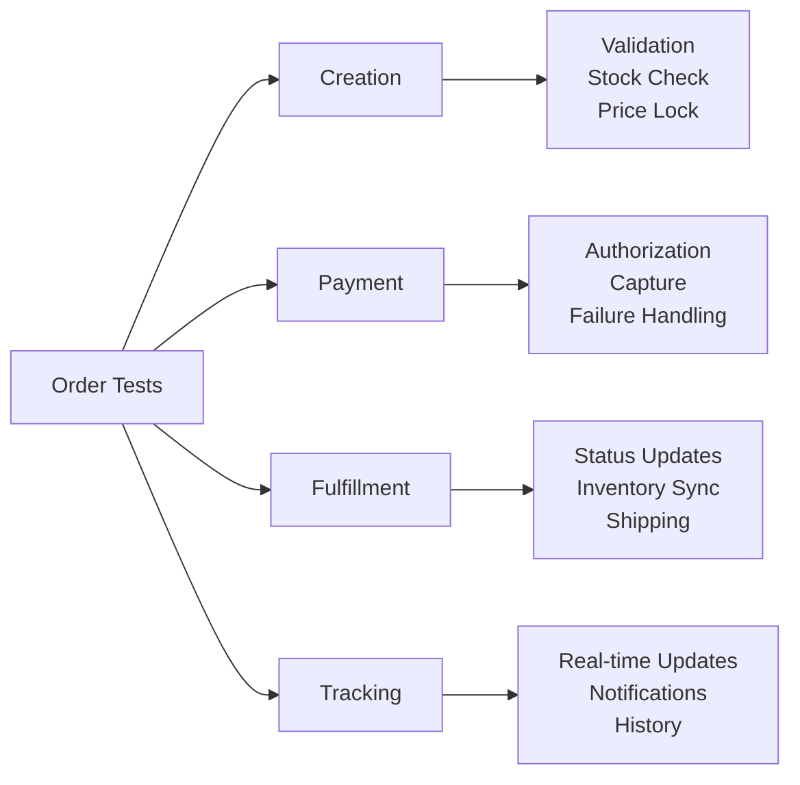
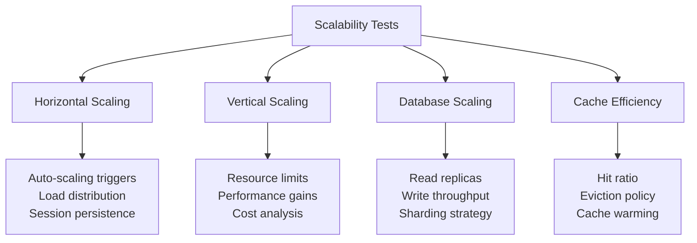
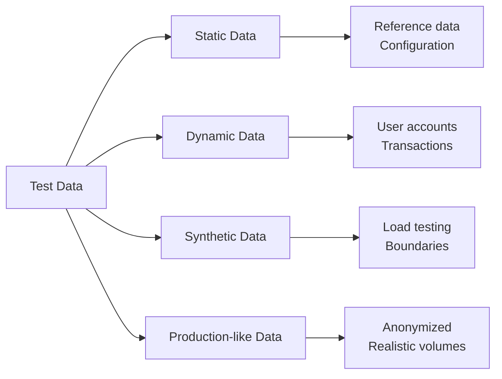
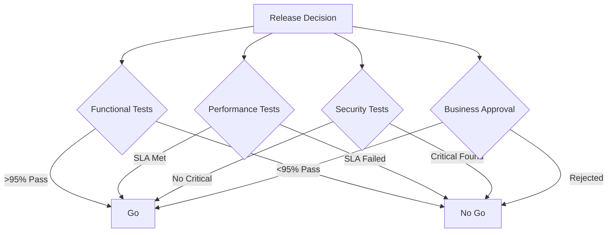
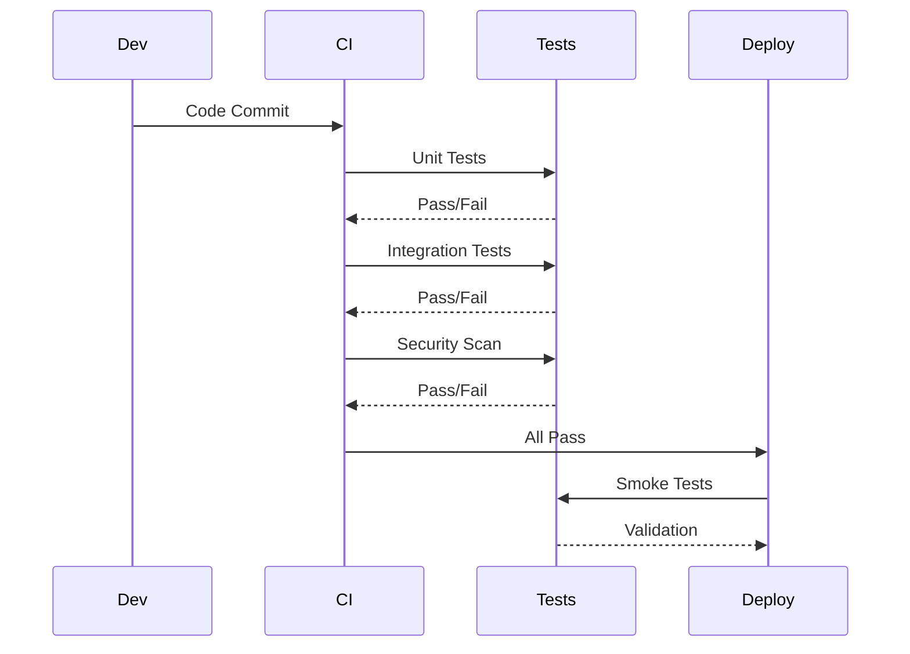

# Test Criteria and Requirements Traceability

## 1. Test Criteria Overview

### 1.1 Testing Pyramid with Requirements Mapping



### 1.2 Test Coverage Matrix

| Requirement Type | Unit Tests | Integration | E2E | Performance | Security |
|-----------------|------------|-------------|-----|-------------|----------|
| Functional | 90% | 80% | 70% | - | - |
| Performance | - | 30% | 50% | 100% | - |
| Security | 20% | 40% | 30% | - | 100% |
| Usability | - | - | 80% | - | - |
| Reliability | 30% | 60% | 70% | 80% | - |

## 2. Functional Requirements Test Criteria

### 2.1 User Management Testing

| Requirement ID | Requirement | Test Criteria | Test Type | Pass Criteria |
|---------------|-------------|---------------|-----------|---------------|
| `REQ-FR-001` | User Registration | - Valid email format<br>- Password complexity<br>- Duplicate prevention<br>- Email verification | Unit, Integration, E2E | - 100% validation rules pass<br>- Email sent within 1 min<br>- No duplicate accounts |
| `REQ-FR-002` | User Login | - Valid credentials<br>- Invalid credentials<br>- Account locked<br>- Session management | Unit, Integration, E2E | - Successful auth < 2s<br>- Failed auth logged<br>- Lockout after 5 attempts |
| `REQ-FR-003` | Password Reset | - Token generation<br>- Token expiry<br>- Password update<br>- Security validation | Integration, E2E | - Token valid for 1 hour<br>- Old password invalidated<br>- Email notification sent |
| `REQ-FR-004` | Profile Management | - Data validation<br>- Update operations<br>- Image upload<br>- Privacy settings | Unit, Integration, E2E | - All fields updatable<br>- Image < 5MB<br>- Changes persisted |

### 2.2 Product Catalog Testing

| Requirement ID | Requirement | Test Criteria | Test Type | Pass Criteria |
|---------------|-------------|---------------|-----------|---------------|
| `REQ-FR-010` | Product Listing | - Pagination works<br>- Sorting accurate<br>- Filters apply correctly<br>- Performance | Integration, E2E, Performance | - Load < 2s<br>- 100 products/page<br>- All filters functional |
| `REQ-FR-011` | Product Search | - Keyword matching<br>- Fuzzy search<br>- Relevance ranking<br>- Search suggestions | Unit, Integration, E2E | - Results < 500ms<br>- Typo tolerance<br>- Min 80% relevance |
| `REQ-FR-012` | Product Details | - All fields displayed<br>- Images load<br>- Variants shown<br>- Stock status | Integration, E2E | - Complete data<br>- Images < 3s load<br>- Real-time stock |
| `REQ-FR-013` | Product Reviews | - Rating calculation<br>- Review validation<br>- Sorting/filtering<br>- Moderation | Unit, Integration, E2E | - Avg rating accurate<br>- Profanity filter<br>- Moderation queue |

### 2.3 Shopping Cart Testing

```yaml
cart_test_criteria:
  REQ-FR-020:
    requirement: Add to Cart
    test_scenarios:
      - Add single item
      - Add multiple items
      - Add with variants
      - Add out-of-stock item
    validations:
      - Item appears in cart
      - Quantity updates correctly
      - Price calculates accurately
      - Stock validation works
    pass_criteria:
      response_time: <200ms
      accuracy: 100%
      persistence: Session/User based
      
  REQ-FR-021:
    requirement: Update Cart
    test_scenarios:
      - Update quantity
      - Remove item
      - Clear cart
      - Apply coupon
    validations:
      - Quantity constraints (1-99)
      - Stock availability check
      - Price recalculation
      - Coupon validation
    pass_criteria:
      update_time: <500ms
      calculation_accuracy: 100%
      coupon_validation: Real-time
```

### 2.4 Order Processing Testing



| Requirement ID | Test Scenarios | Validation Points | Pass Criteria |
|---------------|----------------|-------------------|---------------|
| `REQ-FR-030` | Order Creation | - All fields validated<br>- Inventory reserved<br>- Order number generated<br>- Confirmation sent | - Order created < 5s<br>- Unique order number<br>- Email within 1 min |
| `REQ-FR-031` | Payment Processing | - Card validation<br>- 3DS flow<br>- Payment gateway integration<br>- Failure handling | - Payment < 10s<br>- PCI compliance<br>- Retry logic works |
| `REQ-FR-032` | Order Status | - Status transitions<br>- Real-time updates<br>- History tracking<br>- Notifications | - Updates < 1s<br>- All statuses tracked<br>- Notifications sent |

## 3. Non-Functional Requirements Test Criteria

### 3.1 Performance Testing Criteria

| NFR ID | Requirement | Test Scenario | Load Profile | Pass Criteria |
|--------|-------------|---------------|--------------|---------------|
| `NFR-PERF-001` | Homepage Load | Load homepage | 1000 concurrent users | - P95 < 3s<br>- P99 < 5s<br>- 0% errors |
| `NFR-PERF-002` | Product Search | Search products | 500 req/sec | - P95 < 1s<br>- Relevance > 80%<br>- <1% errors |
| `NFR-PERF-003` | Add to Cart | Add items to cart | 1000 req/sec | - P99 < 500ms<br>- 100% success<br>- Session consistency |
| `NFR-PERF-004` | Checkout | Complete checkout | 200 concurrent | - P95 < 5s<br>- 0% data loss<br>- Payment success > 95% |

### 3.2 Performance Test Execution Plan

```yaml
performance_tests:
  load_test:
    description: Normal load conditions
    virtual_users: 1000
    ramp_up: 5 minutes
    duration: 30 minutes
    scenarios:
      - browse_products: 40%
      - search: 30%
      - add_to_cart: 20%
      - checkout: 10%
    
  stress_test:
    description: Beyond normal capacity
    virtual_users: 5000
    ramp_up: 10 minutes
    duration: 20 minutes
    break_point_detection: true
    
  spike_test:
    description: Sudden traffic spike
    baseline: 100 users
    spike_to: 2000 users
    spike_duration: 2 minutes
    recovery_time: measure
    
  endurance_test:
    description: Extended period test
    virtual_users: 500
    duration: 4 hours
    memory_leak_detection: true
    resource_monitoring: continuous
```

### 3.3 Security Testing Criteria

| NFR ID | Security Requirement | Test Criteria | Test Method | Pass Criteria |
|--------|---------------------|---------------|-------------|---------------|
| `NFR-SEC-001` | Authentication | - Password strength<br>- Brute force protection<br>- Session security<br>- MFA validation | Automated + Manual | - No weak passwords<br>- Lockout works<br>- Session timeout<br>- MFA enforced |
| `NFR-SEC-002` | Authorization | - Role-based access<br>- Privilege escalation<br>- API permissions<br>- Resource isolation | Automated + Penetration | - RBAC enforced<br>- No escalation<br>- API secured<br>- Data isolated |
| `NFR-SEC-003` | Data Protection | - Encryption at rest<br>- Encryption in transit<br>- PII handling<br>- Data masking | Audit + Scanning | - AES-256 encryption<br>- TLS 1.3<br>- PII protected<br>- Logs sanitized |
| `NFR-SEC-004` | Input Validation | - SQL injection<br>- XSS attacks<br>- Command injection<br>- File upload | SAST + DAST | - No injections<br>- XSS prevented<br>- Safe uploads<br>- Input sanitized |

### 3.4 Scalability Testing Criteria



### 3.5 Reliability Testing Criteria

| NFR ID | Requirement | Test Scenarios | Measurement | Pass Criteria |
|--------|-------------|----------------|-------------|---------------|
| `NFR-REL-001` | Availability 99.9% | - Service uptime<br>- Failover testing<br>- Recovery testing | Uptime monitoring | - Monthly uptime > 99.9%<br>- Failover < 1 min<br>- Recovery < 2 hours |
| `NFR-REL-002` | Fault Tolerance | - Component failure<br>- Network issues<br>- Database failure | Chaos engineering | - Graceful degradation<br>- No data loss<br>- User notification |
| `NFR-REL-003` | Data Integrity | - Transaction consistency<br>- Backup/restore<br>- Replication lag | Data validation | - ACID compliance<br>- Backup valid<br>- Lag < 1s |

## 4. Acceptance Criteria Mapping

### 4.1 User Story to Test Criteria

```yaml
user_story_US001:
  title: "As a customer, I want to search for products"
  acceptance_criteria:
    - AC1: Search returns relevant results
    - AC2: Results display within 2 seconds
    - AC3: Filters can be applied
    - AC4: Results are paginated
    
  test_criteria:
    AC1:
      - Keyword matching accuracy > 80%
      - Typo tolerance enabled
      - Category relevance considered
    AC2:
      - Response time P95 < 2s under load
      - First byte < 200ms
      - Full render < 2s
    AC3:
      - All filter combinations work
      - Multiple filters can combine
      - Filter state persists
    AC4:
      - 20 results per page
      - Navigation controls work
      - Page state in URL
```

### 4.2 Business Requirements Validation

| Business Requirement | Test Validation | Success Metrics |
|---------------------|-----------------|-----------------|
| Increase conversion rate | A/B testing, funnel analysis | >15% conversion |
| Reduce cart abandonment | Session recording, analytics | <30% abandonment |
| Improve user satisfaction | Usability testing, surveys | NPS > 50 |
| Ensure PCI compliance | Security audit, penetration test | Pass certification |

## 5. Test Data Requirements

### 5.1 Test Data Categories



### 5.2 Test Data Specifications

```yaml
test_data_specifications:
  users:
    volume: 10000
    types:
      - regular: 70%
      - premium: 20%
      - admin: 5%
      - test: 5%
    attributes:
      - valid_emails: 95%
      - verified: 80%
      - with_orders: 60%
      
  products:
    volume: 50000
    categories: 50
    attributes:
      - with_images: 100%
      - with_reviews: 40%
      - in_stock: 85%
      - variants: 30%
      
  orders:
    volume: 100000
    distribution:
      - completed: 80%
      - processing: 10%
      - cancelled: 5%
      - refunded: 5%
```

## 6. Environment-Specific Criteria

### 6.1 Environment Test Coverage

| Environment | Test Types | Data Set | Pass Criteria |
|-------------|------------|----------|---------------|
| Development | Unit, Integration | Minimal | 80% pass |
| QA | All except production | Full test data | 95% pass |
| Staging | All types | Production-like | 98% pass |
| Production | Smoke, Monitoring | Real data | 100% critical |

### 6.2 Environment Validation

```yaml
environment_validation:
  development:
    - Code coverage > 80%
    - All unit tests pass
    - Integration tests pass
    
  qa:
    - Functional coverage > 90%
    - Performance baseline met
    - Security scans clean
    
  staging:
    - Full regression pass
    - Performance matches production
    - Deployment validation
    
  production:
    - Smoke tests pass
    - Monitoring active
    - Rollback tested
```

## 7. Test Exit Criteria

### 7.1 Release Criteria



### 7.2 Quality Gates

| Gate | Criteria | Threshold | Action if Failed |
|------|----------|-----------|------------------|
| Unit Test Gate | Coverage and pass rate | >90% coverage, 100% pass | Block commit |
| Integration Gate | API tests | >95% pass | Block deployment |
| Performance Gate | Load test results | Meet SLA | Investigation required |
| Security Gate | Vulnerability scan | No high/critical | Fix required |
| UAT Gate | User acceptance | Sign-off received | Cannot release |

## 8. Defect Acceptance Criteria

### 8.1 Defect Severity Levels

| Severity | Definition | Examples | Resolution Time |
|----------|------------|----------|-----------------|
| P1 - Critical | System down, data loss | Payment failure, site crash | 4 hours |
| P2 - High | Major feature broken | Cannot add to cart | 24 hours |
| P3 - Medium | Feature impaired | Slow search | 3 days |
| P4 - Low | Minor issue | Typo, cosmetic | Next release |

### 8.2 Defect Metrics

```yaml
defect_metrics:
  density:
    target: <5 defects/KLOC
    measurement: defects_found/lines_of_code
    
  escape_rate:
    target: <2%
    measurement: production_defects/total_defects
    
  resolution_rate:
    target: >90% within SLA
    measurement: resolved_in_sla/total_resolved
    
  reopen_rate:
    target: <5%
    measurement: reopened/total_closed
```

## 9. Continuous Testing Criteria

### 9.1 CI/CD Test Gates



### 9.2 Automated Test Criteria

| Test Type | Automation % | Execution Frequency | Failure Action |
|-----------|--------------|-------------------|----------------|
| Unit Tests | 100% | Every commit | Block merge |
| API Tests | 90% | Every build | Alert team |
| UI Tests | 70% | Nightly | Create ticket |
| Performance | 80% | Weekly | Investigation |
| Security | 100% | Daily | Security review |

## 10. Compliance Testing Criteria

### 10.1 Regulatory Compliance

| Regulation | Test Requirements | Evidence Required | Frequency |
|------------|------------------|-------------------|-----------|
| PCI DSS | - Cardholder data protection<br>- Access controls<br>- Vulnerability scanning | Audit reports, scan results | Quarterly |
| GDPR | - Data privacy<br>- Right to deletion<br>- Consent management | Privacy assessment, logs | Continuous |
| ADA/WCAG | - Accessibility testing<br>- Screen reader compatible<br>- Keyboard navigation | Accessibility audit | Per release |

## 11. Test Metrics and KPIs

### 11.1 Testing KPIs

```yaml
testing_kpis:
  test_coverage:
    target: >85%
    formula: (tested_requirements/total_requirements) * 100
    
  defect_detection_rate:
    target: >80%
    formula: (defects_in_testing/total_defects) * 100
    
  test_execution_rate:
    target: 100 tests/day
    formula: tests_executed/days
    
  automation_roi:
    target: >300%
    formula: (manual_effort_saved/automation_cost) * 100
```

## 12. Requirements Traceability Matrix

### 12.1 Sample Traceability

| Req ID | Requirement | Test Case IDs | Test Type | Status |
|--------|-------------|---------------|-----------|--------|
| REQ-FR-001 | User Registration | TC-001, TC-002, TC-003 | Unit, E2E | ✅ Covered |
| REQ-FR-010 | Product Search | TC-010, TC-011, TC-012 | Integration, E2E | ✅ Covered |
| REQ-NFR-001 | Performance | PT-001, PT-002 | Performance | ✅ Covered |
| REQ-NFR-002 | Security | ST-001, ST-002, ST-003 | Security | ⚠️ Partial |

## 13. References

- [Functional Requirements](../02_requirements/functional-requirements.md) - `REQ-FR-001`
- [Non-Functional Requirements](../02_requirements/non-functional-requirements.md) - `REQ-NFR-001`
- [Test Plan](./test-plan.md) - `TEST-001`
- [Test Strategy](./test-strategy.md) - `TEST-STRAT-001`
- [API Testing](./api-testing.md) - `TEST-API-001`

---
*This test criteria document is maintained by the QA Team and updated with each requirement change.*
