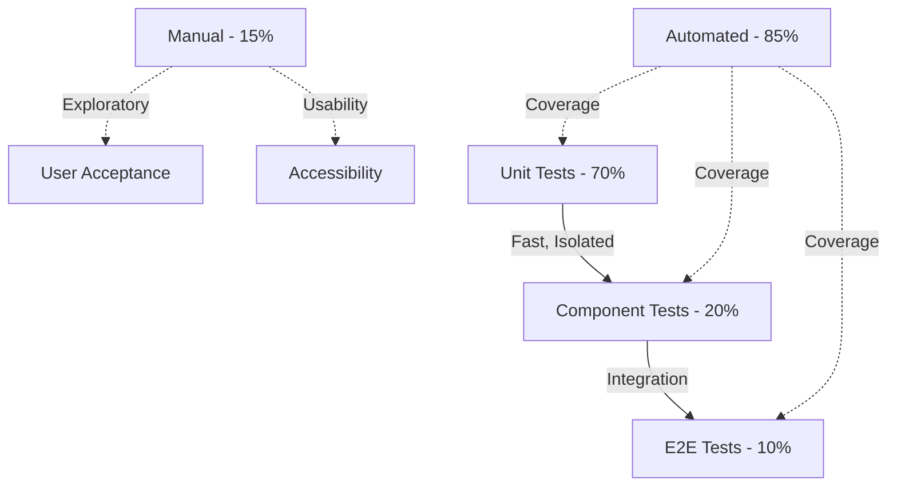
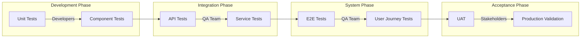
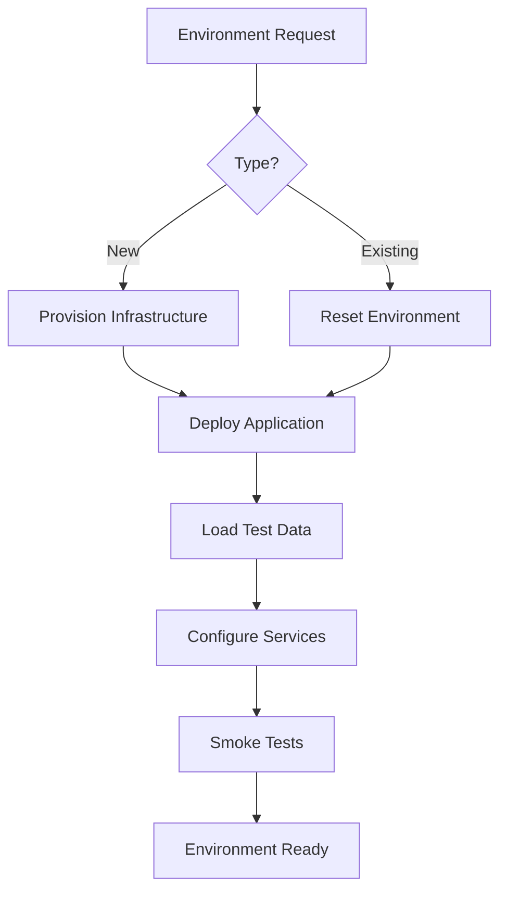
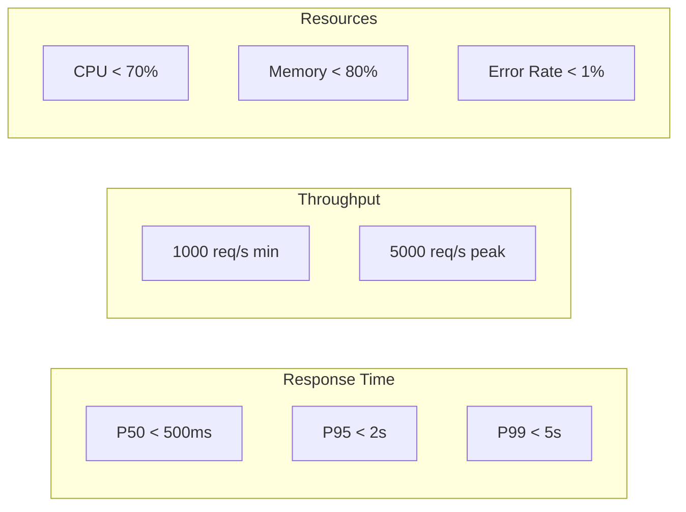
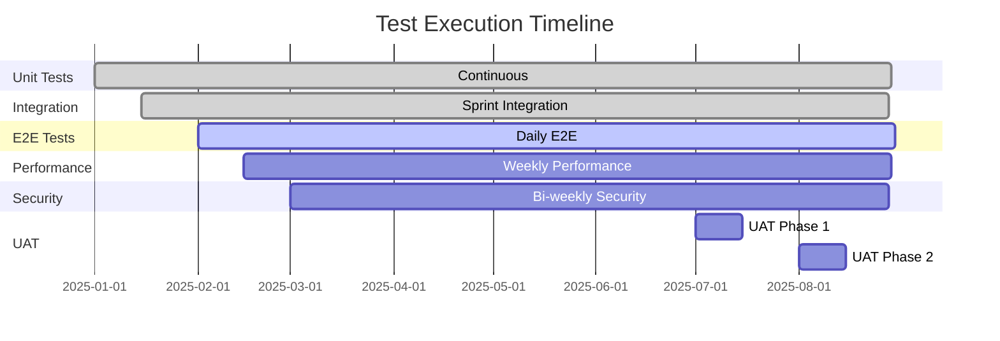
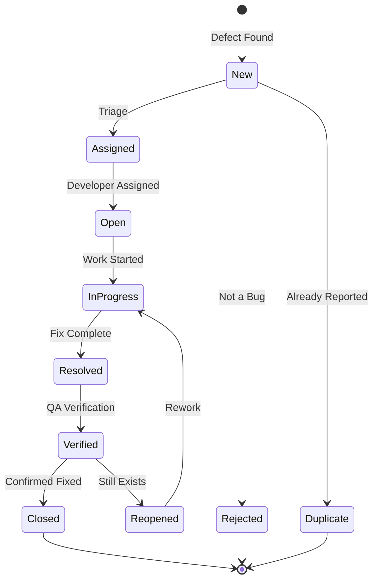
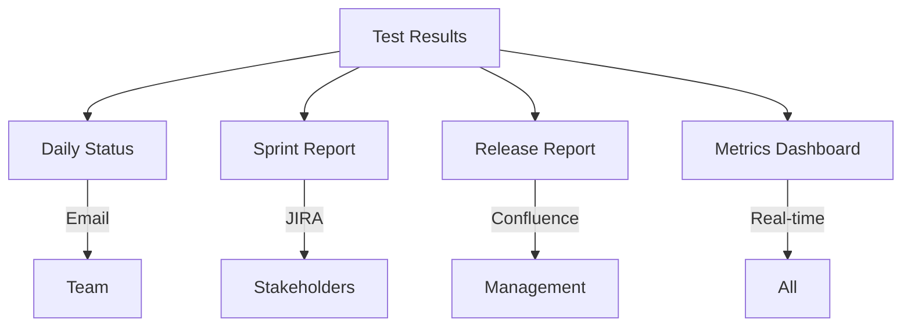

# Master Test Plan

## 1. Test Strategy Overview

### 1.1 Testing Pyramid



### 1.2 Test Phases

| Phase | Objective | Duration | Entry Criteria | Exit Criteria |
|-------|-----------|----------|----------------|---------------|
| Unit Testing | Component validation | Continuous | Code complete | 90% coverage |
| Integration Testing | Service integration | 2 weeks | APIs ready | All endpoints tested |
| System Testing | E2E validation | 2 weeks | Integration complete | Critical paths pass |
| Performance Testing | Load validation | 1 week | System stable | SLA met |
| Security Testing | Vulnerability scan | 1 week | Features complete | No critical issues |
| UAT | User validation | 1 week | System tested | Sign-off received |

## 2. Test Scope

### 2.1 In Scope

| Component | Test Coverage | Priority | Test Types |
|-----------|---------------|----------|------------|
| User Authentication | 95% | Critical | Unit, Integration, Security |
| Product Catalog | 90% | High | Unit, Integration, Performance |
| Shopping Cart | 95% | Critical | Unit, Integration, E2E |
| Checkout Process | 95% | Critical | All types |
| Payment Processing | 98% | Critical | All types + Compliance |
| Order Management | 90% | High | Unit, Integration, E2E |
| Search Functionality | 85% | High | Unit, Integration, Performance |
| Admin Portal | 80% | Medium | Unit, Integration, Manual |

### 2.2 Out of Scope

- Third-party service internals
- Legacy system migrations
- Hardware testing
- Network infrastructure testing

## 3. Test Approach

### 3.1 Test Levels



### 3.2 Test Types Matrix

| Test Type | Automated | Manual | Tools | Frequency |
|-----------|-----------|--------|-------|-----------|
| Unit Tests | ✅ | ❌ | Jest, Mocha | Every commit |
| Integration Tests | ✅ | ⚠️ | Supertest, Postman | Every PR |
| E2E Tests | ✅ | ⚠️ | Cypress, Playwright | Daily |
| Performance Tests | ✅ | ❌ | K6, JMeter | Weekly |
| Security Tests | ✅ | ✅ | OWASP ZAP, Burp | Bi-weekly |
| Accessibility Tests | ✅ | ✅ | axe, NVDA | Sprint |
| Usability Tests | ❌ | ✅ | User panels | Monthly |
| Smoke Tests | ✅ | ❌ | Custom scripts | After deploy |

## 4. Test Cases

### 4.1 Critical Test Scenarios

| ID | Scenario | Steps | Expected Result | Priority |
|----|----------|-------|-----------------|----------|
| `TC-001` | User Registration | 1. Navigate to signup<br>2. Enter valid data<br>3. Submit form | Account created, verification email sent | Critical |
| `TC-002` | Product Search | 1. Enter search term<br>2. Apply filters<br>3. Sort results | Relevant products displayed | High |
| `TC-003` | Add to Cart | 1. Select product<br>2. Choose options<br>3. Add to cart | Item in cart with correct details | Critical |
| `TC-004` | Checkout Process | 1. Review cart<br>2. Enter shipping<br>3. Enter payment<br>4. Confirm | Order placed successfully | Critical |
| `TC-005` | Payment Processing | 1. Enter card details<br>2. Submit payment<br>3. Verify transaction | Payment processed, order confirmed | Critical |

### 4.2 Test Data Requirements

```yaml
testData:
  users:
    valid:
      - email: test.user@example.com
        password: TestPass123!
        role: customer
    invalid:
      - email: invalid-email
        password: weak
    edge:
      - email: user+tag@domain.co.uk
        password: "Very$tr0ng!P@ssw0rd123"
  
  products:
    inStock:
      - id: PROD-001
        price: 99.99
        quantity: 100
    outOfStock:
      - id: PROD-002
        price: 199.99
        quantity: 0
    
  payments:
    validCards:
      - number: 4242424242424242
        type: visa
        cvc: 123
    declinedCards:
      - number: 4000000000000002
        type: visa
        cvc: 123
```

## 5. Test Environment

### 5.1 Environment Configuration

| Environment | Purpose | Configuration | Data | Access |
|-------------|---------|---------------|------|--------|
| Dev | Development testing | Minimal | Mock data | Developers |
| QA | Test execution | Scaled down | Test data | QA Team |
| Staging | Pre-production | Production-like | Sanitized prod | Team |
| Performance | Load testing | Scaled up | Generated | QA Team |
| Security | Security testing | Isolated | Test data | Security team |

### 5.2 Environment Setup



## 6. Test Automation

### 6.1 Automation Framework

| Layer | Framework | Language | Coverage | Execution |
|-------|-----------|----------|----------|-----------|
| Unit | Jest | JavaScript | 90% | CI/CD |
| API | Supertest | JavaScript | 85% | CI/CD |
| UI | Cypress | JavaScript | 70% | Nightly |
| Mobile | Appium | JavaScript | 60% | Nightly |
| Performance | K6 | JavaScript | Key scenarios | Weekly |

### 6.2 CI/CD Integration

```yaml
pipeline:
  stages:
    - build:
        - lint
        - compile
    - test:
        - unit_tests:
            coverage: 90%
            parallel: true
        - integration_tests:
            coverage: 80%
            parallel: true
    - deploy:
        - staging
    - e2e_tests:
        - smoke_tests:
            timeout: 5m
        - regression_tests:
            timeout: 30m
    - performance:
        - load_tests:
            users: 1000
            duration: 10m
    - security:
        - vulnerability_scan
        - penetration_test
```

## 7. Performance Testing

### 7.1 Performance Test Scenarios

| Scenario | Virtual Users | Duration | Ramp-up | Success Criteria |
|----------|---------------|----------|---------|------------------|
| Normal Load | 1000 | 30 min | 5 min | <2s response, 0% error |
| Peak Load | 5000 | 20 min | 10 min | <5s response, <1% error |
| Stress Test | 10000 | 15 min | 5 min | System stability |
| Spike Test | 0→5000→0 | 20 min | Instant | Auto-scaling works |
| Endurance | 500 | 4 hours | 10 min | No memory leaks |

### 7.2 Performance Metrics



## 8. Security Testing

### 8.1 Security Test Categories

| Category | Tests | Tools | Frequency |
|----------|-------|-------|-----------|
| Authentication | Password policy, MFA, Session | Burp Suite | Sprint |
| Authorization | RBAC, Privilege escalation | Custom scripts | Sprint |
| Input Validation | SQL injection, XSS, Command injection | OWASP ZAP | Weekly |
| Data Protection | Encryption, PII handling | Manual review | Monthly |
| API Security | Rate limiting, Auth bypass | Postman | Weekly |
| Infrastructure | Port scanning, SSL/TLS | Nessus | Monthly |

### 8.2 OWASP Top 10 Coverage

| Risk | Test Coverage | Mitigation | Status |
|------|---------------|------------|--------|
| Injection | Parameterized queries, Input validation | ✅ Implemented | Pass |
| Broken Authentication | Strong passwords, MFA | ✅ Implemented | Pass |
| Sensitive Data Exposure | Encryption, Masking | ✅ Implemented | Pass |
| XML External Entities | Input validation | ✅ Implemented | Pass |
| Broken Access Control | RBAC testing | ✅ Implemented | Pass |
| Security Misconfiguration | Hardening, Scanning | ⚠️ In Progress | Review |
| Cross-Site Scripting | Output encoding | ✅ Implemented | Pass |
| Insecure Deserialization | Input validation | ✅ Implemented | Pass |
| Using Components with Known Vulnerabilities | Dependency scanning | ✅ Automated | Pass |
| Insufficient Logging | Audit logs | ✅ Implemented | Pass |

## 9. Test Execution

### 9.1 Test Execution Schedule



### 9.2 Test Execution Metrics

| Metric | Target | Measurement | Reporting |
|--------|--------|-------------|-----------|
| Test Coverage | >85% | Code coverage tools | Daily |
| Pass Rate | >95% | Test results | Per run |
| Defect Density | <5/KLOC | Bug tracking | Sprint |
| Test Execution Rate | 100/day | Test reports | Daily |
| Automation Rate | >80% | Test inventory | Monthly |

## 10. Defect Management

### 10.1 Defect Lifecycle



### 10.2 Defect Priority Matrix

| Priority | Severity | Response Time | Resolution Time | Example |
|----------|----------|---------------|-----------------|---------|
| P1 - Critical | Blocker | 1 hour | 4 hours | Payment failure |
| P2 - High | Major | 4 hours | 24 hours | Cart not working |
| P3 - Medium | Minor | 24 hours | 3 days | UI misalignment |
| P4 - Low | Trivial | 48 hours | Next sprint | Typo in text |

## 11. Test Reports

### 11.1 Test Metrics Dashboard

| Metric | Formula | Target | Status |
|--------|---------|--------|--------|
| Test Coverage | (Executed/Total) × 100 | >90% | 🟢 92% |
| Pass Rate | (Passed/Executed) × 100 | >95% | 🟡 94% |
| Defect Detection | Defects Found/Test Cycle | >80% | 🟢 85% |
| Automation Coverage | (Automated/Total) × 100 | >80% | 🟢 82% |
| Test Efficiency | Defects/(Time × Resources) | Increasing | 🟢 ↑ |

### 11.2 Reporting Structure



## 12. Risk Management

### 12.1 Testing Risks

| Risk | Impact | Probability | Mitigation |
|------|--------|-------------|------------|
| Insufficient test coverage | High | Medium | Increase automation |
| Environment unavailability | High | Low | Multiple environments |
| Test data corruption | Medium | Medium | Data refresh scripts |
| Resource constraints | High | Medium | Cross-training |
| Timeline pressure | High | High | Risk-based testing |

## 13. Test Tools

### 13.1 Tool Stack

| Category | Tool | Purpose | License |
|----------|------|---------|---------|
| Test Management | TestRail | Test cases, execution | Commercial |
| Bug Tracking | JIRA | Defect management | Commercial |
| Unit Testing | Jest | JavaScript testing | Open Source |
| API Testing | Postman | API validation | Freemium |
| UI Testing | Cypress | E2E automation | Open Source |
| Performance | K6 | Load testing | Open Source |
| Security | OWASP ZAP | Security scanning | Open Source |
| CI/CD | GitHub Actions | Automation | Included |

## 14. Entry and Exit Criteria

### 14.1 Entry Criteria

- [ ] Requirements reviewed and baselined
- [ ] Test plan approved
- [ ] Test environment ready
- [ ] Test data prepared
- [ ] Test cases reviewed
- [ ] Resources allocated

### 14.2 Exit Criteria

- [ ] All critical test cases executed
- [ ] Pass rate >95%
- [ ] No P1/P2 defects open
- [ ] Performance SLA met
- [ ] Security scan passed
- [ ] Test report submitted
- [ ] Stakeholder sign-off

## 15. References

- [Functional Requirements](../requirements/functional-requirements.md) - `REQ-FR-001`
- [Non-Functional Requirements](../requirements/non-functional-requirements.md) - `REQ-NFR-001`
- [Test Automation Framework](./automation-framework.md) - `TEST-AUTO-001`
- [Performance Test Plan](./performance-test-plan.md) - `TEST-PERF-001`
- [Security Test Plan](./security-test-plan.md) - `TEST-SEC-001`

---
*This test plan is maintained by the QA Team and requires approval from QA Lead and Project Manager.*
