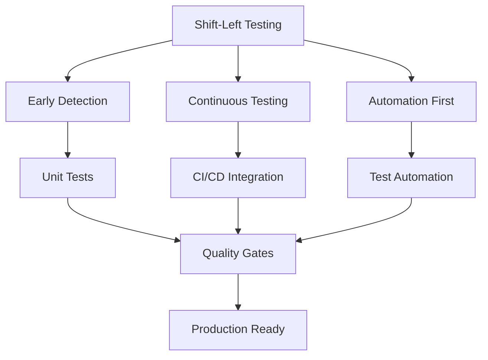
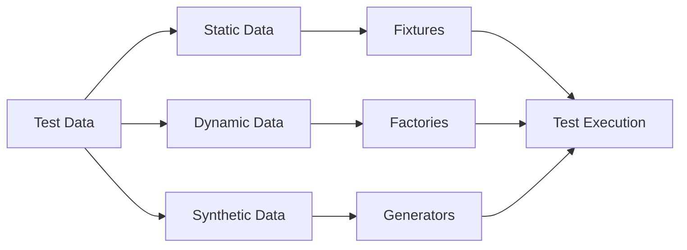

# Test Strategy

## 1. Testing Overview

### 1.1 Testing Philosophy



### 1.2 Testing Objectives

| Objective | Description | Success Criteria |
|-----------|-------------|------------------|
| **Quality Assurance** | Ensure product meets requirements | 95% test coverage |
| **Risk Mitigation** | Identify and prevent defects | <2% defect escape rate |
| **Performance** | Validate system performance | <200ms response time |
| **Security** | Verify security controls | 0 critical vulnerabilities |
| **Usability** | Ensure user experience | >4.0 usability score |
| **Automation** | Maximize test automation | >80% automation coverage |

## 2. Testing Scope

### 2.1 In Scope

- **Functional Testing**: All user stories and features
- **API Testing**: REST APIs, GraphQL endpoints
- **UI Testing**: Web application, mobile apps
- **Performance Testing**: Load, stress, scalability
- **Security Testing**: OWASP Top 10, penetration testing
- **Integration Testing**: Service-to-service communication
- **Database Testing**: Data integrity, migrations
- **Accessibility Testing**: WCAG 2.1 compliance

### 2.2 Out of Scope

- Third-party service testing (Stripe, SendGrid)
- Infrastructure testing (AWS services)
- Browser/device testing beyond supported list
- Legacy system testing

## 3. Testing Levels

### 3.1 Testing Pyramid

```
         /\
        /  \  E2E Tests (5%)
       /    \
      /------\ Integration Tests (15%)
     /        \
    /----------\ Component Tests (30%)
   /            \
  /--------------\ Unit Tests (50%)
```

### 3.2 Test Level Details

| Level | Coverage | Execution Time | Frequency | Owner |
|-------|----------|----------------|-----------|-------|
| **Unit Tests** | 90% | <1 min | Every commit | Developers |
| **Component Tests** | 80% | 2-5 min | Every PR | Developers |
| **Integration Tests** | 70% | 5-10 min | Every merge | QA Team |
| **E2E Tests** | 60% | 15-30 min | Daily | QA Team |
| **Performance Tests** | Critical paths | 1-2 hours | Weekly | DevOps |
| **Security Tests** | Full scan | 2-4 hours | Bi-weekly | Security Team |

## 4. Testing Types

### 4.1 Functional Testing

```yaml
functional_testing:
  smoke_tests:
    coverage: Critical paths
    duration: 5 minutes
    triggers: [deployment, PR]
    
  regression_tests:
    coverage: All features
    duration: 30 minutes
    triggers: [release, nightly]
    
  acceptance_tests:
    coverage: User stories
    duration: 1 hour
    triggers: [sprint_end]
```

### 4.2 Non-Functional Testing

```yaml
non_functional_testing:
  performance:
    - Load Testing: 1000 concurrent users
    - Stress Testing: Find breaking point
    - Endurance Testing: 24-hour run
    - Spike Testing: Sudden load increase
    
  security:
    - SAST: Static code analysis
    - DAST: Dynamic scanning
    - Dependency Scanning: Known vulnerabilities
    - Penetration Testing: Quarterly
    
  usability:
    - User Testing: 10 participants
    - A/B Testing: Feature variants
    - Accessibility: WCAG compliance
```

## 5. Test Environment Strategy

### 5.1 Environment Matrix

| Environment | Purpose | Data | Refresh Cycle | Access |
|-------------|---------|------|---------------|--------|
| **Local** | Development | Mock | On-demand | Developers |
| **CI** | Automated tests | Synthetic | Per build | CI/CD |
| **Dev** | Integration | Sample | Daily | Dev Team |
| **Staging** | Pre-production | Production-like | Weekly | All Teams |
| **Production** | Live testing | Real | N/A | Limited |

### 5.2 Environment Configuration

```javascript
// config/test-environments.js
module.exports = {
  local: {
    baseUrl: 'http://localhost:3000',
    database: 'techally_test',
    services: 'docker-compose.test.yml'
  },
  
  staging: {
    baseUrl: 'https://staging.techally.com',
    database: 'techally_staging',
    services: 'kubernetes-staging'
  },
  
  production: {
    baseUrl: 'https://techally.com',
    database: 'techally_prod',
    services: 'kubernetes-prod',
    readonly: true
  }
};
```

## 6. Test Data Management

### 6.1 Test Data Strategy



### 6.2 Test Data Implementation

```javascript
// test/fixtures/users.fixture.js
export const userFixtures = {
  admin: {
    email: 'admin@test.com',
    password: 'Test123!',
    role: 'admin'
  },
  customer: {
    email: 'customer@test.com',
    password: 'Test123!',
    role: 'customer'
  }
};

// test/factories/product.factory.js
import { Factory } from 'fishery';
import { faker } from '@faker-js/faker';

export const productFactory = Factory.define(() => ({
  name: faker.commerce.productName(),
  price: faker.commerce.price(),
  description: faker.commerce.productDescription(),
  category: faker.helpers.arrayElement(['electronics', 'accessories']),
  stock: faker.number.int({ min: 0, max: 100 })
}));
```

## 7. Test Automation Framework

### 7.1 Technology Stack

| Layer | Tool | Purpose |
|-------|------|---------|
| **Unit Testing** | Jest | JavaScript testing |
| **API Testing** | Supertest, Postman | API validation |
| **UI Testing** | Playwright | Cross-browser testing |
| **Mobile Testing** | Detox | React Native testing |
| **Performance** | K6, JMeter | Load testing |
| **Security** | OWASP ZAP | Security scanning |
| **Reporting** | Allure | Test reporting |

### 7.2 Automation Architecture

```typescript
// test/framework/base.test.ts
export abstract class BaseTest {
  protected context: TestContext;
  protected data: TestData;
  protected reporter: Reporter;
  
  async setup(): Promise<void> {
    this.context = await this.createContext();
    this.data = await this.loadTestData();
    this.reporter = new AllureReporter();
  }
  
  async teardown(): Promise<void> {
    await this.cleanupData();
    await this.context.close();
    await this.reporter.generate();
  }
  
  protected abstract execute(): Promise<void>;
}

// test/e2e/checkout.test.ts
class CheckoutTest extends BaseTest {
  async execute(): Promise<void> {
    await this.reporter.step('Add product to cart', async () => {
      await this.context.page.goto('/products');
      await this.context.page.click('[data-testid="add-to-cart"]');
    });
    
    await this.reporter.step('Complete checkout', async () => {
      await this.context.page.goto('/checkout');
      await this.fillPaymentDetails();
      await this.context.page.click('[data-testid="place-order"]');
    });
    
    await this.reporter.step('Verify order', async () => {
      await expect(this.context.page).toHaveURL(/order-confirmation/);
    });
  }
}
```

## 8. CI/CD Integration

### 8.1 Test Pipeline

```yaml
# .github/workflows/test-pipeline.yml
name: Test Pipeline

on:
  push:
    branches: [main, develop]
  pull_request:
    branches: [main]

jobs:
  unit-tests:
    runs-on: ubuntu-latest
    steps:
      - uses: actions/checkout@v3
      - name: Run Unit Tests
        run: |
          npm ci
          npm run test:unit
      - name: Upload Coverage
        uses: codecov/codecov-action@v3

  integration-tests:
    needs: unit-tests
    runs-on: ubuntu-latest
    services:
      postgres:
        image: postgres:15
      redis:
        image: redis:7
    steps:
      - uses: actions/checkout@v3
      - name: Run Integration Tests
        run: |
          npm ci
          npm run test:integration

  e2e-tests:
    needs: integration-tests
    runs-on: ubuntu-latest
    steps:
      - uses: actions/checkout@v3
      - name: Run E2E Tests
        run: |
          npm ci
          npx playwright install
          npm run test:e2e
      - name: Upload Test Results
        uses: actions/upload-artifact@v3
        with:
          name: test-results
          path: test-results/
```

### 8.2 Quality Gates

```javascript
// quality-gates.js
module.exports = {
  coverage: {
    statements: 80,
    branches: 75,
    functions: 80,
    lines: 80
  },
  
  performance: {
    lighthouse: {
      performance: 90,
      accessibility: 95,
      'best-practices': 90,
      seo: 90
    }
  },
  
  security: {
    critical: 0,
    high: 0,
    medium: 5,
    low: 10
  }
};
```

## 9. Test Metrics and Reporting

### 9.1 Key Metrics

| Metric | Target | Measurement |
|--------|--------|-------------|
| **Code Coverage** | >80% | Jest coverage |
| **Test Pass Rate** | >98% | CI/CD results |
| **Defect Density** | <5 per KLOC | Bug tracking |
| **Test Execution Time** | <30 min | Pipeline duration |
| **Automation Coverage** | >80% | Automated vs Manual |
| **Defect Escape Rate** | <2% | Production bugs |

### 9.2 Reporting Dashboard

```javascript
// test/reporting/dashboard.js
export class TestDashboard {
  async generateReport(): Promise<Report> {
    return {
      summary: {
        total: this.totalTests,
        passed: this.passedTests,
        failed: this.failedTests,
        skipped: this.skippedTests,
        duration: this.totalDuration
      },
      
      coverage: {
        unit: await this.getUnitCoverage(),
        integration: await this.getIntegrationCoverage(),
        e2e: await this.getE2ECoverage()
      },
      
      trends: {
        passRate: await this.getPassRateTrend(),
        executionTime: await this.getExecutionTimeTrend(),
        defects: await this.getDefectTrend()
      }
    };
  }
}
```

## 10. Risk-Based Testing

### 10.1 Risk Matrix

| Feature | Business Impact | Technical Complexity | Test Priority |
|---------|----------------|---------------------|---------------|
| **Payment Processing** | Critical | High | P1 |
| **User Authentication** | Critical | Medium | P1 |
| **Product Search** | High | High | P2 |
| **Order Management** | High | Medium | P2 |
| **User Profile** | Medium | Low | P3 |
| **Reviews** | Low | Low | P4 |

### 10.2 Risk Mitigation

```yaml
risk_mitigation:
  high_risk:
    - Extensive test coverage (>90%)
    - Multiple test levels
    - Performance testing
    - Security testing
    - Manual exploratory testing
    
  medium_risk:
    - Standard test coverage (>80%)
    - Automated regression
    - Smoke testing
    
  low_risk:
    - Basic test coverage (>70%)
    - Critical path testing
```

## 11. Test Execution Schedule

### 11.1 Execution Matrix

| Test Type | Frequency | Duration | Trigger |
|-----------|-----------|----------|---------|
| **Smoke Tests** | Every build | 5 min | CI/CD |
| **Unit Tests** | Every commit | 1 min | Pre-commit |
| **Integration Tests** | Every PR | 10 min | PR validation |
| **Regression Tests** | Daily | 30 min | Nightly build |
| **E2E Tests** | Daily | 1 hour | Scheduled |
| **Performance Tests** | Weekly | 2 hours | Weekend |
| **Security Scans** | Bi-weekly | 4 hours | Scheduled |

## 12. References

- [Automation Framework](./automation-framework.md) - `TEST-AUTO-001`
- [Performance Test Plan](./performance-test-plan.md) - `TEST-PERF-001`
- [Security Test Plan](./security-test-plan.md) - `TEST-SEC-001`
- [Functional Requirements](../02_requirements/functional-requirements.md) - `REQ-FR-001`

---
*This test strategy document is maintained by the QA Team.*