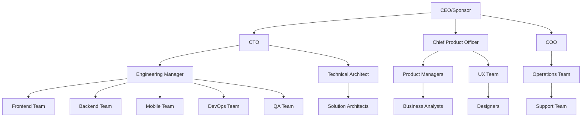
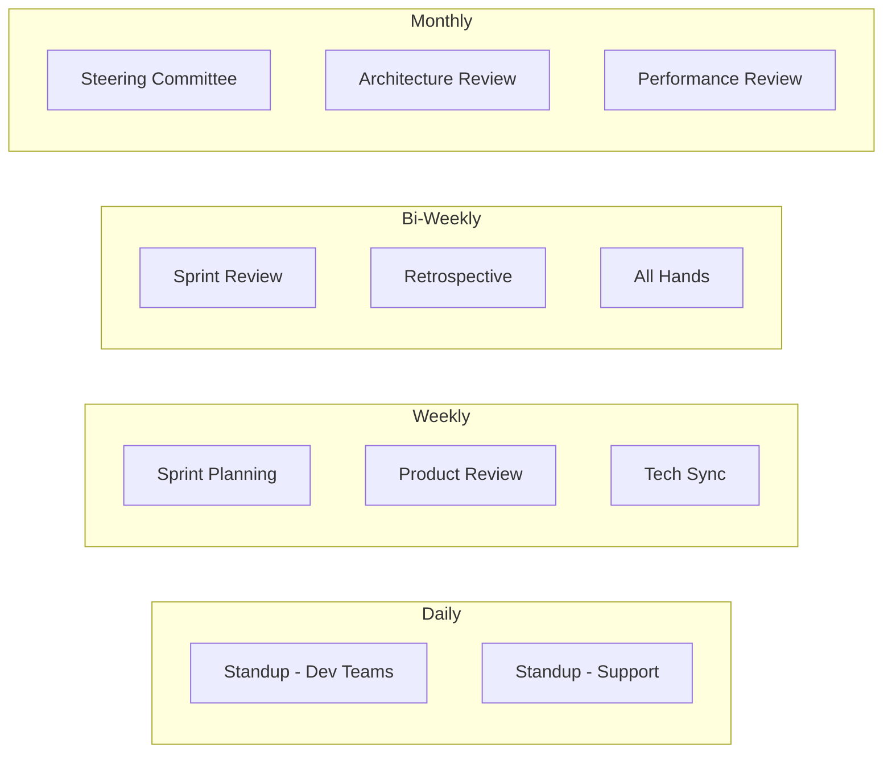
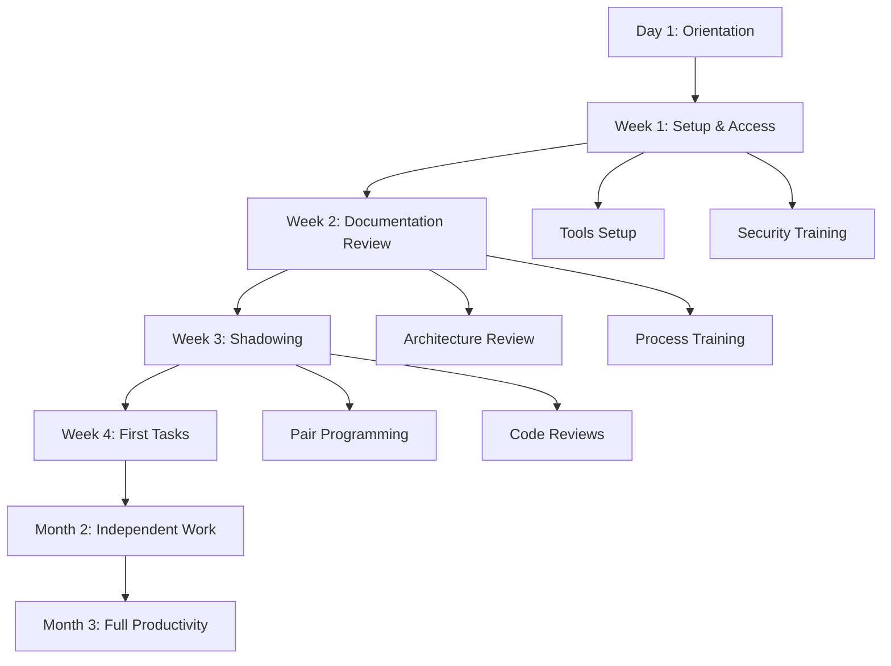
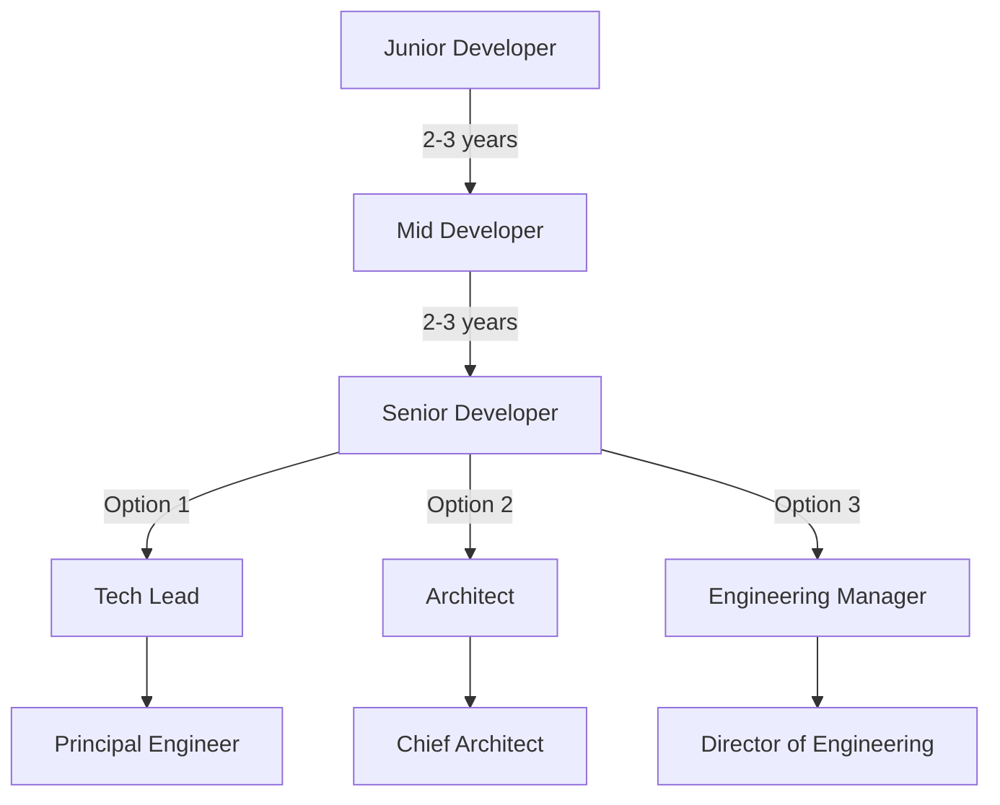
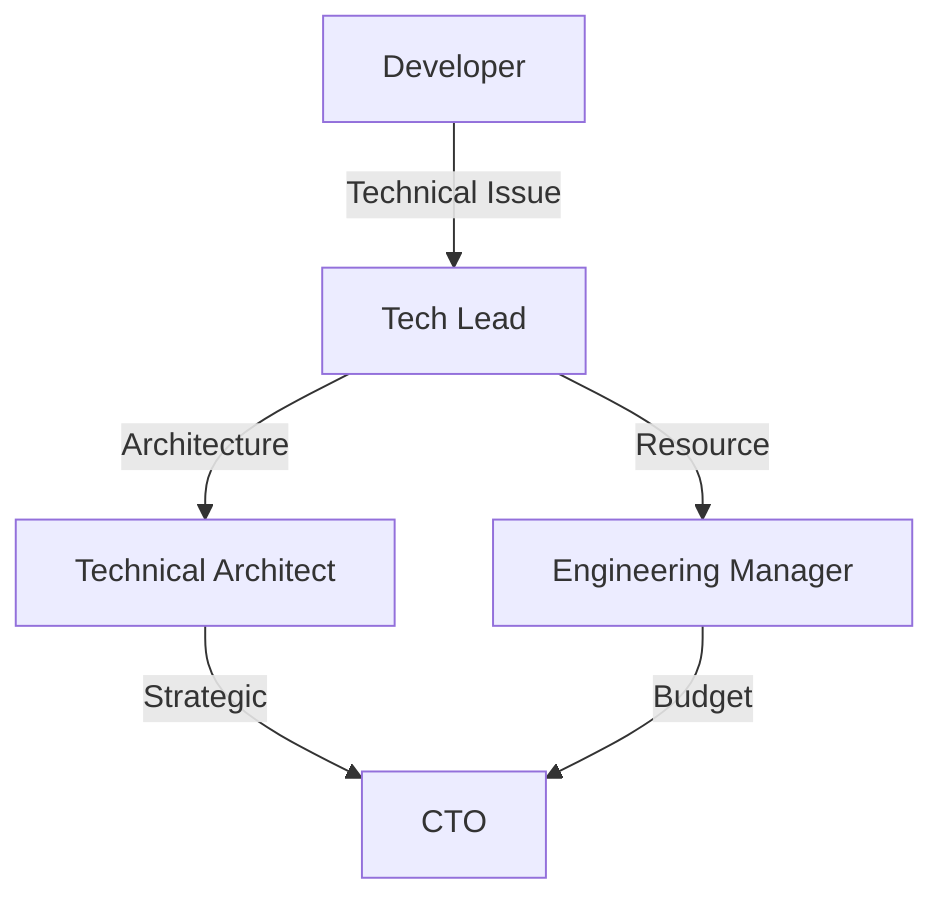

# Team Structure and Responsibilities

## 1. Organizational Overview

### 1.1 Team Hierarchy

### 1.2 Team Distribution

| Department | Team Size | Location | Time Zone |
|------------|-----------|----------|-----------|
| Engineering | 12 | Distributed | PST/EST/CET |
| Product | 4 | San Francisco | PST |
| Design | 3 | San Francisco | PST |
| DevOps | 3 | Distributed | PST/EST |
| QA | 4 | Bangalore | IST |
| Support | 5 | 24/7 Coverage | Global |

## 2. Core Teams

### 2.1 Engineering Teams

#### 2.1.1 Frontend Team

| Role | Name | Responsibilities | Technologies | Component Ownership |
|------|------|------------------|--------------|-------------------|
| Lead Developer | Alex Chen | Architecture, Code Review | React, Next.js | [`MOD-WEB-001`](../architecture/frontend-architecture.md) |
| Senior Developer | Sarah Miller | Feature Development | React, TypeScript | [`MOD-CART-001`](../architecture/cart-module.md) |
| Developer | James Wilson | UI Components | React, CSS | [`UI-LIB-001`](../architecture/ui-library.md) |
| Developer | Maria Garcia | Performance | React, Optimization | [`PERF-001`](../architecture/performance.md) |

**Key Responsibilities:**
- Web application development
- Component library maintenance
- Performance optimization
- Cross-browser compatibility
- Accessibility implementation

#### 2.1.2 Backend Team

| Role | Name | Responsibilities | Technologies | Service Ownership |
|------|------|------------------|--------------|------------------|
| Lead Developer | Michael Johnson | Architecture, APIs | Node.js, PostgreSQL | [`SVC-ORD-001`](../api/order-service.md) |
| Senior Developer | Emily Davis | Microservices | Node.js, Docker | [`SVC-PAY-001`](../api/payment-service.md) |
| Developer | Robert Kim | Database, Caching | PostgreSQL, Redis | [`DB-001`](../database/schema-overview.md) |
| Developer | Lisa Anderson | Integrations | REST, GraphQL | [`INT-001`](../api/integrations.md) |

**Key Responsibilities:**
- API development and maintenance
- Microservices architecture
- Database design and optimization
- Third-party integrations
- Performance tuning

#### 2.1.3 Mobile Team

| Role | Name | Responsibilities | Platforms | Apps |
|------|------|------------------|-----------|------|
| Lead Developer | David Park | Architecture, Publishing | iOS, Android | [`MOB-001`](../architecture/mobile-architecture.md) |
| iOS Developer | Jennifer Lee | iOS Development | Swift, React Native | iOS App |
| Android Developer | Carlos Rodriguez | Android Development | Kotlin, React Native | Android App |

**Key Responsibilities:**
- Mobile application development
- App store management
- Push notification implementation
- Offline functionality
- Platform-specific features

### 2.2 Product Team

#### 2.2.1 Product Management

| Role | Name | Focus Area | Stakeholders | Documentation |
|------|------|------------|--------------|---------------|
| Chief Product Officer | Patricia Brown | Strategy | Executive Team | [`PRJ-CHARTER-001`](../project/project-charter.md) |
| Senior PM | Kevin Zhang | Customer Experience | Customers, Sales | [`REQ-BR-001`](../requirements/business-requirements.md) |
| Product Manager | Amanda White | Platform Features | Engineering | [`REQ-FR-001`](../requirements/functional-requirements.md) |
| Product Manager | Daniel Martinez | B2B Features | Enterprise Clients | [`REQ-B2B-001`](../requirements/b2b-requirements.md) |

**Key Responsibilities:**
- Product strategy and roadmap
- Feature prioritization
- Stakeholder management
- Requirements documentation
- Success metrics definition

### 2.3 DevOps Team

#### 2.3.1 Infrastructure and Operations

| Role | Name | Responsibilities | Technologies | Systems |
|------|------|------------------|--------------|---------|
| DevOps Lead | Thomas Wright | Infrastructure Architecture | AWS, Kubernetes | [`INF-001`](../architecture/infrastructure.md) |
| DevOps Engineer | Rachel Green | CI/CD Pipeline | GitHub Actions, Docker | [`CI-001`](../architecture/cicd-pipeline.md) |
| DevOps Engineer | Steven Liu | Monitoring, Security | DataDog, Security Tools | [`MON-001`](../architecture/monitoring.md) |

**Key Responsibilities:**
- Cloud infrastructure management
- CI/CD pipeline maintenance
- Monitoring and alerting
- Security implementation
- Disaster recovery planning

### 2.4 Quality Assurance Team

| Role | Name | Focus | Tools | Test Plans |
|------|------|-------|-------|------------|
| QA Lead | Priya Sharma | Test Strategy | Selenium, Jest | [`TEST-001`](../testing/test-strategy.md) |
| QA Engineer | John Thompson | Automation | Cypress, Playwright | [`AUTO-001`](../testing/automation-plan.md) |
| QA Engineer | Nina Patel | Manual Testing | JIRA, TestRail | [`MAN-001`](../testing/manual-test-plan.md) |
| QA Engineer | Omar Hassan | Performance | JMeter, K6 | [`PERF-TEST-001`](../testing/performance-tests.md) |

## 3. Responsibilities Matrix (RACI)

### 3.1 Development Activities

| Activity | Frontend | Backend | Mobile | DevOps | QA | Product | Responsible |
|----------|----------|---------|--------|--------|-----|---------|-------------|
| Feature Development | R | R | R | C | I | A | Dev Teams |
| Code Review | R | R | R | I | C | I | Tech Leads |
| Testing | C | C | C | I | R | I | QA Team |
| Deployment | I | I | I | R | C | A | DevOps |
| Documentation | R | R | R | C | C | A | Dev Teams |
| Bug Fixes | R | R | R | I | C | I | Dev Teams |

**Legend:** R = Responsible, A = Accountable, C = Consulted, I = Informed

### 3.2 Operational Activities

| Activity | Product | Engineering | Operations | Support | Management |
|----------|---------|-------------|------------|---------|------------|
| Requirements | R | C | I | I | A |
| Architecture | C | R | C | I | A |
| Monitoring | I | C | R | C | A |
| Incident Response | I | R | R | C | A |
| Customer Issues | C | C | C | R | A |
| Reporting | C | C | C | C | R |

## 4. Communication Structure

### 4.1 Meeting Cadence

### 4.2 Communication Channels

| Channel | Purpose | Participants | Frequency |
|---------|---------|--------------|-----------|
| Slack #general | Company updates | All | Continuous |
| Slack #dev | Development discussions | Engineering | Continuous |
| Slack #incidents | Incident management | On-call, DevOps | As needed |
| Email - team@ | Official communications | All | As needed |
| JIRA | Task tracking | All teams | Daily |
| Confluence | Documentation | All teams | Continuous |
| GitHub | Code collaboration | Engineering | Continuous |

## 5. Skill Matrix

### 5.1 Technical Skills

| Team Member | JavaScript | React | Node.js | PostgreSQL | AWS | Docker | Python |
|-------------|------------|-------|---------|------------|-----|--------|--------|
| Alex Chen | Expert | Expert | Advanced | Intermediate | Advanced | Advanced | Basic |
| Michael Johnson | Expert | Intermediate | Expert | Expert | Advanced | Expert | Intermediate |
| David Park | Expert | Expert | Advanced | Intermediate | Intermediate | Advanced | Basic |
| Thomas Wright | Advanced | Basic | Advanced | Advanced | Expert | Expert | Advanced |

### 5.2 Domain Knowledge

| Area | Product Team | Engineering | Operations | Support |
|------|--------------|-------------|------------|---------|
| E-commerce | Expert | Advanced | Intermediate | Advanced |
| Smart Devices | Expert | Intermediate | Basic | Advanced |
| Payment Systems | Advanced | Expert | Advanced | Intermediate |
| Logistics | Advanced | Intermediate | Expert | Advanced |
| Customer Service | Advanced | Basic | Advanced | Expert |

## 6. Onboarding Process

### 6.1 New Team Member Onboarding

### 6.2 Onboarding Checklist

- [ ] HR paperwork and orientation
- [ ] Equipment setup (laptop, accounts)
- [ ] Tool access (GitHub, JIRA, Slack)
- [ ] Security training and compliance
- [ ] Architecture documentation review
- [ ] Development environment setup
- [ ] First code review participation
- [ ] First pull request
- [ ] Team introduction meetings
- [ ] 30-day check-in
- [ ] 60-day review
- [ ] 90-day evaluation

## 7. Performance Management

### 7.1 Individual Goals

| Level | Technical Goals | Business Goals | Team Goals |
|-------|----------------|----------------|------------|
| Junior | Learn codebase, Fix bugs | Understand product | Collaborate effectively |
| Mid | Feature development | Customer impact | Mentor juniors |
| Senior | Architecture decisions | Strategic initiatives | Lead projects |
| Lead | Technical strategy | Business alignment | Team development |

### 7.2 Team Metrics

| Metric | Target | Measurement | Review Cycle |
|--------|--------|-------------|--------------|
| Velocity | 80 points/sprint | JIRA | Sprint |
| Code Coverage | >90% | Jest/Coverage | Continuous |
| Bug Escape Rate | <5% | Production bugs | Monthly |
| Deployment Frequency | Daily | CI/CD metrics | Weekly |
| MTTR | <2 hours | Incident tracking | Monthly |

## 8. Training and Development

### 8.1 Training Programs

| Program | Target Audience | Duration | Frequency |
|---------|-----------------|----------|-----------|
| Tech Talks | All Engineering | 1 hour | Weekly |
| AWS Certification | DevOps, Backend | Self-paced | Annual |
| React Advanced | Frontend | 3 days | Annual |
| Security Training | All | 2 hours | Quarterly |
| Product Training | New hires | 1 week | As needed |

### 8.2 Career Development Paths

## 9. Remote Work Guidelines

### 9.1 Remote Work Policy

- **Core Hours**: 10 AM - 3 PM PST
- **Response Time**: Within 2 hours during core hours
- **Video Calls**: Camera optional but encouraged
- **Documentation**: Async-first communication
- **Time Off**: Minimum 2 weeks notice

### 9.2 Remote Collaboration Tools

| Tool | Purpose | Guidelines |
|------|---------|------------|
| Slack | Instant messaging | Respond within 2 hours |
| Zoom | Video meetings | Record important sessions |
| Miro | Whiteboarding | Document outcomes |
| GitHub | Code collaboration | Daily commits |
| Confluence | Documentation | Keep updated |

## 10. Escalation Matrix

### 10.1 Technical Escalation

### 10.2 Incident Escalation

| Severity | First Response | Escalation Time | Escalation To |
|----------|---------------|-----------------|---------------|
| P1 - Critical | 15 min | 30 min | Engineering Manager, CTO |
| P2 - High | 30 min | 2 hours | Tech Lead, EM |
| P3 - Medium | 2 hours | 24 hours | Tech Lead |
| P4 - Low | 24 hours | 48 hours | Team |

## 11. References

- [Project Charter](../project/project-charter.md) - [`PRJ-CHARTER-001`]
- [Development Process](../project/development-process.md) - [`PROC-001`]
- [Communication Plan](../project/communication-plan.md) - [`COMM-001`]
- [Training Resources](../team/training-resources.md) - [`TRAIN-001`]
- [Career Framework](../team/career-framework.md) - [`CAREER-001`]

---
*This team structure document is maintained by HR and Management. Updates require approval from the Executive Team.*
