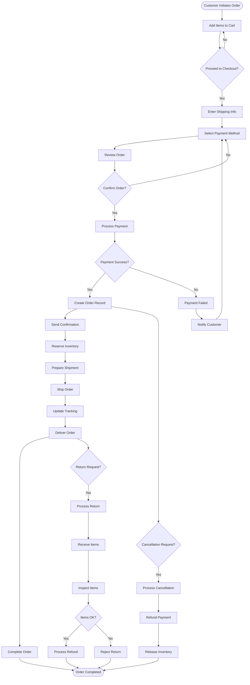
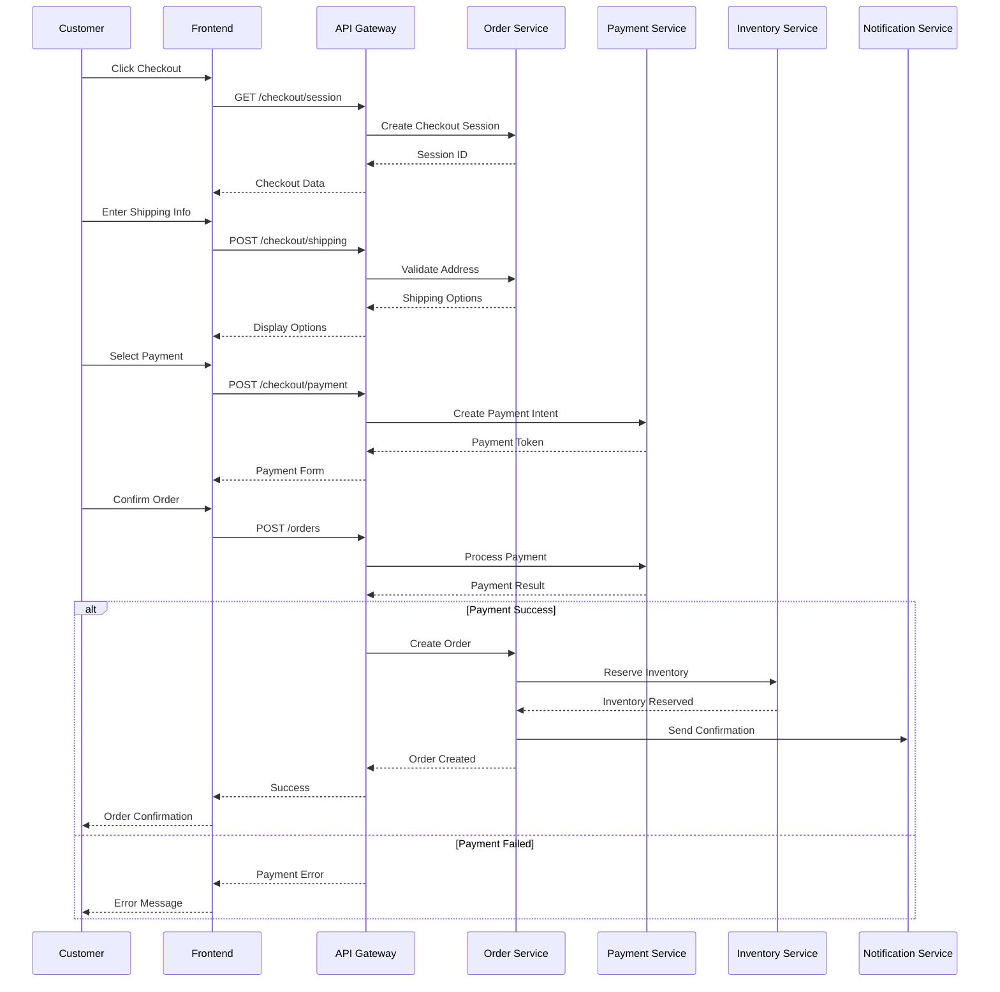
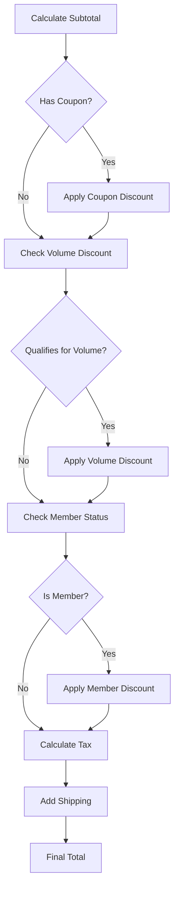
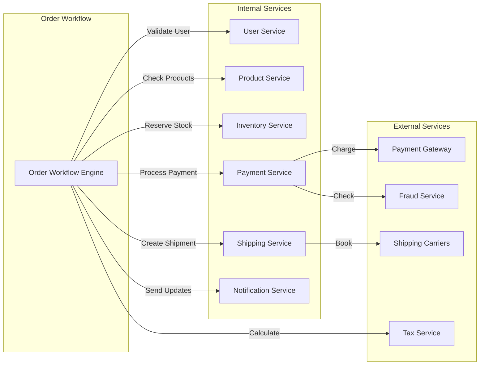
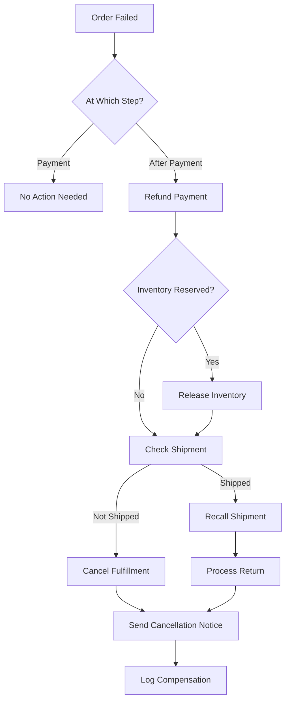

# Order Processing Workflow

## 1. Workflow Overview

### 1.1 Order Lifecycle



## 2. Process Steps

### 2.1 Cart to Checkout

| Step | Actor | System Actions | Validations | Error Handling |
|------|-------|----------------|-------------|----------------|
| Add to Cart | Customer | [`API: POST /cart/items`](../api/api-reference.md#cart) | Stock availability | Out of stock message |
| Update Quantity | Customer | [`API: PUT /cart/items/{id}`](../api/api-reference.md#cart) | Max quantity check | Quantity limit message |
| Apply Coupon | Customer | [`API: POST /cart/apply-coupon`](../api/api-reference.md#cart) | Coupon validity | Invalid coupon error |
| Calculate Total | System | [`SVC-PRICE-001`](../api/pricing-service.md) | Price accuracy | Recalculate on error |

### 2.2 Checkout Process



## 3. Business Rules

### 3.1 Order Validation Rules

| Rule ID | Rule | Condition | Action | Priority |
|---------|------|-----------|--------|----------|
| [`BR-ORD-001`] | Minimum Order | Total < $10 | Block checkout | Critical |
| [`BR-ORD-002`] | Stock Check | Item unavailable | Remove from cart | Critical |
| [`BR-ORD-003`] | Payment Verification | High risk score | Additional verification | High |
| [`BR-ORD-004`] | Shipping Restriction | Restricted location | Block order | Critical |
| [`BR-ORD-005`] | Order Limit | >10 same items | Manager approval | Medium |

### 3.2 Pricing Rules



## 4. Order States

### 4.1 State Transitions

| From State | To State | Trigger | Conditions | Actions |
|------------|----------|---------|------------|---------|
| `PENDING` | `PROCESSING` | Payment initiated | Valid order | Lock inventory |
| `PROCESSING` | `CONFIRMED` | Payment success | Funds captured | Confirm inventory |
| `PROCESSING` | `FAILED` | Payment failure | Insufficient funds | Release inventory |
| `CONFIRMED` | `PREPARING` | Start fulfillment | Inventory available | Assign warehouse |
| `PREPARING` | `SHIPPED` | Package dispatched | Tracking created | Send tracking |
| `SHIPPED` | `DELIVERED` | Delivery confirmed | Signature/photo | Update status |
| `DELIVERED` | `COMPLETED` | No issues in 7 days | No returns | Close order |
| Any | `CANCELLED` | Customer request | Before shipping | Process refund |

### 4.2 State Machine Definition

```yaml
stateMachine:
  name: OrderStateMachine
  initialState: PENDING
  states:
    PENDING:
      on:
        PROCESS_PAYMENT: PROCESSING
        CANCEL: CANCELLED
    PROCESSING:
      on:
        PAYMENT_SUCCESS: CONFIRMED
        PAYMENT_FAILED: FAILED
        TIMEOUT: FAILED
    CONFIRMED:
      on:
        START_FULFILLMENT: PREPARING
        CANCEL: CANCELLING
    PREPARING:
      on:
        SHIP: SHIPPED
        OUT_OF_STOCK: BACKORDER
    SHIPPED:
      on:
        DELIVER: DELIVERED
        LOST: INVESTIGATING
    DELIVERED:
      on:
        COMPLETE: COMPLETED
        RETURN_REQUEST: RETURN_PENDING
    COMPLETED:
      type: final
    CANCELLED:
      type: final
```

## 5. Integration Points

### 5.1 Service Interactions



### 5.2 Event Flow

| Event | Source | Consumers | Action |
|-------|--------|-----------|--------|
| `order.created` | Order Service | Inventory, Notification | Reserve stock, Send email |
| `payment.completed` | Payment Service | Order, Accounting | Update status, Record transaction |
| `inventory.reserved` | Inventory Service | Order, Warehouse | Confirm availability |
| `shipment.created` | Shipping Service | Order, Notification | Update tracking, Notify customer |
| `order.delivered` | Shipping Service | Order, Analytics | Complete order, Update metrics |

## 6. Error Handling

### 6.1 Error Scenarios

| Scenario | Detection | Response | Recovery |
|----------|-----------|----------|----------|
| Payment timeout | 30 seconds | Retry payment | 3 attempts |
| Inventory conflict | During reservation | Queue order | Wait 5 minutes |
| Address invalid | Validation API | Request correction | Customer action |
| System outage | Health check | Circuit breaker | Fallback mode |

### 6.2 Compensation Logic



## 7. Performance Metrics

### 7.1 SLA Targets

| Metric | Target | Measurement | Alert Threshold |
|--------|--------|-------------|-----------------|
| Order creation | <2 seconds | API response time | >5 seconds |
| Payment processing | <10 seconds | End-to-end | >30 seconds |
| Order confirmation | <1 minute | Email delivery | >5 minutes |
| Fulfillment start | <2 hours | Order to picking | >6 hours |
| Shipping time | 1-3 days | Dispatch to delivery | >5 days |

### 7.2 Monitoring Points

```yaml
monitoring:
  metrics:
    - name: order_creation_time
      type: histogram
      labels: [status, payment_method]
    - name: payment_success_rate
      type: gauge
      labels: [gateway, currency]
    - name: inventory_conflicts
      type: counter
      labels: [product_id, warehouse]
    - name: order_cancellation_rate
      type: gauge
      labels: [reason, stage]
  alerts:
    - name: high_order_failure_rate
      condition: failure_rate > 0.05
      severity: critical
    - name: payment_gateway_down
      condition: success_rate < 0.95
      severity: high
```

## 8. Audit and Compliance

### 8.1 Audit Trail

| Event | Data Captured | Retention | Purpose |
|-------|---------------|-----------|---------|
| Order created | Full order data | 7 years | Legal compliance |
| Payment processed | Transaction details | 7 years | Financial audit |
| Status changed | Old/new status, user | 3 years | Operational audit |
| Order modified | Changes, reason | 3 years | Fraud detection |
| Refund issued | Amount, reason | 7 years | Financial audit |

### 8.2 Compliance Requirements

- **PCI DSS**: Payment data handling
- **GDPR**: Customer data privacy
- **Sales Tax**: Jurisdiction compliance
- **Export Control**: Restricted items/countries
- **Age Verification**: Restricted products

## 9. Testing Scenarios

### 9.1 Happy Path Tests

```gherkin
Feature: Order Processing
  
  Scenario: Successful order placement
    Given a customer with valid account
    And products are in stock
    When customer completes checkout
    And payment is successful
    Then order should be created
    And inventory should be reserved
    And confirmation email should be sent
    
  Scenario: Express checkout
    Given a customer with saved payment method
    And default shipping address
    When customer uses express checkout
    Then order should complete in one step
```

### 9.2 Edge Cases

| Test Case | Scenario | Expected Result |
|-----------|----------|-----------------|
| [`TC-ORD-001`] | Concurrent same item purchase | First wins, second gets waitlist |
| [`TC-ORD-002`] | Payment succeeds, inventory fails | Automatic refund |
| [`TC-ORD-003`] | Multiple coupon codes | Only best discount applies |
| [`TC-ORD-004`] | Order during price change | Honor cart price |
| [`TC-ORD-005`] | Split shipment required | Create multiple shipments |

## 10. Optimization Opportunities

### 10.1 Performance Improvements

1. **Batch Processing**: Group order notifications
2. **Async Operations**: Non-blocking payment processing
3. **Cache Strategy**: Cache product and pricing data
4. **Connection Pooling**: Reuse database connections
5. **Queue Management**: Priority queues for orders

### 10.2 Future Enhancements

- [ ] AI-based fraud detection
- [ ] Predictive inventory allocation
- [ ] Dynamic pricing optimization
- [ ] Smart shipping route selection
- [ ] Automated customer service integration

## 11. References

- [Business Requirements](../requirements/business-requirements.md#order-processing) - [`REQ-BR-001`]
- [Order Service API](../api/order-service.md) - [`SVC-ORD-001`]
- [Payment Workflow](./payment-workflow.md) - [`WF-PAY-001`]
- [Shipping Workflow](./shipping-workflow.md) - [`WF-SHIP-001`]
- [Return Workflow](./return-workflow.md) - [`WF-RET-001`]

---
*This workflow documentation is maintained by the Business Process Team and requires approval for changes.*
