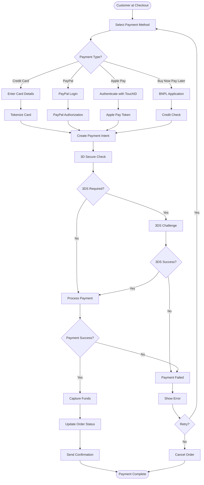
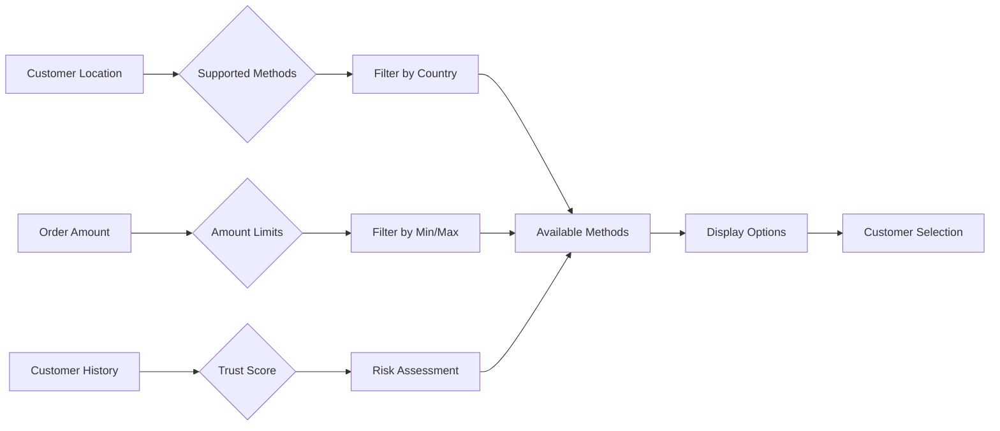
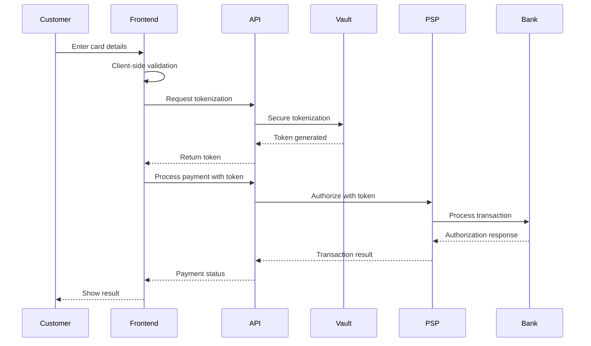
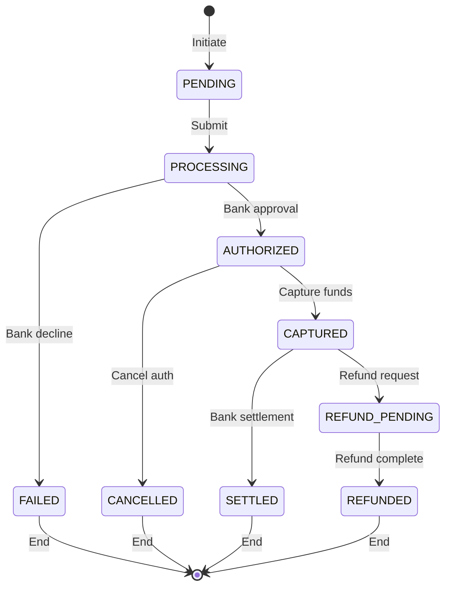
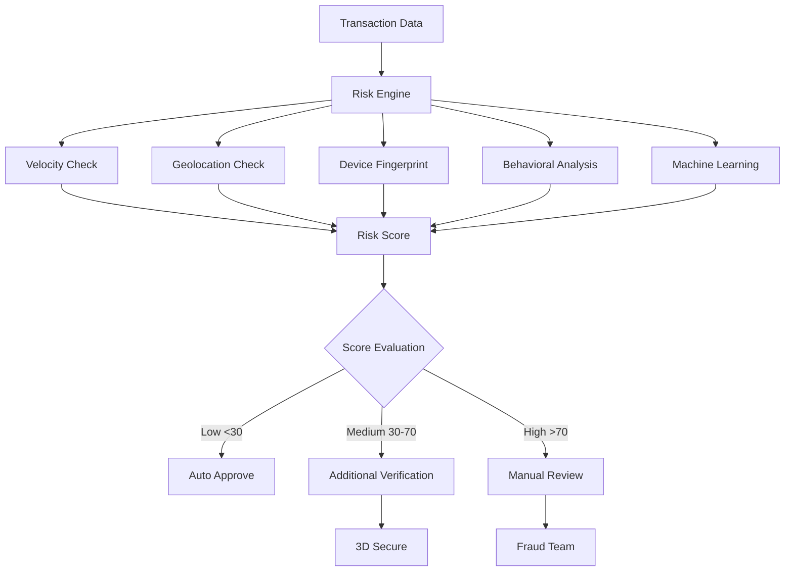
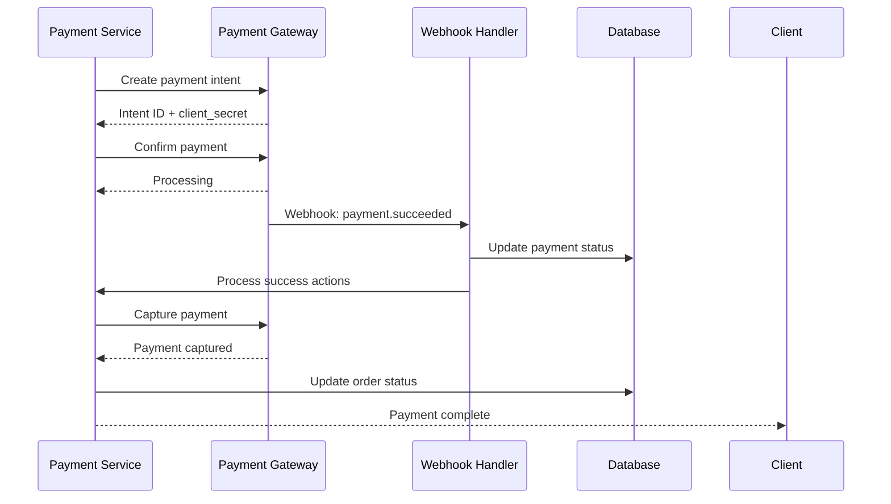
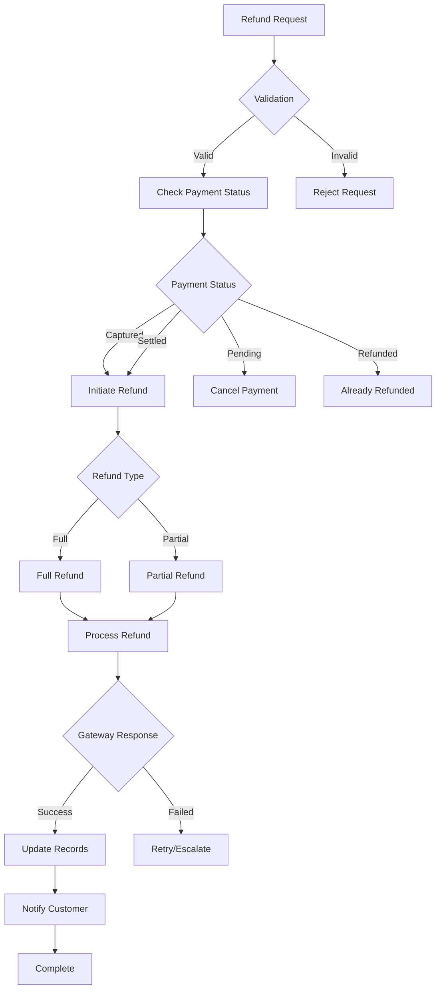
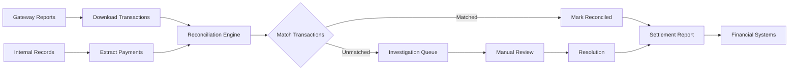
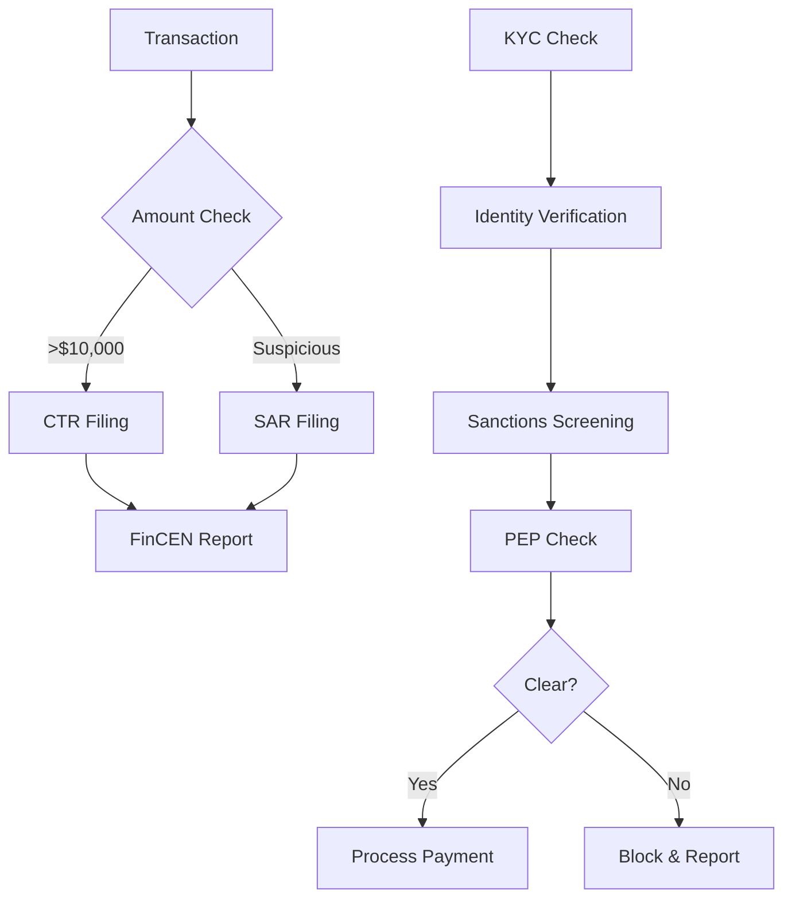

# Payment Processing Workflow

## 1. Payment Workflow Overview

### 1.1 Payment Processing Flow



## 2. Payment Methods

### 2.1 Supported Payment Types

| Method | Provider | Countries | Processing Time | Fees |
|--------|----------|-----------|-----------------|------|
| `PAY-001` Credit/Debit | Stripe | Global | Instant | 2.9% + $0.30 |
| `PAY-002` PayPal | PayPal | 200+ | Instant | 2.9% + $0.30 |
| `PAY-003` Apple Pay | Apple | 70+ | Instant | Same as card |
| `PAY-004` Google Pay | Google | 40+ | Instant | Same as card |
| `PAY-005` Klarna | Klarna | US/EU | Instant approval | 3.29% + $0.30 |
| `PAY-006` Bank Transfer | Plaid | US | 1-3 days | $0.50 |
| `PAY-007` Cryptocurrency | BitPay | Global | 10-60 min | 1% |

### 2.2 Payment Method Selection Logic



## 3. Payment Security

### 3.1 PCI Compliance Flow



### 3.2 Security Measures

| Layer | Measure | Implementation | Compliance |
|-------|---------|----------------|------------|
| Network | TLS 1.3 | All connections encrypted | PCI DSS 4.0 |
| Application | Tokenization | No card storage | PCI DSS 3.4 |
| Data | Field encryption | AES-256 | PCI DSS 3.4 |
| Access | MFA required | Admin access only | PCI DSS 8.3 |
| Monitoring | Transaction monitoring | Real-time alerts | PCI DSS 10.8 |

## 4. Payment States

### 4.1 Payment Status Lifecycle



### 4.2 Status Transitions

| From Status | To Status | Trigger | Validation | Actions |
|-------------|-----------|---------|------------|---------|
| PENDING | PROCESSING | Customer submit | Valid payment data | Lock amount |
| PROCESSING | AUTHORIZED | Bank approval | Sufficient funds | Reserve funds |
| PROCESSING | FAILED | Bank decline | Various reasons | Release lock |
| AUTHORIZED | CAPTURED | Order confirmed | Within 7 days | Transfer funds |
| AUTHORIZED | CANCELLED | Order cancelled | Before capture | Release auth |
| CAPTURED | REFUND_PENDING | Refund request | Valid reason | Initiate refund |
| REFUND_PENDING | REFUNDED | Bank processed | 3-5 days | Credit account |

## 5. Payment Validations

### 5.1 Pre-Payment Checks

```yaml
validations:
  card:
    number:
      - luhn_check
      - bin_validation
      - card_type_detection
    expiry:
      - not_expired
      - valid_format
    cvv:
      - length_check
      - numeric_only
  
  address:
    billing:
      - avs_check
      - zip_validation
    shipping:
      - deliverability_check
      
  fraud:
    velocity:
      - max_transactions_per_hour: 5
      - max_amount_per_day: 5000
    risk_score:
      - threshold: 70
      - action: manual_review
```

### 5.2 Fraud Detection



## 6. Payment Processing Rules

### 6.1 Business Rules

| Rule ID | Rule | Condition | Action | Priority |
|---------|------|-----------|--------|----------|
| `PAY-RULE-001` | Min amount | Amount < $1 | Block payment | Critical |
| `PAY-RULE-002` | Max amount | Amount > $10,000 | Manual review | High |
| `PAY-RULE-003` | Currency match | Currency mismatch | Convert or block | Critical |
| `PAY-RULE-004` | Duplicate payment | Same amount in 60s | Confirm intent | High |
| `PAY-RULE-005` | High risk country | Restricted countries | Enhanced verification | High |

### 6.2 Retry Logic

```yaml
retry_strategy:
  soft_decline:
    max_retries: 3
    backoff: exponential
    initial_delay: 1s
    max_delay: 30s
    
  hard_decline:
    max_retries: 0
    action: request_different_payment
    
  network_error:
    max_retries: 5
    backoff: linear
    delay: 5s
    
  timeout:
    max_retries: 2
    timeout: 30s
    action: check_status_then_retry
```

## 7. Payment Integrations

### 7.1 Gateway Integration Flow



### 7.2 Integration Configuration

```yaml
payment_gateways:
  stripe:
    api_version: "2023-10-16"
    webhook_endpoints:
      - payment_intent.succeeded
      - payment_intent.failed
      - charge.refunded
      - charge.dispute.created
    retry_policy:
      max_attempts: 3
      idempotency: true
      
  paypal:
    environment: production
    webhook_events:
      - PAYMENT.SALE.COMPLETED
      - PAYMENT.SALE.DENIED
      - PAYMENT.SALE.REFUNDED
    timeout: 30s
```

## 8. Refund Processing

### 8.1 Refund Workflow



### 8.2 Refund Rules

| Scenario | Time Limit | Approval | Processing Time |
|----------|------------|----------|-----------------|
| Full refund | 30 days | Automatic | 3-5 days |
| Partial refund | 60 days | Supervisor | 3-5 days |
| Damaged item | 90 days | Manager | 5-7 days |
| Service issue | No limit | Director | 7-10 days |

## 9. Reconciliation

### 9.1 Daily Reconciliation Process



### 9.2 Settlement Timeline

| Provider | Settlement Time | Cut-off Time | Payout Schedule |
|----------|----------------|--------------|-----------------|
| Stripe | T+2 | 5 PM PST | Daily |
| PayPal | T+1 | 8 PM PST | Daily |
| Bank Transfer | T+3 | 3 PM PST | Business days |
| Klarna | T+7 | Monthly | Monthly |

## 10. Monitoring and Alerts

### 10.1 Key Metrics

| Metric | Target | Alert Threshold | Response |
|--------|--------|-----------------|----------|
| Success rate | >95% | <90% | Investigate immediately |
| Avg processing time | <3s | >5s | Performance review |
| Decline rate | <10% | >15% | Fraud review |
| Refund rate | <5% | >8% | Quality check |
| Chargeback rate | <0.5% | >1% | Risk assessment |

### 10.2 Alert Configuration

```yaml
alerts:
  critical:
    - payment_gateway_down
    - success_rate_below_85
    - multiple_timeouts
    
  high:
    - high_decline_rate
    - unusual_refund_volume
    - chargeback_spike
    
  medium:
    - slow_processing_time
    - reconciliation_mismatch
    - webhook_failures
    
  channels:
    critical: [pagerduty, slack, email]
    high: [slack, email]
    medium: [email]
```

## 11. Compliance Requirements

### 11.1 PCI DSS Requirements

| Requirement | Implementation | Audit | Evidence |
|-------------|----------------|-------|----------|
| No card storage | Tokenization only | Quarterly | Token logs |
| Encryption | TLS 1.3, AES-256 | Annual | Certificates |
| Access control | Role-based, MFA | Quarterly | Access logs |
| Monitoring | Real-time alerts | Continuous | Alert logs |
| Vulnerability management | Regular scanning | Monthly | Scan reports |

### 11.2 Financial Regulations



## 12. Testing Scenarios

### 12.1 Test Cases

| Test ID | Scenario | Expected Result | Type |
|---------|----------|-----------------|------|
| `PAY-TC-001` | Valid card payment | Success | Happy path |
| `PAY-TC-002` | Insufficient funds | Decline | Negative |
| `PAY-TC-003` | Expired card | Decline | Negative |
| `PAY-TC-004` | 3DS challenge | Challenge flow | Integration |
| `PAY-TC-005` | Network timeout | Retry success | Resilience |
| `PAY-TC-006` | Duplicate payment | Idempotent response | Edge case |
| `PAY-TC-007` | Partial refund | Refund success | Functional |

## 13. References

- [Order Processing Workflow](./order-workflow.md) - `WF-ORDER-001`
- [Payment Service API](../api/payment-service.md) - `SVC-PAY-001`
- [Security Architecture](../architecture/security.md) - `SEC-001`
- [PCI Compliance Guide](../security/pci-compliance.md) - `PCI-001`
- [Fraud Prevention](../security/fraud-prevention.md) - `FRAUD-001`

---
*This payment workflow documentation is maintained by the Payment Team and requires compliance review for changes.*
