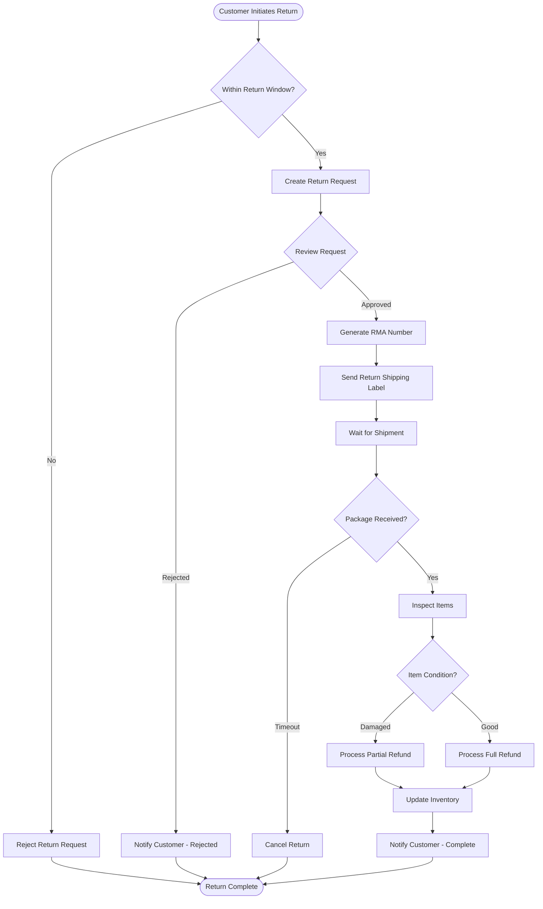
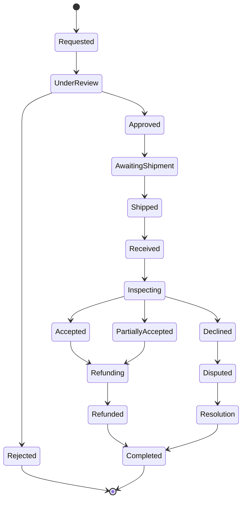

# Return Workflow

## 1. Overview

### 1.1 Return Process Flow



## 2. Return Request Initiation

### 2.1 Eligibility Criteria

| Criteria | Requirement |
|----------|-------------|
| **Time Window** | Within 30 days of delivery |
| **Item Condition** | Unused, original packaging |
| **Documentation** | Order number, receipt |
| **Excluded Items** | Final sale, personalized items |
| **Original Payment** | Must match return method |

### 2.2 Return Request API

```typescript
// POST /api/returns
interface CreateReturnRequest {
  orderId: string;
  items: Array<{
    orderItemId: string;
    quantity: number;
    reason: ReturnReason;
    comments?: string;
    images?: string[];
  }>;
  preferredOutcome: 'refund' | 'exchange' | 'store_credit';
}

enum ReturnReason {
  DEFECTIVE = 'defective',
  WRONG_ITEM = 'wrong_item',
  NOT_AS_DESCRIBED = 'not_as_described',
  NO_LONGER_NEEDED = 'no_longer_needed',
  BETTER_PRICE = 'better_price',
  DAMAGED_IN_SHIPPING = 'damaged_in_shipping',
  OTHER = 'other'
}

// Response
interface ReturnResponse {
  returnId: string;
  rmaNumber: string;
  status: ReturnStatus;
  items: ReturnItem[];
  shippingLabel?: ShippingLabel;
  estimatedRefund: Money;
  expiresAt: Date;
}
```

## 3. Return Processing States

### 3.1 State Machine



### 3.2 State Definitions

| State | Description | Actions | SLA |
|-------|-------------|---------|-----|
| **Requested** | Initial return request | Validate eligibility | 1 hour |
| **UnderReview** | Manual review if needed | Check fraud signals | 4 hours |
| **Approved** | Return approved | Generate RMA, send label | 1 hour |
| **AwaitingShipment** | Waiting for customer | Send reminders | 14 days max |
| **Shipped** | Customer shipped items | Track package | - |
| **Received** | Items received at warehouse | Log receipt | 1 hour |
| **Inspecting** | Quality check | Verify condition | 24 hours |
| **Refunding** | Processing refund | Execute payment | 48 hours |
| **Refunded** | Money returned | Update records | Immediate |
| **Completed** | Return closed | Archive | - |

## 4. Return Processing Logic

### 4.1 Automated Approval Logic

```javascript
class ReturnApprovalService {
  async evaluateReturn(request: ReturnRequest): Promise<ApprovalDecision> {
    const checks = await Promise.all([
      this.checkTimeWindow(request),
      this.checkCustomerHistory(request.customerId),
      this.checkItemEligibility(request.items),
      this.checkFraudRisk(request),
      this.checkReturnValue(request)
    ]);
    
    const score = this.calculateApprovalScore(checks);
    
    if (score >= 90) {
      return { 
        decision: 'AUTO_APPROVED',
        rmaNumber: this.generateRMA()
      };
    } else if (score >= 50) {
      return { 
        decision: 'MANUAL_REVIEW',
        reasons: this.getReviewReasons(checks)
      };
    } else {
      return { 
        decision: 'AUTO_REJECTED',
        reasons: this.getRejectionReasons(checks)
      };
    }
  }
  
  private async checkTimeWindow(request: ReturnRequest): Promise<Check> {
    const order = await this.orderService.getOrder(request.orderId);
    const daysSinceDelivery = this.calculateDays(order.deliveredAt, new Date());
    
    return {
      passed: daysSinceDelivery <= 30,
      score: Math.max(0, 100 - (daysSinceDelivery * 3)),
      reason: `${daysSinceDelivery} days since delivery`
    };
  }
  
  private async checkCustomerHistory(customerId: string): Promise<Check> {
    const history = await this.getCustomerReturnHistory(customerId);
    const returnRate = history.returns / history.orders;
    
    return {
      passed: returnRate < 0.3,
      score: Math.max(0, 100 - (returnRate * 200)),
      flags: returnRate > 0.5 ? ['HIGH_RETURN_RATE'] : []
    };
  }
}
```

### 4.2 RMA Generation

```typescript
class RMAService {
  generateRMA(): string {
    const prefix = 'RMA';
    const date = format(new Date(), 'YYYYMMDD');
    const sequence = this.getNextSequence();
    return `${prefix}-${date}-${sequence.toString().padStart(6, '0')}`;
  }
  
  async createReturnShipment(returnId: string): Promise<ShippingLabel> {
    const returnRequest = await this.getReturn(returnId);
    
    const shipment = await this.shippingService.createLabel({
      from: returnRequest.customer.address,
      to: this.warehouseAddress,
      weight: this.calculateWeight(returnRequest.items),
      service: 'GROUND',
      reference: returnRequest.rmaNumber
    });
    
    // Send label to customer
    await this.notificationService.sendReturnLabel({
      email: returnRequest.customer.email,
      rmaNumber: returnRequest.rmaNumber,
      labelUrl: shipment.labelUrl,
      instructions: this.getReturnInstructions()
    });
    
    return shipment;
  }
}
```

## 5. Inspection Process

### 5.1 Inspection Checklist

```yaml
inspection_criteria:
  physical_condition:
    - no_damage: Check for physical damage
    - original_packaging: Verify packaging integrity
    - all_accessories: Confirm all parts included
    - no_wear: Check for signs of use
    
  authenticity:
    - serial_match: Verify serial numbers
    - genuine_product: Authenticate product
    - tamper_seals: Check security seals
    
  hygiene:
    - cleanliness: Product is clean
    - no_odor: No unusual smells
    - no_stains: No staining or marking
    
  functionality:
    - powers_on: Electronic items work
    - all_features: All functions operational
    - factory_reset: Data wiped (if applicable)
```

### 5.2 Inspection Workflow

```javascript
class InspectionService {
  async inspectReturn(returnId: string): Promise<InspectionResult> {
    const returnItems = await this.getReturnItems(returnId);
    const results = [];
    
    for (const item of returnItems) {
      const inspection = await this.inspectItem(item);
      results.push(inspection);
      
      // Update item status
      await this.updateReturnItem(item.id, {
        inspectionResult: inspection,
        inspectedBy: this.currentUser.id,
        inspectedAt: new Date()
      });
    }
    
    return this.aggregateResults(results);
  }
  
  private async inspectItem(item: ReturnItem): Promise<ItemInspection> {
    const checks = {
      physical: await this.checkPhysicalCondition(item),
      authenticity: await this.verifyAuthenticity(item),
      completeness: await this.checkCompleteness(item),
      functionality: await this.testFunctionality(item)
    };
    
    const decision = this.makeDecision(checks);
    
    return {
      itemId: item.id,
      checks,
      decision,
      refundAmount: this.calculateRefund(item, decision),
      restockable: decision === 'ACCEPTED',
      notes: this.generateNotes(checks)
    };
  }
  
  private makeDecision(checks: InspectionChecks): InspectionDecision {
    const failedChecks = Object.values(checks).filter(c => !c.passed).length;
    
    if (failedChecks === 0) {
      return 'ACCEPTED';
    } else if (failedChecks <= 2 && !checks.authenticity.failed) {
      return 'PARTIAL_REFUND';
    } else {
      return 'REJECTED';
    }
  }
}
```

## 6. Refund Processing

### 6.1 Refund Calculation

```typescript
class RefundCalculator {
  calculateRefund(returnRequest: ReturnRequest): RefundBreakdown {
    const breakdown: RefundBreakdown = {
      items: [],
      subtotal: 0,
      shipping: 0,
      tax: 0,
      fees: 0,
      total: 0
    };
    
    for (const item of returnRequest.items) {
      const itemRefund = this.calculateItemRefund(item);
      breakdown.items.push(itemRefund);
      breakdown.subtotal += itemRefund.amount;
    }
    
    // Calculate proportional tax refund
    breakdown.tax = this.calculateTaxRefund(
      returnRequest.order,
      breakdown.subtotal
    );
    
    // Determine shipping refund
    if (this.shouldRefundShipping(returnRequest)) {
      breakdown.shipping = returnRequest.order.shippingAmount;
    }
    
    // Apply restocking fee if applicable
    if (this.hasRestockingFee(returnRequest)) {
      breakdown.fees = breakdown.subtotal * 0.15; // 15% restocking fee
    }
    
    breakdown.total = 
      breakdown.subtotal + 
      breakdown.tax + 
      breakdown.shipping - 
      breakdown.fees;
    
    return breakdown;
  }
  
  private calculateItemRefund(item: ReturnItem): ItemRefund {
    const originalPrice = item.purchasePrice;
    let refundAmount = originalPrice * item.quantity;
    
    // Apply depreciation based on condition
    if (item.condition === 'USED') {
      refundAmount *= 0.7; // 70% refund for used items
    } else if (item.condition === 'DAMAGED') {
      refundAmount *= 0.5; // 50% refund for damaged items
    }
    
    return {
      itemId: item.id,
      quantity: item.quantity,
      originalPrice,
      refundAmount,
      reason: item.conditionNotes
    };
  }
}
```

### 6.2 Refund Execution

```typescript
class RefundService {
  async processRefund(returnId: string): Promise<RefundResult> {
    const returnRequest = await this.getReturn(returnId);
    const refundAmount = returnRequest.approvedRefundAmount;
    
    try {
      // Lock the return to prevent double processing
      await this.lockReturn(returnId);
      
      // Process based on original payment method
      const result = await this.executeRefund(
        returnRequest.order.paymentMethod,
        refundAmount
      );
      
      // Update return status
      await this.updateReturn(returnId, {
        status: 'REFUNDED',
        refundedAt: new Date(),
        refundTransactionId: result.transactionId
      });
      
      // Update order
      await this.orderService.addRefund(returnRequest.orderId, {
        amount: refundAmount,
        returnId,
        transactionId: result.transactionId
      });
      
      // Send confirmation
      await this.sendRefundConfirmation(returnRequest);
      
      return result;
      
    } catch (error) {
      await this.handleRefundError(returnId, error);
      throw error;
    } finally {
      await this.unlockReturn(returnId);
    }
  }
  
  private async executeRefund(
    paymentMethod: PaymentMethod,
    amount: Money
  ): Promise<RefundResult> {
    switch (paymentMethod.type) {
      case 'CREDIT_CARD':
        return this.stripeService.refund({
          chargeId: paymentMethod.chargeId,
          amount: amount.cents,
          reason: 'requested_by_customer'
        });
        
      case 'PAYPAL':
        return this.paypalService.refund({
          transactionId: paymentMethod.transactionId,
          amount: amount.value,
          currency: amount.currency
        });
        
      case 'STORE_CREDIT':
        return this.storeCreditService.issue({
          customerId: paymentMethod.customerId,
          amount: amount.value,
          expiresIn: 365 // days
        });
        
      default:
        throw new Error(`Unsupported payment method: ${paymentMethod.type}`);
    }
  }
}
```

## 7. Communication Templates

### 7.1 Email Notifications

```typescript
const emailTemplates = {
  returnRequested: {
    subject: 'Return Request Received - Order {{orderNumber}}',
    body: `
      We've received your return request for order {{orderNumber}}.
      
      Return ID: {{returnId}}
      Items: {{itemCount}}
      
      We'll review your request within 4 hours and email you with next steps.
    `
  },
  
  returnApproved: {
    subject: 'Return Approved - RMA {{rmaNumber}}',
    body: `
      Good news! Your return has been approved.
      
      RMA Number: {{rmaNumber}}
      
      Please follow these steps:
      1. Print the attached shipping label
      2. Pack items securely in original packaging
      3. Include the RMA slip inside the package
      4. Drop off at any {{carrier}} location
      
      Ship by: {{shipByDate}}
    `
  },
  
  returnReceived: {
    subject: 'We Received Your Return - {{rmaNumber}}',
    body: `
      We've received your return package and will inspect the items within 24 hours.
      
      Tracking: {{trackingNumber}}
      Received: {{receivedDate}}
      
      You'll receive another email once the inspection is complete.
    `
  },
  
  refundProcessed: {
    subject: 'Refund Processed - ${{amount}}',
    body: `
      Your refund has been processed!
      
      Amount: ${{amount}}
      Method: {{paymentMethod}}
      Transaction: {{transactionId}}
      
      Please allow 3-5 business days for the refund to appear in your account.
      
      Thank you for shopping with TechAlly!
    `
  }
};
```

## 8. Exception Handling

### 8.1 Exception Scenarios

| Scenario | Handling | Escalation |
|----------|----------|------------|
| **Lost in Transit** | File carrier claim, full refund | Automatic |
| **Wrong Item Returned** | Contact customer, request correct item | Manual |
| **Damaged in Return Shipping** | Document, partial refund | Manager approval |
| **Fraudulent Return** | Reject, flag account | Security team |
| **High Value Return** | Manual inspection required | Senior staff |
| **Repeated Returns** | Review account status | Account team |

### 8.2 Dispute Resolution

```typescript
class DisputeHandler {
  async handleDispute(disputeRequest: DisputeRequest): Promise<Resolution> {
    // Create dispute case
    const dispute = await this.createDispute({
      returnId: disputeRequest.returnId,
      reason: disputeRequest.reason,
      customerComments: disputeRequest.comments,
      evidence: disputeRequest.attachments
    });
    
    // Assign to agent
    const agent = await this.assignAgent(dispute.priority);
    
    // Review evidence
    const review = await this.reviewEvidence(dispute);
    
    // Make decision
    const decision = await this.makeDecision(review);
    
    // Apply resolution
    if (decision.outcome === 'CUSTOMER_FAVOR') {
      await this.applyCustomerResolution(decision);
    } else {
      await this.applyMerchantResolution(decision);
    }
    
    // Document outcome
    await this.documentResolution(dispute, decision);
    
    return decision;
  }
}
```

## 9. Metrics & Monitoring

### 9.1 Key Metrics

| Metric | Target | Alert Threshold |
|--------|--------|-----------------|
| **Return Rate** | <5% | >8% |
| **Processing Time** | <48 hours | >72 hours |
| **Auto-Approval Rate** | >70% | <50% |
| **Refund Accuracy** | >99% | <97% |
| **Customer Satisfaction** | >4.0/5.0 | <3.5 |
| **Dispute Rate** | <2% | >5% |

### 9.2 Dashboard Queries

```sql
-- Return rate by category
SELECT 
    c.name as category,
    COUNT(DISTINCT o.id) as total_orders,
    COUNT(DISTINCT r.order_id) as returned_orders,
    ROUND(COUNT(DISTINCT r.order_id)::numeric / COUNT(DISTINCT o.id) * 100, 2) as return_rate
FROM orders o
JOIN order_items oi ON o.id = oi.order_id
JOIN products p ON oi.product_id = p.id
JOIN categories c ON p.category_id = c.id
LEFT JOIN returns r ON o.id = r.order_id
WHERE o.created_at >= NOW() - INTERVAL '30 days'
GROUP BY c.name
ORDER BY return_rate DESC;

-- Average processing time
SELECT 
    DATE_TRUNC('day', r.created_at) as date,
    AVG(EXTRACT(EPOCH FROM (r.refunded_at - r.created_at))/3600) as avg_hours,
    COUNT(*) as return_count
FROM returns r
WHERE r.status = 'REFUNDED'
  AND r.created_at >= NOW() - INTERVAL '7 days'
GROUP BY DATE_TRUNC('day', r.created_at)
ORDER BY date DESC;
```

## 10. References

- [Order Workflow](./order-workflow.md) - `WF-ORDER-001`
- [Payment Workflow](./payment-workflow.md) - `WF-PAY-001`
- [Customer Support Workflow](./support-workflow.md) - `WF-SUPP-001`

---
*This return workflow document is maintained by the Operations Team.*
