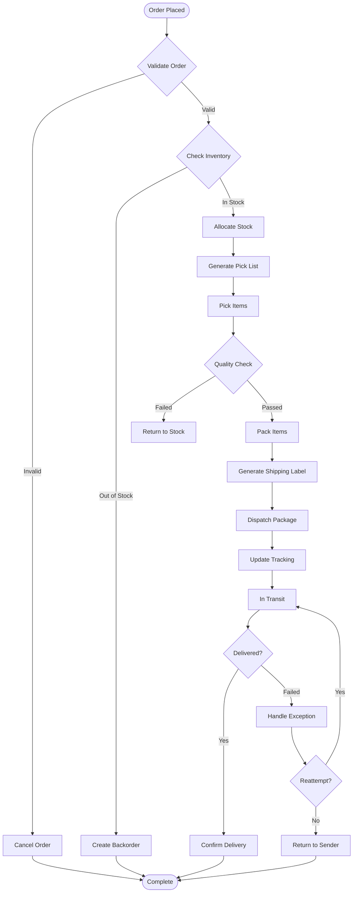
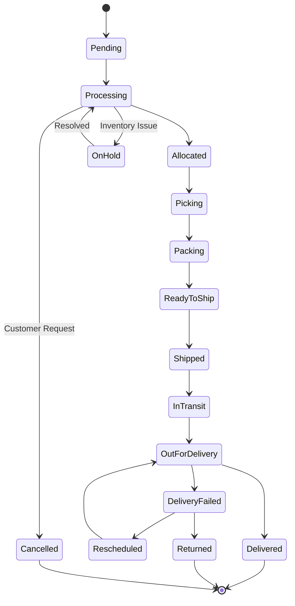

# Shipping Workflow

## 1. Overview

### 1.1 Fulfillment Process Flow



## 2. Order Fulfillment States

### 2.1 State Machine



### 2.2 State Definitions

| State | Description | SLA | Next Actions |
|-------|-------------|-----|--------------|
| **Pending** | Order awaiting processing | 1 hour | Validate, check inventory |
| **Processing** | Order being prepared | 4 hours | Allocate stock |
| **Allocated** | Stock reserved | 30 min | Generate pick list |
| **Picking** | Items being collected | 2 hours | Quality check |
| **Packing** | Items being packed | 1 hour | Generate label |
| **ReadyToShip** | Awaiting carrier pickup | 4 hours | Schedule pickup |
| **Shipped** | With carrier | - | Track shipment |
| **InTransit** | En route to customer | Variable | Monitor tracking |
| **OutForDelivery** | Final delivery attempt | Same day | Confirm delivery |
| **Delivered** | Successfully delivered | - | Close order |

## 3. Warehouse Operations

### 3.1 Pick List Generation

```typescript
class PickListService {
  async generatePickList(orderId: string): Promise<PickList> {
    const order = await this.orderService.getOrder(orderId);
    const items = await this.getOrderItems(orderId);
    
    // Optimize picking route
    const optimizedRoute = await this.optimizePickingRoute(items);
    
    const pickList: PickList = {
      id: generateId(),
      orderId: order.id,
      orderNumber: order.orderNumber,
      priority: this.calculatePriority(order),
      picker: null,
      items: optimizedRoute.map(item => ({
        sku: item.sku,
        name: item.name,
        quantity: item.quantity,
        location: {
          warehouse: item.warehouse,
          zone: item.zone,
          aisle: item.aisle,
          shelf: item.shelf,
          bin: item.bin
        },
        barcode: item.barcode,
        imageUrl: item.imageUrl,
        specialInstructions: item.instructions
      })),
      estimatedTime: optimizedRoute.estimatedMinutes,
      createdAt: new Date()
    };
    
    // Assign to available picker
    const picker = await this.assignPicker(pickList);
    pickList.picker = picker;
    
    // Send to warehouse management system
    await this.wms.createPickTask(pickList);
    
    return pickList;
  }
  
  private async optimizePickingRoute(items: OrderItem[]): Promise<OptimizedRoute> {
    // Group items by warehouse zone
    const zones = this.groupByZone(items);
    
    // Calculate optimal path using TSP algorithm
    const path = this.calculateShortestPath(zones);
    
    // Order items by optimized path
    return {
      items: path.orderedItems,
      estimatedMinutes: path.totalTime,
      distance: path.totalDistance
    };
  }
  
  private calculatePriority(order: Order): Priority {
    const factors = {
      shippingSpeed: this.getShippingPriority(order.shippingMethod),
      customerTier: this.getCustomerPriority(order.customerId),
      orderValue: this.getValuePriority(order.totalAmount),
      timeInQueue: this.getAgePriority(order.createdAt)
    };
    
    const score = 
      factors.shippingSpeed * 0.4 +
      factors.customerTier * 0.2 +
      factors.orderValue * 0.2 +
      factors.timeInQueue * 0.2;
    
    if (score > 80) return 'URGENT';
    if (score > 60) return 'HIGH';
    if (score > 40) return 'NORMAL';
    return 'LOW';
  }
}
```

### 3.2 Picking Process

```typescript
class PickingService {
  async startPicking(pickListId: string, pickerId: string): Promise<void> {
    await this.updatePickList(pickListId, {
      status: 'IN_PROGRESS',
      startedAt: new Date(),
      pickerId
    });
    
    // Start timer for performance tracking
    await this.metricsService.startTimer(`picking:${pickListId}`);
  }
  
  async scanItem(pickListId: string, barcode: string): Promise<ScanResult> {
    const pickList = await this.getPickList(pickListId);
    const item = pickList.items.find(i => i.barcode === barcode);
    
    if (!item) {
      return {
        success: false,
        error: 'Item not in pick list',
        suggestion: await this.findSimilarItem(barcode, pickList)
      };
    }
    
    if (item.picked) {
      return {
        success: false,
        error: 'Item already picked'
      };
    }
    
    // Mark item as picked
    await this.updatePickItem(pickListId, item.id, {
      picked: true,
      pickedAt: new Date(),
      pickedQuantity: item.quantity
    });
    
    // Check if all items picked
    const remaining = await this.getRemainingItems(pickListId);
    
    return {
      success: true,
      remaining: remaining.length,
      nextLocation: remaining[0]?.location
    };
  }
  
  async completePicking(pickListId: string): Promise<void> {
    const pickList = await this.getPickList(pickListId);
    
    // Validate all items picked
    const unpicked = pickList.items.filter(i => !i.picked);
    if (unpicked.length > 0) {
      throw new Error(`${unpicked.length} items not picked`);
    }
    
    // Update status
    await this.updatePickList(pickListId, {
      status: 'COMPLETED',
      completedAt: new Date()
    });
    
    // Record metrics
    const duration = await this.metricsService.stopTimer(`picking:${pickListId}`);
    await this.recordPickingMetrics(pickListId, duration);
    
    // Move to packing
    await this.packingService.createPackingTask(pickList.orderId);
  }
}
```

## 4. Packing Operations

### 4.1 Package Selection

```typescript
class PackageSelector {
  async selectOptimalPackage(items: Item[]): Promise<Package> {
    const totalVolume = this.calculateTotalVolume(items);
    const totalWeight = this.calculateTotalWeight(items);
    const fragile = items.some(i => i.fragile);
    
    // Get available package types
    const packages = await this.getAvailablePackages();
    
    // Filter suitable packages
    const suitable = packages.filter(pkg => 
      pkg.maxVolume >= totalVolume &&
      pkg.maxWeight >= totalWeight &&
      (!fragile || pkg.protective)
    );
    
    // Select optimal package (smallest suitable)
    const optimal = suitable.sort((a, b) => {
      const aCost = this.calculatePackageCost(a, totalWeight);
      const bCost = this.calculatePackageCost(b, totalWeight);
      return aCost - bCost;
    })[0];
    
    if (!optimal) {
      // Need multiple packages
      return this.splitIntoMultiplePackages(items);
    }
    
    return {
      type: optimal.type,
      dimensions: optimal.dimensions,
      weight: totalWeight,
      items: items.map(i => i.id),
      packingMaterial: this.selectPackingMaterial(items, optimal),
      estimatedShippingCost: this.calculatePackageCost(optimal, totalWeight)
    };
  }
  
  private selectPackingMaterial(items: Item[], pkg: Package): PackingMaterial[] {
    const materials = [];
    
    // Add bubble wrap for fragile items
    if (items.some(i => i.fragile)) {
      materials.push({
        type: 'BUBBLE_WRAP',
        quantity: this.calculateBubbleWrapNeeded(items)
      });
    }
    
    // Add void fill
    const voidSpace = pkg.volume - this.calculateTotalVolume(items);
    if (voidSpace > 0.1) { // More than 10% void
      materials.push({
        type: 'AIR_PILLOWS',
        quantity: Math.ceil(voidSpace / 0.05) // Each pillow fills 0.05 cubic feet
      });
    }
    
    // Add documentation
    materials.push({
      type: 'PACKING_SLIP',
      quantity: 1
    });
    
    return materials;
  }
}
```

### 4.2 Packing Process

```typescript
class PackingService {
  async packOrder(orderId: string): Promise<PackingResult> {
    const items = await this.getPickedItems(orderId);
    const packages = await this.packageSelector.selectOptimalPackage(items);
    
    const packingResult = {
      orderId,
      packages: [],
      totalWeight: 0,
      totalCost: 0
    };
    
    for (const pkg of packages) {
      const packageId = generateId();
      
      // Generate packing instructions
      const instructions = this.generatePackingInstructions(pkg);
      
      // Create package record
      const packageRecord = await this.createPackage({
        id: packageId,
        orderId,
        type: pkg.type,
        dimensions: pkg.dimensions,
        weight: pkg.weight,
        items: pkg.items,
        instructions
      });
      
      // Print packing slip
      await this.printPackingSlip(packageId);
      
      // Generate QR code for tracking
      const qrCode = await this.generateQRCode(packageId);
      
      packingResult.packages.push({
        id: packageId,
        qrCode,
        weight: pkg.weight,
        estimatedCost: pkg.estimatedShippingCost
      });
      
      packingResult.totalWeight += pkg.weight;
      packingResult.totalCost += pkg.estimatedShippingCost;
    }
    
    // Update order status
    await this.orderService.updateStatus(orderId, 'PACKED');
    
    return packingResult;
  }
  
  private generatePackingInstructions(pkg: Package): PackingInstruction[] {
    const instructions = [];
    
    // Base layer
    instructions.push({
      step: 1,
      action: 'Place packing material in bottom of box',
      material: 'AIR_PILLOWS',
      quantity: 2
    });
    
    // Item placement
    let step = 2;
    for (const item of pkg.items) {
      if (item.fragile) {
        instructions.push({
          step: step++,
          action: `Wrap ${item.name} in bubble wrap`,
          material: 'BUBBLE_WRAP'
        });
      }
      
      instructions.push({
        step: step++,
        action: `Place ${item.name} in box`,
        position: this.calculateOptimalPosition(item, pkg)
      });
    }
    
    // Top layer
    instructions.push({
      step: step++,
      action: 'Fill remaining void with packing material',
      material: 'AIR_PILLOWS'
    });
    
    // Documentation
    instructions.push({
      step: step++,
      action: 'Insert packing slip',
      document: 'PACKING_SLIP'
    });
    
    // Seal
    instructions.push({
      step: step++,
      action: 'Seal box with tape',
      material: 'PACKING_TAPE'
    });
    
    return instructions;
  }
}
```

## 5. Shipping Label Generation

### 5.1 Carrier Integration

```typescript
class ShippingLabelService {
  async generateLabel(orderId: string): Promise<ShippingLabel> {
    const order = await this.orderService.getOrder(orderId);
    const packages = await this.getPackages(orderId);
    
    // Select carrier based on shipping method
    const carrier = this.selectCarrier(order.shippingMethod);
    
    // Prepare shipment data
    const shipment = {
      from: await this.getWarehouseAddress(),
      to: order.shippingAddress,
      packages: packages.map(pkg => ({
        weight: pkg.weight,
        dimensions: pkg.dimensions,
        value: this.calculatePackageValue(pkg),
        reference: pkg.id
      })),
      service: this.mapShippingService(order.shippingMethod),
      insurance: order.totalAmount > 100,
      signatureRequired: order.totalAmount > 500
    };
    
    // Generate label with carrier
    const label = await this.createShipmentWithCarrier(carrier, shipment);
    
    // Save label information
    await this.saveShippingLabel({
      orderId,
      carrier: carrier.name,
      trackingNumber: label.trackingNumber,
      labelUrl: label.labelUrl,
      cost: label.cost,
      estimatedDelivery: label.estimatedDelivery,
      createdAt: new Date()
    });
    
    return label;
  }
  
  private async createShipmentWithCarrier(
    carrier: Carrier,
    shipment: Shipment
  ): Promise<CarrierLabel> {
    switch (carrier.type) {
      case 'FEDEX':
        return this.fedexService.createShipment(shipment);
        
      case 'UPS':
        return this.upsService.createShipment(shipment);
        
      case 'USPS':
        return this.uspsService.createShipment(shipment);
        
      case 'DHL':
        return this.dhlService.createShipment(shipment);
        
      default:
        throw new Error(`Unsupported carrier: ${carrier.type}`);
    }
  }
  
  private selectCarrier(shippingMethod: string): Carrier {
    const carrierMap = {
      'standard': { type: 'USPS', service: 'GROUND' },
      'express': { type: 'FEDEX', service: 'EXPRESS' },
      'overnight': { type: 'UPS', service: 'NEXT_DAY_AIR' },
      'international': { type: 'DHL', service: 'EXPRESS_WORLDWIDE' }
    };
    
    return carrierMap[shippingMethod] || carrierMap['standard'];
  }
}
```

## 6. Dispatch & Tracking

### 6.1 Dispatch Process

```typescript
class DispatchService {
  async schedulePickup(date: Date): Promise<PickupConfirmation> {
    // Get all ready-to-ship orders
    const orders = await this.getReadyToShipOrders();
    
    // Group by carrier
    const carrierGroups = this.groupByCarrier(orders);
    
    const pickups = [];
    for (const [carrier, orderList] of carrierGroups) {
      const pickup = await this.scheduleCarrierPickup(carrier, {
        date,
        packageCount: orderList.length,
        totalWeight: this.calculateTotalWeight(orderList),
        readyTime: '10:00',
        closeTime: '18:00',
        location: await this.getWarehouseAddress()
      });
      
      pickups.push(pickup);
      
      // Update order statuses
      await this.updateOrderStatuses(orderList, 'AWAITING_PICKUP');
    }
    
    return {
      date,
      pickups,
      totalPackages: orders.length
    };
  }
  
  async confirmPickup(carrier: string, packages: string[]): Promise<void> {
    // Update package statuses
    for (const packageId of packages) {
      await this.updatePackageStatus(packageId, {
        status: 'PICKED_UP',
        pickedUpAt: new Date(),
        carrier
      });
      
      // Update order status
      const order = await this.getOrderByPackage(packageId);
      await this.orderService.updateStatus(order.id, 'SHIPPED');
      
      // Send shipping confirmation
      await this.notificationService.sendShippingConfirmation(order);
    }
    
    // Start tracking
    await this.trackingService.startTracking(packages);
  }
}
```

### 6.2 Tracking Updates

```typescript
class TrackingService {
  async updateTracking(): Promise<void> {
    // Get all active shipments
    const shipments = await this.getActiveShipments();
    
    // Batch update by carrier
    const updates = await Promise.all([
      this.updateFedExTracking(shipments.fedex),
      this.updateUPSTracking(shipments.ups),
      this.updateUSPSTracking(shipments.usps),
      this.updateDHLTracking(shipments.dhl)
    ]);
    
    // Process updates
    for (const update of updates.flat()) {
      await this.processTrackingUpdate(update);
    }
  }
  
  private async processTrackingUpdate(update: TrackingUpdate): Promise<void> {
    const current = await this.getCurrentStatus(update.trackingNumber);
    
    // Check if status changed
    if (current.status !== update.status) {
      // Update database
      await this.updateShipmentStatus({
        trackingNumber: update.trackingNumber,
        status: update.status,
        location: update.location,
        timestamp: update.timestamp,
        details: update.details
      });
      
      // Send notifications for key events
      if (this.isNotifiableEvent(update.status)) {
        await this.sendTrackingNotification(update);
      }
      
      // Handle special statuses
      switch (update.status) {
        case 'DELIVERED':
          await this.handleDelivery(update);
          break;
          
        case 'DELIVERY_FAILED':
          await this.handleDeliveryFailure(update);
          break;
          
        case 'RETURNED':
          await this.handleReturn(update);
          break;
          
        case 'LOST':
          await this.handleLostPackage(update);
          break;
      }
    }
  }
  
  private async handleDelivery(update: TrackingUpdate): Promise<void> {
    const order = await this.getOrderByTracking(update.trackingNumber);
    
    // Update order status
    await this.orderService.updateStatus(order.id, 'DELIVERED');
    
    // Record delivery details
    await this.recordDeliveryDetails({
      orderId: order.id,
      deliveredAt: update.timestamp,
      signedBy: update.details.signature,
      location: update.details.location,
      photo: update.details.proofPhoto
    });
    
    // Send confirmation
    await this.notificationService.sendDeliveryConfirmation(order);
    
    // Start review request timer (send after 3 days)
    await this.scheduleReviewRequest(order.id, 3);
  }
}
```

## 7. Exception Handling

### 7.1 Common Exceptions

```typescript
class ShippingExceptionHandler {
  async handleException(exception: ShippingException): Promise<void> {
    switch (exception.type) {
      case 'ADDRESS_INVALID':
        await this.handleInvalidAddress(exception);
        break;
        
      case 'PACKAGE_DAMAGED':
        await this.handleDamagedPackage(exception);
        break;
        
      case 'DELIVERY_REFUSED':
        await this.handleRefusedDelivery(exception);
        break;
        
      case 'CUSTOMS_HOLD':
        await this.handleCustomsHold(exception);
        break;
        
      case 'WEATHER_DELAY':
        await this.handleWeatherDelay(exception);
        break;
        
      default:
        await this.handleGenericException(exception);
    }
  }
  
  private async handleInvalidAddress(exception: ShippingException): Promise<void> {
    const order = exception.order;
    
    // Try to validate/correct address
    const suggestion = await this.addressService.validateAddress(order.shippingAddress);
    
    if (suggestion.valid) {
      // Update address and reship
      await this.updateShippingAddress(order.id, suggestion.corrected);
      await this.reshipOrder(order.id);
    } else {
      // Contact customer
      await this.notificationService.sendAddressVerification({
        orderId: order.id,
        currentAddress: order.shippingAddress,
        suggestions: suggestion.alternatives
      });
      
      // Put order on hold
      await this.orderService.updateStatus(order.id, 'ON_HOLD');
    }
  }
}
```

## 8. Performance Metrics

### 8.1 KPIs

| Metric | Target | Measurement |
|--------|--------|-------------|
| **Order Fulfillment Time** | <24 hours | Order placed to shipped |
| **Picking Accuracy** | >99.5% | Correct items picked |
| **Packing Efficiency** | <5 min/order | Time to pack |
| **On-Time Delivery** | >95% | Delivered by promised date |
| **Shipping Cost/Order** | <$8 | Average shipping cost |
| **Damage Rate** | <0.5% | Damaged in shipping |
| **Carrier Performance** | >98% | Successful deliveries |

### 8.2 Dashboard Queries

```sql
-- Daily fulfillment metrics
SELECT 
    DATE(o.created_at) as order_date,
    COUNT(*) as total_orders,
    COUNT(CASE WHEN s.shipped_at IS NOT NULL THEN 1 END) as shipped_orders,
    AVG(EXTRACT(EPOCH FROM (s.shipped_at - o.created_at))/3600) as avg_fulfillment_hours,
    COUNT(CASE WHEN s.delivered_at IS NOT NULL THEN 1 END) as delivered_orders
FROM orders o
LEFT JOIN order_shipping s ON o.id = s.order_id
WHERE o.created_at >= CURRENT_DATE - INTERVAL '30 days'
GROUP BY DATE(o.created_at)
ORDER BY order_date DESC;

-- Carrier performance
SELECT 
    s.carrier,
    COUNT(*) as total_shipments,
    COUNT(CASE WHEN s.delivered_at IS NOT NULL THEN 1 END) as delivered,
    AVG(EXTRACT(EPOCH FROM (s.delivered_at - s.shipped_at))/86400) as avg_transit_days,
    COUNT(CASE WHEN s.status = 'DELIVERY_FAILED' THEN 1 END) as failed_deliveries
FROM order_shipping s
WHERE s.shipped_at >= CURRENT_DATE - INTERVAL '30 days'
GROUP BY s.carrier;
```

## 9. Cost Optimization

### 9.1 Shipping Cost Analysis

```typescript
class ShippingCostOptimizer {
  async optimizeShipping(order: Order): Promise<ShippingOption> {
    const options = await this.getAllShippingOptions(order);
    
    // Calculate total cost including materials
    const costAnalysis = options.map(opt => ({
      ...opt,
      totalCost: opt.carrierCost + 
                 opt.packagingCost + 
                 opt.laborCost,
      deliveryTime: opt.estimatedDays,
      reliability: this.getCarrierReliability(opt.carrier)
    }));
    
    // Apply business rules
    if (order.shippingMethod === 'express') {
      return this.selectFastestReliable(costAnalysis);
    } else if (order.totalAmount > 500) {
      return this.selectMostReliable(costAnalysis);
    } else {
      return this.selectCheapestAcceptable(costAnalysis);
    }
  }
}
```

## 10. References

- [Order Workflow](./order-workflow.md) - `WF-ORDER-001`
- [Return Workflow](./return-workflow.md) - `WF-RET-001`
- [Inventory Management](../03_architecture/inventory-management.md)

---
*This shipping workflow document is maintained by the Fulfillment Team.*
