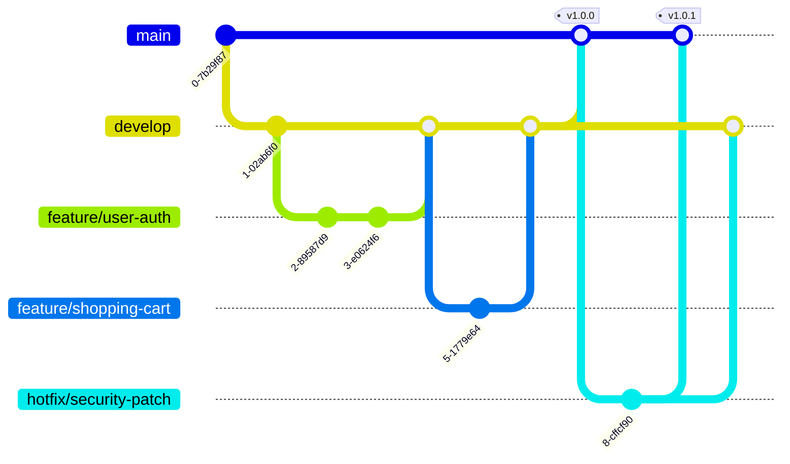

# Deployment and DevOps Guide

## 1. DevOps Overview

### 1.1 DevOps Architecture


### 1.2 DevOps Principles

| Principle | Implementation | Tools | Benefits |
|-----------|----------------|-------|----------|
| Infrastructure as Code | Terraform, CloudFormation | Terraform | Version control, repeatability |
| Continuous Integration | Automated testing | GitHub Actions | Early bug detection |
| Continuous Deployment | Automated deployment | ArgoCD | Faster releases |
| Monitoring & Logging | Observability stack | DataDog, ELK | Proactive issue detection |
| Security Integration | DevSecOps | Snyk, Trivy | Secure by design |
| Collaboration | Shared responsibility | Slack, JIRA | Better communication |

## 2. CI/CD Pipeline

### 2.1 Pipeline Architecture

```yaml
name: CI/CD Pipeline
on:
  push:
    branches: [main, develop]
  pull_request:
    branches: [main]

jobs:
  build-and-test:
    runs-on: ubuntu-latest
    steps:
      - name: Checkout code
        uses: actions/checkout@v3
      
      - name: Setup Node.js
        uses: actions/setup-node@v3
        with:
          node-version: '20'
      
      - name: Install dependencies
        run: npm ci
      
      - name: Run linting
        run: npm run lint
      
      - name: Run unit tests
        run: npm run test:unit
      
      - name: Run integration tests
        run: npm run test:integration
      
      - name: Code coverage
        run: npm run test:coverage
      
      - name: SonarQube analysis
        uses: sonarsource/sonarqube-scan-action@master
      
  security-scan:
    runs-on: ubuntu-latest
    steps:
      - name: Run Snyk security scan
        uses: snyk/actions/node@master
      
      - name: Run SAST scan
        uses: github/super-linter@v4
      
  build-docker:
    needs: [build-and-test, security-scan]
    runs-on: ubuntu-latest
    steps:
      - name: Build Docker image
        run: docker build -t techally:${{ github.sha }} .
      
      - name: Scan Docker image
        uses: aquasecurity/trivy-action@master
      
      - name: Push to ECR
        run: |
          aws ecr get-login-password | docker login --username AWS --password-stdin $ECR_REGISTRY
          docker push $ECR_REGISTRY/techally:${{ github.sha }}
  
  deploy:
    needs: build-docker
    runs-on: ubuntu-latest
    steps:
      - name: Deploy to Kubernetes
        run: |
          kubectl set image deployment/techally techally=$ECR_REGISTRY/techally:${{ github.sha }}
          kubectl rollout status deployment/techally
```

### 2.2 Branching Strategy



## 3. Infrastructure as Code

### 3.1 Terraform Structure

```hcl
# main.tf
terraform {
  required_version = ">= 1.0"
  
  required_providers {
    aws = {
      source  = "hashicorp/aws"
      version = "~> 5.0"
    }
    kubernetes = {
      source  = "hashicorp/kubernetes"
      version = "~> 2.23"
    }
  }
  
  backend "s3" {
    bucket = "techally-terraform-state"
    key    = "infrastructure/terraform.tfstate"
    region = "us-east-1"
    encrypt = true
    dynamodb_table = "terraform-locks"
  }
}

# VPC Configuration
module "vpc" {
  source = "./modules/vpc"
  
  cidr_block = "10.0.0.0/16"
  availability_zones = ["us-east-1a", "us-east-1b", "us-east-1c"]
  
  public_subnets  = ["10.0.1.0/24", "10.0.2.0/24", "10.0.3.0/24"]
  private_subnets = ["10.0.10.0/24", "10.0.11.0/24", "10.0.12.0/24"]
  database_subnets = ["10.0.20.0/24", "10.0.21.0/24", "10.0.22.0/24"]
  
  enable_nat_gateway = true
  enable_vpn_gateway = false
  
  tags = {
    Environment = var.environment
    Project     = "TechAlly"
  }
}

# EKS Cluster
module "eks" {
  source = "./modules/eks"
  
  cluster_name    = "techally-${var.environment}"
  cluster_version = "1.28"
  
  vpc_id     = module.vpc.vpc_id
  subnet_ids = module.vpc.private_subnet_ids
  
  node_groups = {
    general = {
      desired_capacity = 3
      min_capacity     = 2
      max_capacity     = 10
      instance_types   = ["t3.large"]
    }
  }
}

# RDS Database
module "rds" {
  source = "./modules/rds"
  
  identifier = "techally-postgres"
  engine     = "postgres"
  engine_version = "15.4"
  
  instance_class = "db.r6g.xlarge"
  allocated_storage = 100
  storage_encrypted = true
  
  db_name  = "techally"
  username = "dbadmin"
  password = random_password.db_password.result
  
  vpc_id = module.vpc.vpc_id
  subnet_ids = module.vpc.database_subnet_ids
  
  backup_retention_period = 30
  backup_window = "03:00-04:00"
  maintenance_window = "sun:04:00-sun:05:00"
  
  enabled_cloudwatch_logs_exports = ["postgresql"]
}
```

### 3.2 Kubernetes Manifests

```yaml
# deployment.yaml
apiVersion: apps/v1
kind: Deployment
metadata:
  name: techally-api
  namespace: production
  labels:
    app: techally-api
    environment: production
spec:
  replicas: 3
  strategy:
    type: RollingUpdate
    rollingUpdate:
      maxSurge: 1
      maxUnavailable: 0
  selector:
    matchLabels:
      app: techally-api
  template:
    metadata:
      labels:
        app: techally-api
        version: v1.0.0
    spec:
      containers:
      - name: api
        image: techally/api:1.0.0
        ports:
        - containerPort: 3000
          protocol: TCP
        env:
        - name: NODE_ENV
          value: "production"
        - name: DB_HOST
          valueFrom:
            secretKeyRef:
              name: db-credentials
              key: host
        - name: DB_PASSWORD
          valueFrom:
            secretKeyRef:
              name: db-credentials
              key: password
        resources:
          requests:
            memory: "256Mi"
            cpu: "250m"
          limits:
            memory: "512Mi"
            cpu: "500m"
        livenessProbe:
          httpGet:
            path: /health
            port: 3000
          initialDelaySeconds: 30
          periodSeconds: 10
        readinessProbe:
          httpGet:
            path: /ready
            port: 3000
          initialDelaySeconds: 5
          periodSeconds: 5
---
apiVersion: v1
kind: Service
metadata:
  name: techally-api-service
  namespace: production
spec:
  selector:
    app: techally-api
  ports:
  - port: 80
    targetPort: 3000
    protocol: TCP
  type: ClusterIP
---
apiVersion: autoscaling/v2
kind: HorizontalPodAutoscaler
metadata:
  name: techally-api-hpa
  namespace: production
spec:
  scaleTargetRef:
    apiVersion: apps/v1
    kind: Deployment
    name: techally-api
  minReplicas: 3
  maxReplicas: 10
  metrics:
  - type: Resource
    resource:
      name: cpu
      target:
        type: Utilization
        averageUtilization: 70
  - type: Resource
    resource:
      name: memory
      target:
        type: Utilization
        averageUtilization: 80
```

## 4. Deployment Strategies

### 4.1 Deployment Patterns


### 4.2 Deployment Checklist

- [ ] Code review completed
- [ ] All tests passing
- [ ] Security scans passed
- [ ] Documentation updated
- [ ] Database migrations ready
- [ ] Feature flags configured
- [ ] Rollback plan documented
- [ ] Monitoring alerts configured
- [ ] Load testing completed
- [ ] Stakeholder approval

## 5. Environment Management

### 5.1 Environment Configuration

| Environment | Purpose | Scale | Data | Access |
|-------------|---------|-------|------|--------|
| Development | Feature development | Minimal | Mock | Developers |
| Staging | Integration testing | 50% prod | Sanitized | Team |
| UAT | User acceptance | 50% prod | Test | Stakeholders |
| Production | Live system | Full | Production | Limited |
| DR | Disaster recovery | Full | Replicated | Emergency |

### 5.2 Configuration Management

```yaml
# config/environments/production.yaml
application:
  name: techally
  environment: production
  version: 1.0.0
  
server:
  port: 3000
  host: 0.0.0.0
  workers: 4
  
database:
  host: ${DB_HOST}
  port: 5432
  name: techally_prod
  ssl: true
  pool:
    min: 10
    max: 50
  
redis:
  host: ${REDIS_HOST}
  port: 6379
  password: ${REDIS_PASSWORD}
  
aws:
  region: us-east-1
  s3:
    bucket: techally-prod-assets
  sqs:
    queue: techally-prod-queue
    
monitoring:
  datadog:
    enabled: true
    api_key: ${DD_API_KEY}
  sentry:
    enabled: true
    dsn: ${SENTRY_DSN}
```

## 6. Monitoring and Observability

### 6.1 Monitoring Stack


### 6.2 Key Metrics

| Metric Category | Metrics | Threshold | Alert |
|-----------------|---------|-----------|-------|
| Application | Response time, Error rate | <2s, <1% | PagerDuty |
| Infrastructure | CPU, Memory, Disk | <80% | Slack |
| Database | Connections, Query time | <100, <50ms | Email |
| Business | Orders/min, Revenue/hour | Baseline ±20% | Dashboard |

## 7. Backup and Recovery

### 7.1 Backup Strategy


### 7.2 Recovery Procedures

| Scenario | RTO | RPO | Procedure | Test Frequency |
|----------|-----|-----|-----------|----------------|
| Database crash | 2 hours | 1 hour | Restore from backup | Monthly |
| Region failure | 4 hours | 2 hours | Failover to DR | Quarterly |
| Data corruption | 6 hours | 1 day | Point-in-time recovery | Quarterly |
| Complete disaster | 24 hours | 4 hours | Full rebuild | Annually |

## 8. Security Automation

### 8.1 Security Pipeline

```yaml
security-checks:
  pre-commit:
    - secret-scanning
    - code-formatting
  
  ci-pipeline:
    - dependency-check
    - sast-scan
    - container-scan
    
  pre-deployment:
    - penetration-test
    - compliance-check
    
  runtime:
    - vulnerability-monitoring
    - intrusion-detection
```

## 9. Performance Optimization

### 9.1 Performance Tuning

| Component | Optimization | Tool | Metric |
|-----------|--------------|------|--------|
| Application | Code profiling | Node.js Profiler | CPU usage |
| Database | Query optimization | pgAdmin | Query time |
| Cache | Hit ratio improvement | Redis Insights | Hit rate |
| CDN | Edge caching | CloudFront | Cache ratio |
| Load Balancer | Connection pooling | ALB metrics | Connections |

## 10. Incident Management

### 10.1 Incident Response


### 10.2 Runbook Example

```markdown
## Service: Payment Processing
### Alert: High Payment Failure Rate

**Severity**: P1 - Critical
**Team**: Payments Team

**Symptoms**:
- Payment failure rate >5%
- Customer complaints about checkout

**Immediate Actions**:
1. Check payment gateway status
2. Review recent deployments
3. Check database connections
4. Review error logs

**Investigation**:
```bash
# Check service health
kubectl get pods -n production | grep payment

# Check logs
kubectl logs -n production deployment/payment-service --tail=100

# Check metrics
curl http://metrics.internal/payment/failure_rate
```

**Resolution Steps**:
1. Rollback if recent deployment
2. Restart payment service
3. Clear connection pool
4. Contact payment provider if external issue

**Escalation**:
- 15 min: Team Lead
- 30 min: Engineering Manager
- 1 hour: CTO
```

## 11. Cost Optimization

### 11.1 Cost Management

| Resource | Optimization | Savings | Implementation |
|----------|--------------|---------|----------------|
| Compute | Spot instances | 70% | Auto-scaling groups |
| Storage | Lifecycle policies | 50% | S3 tiers |
| Database | Reserved instances | 40% | 1-year commitment |
| Network | CDN caching | 30% | CloudFront |
| Monitoring | Log retention | 60% | 30-day retention |

## 12. Documentation

### 12.1 Documentation Requirements

| Document | Purpose | Audience | Update Frequency |
|----------|---------|----------|------------------|
| Architecture Diagrams | System overview | All teams | Quarterly |
| Runbooks | Incident response | On-call | As needed |
| API Documentation | Integration guide | Developers | Per release |
| Deployment Guide | Release process | DevOps | Per change |
| Disaster Recovery | Recovery procedures | Operations | Annually |

## 13. References

- [Kubernetes Documentation](https://kubernetes.io/docs/)
- [Terraform Documentation](https://www.terraform.io/docs)
- [AWS Best Practices](https://aws.amazon.com/architecture/best-practices/)
- [GitHub Actions](https://docs.github.com/en/actions)
- [DataDog Monitoring](https://docs.datadoghq.com/)

---
*This deployment guide is maintained by the DevOps Team and requires approval for significant changes.*
