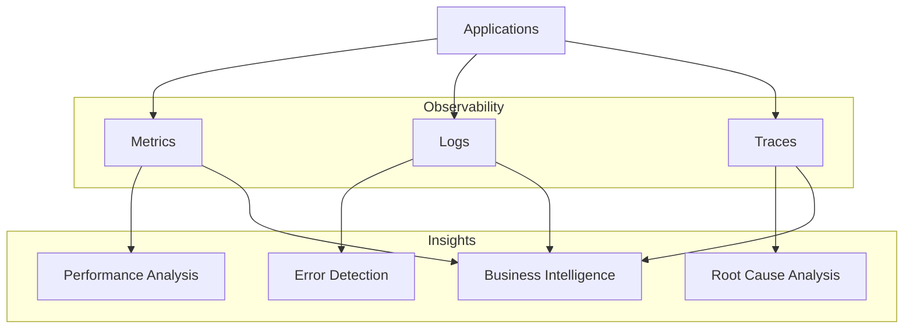
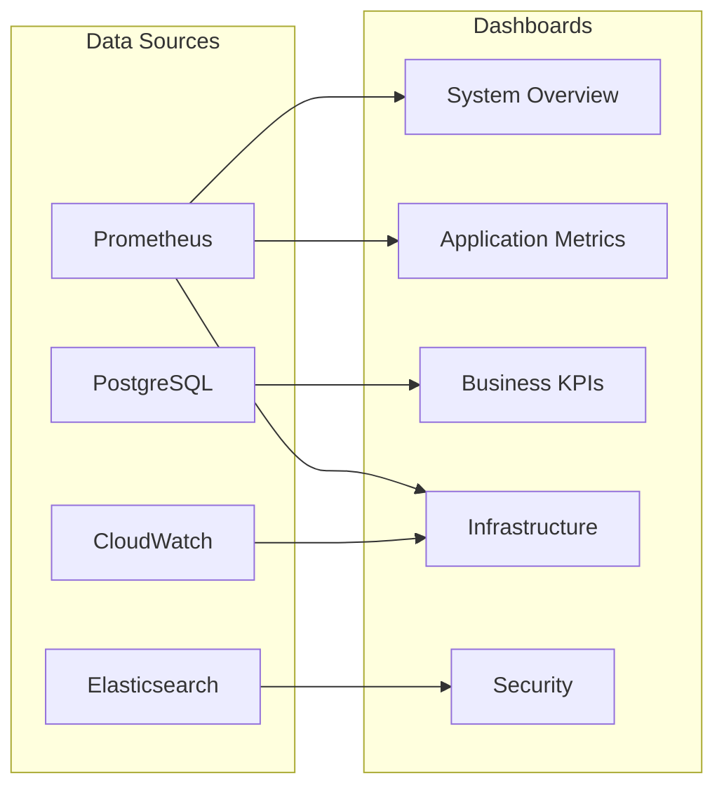
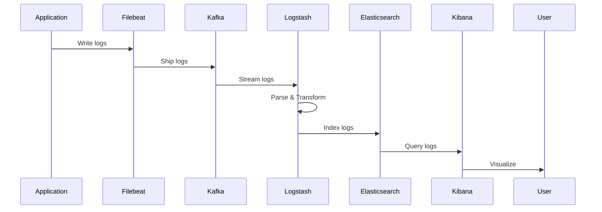
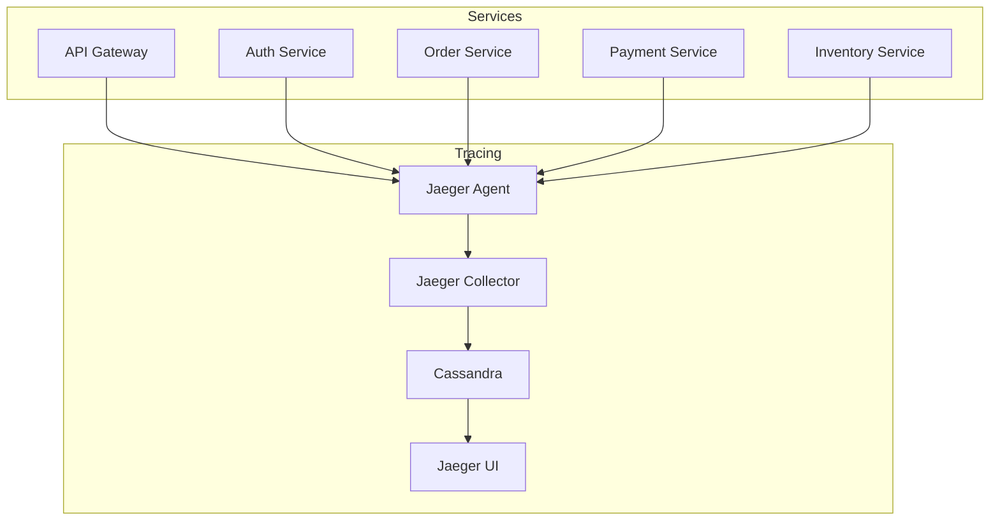
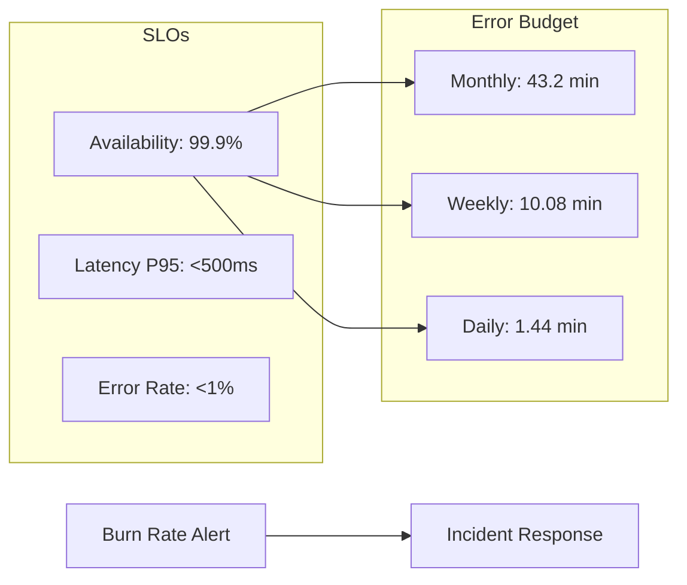
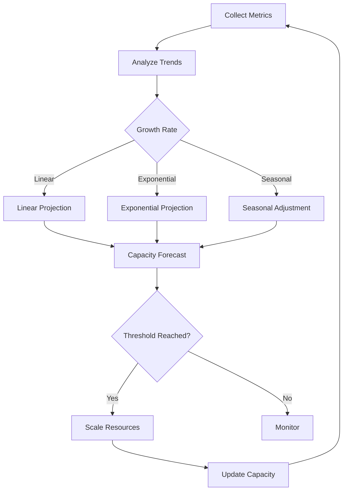
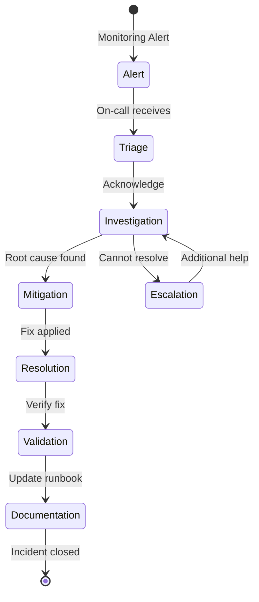

# Monitoring and Observability Guide

## 1. Observability Overview

### 1.1 Three Pillars of Observability



### 1.2 Monitoring Stack

| Component | Tool | Purpose | Data Retention |
|-----------|------|---------|----------------|
| Metrics | Prometheus + Grafana | Time-series metrics | 30 days hot, 1 year cold |
| Logs | ELK Stack | Log aggregation | 7 days hot, 90 days archive |
| Traces | Jaeger | Distributed tracing | 7 days |
| APM | DataDog | Application monitoring | 15 days |
| Synthetic | Pingdom | Uptime monitoring | 30 days |
| Real User | Google Analytics | User behavior | 14 months |

## 2. Metrics Monitoring

### 2.1 Key Metrics Categories

```yaml
metrics:
  application:
    - request_rate
    - response_time
    - error_rate
    - throughput
    - success_rate
    
  infrastructure:
    - cpu_usage
    - memory_usage
    - disk_io
    - network_traffic
    - container_stats
    
  business:
    - orders_per_minute
    - conversion_rate
    - cart_abandonment
    - revenue_per_hour
    - active_users
    
  custom:
    - payment_success_rate
    - inventory_accuracy
    - search_relevance
    - recommendation_ctr
```

### 2.2 Prometheus Configuration

```yaml
# prometheus.yml
global:
  scrape_interval: 15s
  evaluation_interval: 15s
  
scrape_configs:
  - job_name: 'kubernetes-pods'
    kubernetes_sd_configs:
      - role: pod
    relabel_configs:
      - source_labels: [__meta_kubernetes_pod_annotation_prometheus_io_scrape]
        action: keep
        regex: true
      - source_labels: [__meta_kubernetes_pod_annotation_prometheus_io_path]
        action: replace
        target_label: __metrics_path__
        regex: (.+)
        
  - job_name: 'node-exporter'
    static_configs:
      - targets:
        - node1:9100
        - node2:9100
        - node3:9100
        
alerting:
  alertmanagers:
    - static_configs:
        - targets: ['alertmanager:9093']
        
rule_files:
  - '/etc/prometheus/alerts/*.yml'
```

### 2.3 Grafana Dashboards



### 2.4 Application Metrics

```javascript
// Custom metrics example
const prometheus = require('prom-client');

// Counter for requests
const httpRequestTotal = new prometheus.Counter({
  name: 'http_requests_total',
  help: 'Total number of HTTP requests',
  labelNames: ['method', 'route', 'status']
});

// Histogram for response time
const httpRequestDuration = new prometheus.Histogram({
  name: 'http_request_duration_seconds',
  help: 'Duration of HTTP requests in seconds',
  labelNames: ['method', 'route', 'status'],
  buckets: [0.1, 0.5, 1, 2, 5]
});

// Gauge for active connections
const activeConnections = new prometheus.Gauge({
  name: 'active_connections',
  help: 'Number of active connections'
});

// Business metrics
const orderValue = new prometheus.Histogram({
  name: 'order_value_dollars',
  help: 'Order value in dollars',
  buckets: [10, 50, 100, 250, 500, 1000, 5000]
});
```

## 3. Logging Strategy

### 3.1 Log Levels and Structure

```json
{
  "timestamp": "2025-09-23T10:30:45.123Z",
  "level": "INFO",
  "service": "order-service",
  "version": "1.0.0",
  "trace_id": "abc123xyz",
  "span_id": "def456",
  "user_id": "usr_789",
  "message": "Order created successfully",
  "metadata": {
    "order_id": "ORD-2025-001234",
    "amount": 299.99,
    "items": 3,
    "payment_method": "credit_card"
  },
  "environment": "production",
  "host": "pod-order-service-abc123"
}
```

### 3.2 ELK Stack Configuration

```yaml
# logstash.conf
input {
  beats {
    port => 5044
  }
  kafka {
    bootstrap_servers => "kafka:9092"
    topics => ["application-logs"]
    codec => json
  }
}

filter {
  json {
    source => "message"
  }
  
  date {
    match => ["timestamp", "ISO8601"]
  }
  
  mutate {
    add_field => {
      "[@metadata][index_name]" => "%{service}-%{+YYYY.MM.dd}"
    }
  }
  
  if [level] == "ERROR" {
    mutate {
      add_tag => ["alert"]
    }
  }
}

output {
  elasticsearch {
    hosts => ["elasticsearch:9200"]
    index => "%{[@metadata][index_name]}"
  }
  
  if "alert" in [tags] {
    email {
      to => "alerts@techally.com"
      subject => "Error Alert: %{service}"
      body => "%{message}"
    }
  }
}
```

### 3.3 Log Aggregation Pattern



## 4. Distributed Tracing

### 4.1 Tracing Architecture



### 4.2 OpenTelemetry Implementation

```javascript
const { NodeTracerProvider } = require('@opentelemetry/sdk-trace-node');
const { JaegerExporter } = require('@opentelemetry/exporter-jaeger');
const { BatchSpanProcessor } = require('@opentelemetry/sdk-trace-base');
const { registerInstrumentations } = require('@opentelemetry/instrumentation');

// Initialize tracer
const provider = new NodeTracerProvider({
  resource: {
    attributes: {
      'service.name': 'order-service',
      'service.version': '1.0.0',
      'deployment.environment': 'production'
    }
  }
});

// Configure Jaeger exporter
const jaegerExporter = new JaegerExporter({
  endpoint: 'http://jaeger:14268/api/traces',
});

provider.addSpanProcessor(
  new BatchSpanProcessor(jaegerExporter)
);

provider.register();

// Auto-instrument
registerInstrumentations({
  instrumentations: [
    new HttpInstrumentation(),
    new ExpressInstrumentation(),
    new PostgresInstrumentation(),
    new RedisInstrumentation()
  ]
});
```

## 5. Alerting Rules

### 5.1 Alert Categories

```yaml
# alerts.yml
groups:
  - name: application
    rules:
      - alert: HighErrorRate
        expr: rate(http_requests_total{status=~"5.."}[5m]) > 0.05
        for: 5m
        labels:
          severity: critical
          team: backend
        annotations:
          summary: "High error rate detected"
          description: "Error rate is {{ $value | humanizePercentage }}"
          
      - alert: SlowResponseTime
        expr: http_request_duration_seconds{quantile="0.95"} > 2
        for: 10m
        labels:
          severity: warning
          team: backend
        annotations:
          summary: "Slow response time"
          description: "95th percentile response time is {{ $value }}s"
          
  - name: infrastructure
    rules:
      - alert: HighCPUUsage
        expr: cpu_usage > 0.8
        for: 5m
        labels:
          severity: warning
          team: devops
        annotations:
          summary: "High CPU usage"
          description: "CPU usage is {{ $value | humanizePercentage }}"
          
      - alert: LowDiskSpace
        expr: disk_free < 0.1
        for: 5m
        labels:
          severity: critical
          team: devops
        annotations:
          summary: "Low disk space"
          description: "Only {{ $value | humanizePercentage }} disk space remaining"
          
  - name: business
    rules:
      - alert: LowConversionRate
        expr: conversion_rate < 0.15
        for: 30m
        labels:
          severity: warning
          team: product
        annotations:
          summary: "Low conversion rate"
          description: "Conversion rate dropped to {{ $value | humanizePercentage }}"
```

### 5.2 Alert Routing

```yaml
# alertmanager.yml
global:
  resolve_timeout: 5m
  
route:
  group_by: ['alertname', 'cluster', 'service']
  group_wait: 10s
  group_interval: 10s
  repeat_interval: 12h
  receiver: 'default'
  
  routes:
    - match:
        severity: critical
      receiver: pagerduty
      
    - match:
        severity: warning
        team: backend
      receiver: backend-team
      
    - match:
        severity: warning
        team: devops
      receiver: devops-team
      
receivers:
  - name: 'default'
    slack_configs:
      - api_url: ${SLACK_WEBHOOK_URL}
        channel: '#alerts'
        
  - name: 'pagerduty'
    pagerduty_configs:
      - service_key: ${PAGERDUTY_SERVICE_KEY}
        
  - name: 'backend-team'
    email_configs:
      - to: 'backend@techally.com'
        
  - name: 'devops-team'
    email_configs:
      - to: 'devops@techally.com'
```

## 6. SLI/SLO Monitoring

### 6.1 Service Level Indicators

```yaml
slis:
  availability:
    definition: "Ratio of successful requests to total requests"
    query: |
      sum(rate(http_requests_total{status!~"5.."}[5m]))
      /
      sum(rate(http_requests_total[5m]))
    
  latency:
    definition: "95th percentile response time"
    query: |
      histogram_quantile(0.95,
        rate(http_request_duration_seconds_bucket[5m])
      )
    
  error_rate:
    definition: "Ratio of failed requests to total requests"
    query: |
      sum(rate(http_requests_total{status=~"5.."}[5m]))
      /
      sum(rate(http_requests_total[5m]))
```

### 6.2 Service Level Objectives



## 7. Business Metrics Dashboard

### 7.1 Key Business Metrics

```sql
-- Revenue metrics
SELECT 
    DATE_TRUNC('hour', created_at) as hour,
    SUM(total_amount) as revenue,
    COUNT(*) as order_count,
    AVG(total_amount) as avg_order_value
FROM orders
WHERE created_at >= NOW() - INTERVAL '24 hours'
    AND status = 'completed'
GROUP BY 1
ORDER BY 1 DESC;

-- Conversion funnel
WITH funnel AS (
    SELECT
        COUNT(DISTINCT session_id) FILTER (WHERE event = 'page_view') as visitors,
        COUNT(DISTINCT session_id) FILTER (WHERE event = 'add_to_cart') as added_cart,
        COUNT(DISTINCT session_id) FILTER (WHERE event = 'checkout_start') as started_checkout,
        COUNT(DISTINCT session_id) FILTER (WHERE event = 'order_complete') as completed_order
    FROM events
    WHERE created_at >= NOW() - INTERVAL '1 day'
)
SELECT 
    visitors,
    added_cart::float / visitors as cart_rate,
    started_checkout::float / added_cart as checkout_rate,
    completed_order::float / started_checkout as completion_rate,
    completed_order::float / visitors as overall_conversion
FROM funnel;
```

## 8. Performance Monitoring

### 8.1 Application Performance

```javascript
// Performance monitoring middleware
const performanceMonitoring = (req, res, next) => {
  const start = process.hrtime.bigint();
  
  res.on('finish', () => {
    const duration = Number(process.hrtime.bigint() - start) / 1e9;
    
    // Record metrics
    httpRequestDuration
      .labels(req.method, req.route.path, res.statusCode)
      .observe(duration);
      
    // Log slow requests
    if (duration > 2) {
      logger.warn('Slow request detected', {
        method: req.method,
        path: req.path,
        duration,
        status: res.statusCode
      });
    }
  });
  
  next();
};
```

## 9. Synthetic Monitoring

### 9.1 Synthetic Tests

```yaml
synthetic_tests:
  - name: Homepage Load
    url: https://techally.com
    interval: 5m
    locations: [us-east-1, eu-west-1, ap-southeast-1]
    assertions:
      - type: response_time
        operator: less_than
        value: 2000
      - type: status_code
        operator: equals
        value: 200
        
  - name: Search API
    url: https://api.techally.com/v1/products/search?q=laptop
    interval: 5m
    method: GET
    headers:
      Accept: application/json
    assertions:
      - type: response_time
        operator: less_than
        value: 500
      - type: json_path
        path: $.products
        operator: not_empty
        
  - name: Checkout Flow
    type: browser
    interval: 15m
    script: |
      await page.goto('https://techally.com');
      await page.click('[data-testid="product-card"]');
      await page.click('[data-testid="add-to-cart"]');
      await page.click('[data-testid="checkout"]');
      assert(page.url().includes('/checkout'));
```

## 10. Capacity Planning

### 10.1 Resource Utilization Trends



## 11. Incident Response

### 11.1 Alert Response Workflow



## 12. Monitoring Best Practices

### 12.1 Guidelines

| Practice | Description | Implementation |
|----------|-------------|----------------|
| USE Method | Utilization, Saturation, Errors | Monitor all resources |
| RED Method | Rate, Errors, Duration | Monitor all services |
| Golden Signals | Latency, Traffic, Errors, Saturation | Core metrics |
| Custom Metrics | Business-specific KPIs | Define and track |
| Correlation | Link metrics, logs, traces | Unified observability |
| Automation | Automated remediation | Self-healing systems |

## 13. Cost Optimization

### 13.1 Monitoring Costs

| Component | Monthly Cost | Optimization |
|-----------|--------------|--------------|
| DataDog APM | $500-2000 | Sample traces, reduce retention |
| CloudWatch | $200-500 | Reduce log retention, use filters |
| Elasticsearch | $300-1000 | Optimize indices, use ILM |
| Prometheus | $100-300 | Reduce cardinality, downsample |

## 14. References

- [System Architecture](../architecture/system-overview.md) - `ARCH-001`
- [Deployment Guide](./deployment-guide.md) - `DEVOPS-001`
- [Service Catalog](../api/service-catalog.md) - `SVC-CAT-001`
- [Incident Response](../security/incident-response.md) - `INC-001`
- [Performance Requirements](../requirements/non-functional-requirements.md#performance) - `REQ-NFR-001`

---
*This monitoring guide is maintained by the DevOps Team and is updated with each monitoring stack change.*
